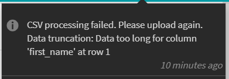
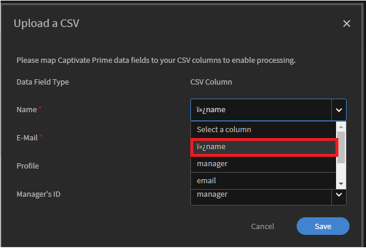
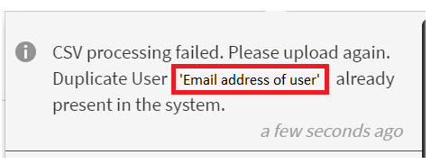

# 無法上傳CSV

## 錯誤：資料截斷：資料太長而無法放入欄

嘗試在Adobe Learning Manager中上傳CSV時，您會看到以下錯誤訊息。

*CSV處理失敗的錯誤訊息*

## 原因

如果指定資料行中的資料超過為資料行定義的字元限制，就會發生錯誤。

## 解決方法

* 開啟CSV。
* 檢查錯誤中提到的欄中的資料。
* 如果有任何值很大（例如，大於60個字元），請變更值以更正資料。

## 錯誤： CSV的第一欄會顯示特殊字元

您無法上傳CSV，因為對應欄時第一欄會顯示特殊字元。

*名稱欄中的特殊字元*

## 原因

在Excel中將CSV儲存為UTF-8格式時會發生問題。 當您以UTF-8格式儲存Excel的CSV時，檔案會以UTF-BOM格式儲存。 您可以使用「記事本」++或上傳CSV至Learning Manager時，在對映欄位時，第一欄會顯示特殊字元。

## 解決方法

* **答：** 透過Excel儲存：

   1. 在Excel中開啟CSV。
   1. 將檔案另存為一般的CSV檔案。

* **B：** 透過記事本或記事本++儲存：

   * 在「記事本」或「記事本++」中開啟CSV。
   * 以UTF-8格式儲存檔案。

## 錯誤：系統中已存在使用者的電子郵件地址

您無法上傳CSV，因為CSV處理失敗。 您會看到下列錯誤訊息：

*適用於重複使用者的Error訊息*

## 原因

如果系統中已存在具有相同電子郵件地址或UUID的使用者，則會發生此問題。

## 解決方法

### 案例1

**未啟用UUID的帳戶。**

在此案例中，此錯誤有兩個原因：

1. 您嘗試新增的使用者是外部設定檔的管理員。 若要解決此問題，請開啟使用者所屬的外部設定檔，選取使用者，然後按一下 **[!UICONTROL Actions]** > **[!UICONTROL Assign Role]** > **[!UICONTROL Manager]**，並變更設定檔的管理員。
1. 您嘗試新增的使用者已清除。 在此案例中，在清除程式完成之前，您將無法新增具有相同電子郵件地址的使用者。 解決方法是**新增具有次要電子郵件地址的使用者，以提供對平台的存取**。 整個清除程式完成後，請編輯使用者，並將電子郵件地址變更為正確的電子郵件地址。

### 案例2

**啟用UUID的帳戶。**

針對啟用UUID的帳戶，如果指派給使用者的UUID已由帳戶中的其他使用者使用，或使用者具有不同的電子郵件地址，則會發生此問題。

例如，假設有兩個使用者A和B，其電子郵件地址為  <a@xyz.com> 和 <b@xyz.com> UUID 1及2的識別碼。

現在，如果您上傳使用者A的UUID為3，而使用者B的UUID為2的CSV，則會顯示錯誤。

>[!TIP]
>
>若要解決此問題， **CSV和系統中的使用者必須具有相同的電子郵件地址和UUID。**

