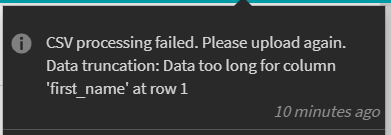
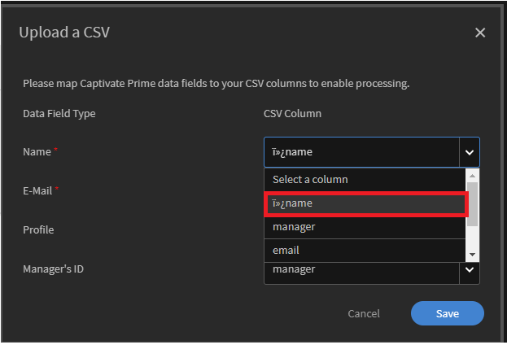
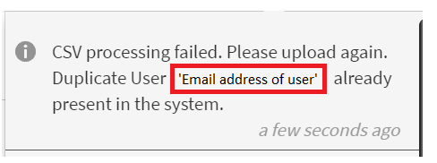

# 無法上傳 CSV

## 錯誤：資料截斷：資料過長無法顯示欄位

當嘗試在 Adobe Learning Manager 上傳 CSV 檔案時，你會看到以下錯誤訊息。

*錯誤訊息顯示 CSV 處理失敗*

## 成因

若指定欄位中的資料超過該欄位定義的字元限制，則會發生錯誤。

## 解決方法

* 打開 CSV。
* 請檢查錯誤中提到的資料欄。
* 如果有任何值很大（例如大於60個字元），則更改該值以修正資料。

## 錯誤：CSV 的第一欄顯示特殊字元

你無法上傳 CSV 檔，因為第一欄在映射欄位時會顯示特殊字元。

*名稱欄中的特殊字元*

## 成因

問題發生在 CSV 以 UTF-8 格式儲存在 Excel 時。 當你將 CSV 存為 UTF-8 時，檔案會以 UTF-BOM 格式儲存。 你可以用 Notepad++ 驗證，或是上傳 CSV 到 Learning Manager 時，對應欄位時，第一欄會顯示一個特殊字元。

## 解決方法

* **答：** 透過 Excel 儲存：

  1. 在 Excel 裡打開 CSV。
  1. 把檔案存成一般的 CSV 檔。

* **B：** 透過記事本或記事本儲存++：

  * 在記事本或記事本++中打開CSV。
  * 儲存檔案為 UTF-8 格式。

## 錯誤：系統中已存在使用者的電子郵件地址

你無法上傳 CSV 文件，因為 CSV 處理失敗了。 你可以看到下面的錯誤訊息：

*dupliacet 使用者的錯誤訊息*

## 成因

如果系統中已有使用者使用相同的電子郵件地址或 UUID，就會出現此問題。

## 解決方法

### 情境一

**未啟用 UUID 的帳號。**

在這種情況下，造成錯誤有兩個原因：

1. 你想新增的使用者是外部設定檔的管理員。 要解決這個問題，請打開該使用者所屬的外部設定檔，選取該使用者，點擊 **[!UICONTROL Actions]** > **[!UICONTROL Assign Role]** > **[!UICONTROL Manager]**，並更改該設定檔的管理員。
1. 你想新增的使用者已被清除。 在這種情況下，在清除程序完成之前，你無法用相同的電子郵件地址新增該使用者。 作為一個變通方法，請讓使用者擁有第二個電子郵件地址，以便存取該平台。 清除完成後，編輯使用者並將電子郵件地址更改為正確的電子郵件地址。

### 情境二

**啟用 UUID 的帳號。**

對於啟用 UUID 的帳號，若使用者被指派的 UUID 已被其他使用者使用，或使用者使用不同的電子郵件地址，可能會發生此問題。

例如，假設有兩個使用者 A 和 B，分別擁有電子郵件地址，  <a@xyz.com> UUID <b@xyz.com> 1 和 2。

現在，如果你上傳的 CSV 中，使用者 A 的 UUID 是 3，使用者 B 的 UUID 是 2，你會看到錯誤。

>[!TIP]
>
>要解決這個問題， **你必須在 CSV 和系統上使用相同的電子郵件地址和使用者的 UUID。**
