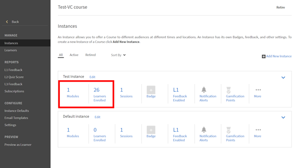
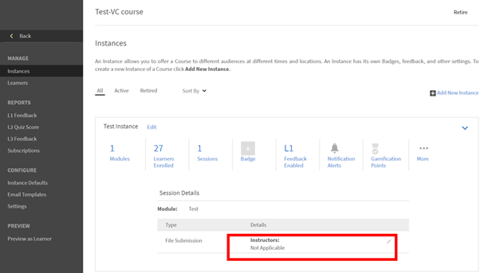
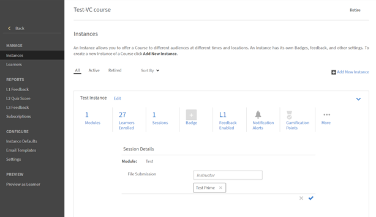

# 無法在Adobe Learning Manager中檢視檔案提交

## 問題

講師無法檢視學習者已上傳的檔案提交。

## 說明

講師無法檢視學習者上傳到中的檔案 **提交活動模組**.

例如，學習者已註冊了名為的執行個體， **測試執行個體** 的課程，如下所示：

*檢視例項*

然後，學習者會開啟課程並在活動模組中上傳檔案。

當講師嘗試核准提交時，講師無法進行。

*在活動模組中上傳檔案*

## 原因

如果註冊學習者的課程例項中沒有講師，則會出現問題。

## 解析度

若要檢查課程執行個體是否新增了講師，請執行下列步驟：

1. 瀏覽至課程設定。
1. 在 **管理** 區段，按一下 **[!UICONTROL Instances].**
1. 在學習者註冊的執行個體中，按一下 **[!UICONTROL Sessions]**.

   

   *選取執行處理中的階段作業*

   沒有指派給此工作階段的講師。

1. 按一下 **[!UICONTROL Edit]**. 新增核准檔案提交的講師。

   

   *新增講師*
1. 儲存變更。

