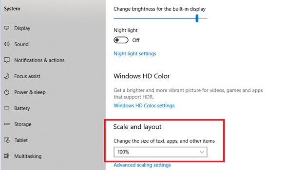

# 無法查看行事曆

## 子嗣

編輯外部個人檔案的到期日時，無法查看行事曆。

## 說明

當管理員嘗試編輯外部登記資料的到期日並點擊行事曆編輯到期日時，該行事曆不會顯示。

## 成因

此問題的發生原因如下：

* 瀏覽器的縮放率超過 100%。
* 顯示設定中的比例和版面配置超過 100%。

## 解決方法

### 瀏覽器

1. 啟動瀏覽器。
1. 登入 Adobe Learning Manager。
1. 在地址列點擊縮放圖示。
1. 點擊 **[!UICONTROL Reset]**。
1. 更改註冊資料的到期日。

### 顯示設定

1. 點擊 **[!UICONTROL Start]** > **[!UICONTROL Settings]** > **[!UICONTROL System]**。
1. 點擊 **[!UICONTROL Display]**。
1. 在該 **[!UICONTROL Scale and layout]** 區塊下方，使用下拉選單。 把設定改成 100%。

   

   *更改顯示設定*

1. 重新啟動電腦。
