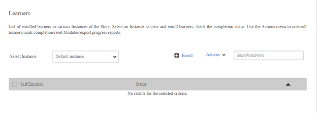

# 無法檢視課程中的學習者

## 問題

您無法檢視已註冊課程的學習者。

## 說明

課程的學習者索引標籤未顯示任何已註冊的學習者。 不過，如果您產生報表，則可以在報表中檢視已註冊的學習者。

*未顯示學習者*

## 原因

如果學習者已透過高等學習物件註冊（學習計畫或認證），則學習者會顯示在高等學習物件的「學習者」標籤上。 在課程的「學習者」標籤下無法搜尋學習者。

**如何檢視學習者已註冊的高等學習物件？**

您可以在學習成績單報告中檢視此資訊。 若要產生學習者成績單，請遵循下列步驟：

1. 以管理員身分登入。
1. 按一下&#x200B;**[!UICONTROL Reports]** > **[!UICONTROL Custom Reports]** > **[!UICONTROL Excel Reports]** > **[!UICONTROL Learner Transcript]**。

1. 輸入&#x200B;**[!UICONTROL Learner]**&#x200B;的名稱並指定&#x200B;**[!UICONTROL Date]**&#x200B;範圍。
1. 展開區段&#x200B;**[!UICONTROL Advanced Options]**&#x200B;並選取選項&#x200B;**[!UICONTROL Enable module level information]**。
1. 按一下&#x200B;**[!UICONTROL Generate]**。

   在學習者成績單上，您可以檢視學習者註冊的高等學習物件。
