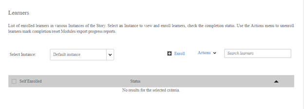

# 無法查看課程中的學習者

## 子嗣

您無法查看已註冊課程的學習者。

## 說明

課程的學習者標籤不會顯示任何已註冊的學習者。 不過，如果你產生報告，可以在報告中查看已註冊的學習者。

*未顯示學習者*

## 成因

若學習者是透過較高等級的學習對象（學習計畫或認證）註冊，則該學習者會在該高級學習對象的學習者標籤中可見。 學習者將無法在課程的學習者標籤下被搜尋。

**如何查看學習者所註冊的高等教育對象？**

您可以在學習成績單報告中查詢此資訊。 要產生學習者成績單，請依照以下步驟操作：

1. 以管理員身份登入。
1. 點擊 **[!UICONTROL Reports]** > **[!UICONTROL Custom Reports]** > **[!UICONTROL Excel Reports]** > **[!UICONTROL Learner Transcript]**。

1. 輸入名稱&#x200B;**[!UICONTROL Learner]**&#x200B;並指定範圍。**[!UICONTROL Date]**
1. 展開該區塊 **[!UICONTROL Advanced Options]** 並選擇選項 **[!UICONTROL Enable module level information]**。
1. 點擊 **[!UICONTROL Generate]**。

   在學習者成績單中，您可以查看學習者所註冊的更高階學習對象。
