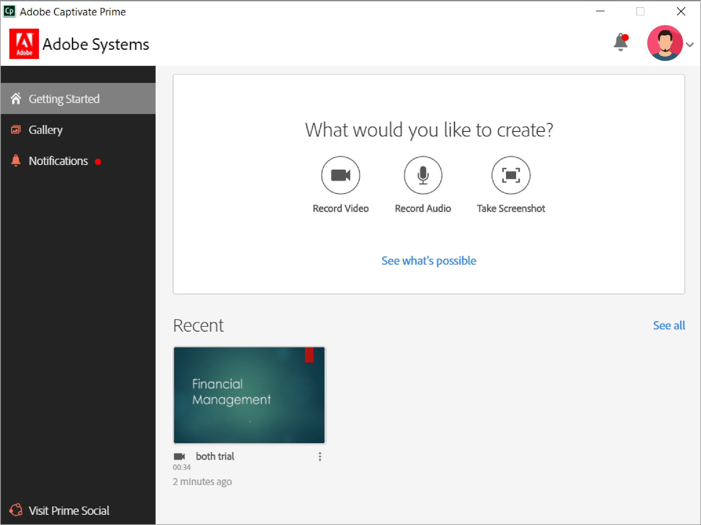
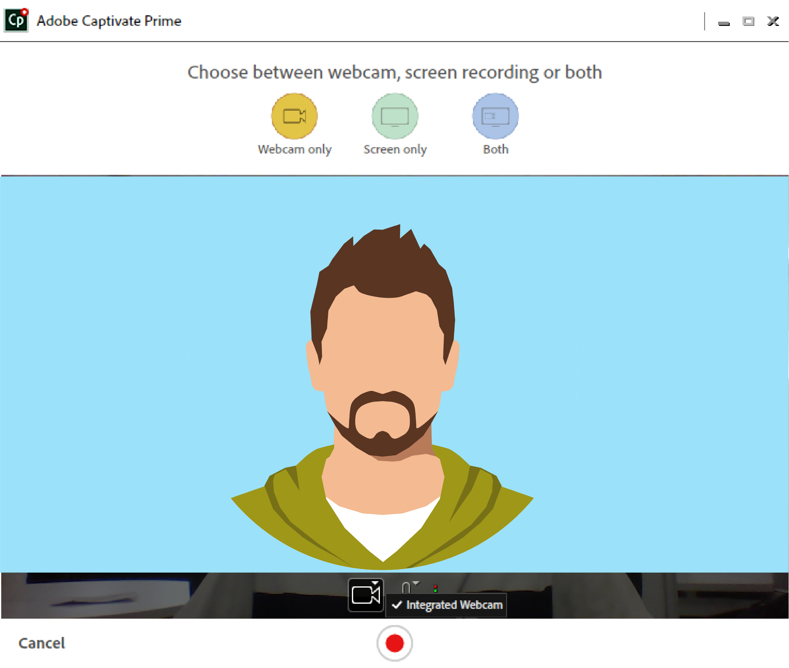
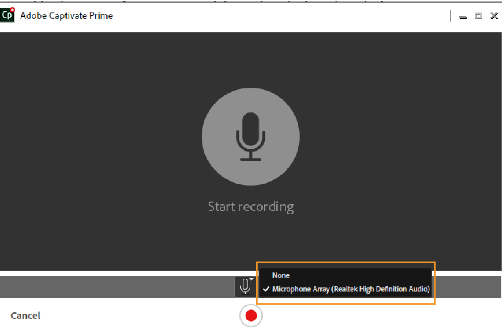
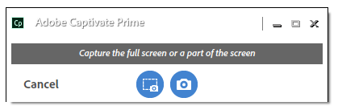
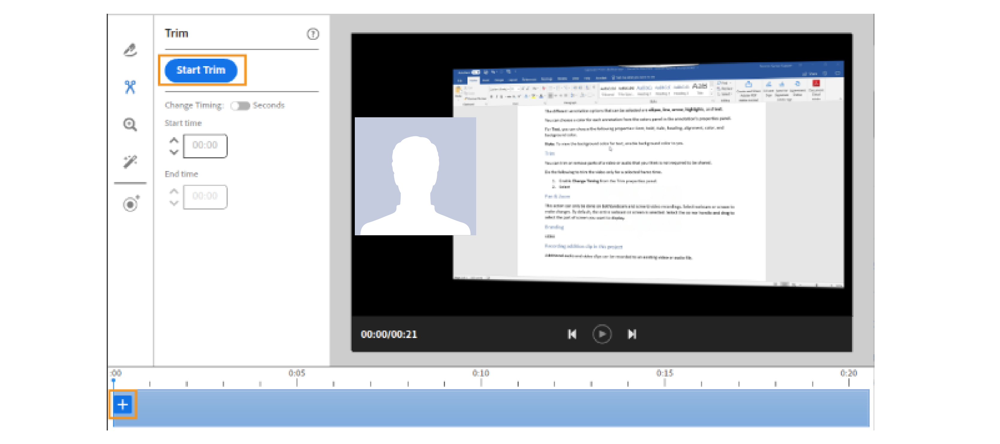
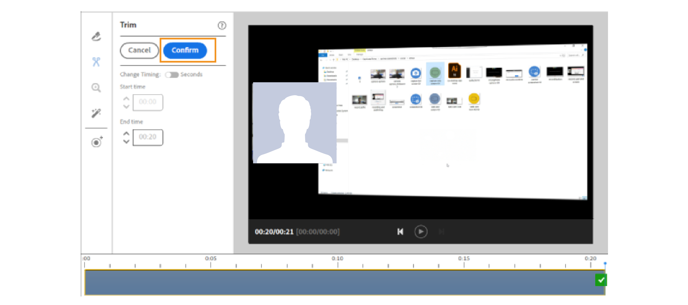
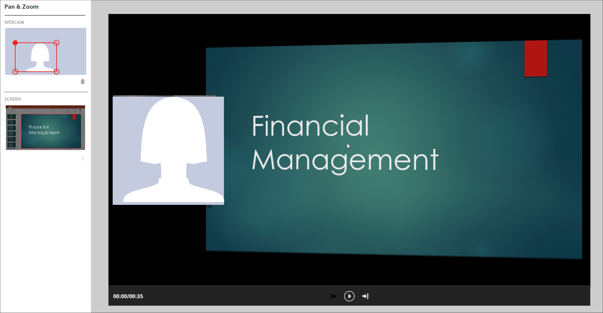
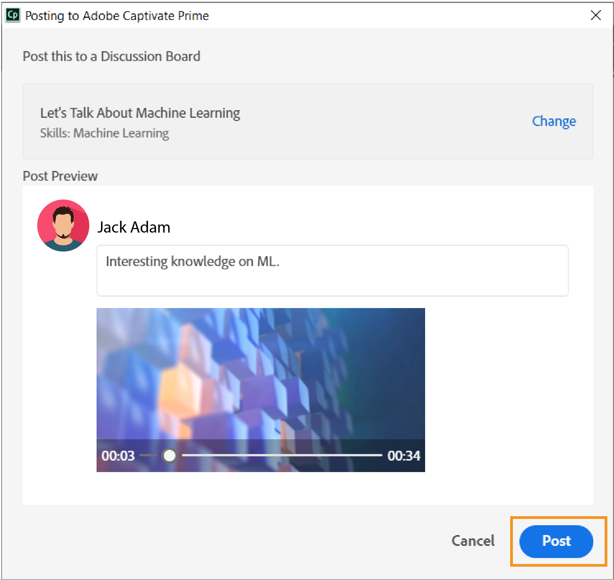
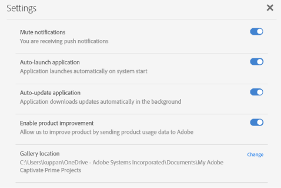

# AdobeLearning Manager案頭應用程式

瞭解如何使用Adobe Learning Manager的案頭應用程式來建立和豐富社交學習上可分享的內容。

AdobeLearning Manager案頭應用程式主要適用於使用Learning Manager社交學習的學習者。 此應用程式一旦安裝在桌上型電腦上，學習者即可在Learning Manager中建立內容並發佈至展示板，促進同儕的非正式、合作和社交學習。 此外，案頭應用程式還可確保學習者在其案頭上獲得社交學習通知，即使他們不一定登入Learning Manager的網頁應用程式。

學習者可以建立豐富的內容，包括影片、音訊和熒幕擷圖，並與其他學習者分享。 內容實際上可以是任何內容 — 軟體示範或逐步解說、簡報、播客或可分享內容的附註熒幕擷圖。

在Learning Manager Social Learning網頁上，按一下「新增貼文」並選取錄製視訊、錄製音訊、擷取熒幕擷圖或Learning Manager相簿以啟動案頭應用程式。 如需社交學習的詳細資訊， [按一下這裡](feature-summary/social-learning-web-user.md).

如果使用者沒有案頭應用程式，您可以從AdobeLearning Manager案頭頁面下載。 如果您無法下載， [按一下這裡](../kb/troubleshooting-issues-with-adobe-learning-manager-desktop-app.md).

使用者安裝完畢後，必須使用Learning Manager學習者憑證登入應用程式。 首頁看起來像下面的熒幕擷圖。

>[!NOTE]
>
>如果帳戶停用「社交學習」，學習者將無法使用案頭應用程式。

<!---->
<!--*Home page*-->

## 建立視訊 {#creatingavideo}

案頭應用程式可讓使用者錄製網頁、熒幕和兩者。

<!---->
<!--*Record web, screen, or both*-->

請進行下列步驟，製作視訊錄製並張貼至社交學習網路平台：

1. 確保符合軟硬體需求。 另請參閱 [系統需求](../system-requirements.md) 以取得相關資訊。
1. 若要從Social Learning開始錄製，請選取影片錄製（網路、熒幕、兩者）圖示，以開啟Learning Manager案頭應用程式。 在使用者登入的案頭應用程式中，可以建立內容，然後張貼。
1. 若要從案頭應用程式開始錄製，請以學習者身分使用您的Learning Manager憑證登入應用程式。
1. 首頁隨即顯示。
1. 若要建立貼文，您可以選擇首頁中提供的三個選項之一。 若要啟動錄製視窗，請按一下錄製視訊圖示。
1. 您可以視需求選擇網路攝影機、熒幕或兩者。

   **網路攝影機** 網路攝影機會擷取正在示範或展示專案或應用程式（包括音訊）的朗讀者。 從上述選項中選取網路攝影機圖示，以顯示「即時」視窗。

   **熒幕** 錄製在熒幕上執行的動作。 選取熒幕圖示後，熒幕會醒目顯示，熒幕中央會顯示錄製對話方塊。

   **兩者** 記錄朗讀程式和熒幕動作。 選取最後一個圖示，畫面會醒目提示，使用者會同時取得即時視窗。

1. 設定錄製偏好設定。

   **選取相機** 按一下錄製視訊視窗底部的攝影機圖示。 從指定選項中選取使用者要使用的攝影機。

   **選取麥克風** 按一下視訊或音訊視窗底部的麥克風圖示，並從指定的選項中選取使用者要使用的麥克風。

   >[!NOTE]
   >
   >如果使用者不想用熒幕或視訊錄製音訊，請選取 **無** 選項，該選項會從按一下音訊圖示時顯示的下拉式清單中選取。
   >
   >當使用者開始錄製他們的畫面或他們自己時，會出現一個快顯對話方塊，要求他們確認是否要在沒有音訊支援的情況下繼續錄製。 按一下「是」以繼續。

1. 使用錄製按鈕開始錄製。 錄製作業會在倒數計時（3秒）後開始。
1. 按一下暫停或繼續按鈕可在錄製時暫停，然後視需要繼續進行。 若要編輯錄製，請參閱 [編輯錄製](adobe-learning-manager-app-for-desktop.md#Editing) 若要發佈，請參閱 [發佈錄製](adobe-learning-manager-app-for-desktop.md#Publishing).

## 建立音訊 {#creatinganaudio}

<!---->
*錄製音訊*

若要錄製音訊，請執行下列動作：

1. 按一下Learning Manager案頭應用程式啟動視窗中的錄製音訊圖示。
1. 按一下麥克風音量圖示並調整音量，確定麥克風音量已調高。
1. 按一下錄製按鈕以開始錄製。
1. 使用者錄製完音訊後，按一下暫停按鈕以停止錄製。
1. 若要預覽錄製，請按一下播放按鈕。
1. 如果使用者想要將其他音訊錄製到相同的檔案，請按一下 **[!UICONTROL Resume]**. 符合所需的錄製之後，請按一下 **[!UICONTROL Next]** 將檔案儲存至所需位置。 錄音儲存在Learning ManagerAdobe應用程式中，供案頭收藏館使用，使用者可在其中檢視其錄音和熒幕擷圖。
1. 若要編輯錄製，請參閱 [編輯錄製](adobe-learning-manager-app-for-desktop.md#Editing) 若要發佈，請參閱 [發佈錄製](adobe-learning-manager-app-for-desktop.md#Publishing).

## 建立熒幕擷圖 {#creatingascreenshot}

若要擷取熒幕擷圖，請執行下列動作：

1. 按一下Learning Manager案頭應用程式首頁的熒幕擷圖圖示。
1. 若要僅擷取畫面的一部分，請按一下部分熒幕的截圖示。 若要擷取整個熒幕，請按一下擷取全熒幕圖示。

   <!--
   *Capture a screenshot*-->

1. 為協助其他學習者更好地理解及保留簡報或靜態內容，請在內容中新增註解。
1. 若要編輯熒幕擷圖， [按一下這裡](adobe-learning-manager-app-for-desktop.md#Editing)，並發佈熒幕擷圖 [按一下這裡](adobe-learning-manager-app-for-desktop.md#Publishing).

## 編輯視訊、音訊和熒幕擷圖 {#editing}

儲存檔案後，編輯視窗會立即出現在系統上，您可以使用以下選項讓錄製看起來完美專業：

## 註解（錄影和熒幕擷圖） {#annotationsvideorecordingsandscreenshots}

註解可用於錄影和熒幕擷取畫面，以強調特定詳細資訊或撰寫一些文字以供其他使用者閱讀。

>[!NOTE]
>
>若是視訊，使用者只能在熒幕上方加上註解。

* 可選取的不同註解包括 **橢圓**， **折線圖**， **箭頭**， **反白顯示**、和 **文字**.

* 從註解屬性面板的顏色面板中，為每個註解選擇顏色。
* 的 **文字**，選擇下列屬性：字型、粗體、斜體、標題、對齊、顏色和背景顏色。

>[!NOTE]
>
>若要檢視文字的背景顏色，請將背景顏色啟用為yes。

## 修剪（所有型別的視訊與音訊錄製） {#trimalltypesofvideoandaudiorecordings}

若要裁剪或移除不需要的視訊或音訊部分，請使用裁剪工具。

若要裁剪，請按一下 **[!UICONTROL Start Trim]** 按鈕或按一下時間軸上的加號圖示以開始修剪。 然後按一下播放器上的暫停按鈕以停止修剪。 按一下 **[!UICONTROL Confirm]** 按鈕以完成修剪。

您可以輸入時間，修剪錄製 **[!UICONTROL Start time]** 和 **[!UICONTROL End time]** 啟用後的輸入欄位 **[!UICONTROL Change Timing]**.

*開始修剪*

*確認修剪*

## 平移和縮放（任何視訊錄製） {#panampzoomanyvideorecording}

平移和縮放動作只能在 **兩者** （網路攝影機和熒幕）錄影。 預設會選取整個網路攝影機或熒幕。 選取角落控點並拖曳以選取要顯示或聚焦的熒幕部分。 按兩下視窗以取得全熒幕。

*平移和縮放*

## 品牌推廣（所有型別的視訊錄製） {#brandingalltypesofvideorecordings}

若要為視訊建立唯一名稱以及一致的主題，請選取品牌工具。 品牌建立旨在於學習管理系統中建立重要且與眾不同的存在，吸引並保留學習者觀看完整影片。

若要將品牌或佈景主題新增至影片，請執行下列動作：

1. 在編輯視窗中，按一下左側導覽面板中的品牌圖示。
1. 選取 **主題** 從指定的選項，或使用者可以透過新增 **開始**， **背景，** 和 **結束** 從他們的系統播放視訊。

   >[!NOTE]
   >
   >若要下載更多佈景主題，請按一下 **取得更多資產** 按鈕。

1. 新增視訊標題文字並選取 **顯示於** 要顯示的格線。

   >[!NOTE]
   >
   >標題文字只能新增為品牌推廣影片的一部分。 為品牌推廣影片指定標題前，必須先指定主題。

1. 視需要新增簡報者名稱和簡報者標題至影片。 在「播放點顯示」欄位中輸入視訊時間範圍內的數字，以便在播放視訊時顯示簡報者名稱和標題。
1. 如有必要，在視訊畫面的左側或右側新增品牌圖示。 若要選取品牌圖示，請按一下 **[!UICONTROL Select]** > **[!UICONTROL Browse from system]**.
1. 若要預覽視訊，請按一下預覽畫面中的播放按鈕。

   

   *品牌化*

## 錄製其他剪輯（所有型別的視訊與音訊錄製） {#recordingadditionalclipsalltypesofvideoandaudiorecordings}

其他音訊和視訊片段可以錄製到現有的視訊或音訊檔案中。

若要開始新的錄製，請按一下錄製其他剪輯圖示。 新錄製內容會插入正在編輯的錄製的播放點位置。

## 發佈視訊錄製、音訊錄製和熒幕擷圖 {#publishing}

完成所有變更和編輯後，按一下 **[!UICONTROL Share]** >輸入或搜尋 **技能或討論區** 與貼文最密切相關的專案> **Post**.

<!---->
*發佈至網頁*

## 瀏覽Learning Manager案頭相簿 {#browsingcaptivateprimedesktopgallery}

所有影片和熒幕擷取畫面都會儲存在Adobe Learning Manager案頭應用程式中。 若要瀏覽這些檔案，請按一下 **[!UICONTROL Gallery]** 從首頁的左側導覽面板。

>[!NOTE]
>
>按一下「 」，也可以從「社交學習」啟動相簿 **Learning Manager相簿** 圖示建立貼文時。

從相簿視窗中，在搜尋欄位中輸入您要尋找的檔案名稱。

若要從影像中心視窗建立新的錄製，請按一下 **錄製新內容** 按鈕。

若要編輯或刪除相簿中的檔案，請按一下檔案底部的三個點，然後從彈出式清單中選取選項。

## 通知 {#notifications}

無論學習者是否已登入Learning Manager網路應用程式，Learning Manager中的通知都會顯示在通知視窗中。 通知包括使用者已建立、正在關注或已參與的貼文或面板。 按一下通知即可將使用者導覽至Learning Manager社交學習網站。

若要將通知設為靜音，請按一下**[!UICONTROL Profile menu*]* > **[!UICONTROL Settings] > **[!UICONTROL Mute notifications]**.

## Adobe Learning Manager案頭應用程式中的設定 {#settingsinadobecaptivateprimedesktopapplication}

在 **設定** 頁面，變更下列設定：

將通知設為靜音、自動啟動應用程式、自動更新應用程式、啟用產品改進。

使用者也可以按一下 **變更** 超連結。

*AdobeLearning Manager應用程式設定*
