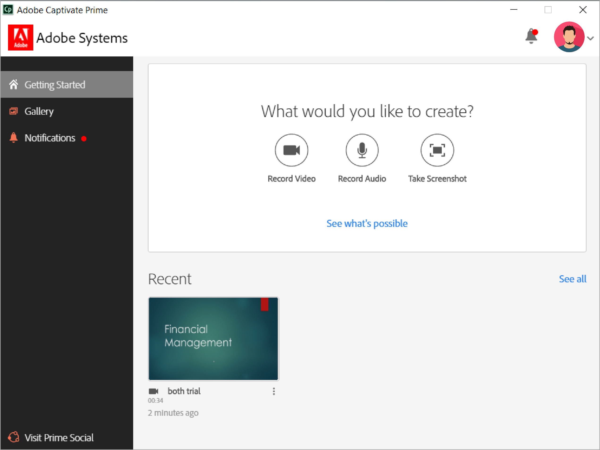
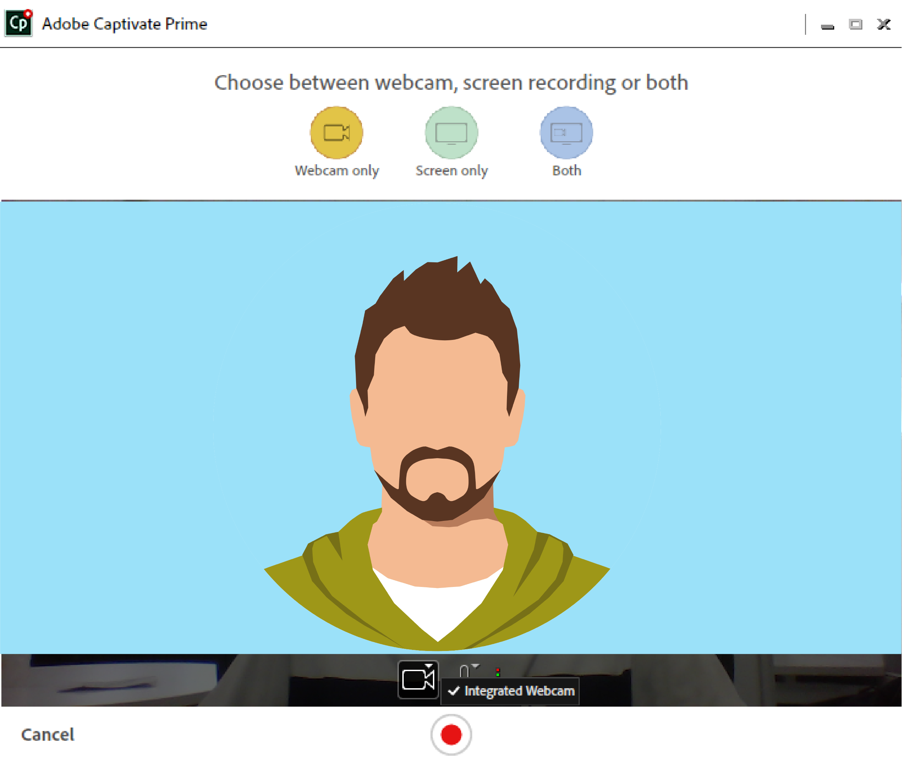
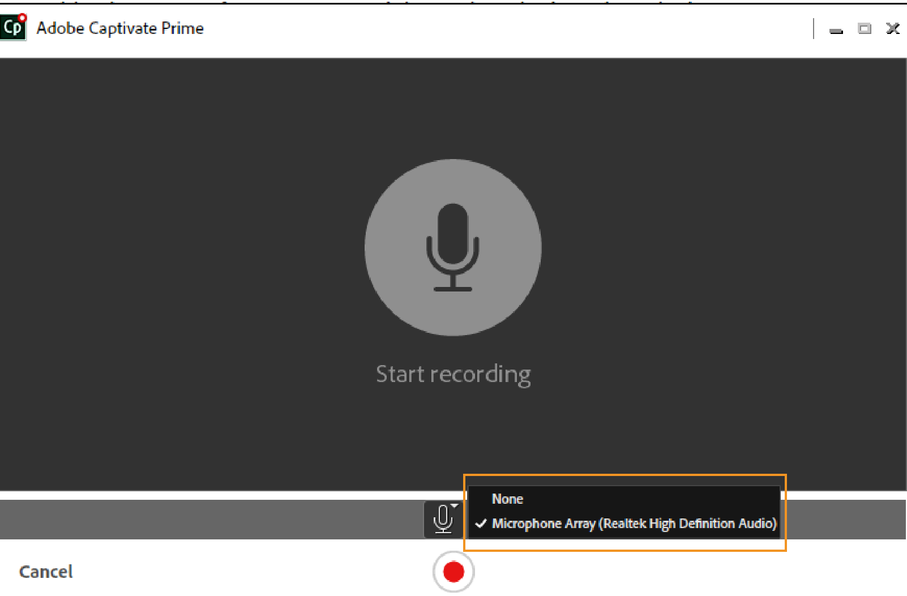
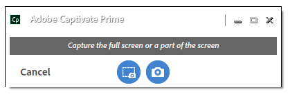
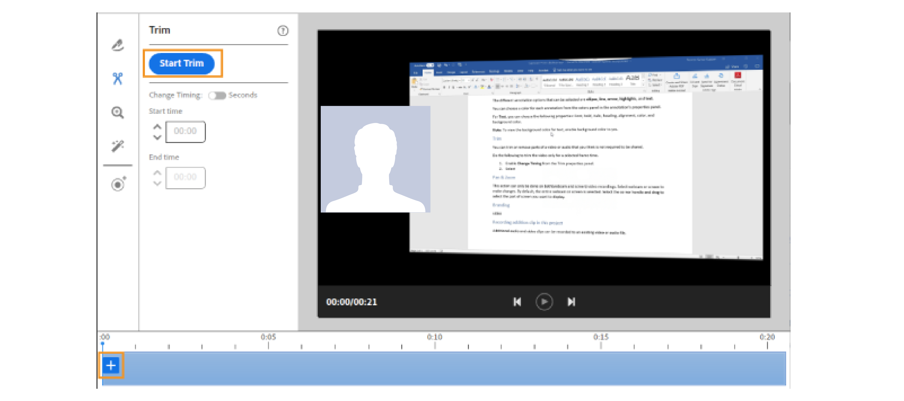
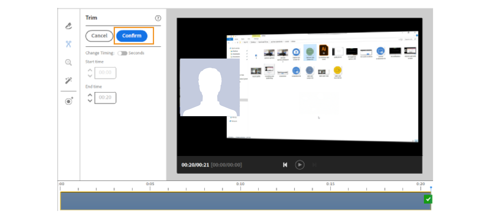
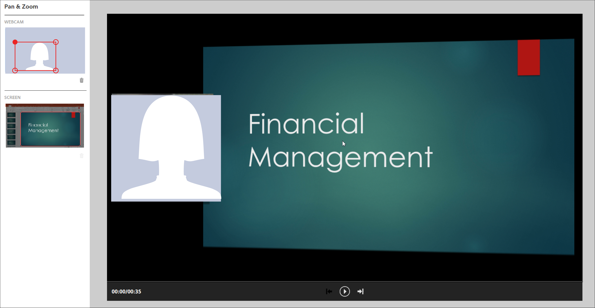
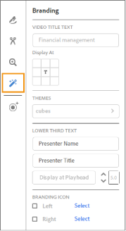
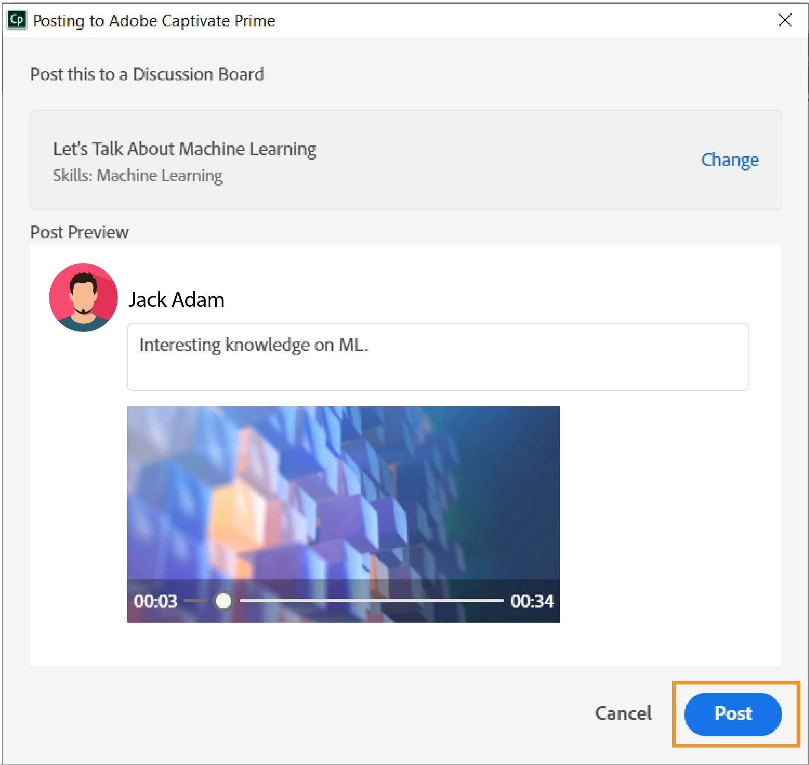
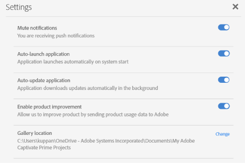

# Adobe Learning Manager 桌面應用程式

學習如何使用 Adobe Learning Manager 的桌面應用程式來創作並豐富可在 Social Learning 分享的內容。

Adobe Learning Manager 桌面應用程式主要針對使用 Learning Manager Social Learning 的學習者設計。 安裝於桌面後，該應用程式讓學習者能創作內容並發布到學習管理員的看板，促進同儕間的非正式、協作及社交學習。 此外，桌面應用程式也確保學習者即使不一定登入 Learning Manager 的網頁應用程式，也能在桌面上收到社交學習通知。

學習者可以創作豐富的內容，包括影片、音訊和截圖，並與其他學習者分享。 內容可以是任何東西——軟體展示或攻略、簡報、播客，或是可以分享的附註截圖。

在 Learning Manager 社交學習網頁上，點擊新貼文並選擇錄製影片、錄製音訊、截圖，或選擇學習管理員相簿以啟動桌面應用程式。 欲了解更多社會學習資訊，請 [點此](feature-summary/social-learning-web-user.md)。

如果使用者沒有桌面應用程式，你可以從 Adobe Learning Manager 桌面頁面下載。 如果您無法下載，請 [點此](../kb/troubleshooting-issues-with-adobe-learning-manager-desktop-app.md)。

使用者安裝完成應用程式後，必須使用學習管理員的學習者憑證登入。 首頁看起來像下面的截圖。

>[!NOTE]
>
>若學習者的帳戶關閉社交學習，將無法使用桌面應用程式。

<!---->
<!--*Home page*-->

## 製作影片 {#creatingavideo}

桌面應用程式允許使用者錄製網頁、螢幕及兩者。

<!---->
<!--*Record web, screen, or both*-->

請按以下步驟製作影片並上傳到社交學習平台：

1. 確保硬體與軟體需求皆有滿足。 詳情請參閱 [系統需求](../system-requirements.md) 。
1. 要從 Social Learning 開始錄影，請選擇影片錄影（網頁、螢幕、兩者）圖示，這會開啟 Learning Manager 桌面應用程式。 在桌面應用程式中，使用者登入後可以建立內容，然後發布。
1. 要從桌面應用程式開始錄音，請以學習者身份使用你的學習管理員憑證登入該應用程式。
1. 首頁會出現。
1. 要建立文章，你可以在首頁提供的三個選項中選擇其中一個。 要啟動錄影視窗，請點擊「錄影」圖示。
1. 依需求，你可以選擇網路攝影機、螢幕或兩者兼具。

   **網路攝影機** 網路攝影機捕捉敘述者示範或展示專案或應用程式（包括音訊）的畫面。 從上述選項中選擇網路攝影機圖示，即時視窗就會顯示。

   **&#x200B;**&#x200B;螢幕錄影操作在螢幕上執行。選擇螢幕圖示後，畫面中央會顯示錄影對話框。

   **兩者** 同時記錄旁白與螢幕上的動作。 選擇最後一個圖示後，畫面會被高亮，使用者也會看到一個即時視窗。

1. 設定錄影偏好。

   **選擇相機** ，點擊錄影視窗底部的攝影機圖示。 從給定選項中選擇使用者想使用的相機。

   **選擇麥克風** 點擊影片或音訊視窗底部的麥克風圖示，從指定選項中選擇使用者想使用的麥克風。

   >[!NOTE]
   >
   >如果使用者不想錄製帶螢幕或影片的音訊，請從點擊音訊圖示時顯示的下拉選單中選擇 **「無」** 選項。
   >
   >當使用者開始錄製自己的螢幕或自己時，會出現一個彈出視窗，請他們確認是否要在沒有音訊支援的情況下繼續錄影。 點擊「是」繼續。

1. 使用錄音按鈕開始錄影。 倒數結束後（3秒）開始錄影。
1. 點擊暫停或繼續按鈕，在錄影時暫停，然後如果需要再繼續。 要編輯錄音，請參見 [「編輯錄音](adobe-learning-manager-app-for-desktop.md#Editing) 」;要發佈，請參見 [「發佈錄音](adobe-learning-manager-app-for-desktop.md#Publishing)」。

## 製作音訊 {#creatinganaudio}

<!---->
*錄音*

要錄製音訊，請執行以下步驟：

1. 點擊學習管理員桌面應用程式啟動視窗中的錄音音訊圖示。
1. 請點擊麥克風音量圖示並調整音量，確保麥克風音量調高。
1. 點擊錄影按鈕開始錄影。
1. 使用者完成錄音後，點擊暫停鍵停止錄音。
1. 要預覽錄影，請點擊播放按鈕。
1. 若使用者想為同一檔案錄製額外音訊，請點擊 **[!UICONTROL Resume]**。 當達成目標錄音後，點擊 **[!UICONTROL Next]** 將檔案儲存到指定位置。 錄影會儲存在 Adobe Learning Manager 桌面畫廊中，使用者可查看錄影與截圖。
1. 要編輯錄音，請參見 [「編輯錄音](adobe-learning-manager-app-for-desktop.md#Editing) 」;要發佈，請參見 [「發佈錄音](adobe-learning-manager-app-for-desktop.md#Publishing)」。

## 製作截圖 {#creatingascreenshot}

要截圖，請做以下操作：

1. 點擊 Learning Manager 桌面應用程式首頁的截圖圖示。
1. 若要只擷取部分畫面，請點擊剪切部分畫面圖示。 要擷取全螢幕，請點擊「擷取全螢幕」圖示。

   <!--
   
   *Capture a screenshot*
   -->

1. 為了幫助其他學習者更好地理解並記住簡報或靜態內容，可以在內容中加入註解。
1. 要編輯截圖請 [點此](adobe-learning-manager-app-for-desktop.md#Editing)，若要發布截圖 [請點此](adobe-learning-manager-app-for-desktop.md#Publishing)。

## 編輯影片、音訊和截圖 {#editing}

檔案儲存後，系統會立即跳出編輯視窗，透過以下選項讓錄影看起來完美且專業：

## 註解（影片錄影與截圖） {#annotationsvideorecordingsandscreenshots}

註解可用於影片錄影和截圖，用以標示特定細節或撰寫文字供其他使用者閱讀。

>[!NOTE]
>
>對於影片，使用者只能在螢幕上方註解。

* 可選擇的不同註解包括&#x200B;**橢圓**、**直線**、**箭頭**、**螢光**&#x200B;**和文字**。

* 在註解屬性面板的顏色面板中，為每個註解選擇一種顏色。
* 文字設定&#x200B;**&#x200B;**，請選擇以下屬性：字體、粗體、斜體、標題、對齊、顏色和背景色。

>[!NOTE]
>
>要查看文字背景色，請啟用背景色為「是」。

## Trim（所有類型的影音錄影） {#trimalltypesofvideoandaudiorecordings}

若要剪輯或刪除不必要的影片或音訊部分，請使用剪輯工具。

要修剪，請點擊 **[!UICONTROL Start Trim]** 按鈕或點擊時間軸上的加號圖示開始修剪。 然後點擊播放器上的暫停鍵停止修剪。 點擊按鈕 **[!UICONTROL Confirm]** 完成修剪。

啟用後&#x200B;**[!UICONTROL Change Timing]**，可在輸入欄位輸入時間&#x200B;**[!UICONTROL Start time]**&#x200B;**[!UICONTROL End time]**&#x200B;來修剪錄影。

*開始修剪*

*確認修剪*

## 平移與放大（任何錄影） {#panampzoomanyvideorecording}

平移與變焦動作只能在 **（** 網路攝影機和螢幕）錄影中進行。 預設情況下，整個網路攝影機或螢幕都會被選取。 選擇角落把手並拖曳，選擇要顯示或聚焦的螢幕區域。 雙擊視窗即可全螢幕。

*平移與變焦*

## 品牌塑造（各類錄影帶） {#brandingalltypesofvideorecordings}

要為影片創造獨特名稱並設定一致主題，請選擇品牌工具。 品牌塑造旨在建立在學習管理系統中顯著且差異化的存在感，吸引並留住學習者觀看完整影片。

要為影片加入品牌或主題，請執行以下步驟：

1. 在編輯視窗左側導覽面板點擊品牌圖示。
1. 從給定選項中選擇&#x200B;**主題**，或使用者可自訂&#x200B;**系統的開頭**、**背景**&#x200B;**和結尾**&#x200B;影片。

   >[!NOTE]
   >
   >要下載更多主題，請點擊「 **取得更多素材** 」按鈕。

1. 新增影片標題文字，並在「顯示格&#x200B;**子」中選擇**&#x200B;一個位置以顯示。

   >[!NOTE]
   >
   >標題文字只能作為品牌宣傳影片的一部分加入。 在為品牌影片命名前，必須先設定主題。

1. 如有需要，請在影片中加入主持人姓名和主持人名稱。 在播放頭的顯示欄位輸入該視訊時間範圍內的數字，即可顯示主持人姓名與標題。
1. 如有需要，可在影片螢幕的左側或右側加上品牌圖示。 要選擇品牌圖示，請點擊 **[!UICONTROL Select]** > **[!UICONTROL Browse from system]**。
1. 要預覽影片，請點擊預覽畫面中的播放按鈕。

   

   *品牌形象*

## 錄製額外片段（各類影片與音訊錄製） {#recordingadditionalclipsalltypesofvideoandaudiorecordings}

額外的音訊和影片片段可以錄製到現有的影片或音訊檔案中。

要開始新錄影，請點擊「錄製額外片段」圖示。 新錄音會插入在正在剪輯的錄音中播放頭的位置。

## 發布影片錄影、音訊錄音及截圖 {#publishing}

完成所有修改與編輯後，點擊 **[!UICONTROL Share]** >輸入或搜尋 **與該貼文最相關的技能或看板** > **貼文**。

<!---->
*發佈至網路*

## 瀏覽學習管理軟體桌面圖庫 {#browsingcaptivateprimedesktopgallery}

所有錄影和截圖都儲存在 Adobe Learning Manager 桌面應用程式中。 要瀏覽這些檔案，請從首頁左側導覽面板點擊 **[!UICONTROL Gallery]** 。

>[!NOTE]
>
>在建立貼文時，點擊 **學習管理員圖示** ，也可以從 Social Learning 啟動該畫廊。

在相簿視窗中，輸入你要找的檔案名稱。

要從相簿視窗建立新錄影，請點擊 **「錄製新」** 按鈕。

若要編輯或刪除相簿中的檔案，請點擊檔案底部的三個點，然後從彈出清單中選擇你的選項。

## 通知 {#notifications}

無論學習者是否登入 Learning Manager 網頁應用程式，通知視窗都會顯示通知。 通知包括用戶已創建、追蹤或參與的貼文或討論區。 點擊通知後，使用者會進入學習管理員社交學習網頁。

要靜音通知，請點擊 * >*[!UICONTROL Profile menu*]* **&#x200B; >[!UICONTROL Settings]**&#x200B;[!UICONTROL Mute notifications]**。

## Adobe Learning Manager 桌面應用程式的設定 {#settingsinadobecaptivateprimedesktopapplication}

在 **設定** 頁面中，更改以下設定：

靜音通知、自動啟動應用程式、自動更新應用程式，並啟用產品改進。

使用者也可點擊 **「變更** 」超連結來更改畫廊位置。

*Adobe Learning Manager 應用程式設定*
