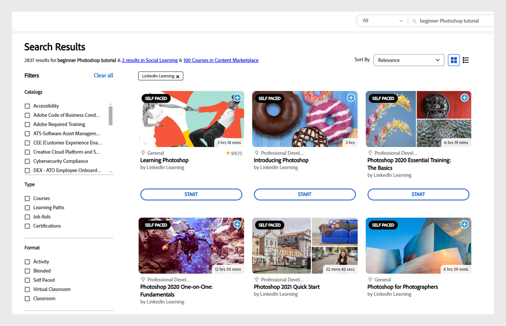

# Adobe Learning Manager中的進階AI搜尋

Adobe Learning Manager中的搜尋功能可讓使用者有效率地尋找相關內容，並協助他們使用正確的內容，藉此增強使用者體驗。

Adobe Learning Manager引進了AI支援的搜尋功能，結合了辭彙和語意搜尋。 此增強功能可讓學習者有效率地找到相關內容。 進階AI支援的搜尋可瞭解您查詢的涵義並提供相關結果。

## 主要優點

* **更聰明的搜尋**：瞭解搜尋字詞背後的內容與意圖
* **已改善關聯性**：根據查詢的意義提供結果
* **增強型使用者體驗**：協助學習者使用正確的內容

>[!NOTE]
>
>AI支援的搜尋僅適用於學習者。

## 為什麼搜尋很重要？

搜尋功能之所以重要有幾個原因：

* **使用者體驗**：啟用快速資訊擷取，提升使用者滿意度
* **效率**：減少尋找特定內容的工作量，以節省時間。
* **協助工具**：有效的搜尋功能讓資訊更容易存取，確保使用者可以參與符合其需求的內容。
* **Personalization**：進階搜尋系統可以根據使用者偏好設定量身打造結果，改善所呈現資訊的相關性。

## 發展網路上的搜尋行為

隨著人們線上上搜尋，他們的搜尋方式正在改變，搜尋引擎也在調整以跟上趨勢。 以下是人們最近搜尋資訊的一些主要方式：

* **意圖導向**：使用者現在不再輸入精確的關鍵字，而是使用我想要或我需要使用的短語來表達他們的需求。 現代搜尋引擎瞭解這些片語背後的目的，並提供更相關的結果。
* **排名結果**：搜尋結果會根據其他使用者認為有用的內容來整理。 這表示最有用的內容會顯示在頂端，讓您更容易找到品質資訊。
* **多個來源**：搜尋引擎涵蓋的來源越多，結果就越好。 透過從各種可靠來源取得資訊，搜尋引擎可提供更完整且準確的答案。
* **個人化**：搜尋引擎會根據時間、位置和使用者偏好設定等因素調整結果。 這可讓使用者更輕鬆地尋找符合他們目前特定需求的資訊。

## 為什麼Adobe Learning Manager的搜尋結果更好

Adobe Learning Manager提供更聰明、更進階的搜尋體驗。 它不僅符合關鍵字，而且內容上可理解使用者查詢的含義，以找出最相關的結果。

* **AI支援**： Adobe Learning Manager使用進階AI技術來瞭解搜尋意圖背後的意義，而不只是字詞。 這有助於顯示真正符合使用者想要的結果，讓搜尋更準確。
* **同儕節點驅動**： Adobe Learning Manager會使用一系列課程品質引數，將最有用的結果排名。 此排名演演算法是針對5,000萬個資料點進行訓練，這些資料點會定期對存放庫中的每個內容評分
* **完整**： Adobe Learning Manager會搜尋整個資料庫，包括自己的內容、協力廠商課程標題、說明、標籤、個人化附註和其他中繼資料。 針對Video和PDF等內容，此功能會自動在成績單中進行成績單和搜尋。

## Adobe Learning Manager的AI支援搜尋

Adobe Learning Manager使用進階AI技術來增強搜尋體驗，並讓尋找相關學習內容變得更輕鬆。 以下說明進階搜尋的主要元件。

### 辨識關鍵辭彙

Adobe Learning Manager使用自然語言處理(NLP)從課程標題和說明中識別重要關鍵字。 然後它會聚焦於這些關鍵字，以提供更好的搜尋結果，協助提升這些關鍵字的結果（而非其他結果）。 例如，如果學習者搜尋&#x200B;**Photoshop基本知識**，Adobe Learning Manager會優先處理&#x200B;**Photoshop**&#x200B;這個字，以顯示最相關的課程。

_優先處理關鍵字_

在上面的熒幕擷圖中，學習者使用術語&#x200B;**Photoshop快速入門**&#x200B;來搜尋課程。 搜尋會將&#x200B;**Photoshop**&#x200B;一詞排定優先順序，以尋找&#x200B;**Photoshop**&#x200B;的相關課程。 對於關鍵字快速入門，它會瞭解其意圖並尋找類似字詞以顯示最佳符合專案。 如此一來，學習者便可看到著重於Photoshop且適合初學者使用的課程。

### 展開查詢

Adobe Learning Manager將使用者查詢擴展至更多情境式含義，以協助尋找更好的結果。 這樣一來，搜尋演演算法就能隨著使用者查詢而獲得更多內容。 即使學習者使用一般術語，他們仍可以找到有用的結果。 例如，如果學習者正在搜尋&#x200B;**客戶服務基礎**，它會嘗試從查詢中尋找關鍵字，並將查詢的其餘部分展開成類似的片語。

_正在展開查詢_

### 課程中繼資料搜尋

Adobe Learning Manager的中繼資料搜尋涵蓋原生和匯入課程的中繼資料（例如來自LinkedIn學習或Go1）。 此功能會搜尋您的課程標題、說明、標籤、個人化附註和其他中繼資料。 這有助於使用許多不同的中繼資料來尋找結果，讓結果更好也更準確。
注意：客戶資料（包括內容和成績單）不會與任何外部服務共用，以進行AI支援的搜尋。 所有內容都儲存在目前的儲存系統中。

#### 內容內搜尋

Adobe Learning Manager提供增強的搜尋功能，可讓使用者在各種檔案型別的實際內容中進行搜尋，包括影片、音訊檔案、PDF、檔案、簡報和電子表格。 系統會自動轉譯此內容，以提供更完整且精確的搜尋結果。 此外，搜尋中會納入Adobe Connect會議的錄影，確保不會遺漏有價值的資訊。 如果在內容中找到相符專案，搜尋模型會提升該內容在最終結果中的排名。 最終排名由多個因素決定，如[AI支援的搜尋和重新排名](/help/migrated/learners/feature-summary/advanced-search.md#ai-powered-search-and-re-ranking)區段中所述。

>[!NOTE]
>
>新新增的內容（例如視訊或PDF）將在24小時的處理期間後可用於內容內搜尋。

### 語意搜尋

Adobe Learning Manager現在整合了語意搜尋與傳統辭彙搜尋，提高了搜尋結果的準確性。 透過從課程標題和說明產生向量內嵌，可建立完整的向量資料庫。 當學習者提交查詢時，系統會向量化查詢並執行相似度比對以識別最相關的結果。 例如，如果學習者搜尋初學者Photoshop教學課程，系統可瞭解該請求，並找到對Photoshop初學者特別實用的課程。

_語意搜尋_

>[!NOTE]
>
>語意搜尋目前僅支援英文內容。

### AI支援的搜尋和重新排名

Adobe Learning Manager的搜尋結合傳統和進階技術，引領業界。 它結合傳統的搜尋方法，例如片語比對和複雜的語意搜尋，以產生全面的結果。 系統會根據主要因素（例如註冊編號、出版日期、評分和人氣）對這些結果進行排名。 由我們的課程品質排名系統作為指引，可確保所有索引的高品質比對。

整體而言，AI支援的搜尋旨在提供完整、精確且方便使用的搜尋結果，協助學習者快速找到支援其學習歷程所需的資源。

>[!NOTE]
>
>1. 使用Headless實作的客戶需要遵循API檔案來啟用進階搜尋
>2. 進階搜尋目前無法用於Salesforce應用程式。
>3. 客戶資料（包括內容和成績單）不會與任何外部服務共用，以進行AI支援的搜尋。 所有內容都會安全地儲存在現有的儲存系統中。
