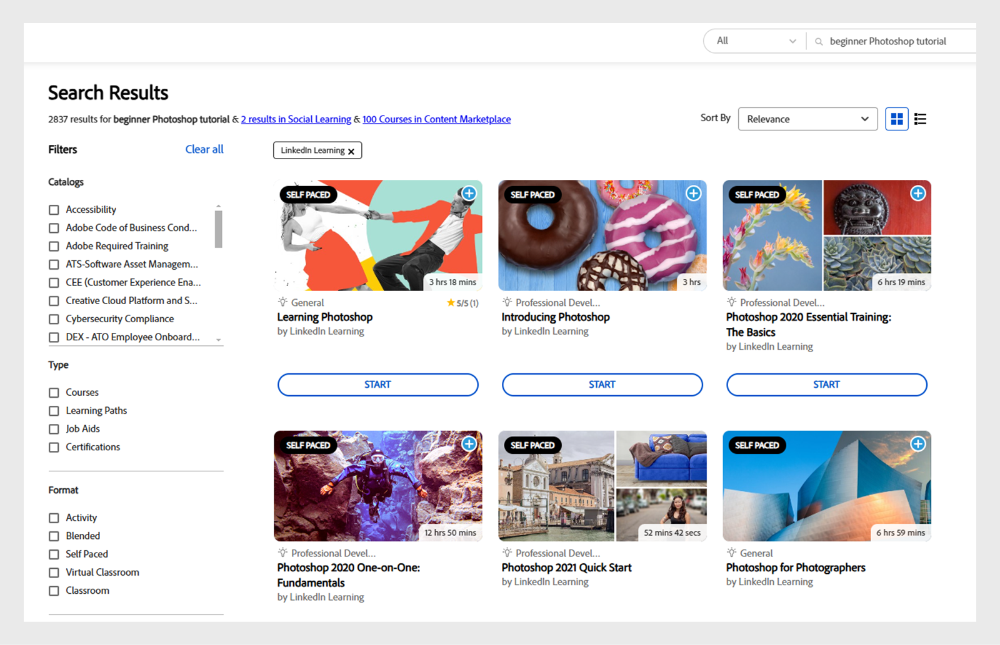

# Adobe Learning Manager 中的進階 AI 搜尋

## 簡介

Adobe Learning Manager 的搜尋功能提升使用者體驗，讓他們能有效率地找到相關內容，並協助他們消費正確的內容。

Adobe Learning Manager 引入結合詞彙與語意搜尋的 AI 搜尋功能。 這項強化的功能讓學習者能有效率地找到相關內容。 先進的 AI 搜尋能理解您的查詢意義，並提供相關結果。

>[!NOTE]
>
>此功能在 FedRAMP 授權的環境中無法使用。 詳情請參閱 [FedRAMP 環境](/help/migrated/feature-availability-in-fedramp-authorized-environment.md) 的功能可用性。

## 主要優點

* **更智慧的搜尋**：了解搜尋詞背後的脈絡與意圖
* **提升相關性**：根據你查詢的意義提供結果
* **提升使用者體驗**：幫助學習者消費正確的內容

>[!NOTE]
>
>AI 驅動的搜尋僅提供給學習者。

## 為什麼搜尋很重要？

搜尋功能的重要性有幾個：

* **使用者體驗**：透過快速資訊檢索提升用戶滿意度
* **效率**：透過減少尋找特定內容的努力，節省時間。
* **可及性**：有效的搜尋功能使資訊更易取得，確保使用者能接觸到符合其需求的內容。
* **個人化**：先進的搜尋系統能根據使用者偏好調整結果，提升資訊的相關性。

## 網路搜尋行為的演變

隨著人們在網路上搜尋，搜尋方式也在改變，搜尋引擎也在調整以跟上。 以下是近年來人們搜尋資訊的一些主要方式：

* **意圖驅動**：使用者不再輸入精確關鍵字，而是用「我想這麼做」或「我需要」等詞語表達需求。 現代搜尋引擎了解這些詞彙背後的目的，並提供更相關的結果。
* **排名結果**：搜尋結果會根據其他用戶覺得有幫助的內容來組織。 這代表最有用的內容會出現在最上面，讓你更容易找到優質資訊。
* **多元來源**：搜尋引擎涵蓋的來源越多，結果越好。 透過從多種可信來源擷取資訊，搜尋引擎能提供更完整且準確的答案。
* **個人化**：搜尋引擎會根據時間、地點及使用者偏好等因素調整結果。 這讓使用者更容易找到符合當下特定需求的資訊。

## 為什麼 Adobe Learning Manager 的搜尋更好

Adobe Learning Manager 提供更智慧且進階的搜尋體驗。 它不僅匹配關鍵字，還能在上下文中理解使用者查詢的意義，以找出最相關的結果。

* **AI 驅動**：Adobe Learning Manager 運用先進的 AI 技術，理解搜尋意圖背後的意義，而不僅僅是文字。 這有助於顯示真正符合使用者需求的結果，使搜尋更準確。
* **同儕驅動**：Adobe Learning Manager 使用一系列課程品質參數來排名最有用的結果。 這個排名演算法是根據五千萬個資料點訓練的，這些資料會定期對資料庫中的每個內容進行評分
* **全面**&#x200B;性：Adobe Learning Manager 搜尋整個資料庫，包括自有內容、第三方課程名稱、說明、標籤、個人化筆記及其他元資料。 像影片和 PDF 這類內容，它會自動轉錄並在逐字稿中搜尋。

## Adobe Learning Manager 的 AI 驅動搜尋

Adobe Learning Manager 運用先進的 AI 技術來提升搜尋體驗，並讓尋找相關學習內容變得更容易。 進階搜尋的主要組成部分如下所述。

### 辨識關鍵術語

Adobe Learning Manager 使用自然語言處理（NLP）來從課程名稱與描述中辨識重要關鍵字。 接著專注於這些關鍵字，提供更好的搜尋結果，幫助這些關鍵字的結果優於其他結果。 例如，若學習者搜尋 **PhotoShop 基礎，** Adobe Learning Manager 會優先顯示「PhotoShop **」一詞**，以顯示最相關的課程。

_優先排序關鍵字_

在上方截圖中，一位學習者使用「Photoshop 入門&#x200B;**」一詞**&#x200B;搜尋課程。搜尋會優先搜尋 PhotoShop 一詞&#x200B;**，以找到與 Photoshop** 相關的&#x200B;**最相關**&#x200B;課程。對於關鍵字開始，它會理解意圖並尋找相似詞彙以顯示最佳匹配。 如此一來，學習者會看到以 Photoshop 為主題且適合初學者的課程。

### 擴展查詢

Adobe Learning Manager 將使用者查詢擴展到更具情境性的意義，以幫助找到更好的結果。 這樣搜尋演算法就能獲得更多上下文，同時也符合使用者的查詢。 即使學習者使用一般性的術語，他們仍能找到有用的結果。 例如，若學習者在搜尋 **客戶服務基礎**，會嘗試從查詢中找出關鍵字，並將其餘部分擴展成相似的詞語。

_擴展查詢_

### 課程元資料搜尋

Adobe Learning Manager 的元資料搜尋涵蓋原生及匯入課程（例如 LinkedIn Learning 或 Go1）的元資料。 此功能會搜尋您的課程名稱、說明、標籤、個人化筆記及其他元資料。 這有助於利用大量不同的元資料來尋找結果，讓結果更好且更準確。
注意：客戶資料，包括內容與逐字稿，不會與任何外部 AI 搜尋服務共享。 所有內容都儲存在目前的儲存系統中。

#### 內容內搜尋

Adobe Learning Manager 具備增強的搜尋功能，允許使用者在各種檔案類型的實際內容中搜尋，包括影片、音訊檔案、PDF、文件、簡報及試算表。 系統會自動轉錄這些內容，以提供更全面且準確的搜尋結果。 此外，Adobe Connect 會議的錄影也被納入搜尋，確保寶貴資訊不會被遺漏。 若在內容中找到匹配，搜尋模型會提升該內容在最終結果中的排名。 最終排名由多項因素決定，詳見 [AI 驅動搜尋與重新排名](/help/migrated/learners/feature-summary/advanced-search.md#ai-powered-search-and-re-ranking) 部分。

>[!NOTE]
>
>新增內容，如影片或PDF，將在24小時處理後提供內容內搜尋。

### 語意搜尋

Adobe Learning Manager 現在將語意搜尋與傳統詞彙搜尋結合，提升搜尋結果的準確性。 透過從課程名稱與描述產生向量嵌入，它建立了完整的向量資料庫。 當學習者提交查詢時，系統會將查詢向量化並進行相似性匹配，以找出最相關的結果。 例如，若學習者搜尋初學者 Photoshop 教學，系統會理解需求並找到對初學者特別有幫助的課程。

_語意搜尋_

>[!NOTE]
>
>語意搜尋目前僅支援英文內容。

### AI 驅動搜尋與重新排名

Adobe Learning Manager 的搜尋以結合傳統與先進技術領先業界。 它結合了傳統搜尋方法，如短語匹配與複雜的語意搜尋，以產生完整的結果。 系統根據註冊人數、出版日期、評分及人氣等關鍵因素對這些結果進行排名。 這確保了來自各指標的高品質配對，並依據我們的課程品質排名系統。

整體而言，AI 驅動的搜尋設計全面、準確且易於使用，幫助學習者快速找到支持學習旅程所需的資源。

>[!NOTE]
>
>1. 使用無頭實作的客戶需遵循 API 文件以啟用進階搜尋
>2. Salesforce 應用程式目前無法提供進階搜尋功能。
>3. 客戶資料，包括內容與逐字稿，不會與任何外部 AI 搜尋服務共享。 所有內容都會安全地儲存在現有的儲存系統中。
