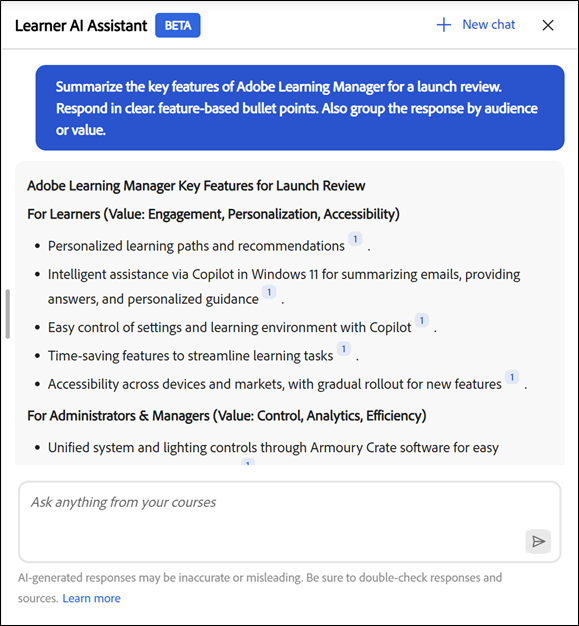

# 學習者助理

學習者專用的Learner AI Assistant (Beta)可協助他們快速從指派的學習內容中找到答案，而不需瀏覽整個課程。 您可以用簡單的語言提出問題，並獲得準確、重點突出的回應，以及相關課程內容的來源連結。

>[!IMPORTANT]
>
>學習者AI助理目前在Beta中，並正透過分階段推出發行。 存取權可能依使用者而異。

## 什麼是學習者AI助理？

Learner AI Assistant是Adobe Learning Manager中的GenAI支援聊天夥伴，可透過Adobe Learning Manager提供的受信任學習內容，為學習者提供快速、準確的問題解答。 其中也包括引文，因此學習者永遠知道資訊的來源。

## 為什麼要使用它？

* 學習者面臨內容超載，通常不知道從哪裡開始或要使用哪個資源。

* 目錄和存取規則讓他們難以發現可供他們使用的內容。

* 學習歷程分為多種格式和培訓型別，例如課程、虛擬教室、工作輔助和評估。

* 要擷取不同格式（如SCORM、PDF、檔案、影片或成績單）的特定資訊，沒有簡單且統一的方式。

* 不同的學習者角色和產業（例如銷售、行銷、支援、營運）有獨特的資訊需求，需要快速的情境式解答。

## AI助理可以轉譯哪些型別的內容

AI助理可以從所有指派給您的學習內容型別中找到資訊，包括：

* **檔案：** PDF、Word、PowerPoint、Excel、HTML

* **媒體：**&#x200B;音訊(mp3、wav、m4a)、視訊(mp4、mov、wmv)

* **互動式內容：** SCORM 1.2、SCORM 2004、

* **學習物件型別：**&#x200B;課程、學習路徑、認證、工作輔助

Adobe使用在Adobe私人VPC環境中託管的受信任協力廠商處理服務，安全地轉譯您的學習內容。

**重要**

AI助理只會使用下列內容：

* 可用於管理員為學習者助理設定的目錄，以及

* Adobe Learning Manager內部目錄的一部分。

目前版本不支援共用、已取得、外部或其他非內部目錄作為AI助理的內容來源。

如果您無法存取課程，將無法存取相關的引文連結。 擷取答案時不含協力廠商程式庫（例如LinkedIn Learning或Go1）。

## 對話功能

AI Assistant支援單一問題和多圈對話。 它會提醒您先前在相同工作階段中的查詢。

**交談範例：**

您：「什麼是退款政策？」
助理：提供摘要
您：「30天後退款呢？」
助理：傳回更具體的資訊

## AI助理的使用案例

### 即時學習支援（所有學習者）

學習者通常需要在工作時快速解答，而非完整課程的重播。 AI助理可以立即從指派的學習內容中擷取精確資訊。

**它的協助內容：**

* 從課程、工作輔助和檔案中取得特定問題的直接解答

* 使用引文跳至完全參照的區段

* 縮短在多個學習物件中搜尋的時間

### 銷售支援與客戶對話

在客戶即時互動期間，銷售團隊需要快速、準確的產品與流程資訊。 AI助理可隨選提供相關知識。

**它的協助內容：**

* 擷取最新的產品功能和定位

* 從訓練內容產生快速銷售指令碼或談話要點

* 使用指派的學習資料比較產品版本或方案

* 強化銷售知識，無需重修整個課程

使用學習者助理進行

**範例2**

**用途：**&#x200B;顯示AI助理可以協助銷售代表立即回答客戶比較問題。

**建議的提示：**&#x200B;比較Adobe Learning Manager與企業培訓的傳統LMS。 以表格格式顯示比較。

學習者助理中的

### 行銷和行銷活動整備

行銷團隊經常在稽核、啟動或利害關係人討論之前需要快速重新整理。 AI助理將複雜的學習內容摘要成可操作的深入分析。

**它的協助內容：**

* 將長課程或影片摘要為重要素材

* 在會議前重新整理程式或產品知識

* 探索相關學習內容以深化專業知識

使用學習者助理進行

### 營運與流程說明

運作、支援和內部團隊都仰賴準確的流程檔案。 AI Assistant有助於立即釐清原則和工作流程。

**它的協助內容：**

* 尋找內部流程、SOP和法規遵循指引的相關解答

* 釐清步驟層級詳細資訊，而不瀏覽冗長的檔案

* 減少重複問題對SME的依賴

### 更快上線和角色轉換

新員工和進入新職位的員工通常很難瀏覽大型學習目錄。 AI Assistant透過引導他們獲得相關答案來加快加速進度。

**它的協助內容：**

* 從指派的內容回答常見的入門問題

* 提供角色特定概念的快速說明

* 支援自我導向學習，避免資訊過載

### 知識更新與持續學習

經驗豐富的學習者需要快速複習資料，而非完整的再培訓。 AI Assistant支援在工作流程中持續學習。

**它的協助內容：**

* 隨選重新整理知識，無需重新觀看課程

* 完成培訓後強化學習結果

* 鼓勵與學習內容頻繁、輕鬆互動

學習者助理中的

## 學習者AI助理如何使用內容

學習者AI助理可幫助您在學習時快速找到準確答案。 為了有效使用，您應該瞭解助理使用了哪些內容、未使用哪些內容，以及如何產生回應。

### AI助理使用哪些內容

學習者AI助理只會使用在Adobe Learning Manager中指派給您的學習內容來回答問題。

* 助理會使用管理員為學習者AI助理啟用之內部目錄的內容。

* 在擷取資訊時，助理會尊重您的角色、群組成員資格和目錄許可權。

### AI助理不使用哪些內容

學習者AI助理會將回應限制在您指派的學習範圍。

* 它不使用來自預設、共用、已取得、外部或其他非內部目錄的內容。

* 它不會擷取協力廠商內容庫（例如LinkedIn Learning或Go1）的資訊。

* 它不會瀏覽網際網路或存取外部網站來產生答案。

### AI助理如何產生答案

Learner AI Assistant會分析您指派的學習內容，以產生重點明確的內容相關回應。

* 每個回應都包含參考原始來源內容的引文。

* 您可以選取引文以直接導覽至相關的課程、模組或檔案。

* 引文可協助您驗證資訊，並在需要時探索其他內容。

### 負責任地使用AI助理

使用Learner AI Assistant作為學習輔助工具，以探索、重新整理及強化知識。

* 將回應視為可用學習內容的指引。

* 請參考引述的來源原物料，以取得完整與權威資訊。

### 管理員如何控制存取

管理員可管理學習者AI助理的存取權並控制其使用的內容。

* 管理員會將助理指派給特定使用者群組。

* 管理員可選取助理可以做為內容來源的內部目錄。

* 這些控制項可確保助理只會顯示已核准的相關學習內容。

## 關於內建提示

學習者AI助理包含一組內建提示，以協助學習者快速開始處理常見問題和情境。 這些提示會引導學習者如何與助理互動並示範他們可以提出的問題型別。

每個帳戶皆可自訂內建提示。 組織可以量身打造這些提示，以反映其學習目標、學習者角色、術語或特定使用案例。

管理員可與其客戶成功經理(CSM)合作，以設定、修改或更新帳戶的內建提示。 提示自訂是在帳戶層級管理，且無法直接在目前版本中的Adobe Learning Manager使用者介面中設定。

根據Adobe所定義的設定，向學習者顯示的提示可能會因帳戶而異。

## 啟用學習者AI助理

AI Assistant (Beta)提供AI支援服務，協助學習者更有效率地探索及運用內容。 管理員可藉由指派功能給特定使用者群組和目錄來控制存取權。 設定AI助理時只應使用內部目錄。 AI Assistant回應和引文不支援顯示來自「共用」、「已獲得」、「外部」或其他非內部目錄的內容。

管理員可選取哪些使用者群組和內部目錄可以存取AI助理功能。 他們應確保指派的目錄僅包含適合透過AI回應和引述顯示的學習內容，並且這些目錄為內部、非共用、已取得或外部。

在設定AI助理(Beta)之前，請確認您擁有管理員認證，並已識別哪些使用者群組和目錄應該擁有該功能的存取權。

### 設定學習者助理存取權

若要啟用學習者AI小幫手：

1.以管理員身分登入Adobe Learning Manager。

2.從首頁中選取&#x200B;**設定**。

![管理員主控台的[設定]選項位於左窗格](assets/settings-menu.png)

3.從&#x200B;**設定**&#x200B;功能表選取&#x200B;**學習者AI助理(Beta)**。

![管理員主控台在左窗格顯示[學習者AI小幫手]選項](assets/learner-assistant-ai-beta.png)

4.選取切換開關以啟用&#x200B;**學習者AI助理(Beta)**。

5.從&#x200B;**合格使用者群組**&#x200B;選項中選取一或多個使用者群組。

6.選取&#x200B;**儲存**&#x200B;以套用使用者群組設定。

7.從&#x200B;**合格目錄**&#x200B;選項中選取一或多個目錄。

8.選取&#x200B;**儲存**&#x200B;以套用目錄設定。

>[!IMPORTANT]
>
>AI助理只支援內部目錄。 如果選取了「共用」、「已取得」、「外部」或其他非「內部」目錄，即使該目錄出現在「合格的目錄」清單中，AI助理也不會顯示其內容。

## 存取Adobe Learning Manager中的學習者AI助理

Adobe Learning Manager的學習者AI助理(Beta)可幫助您在學習時快速找到答案。 此智慧型工具會直接回應您有關課程、內容和平台功能的問題，所有問題均來自您的學習者帳戶。

AI小幫手只能使用管理員已為學習者小幫手啟用的內部目錄中的內容。 僅存在於共用、已取得或外部目錄中的內容不包括在內。

學習者AI助理(Beta)僅供選定學習者使用。

### 啟動AI助理

若要啟動學習者AI助理：

1.以學習者身分登入Adobe Learning Manager。

2.在首頁上選取&#x200B;**詢問AI助理**。

3.當出現&#x200B;**學習者AI助理(Beta)**&#x200B;畫面時，請選取&#x200B;**開始使用**。

![選取[開始使用]以啟動學習者助理](assets/get-started-learner-assistant.png)

>[!NOTE]
>
>第一次啟動AI Assistant時，您必須先提供同意才能使用。 同意對話方塊只會在初次啟動時顯示。 對於所有後續啟動，您將直接帶到AI助理輸入提示。

4.在文字欄位中輸入提示。

5.按&#x200B;**Enter**&#x200B;以接收回應。 檢閱您的答案、來源和建議。

Adobe允許在帳戶層級進行提示自訂。 若要設定或更新內建提示，請聯絡您的Adobe客戶成功經理(CSM)。

AI Assistant回應包含每個回應的引文，讓學習者可輕鬆驗證資訊的來源。 每個被引證的參考連結會回到原始課程模組、工作輔助或其他學習內容。

學習者可以：

* 選取內嵌的引文編號以跳至確切的參考區段

* 選取回應底部的&#x200B;**顯示來源**，開啟完整的來源清單

學習者助理包含每個回應的引文，以顯示資訊的來源。 每個引文都直接連結至用來產生答案的原始課程、模組或學習物件。

您可以選取任何引文，以在Adobe Learning Manager中開啟實際的課程頁面，並在上下文中檢閱完整內容。 引用可協助您驗證資訊、探索其他詳細資訊，並繼續從權威來源學習。

## 使用搜尋存取AI助理

管理員也可以直接從搜尋列啟動AI助理。 只要輸入您的問題，並從下列選項中選取&#x200B;**詢問AI小幫手**，即可從指派的學習內容取得答案。

## 提供學習者AI助理(Beta)回應的意見回饋

您對學習者AI助理(Beta)所產生回應的意見回饋，有助於改善其正確性、相關性和整體效能。

### 喜歡或不喜歡回應

* 選取&#x200B;**向上縮圖**，選擇您認為有幫助的回應，並選擇加入註解，然後選取&#x200B;**提交**。

* 選取&#x200B;**向下縮圖**，選擇回應沒有幫助的原因，新增任何註解，然後選取&#x200B;**提交**。

## 在AI助理中開始新聊天

學習者可隨時清除目前的對話並開始新的聊天。

* 在AI Assistant畫面中選取&#x200B;**新增聊天**，然後選取&#x200B;**是**。

