# 學習者的 AI 助理

AI 助理（Beta）幫助學習者快速從指定的學習內容中找到答案，無需瀏覽整門課程。 你可以用淺顯易懂的語言提問，並獲得準確且聚焦的回答，並附有相關課程內容的來源連結。

>[!IMPORTANT]
>
>學習者的 AI 助理目前作為測試版功能提供。 隨著功能演進，功能、支援情境及限制可能會有所變化。

## 什麼是學習者的 AI 助理

AI 助理是 Adobe Learning Manager 中由 GenAI 驅動的聊天夥伴，利用 Adobe Learning Manager 中可信賴的學習內容，快速且準確地回答學習者的問題。 同時也包含引用，讓學習者隨時知道資訊來源。

### AI 助理的主要功能

1. 智慧問答
   * 單回合與多回合對話
   * 英語中的自然語言理解
   * 答案來自課程、證照、學習路徑及工作輔助工具
   * 當查詢模糊時，聰明的澄清問題
   * 由 Azure 開放式 AI 大型語言模型（LLM）功能驅動，以產生回應
2. 內容來源與引用
   * 從支援目錄中可用的資源中檢索答案。
   * 提供引用並直接連結至原始資料
   * 支援所有靜態與互動式 ALM 內容格式：PDF、DOCX、PPTX、XLSX、音訊（mp3、wav、m4a）、影片（mp4、mov、wmv）、HTML、SCORM 2004、SCORM 1.2
3. 使用者體驗
   * 側邊面板介面可從所有學習者頁面存取
   * 回應式設計，能依據內容範圍調整
   * 聊天記錄會被記錄在瀏覽器會話中
   * 新登入或頁面刷新時，重新開始
   * 教師或家教語氣：友善、清晰且教學嚴謹
4. 管理員控制
   * 在帳號層級啟用或停用功能
   * 使用者群組的存取控制
   * 選擇包含哪些目錄以供 AI 回應
   * 遵守 Adobe AI 指引的使用條款接受要求

## AI 助理支援哪些類型的內容

AI 助理會從分配給你的學習內容中擷取資訊，包括：

* **文件：** PDF、Word、PowerPoint、Excel、HTML
* **媒體：** 音訊（mp3、wav、m4a）、影片（mp4、mov、wmv）
* **互動內容：** SCORM 1.2、SCORM 2004
* **學習對象類型：** 課程、學習路徑、認證、工作輔助工具

Adobe 透過託管於 Adobe 私有 VPC 環境中的可信第三方處理服務，安全轉錄學習內容。

### 目錄與內容來源限制

學習者 AI 助理僅使用管理員明確設定的內部目錄&#x200B;**內容**。

以下內容來源目前 **版本不支援** ：

* 共享目錄
* 已取得的目錄
* 外部目錄
* 預設目錄
* 第三方內容庫（例如 LinkedIn Learning 或 Go1）

若學習者無法取得課程或工作輔助，AI 助理將無法從該內容中呈現資訊，且無法存取引用連結。

## AI 助理的應用案例

### 技術學習者

Sarah 是一名正在學習顯示卡的銷售工程師。 她需要快速了解技術規格與優勢，才能自信地回答客戶問題。

AI 助理協助 Sarah 完成：

* 複雜 GPU 架構的清晰且技術性說明
* 加深對各種顯示卡及其差異的理解
* 範例說明，讓 Sarah 能將功能與現實世界的使用情境連結起來

### 客戶支援

Marcus 是合作公司的支援專家。 他需要快速回答產品功能，幫助客戶，避免升級到工程團隊。

AI 助理協助 Marcus 完成：

* 尋找針對頻繁詢問客戶問題的相關支援內容
* 當最初的答案不夠具體時，會提出澄清性問題
* 尋找相關的故障排除課程推薦，以提升他的技能

### 新員工入職

Jennifer 剛加入公司，對大量的訓練內容感到不知所措。 她需要一種方法，不用複習整門課程就能找到特定資訊。

AI 助理協助 Jennifer 完成：

* 獲取提交費用報告的逐步指引
* 在不瀏覽整個目錄的情況下，發現有關公司政策的課程
* 引導她到課程的適當部分，卻不讓她看好幾個小時的影片

## AI 助理如何使用內容

AI 助理能幫助你在學習的同時快速找到準確答案。 要有效使用它，你應該了解助理使用哪些內容、不使用哪些內容，以及它如何產生回應。

### AI 助理使用哪些內容

AI 助理僅使用帳號管理員啟用的學習內容回答問題。 目錄內容會被索引。

AI 助理會分析你分配的學習內容，產生聚焦且具情境性的回應。

* 每個回應都包含引用原始來源內容的引用。
* 您可以選擇引用，直接導覽到相關的課程、模組或文件。
* 引用資料有助於你核實資訊並在需要時探索更多背景。

### 串流回應

串流回應是指 AI 助理在生成的答案中逐步呈現，讓使用者能立即開始閱讀回應，而不必等待整個答案載入完成。

### 引用與來源透明性

每個 AI 助理回應都包含直接連結原始課程、模組或學習物件的引用。 引用可讓你：

* 選擇內嵌引用號碼以跳轉至精確的參考章節
* 請在回應底部選擇「顯示來源」開啟完整來源列表
* 從權威來源核實資訊並探索更多背景

>[!IMPORTANT]
>
>AI 助理會根據管理員啟用的內容提供答案，但如果使用者無法存取該參考項目，打開時會看到「不支援」的訊息。

## 內建提示

AI 助理內建提示，幫助學習者快速開始解答常見問題與情境。 這些提示引導學習者如何與助理互動，並示範他們可以提出的問題類型。

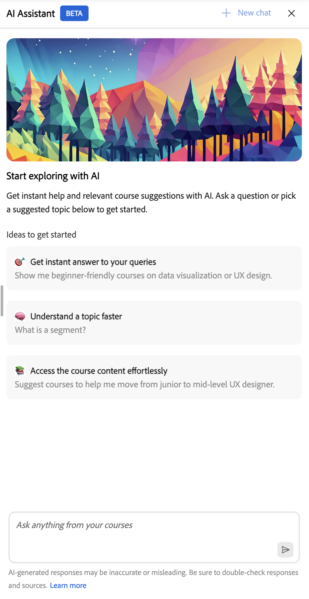

內建提示可依帳號自訂。 組織可以根據學習目標、學習者角色、術語或特定使用情境量身打造這些內容。 管理員可以與客戶成功經理（CSM）合作，設定或更新內建提示。

提示詞自訂由帳號層級管理，且無法直接在 Adobe Learning Manager 使用者介面中配置。

## 管理員設定-啟用學習者的 AI 助理

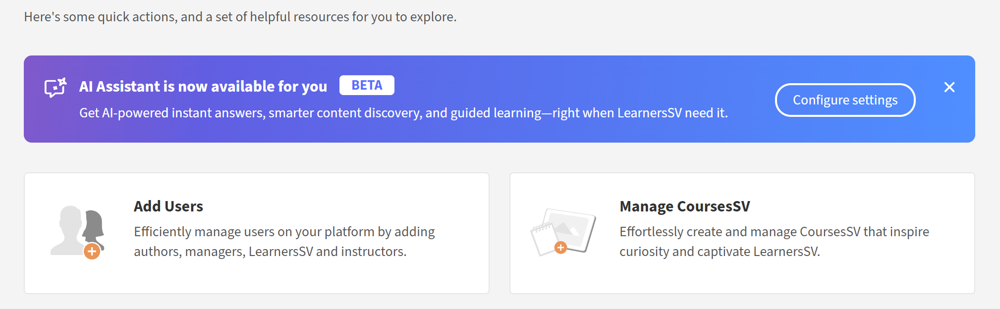

管理員可選擇哪些使用者群組與內部目錄能存取 AI 助理功能。 他們應確保所分配的目錄僅包含適合透過 AI 回應與引用呈現的學習內容，且這些目錄為預設、內部、非共享、已取得或外部。

在設定 AI 助理之前，請確認你擁有管理員憑證，並確認哪些使用者群組和目錄應該有權限使用該功能。

### 設定 AI 助理存取權限

啟用學習者 AI 助理：

1. 以管理員身份登入 Adobe Learning Manager。

2. 從首頁選擇 **設定** 。
   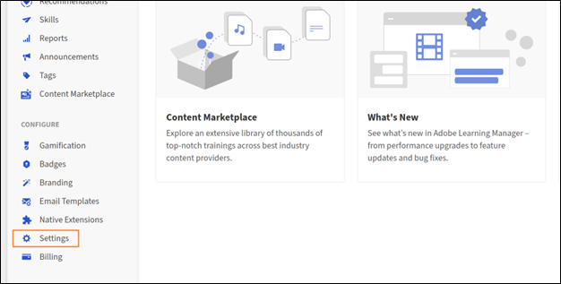

3. 從設定選單選擇&#x200B;**學習者 AI 助理（測試版**&#x200B;**）。**
   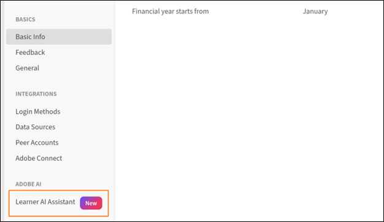

4. 選擇切換開關以啟用&#x200B;**學習者 AI 助理（測試版）。**
   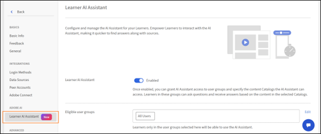

5. 從 **「合格使用者群組** 」選項中選擇一個或多個使用者群組。

6. 選擇 **儲存** 以套用使用者群組設定。

7. 請從 **「合格目錄」** 選項中選擇一個或多個目錄。

8. 選擇 **儲存** 以套用目錄設定。

>[!IMPORTANT]
>
>AI 助理僅支援內部目錄。 若選擇共享、收購、外部或其他非內部目錄，AI 助理不會顯示其內容，即使該目錄出現在合格目錄列表中。

## 學習指南-啟動 AI 助理

### 啟動 AI 助理

要啟動 AI 助理：

1. 以學習者身份登入 Adobe Learning Manager。

2. 在首頁選擇 **「詢問 AI 助理** 」。
   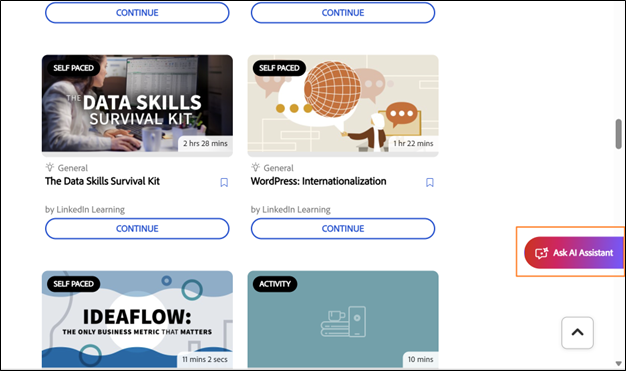

3. 當學習者 AI 助理&#x200B;**畫面出現時**，選擇&#x200B;**「開始**&#x200B;使用」。
   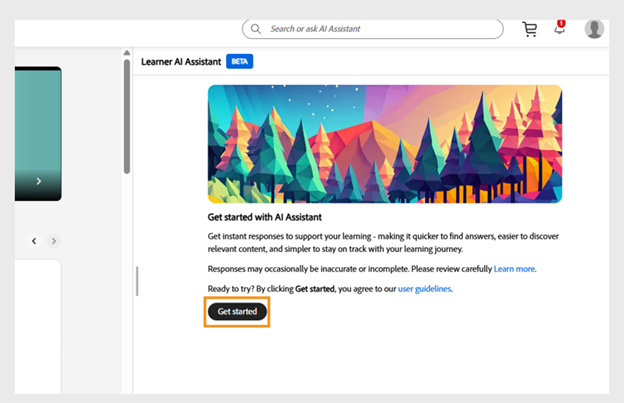

>[!NOTE]
>
>首次啟動 AI 助理時，必須先提供同意才能使用。 同意對話框只會在這次初始啟動期間出現。 之後所有的啟動，你都會直接進入 AI 助理輸入提示。

&#x200B;4. 在文字欄位輸入你的提示。
<!-- 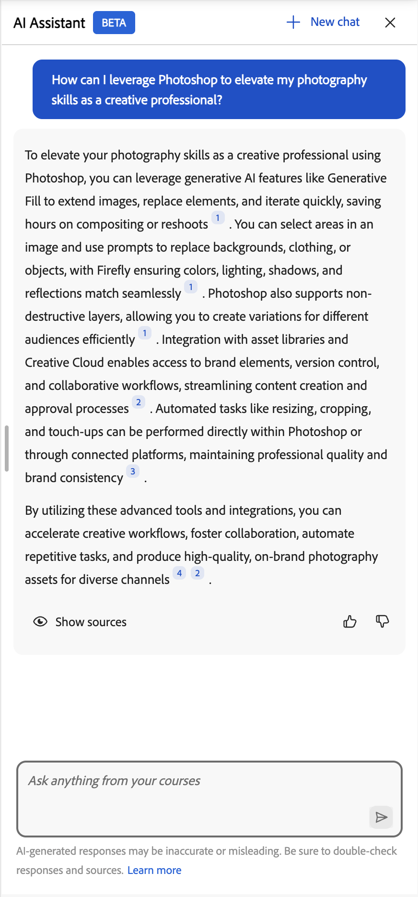 -->

&#x200B;5. 按 **Enter** 鍵接收回覆。 請檢視你的回答、資料來源和建議。

你可以：

* 選擇內嵌引用編號即可跳到精確的參考章節
* 請在回應底部選擇 **「顯示來源** 」開啟完整資料來源清單

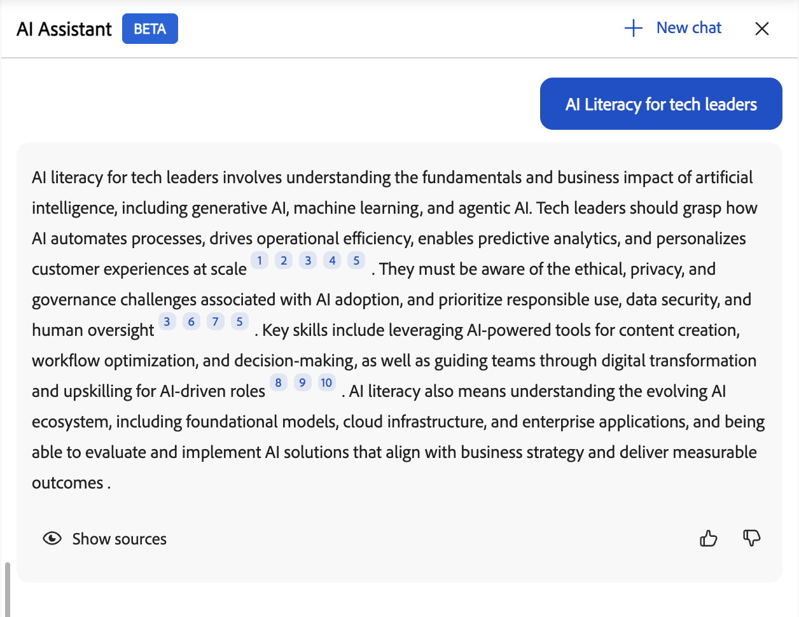

AI 助理在每個回應中附有引用，以顯示資訊來源。 每個引用都直接連結到原始課程、模組或用來產生答案的學習對象。

你可以選擇任何引用，在 Adobe Learning Manager 中開啟課程頁面，並根據上下文檢視完整內容。 引用幫助你驗證資訊、探索更多細節，並持續從權威來源學習。

## 透過搜尋存取 AI 助理

你也可以直接從搜尋欄啟動 AI 助理。 在搜尋欄輸入你的問題，然後從出現的選項中選擇 **「詢問 AI 助理** 」，以獲得你指派的學習內容答案。

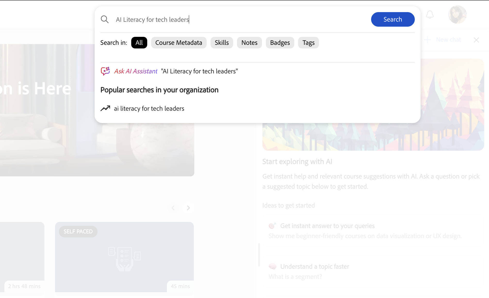

## 對學習者 AI 助理的回應提供回饋

您對學習者 AI 助理（測試版）所產生回應的回饋，有助於提升其準確性、相關性及整體效能。

### 喜歡或不喜歡某個回應

* 選擇 **讚**，選擇你覺得回應中有幫助的內容，然後可選擇新增留言，然後選擇 **提交**。

<!-- 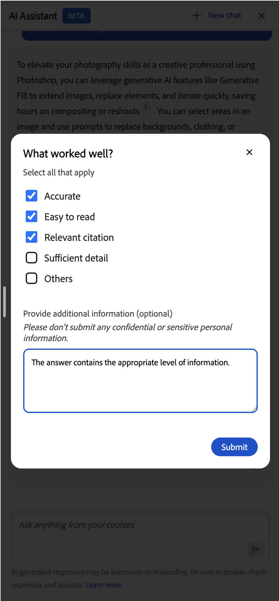 -->

* 選擇 **「豎中指」**，選擇回應無助的原因，新增任何評論，然後選擇 **提交**。

## 在 AI 助理中開啟新聊天

開始新聊天讓使用者能重新開始對話，清除先前的上下文，讓助理能專注於新主題，而不必重複先前的互動。 這在轉換主題或尋求與先前問題無關的答案時非常重要。

隨時清空目前的對話並開始新的聊天。

在 AI 助理畫面選擇 **「新聊天」** ，然後再選擇 **「是**」。

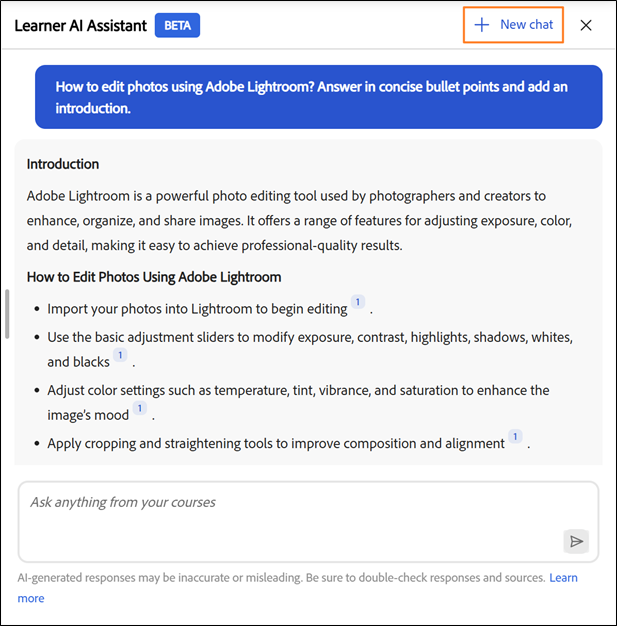

AI 助理為學習者提供快速且具上下文的答案，支援多種內容類型，並提供內嵌引用以提升透明度。 管理員可控制存取權限，確保 AI 助理符合組織需求，提升學習體驗。

## 疑難排解

>[!NOTE]
>
>設定新目錄後，預留4至5小時時間將內容索引並供 AI 助理回應。

### 情境一：無法存取內容

問題：學習者可以使用學習助理，但收到的回覆是「我沒有這個問題的答案」。

**可能的原因**

* 在設定 AI 助理時，學習者目錄並未包含在內
* 與問題相關的內容不在部分目錄中，或目錄為空白
* 學習者無法看到相關內容

**解法**

* 確認學習者的目錄存取權限
* 檢查學習助理設定中啟用的目錄
* 確保這些目錄中存在相關內容
* 新增內容幾小時後才會被索引

### 情境二：答案不相關或品質不佳

**問題：** AI 助理提供的答案與問題不符或品質低劣。

**可能的原因**

* 問題範圍過於廣泛或模糊
* 相關內容的元資料（描述、標籤）不夠好
* 內容結構使得資訊擷取變得困難

**解法**

* 鼓勵學習者提出更具體的問題
* 檢視並改進課程說明與元資料
* 確保內容有清晰的標題和結構
* 請檢視詳細的使用報告以找出模式
* 考慮為常見問題建立工作輔助工具

### 情境三：範圍外問題

**問題**：學習者提出與訓練內容無關的問題。

**舉例**：

* 常識問題（「誰是總統？」）
* 個人意見（「你覺得X怎麼樣？」）
* 不當內容
