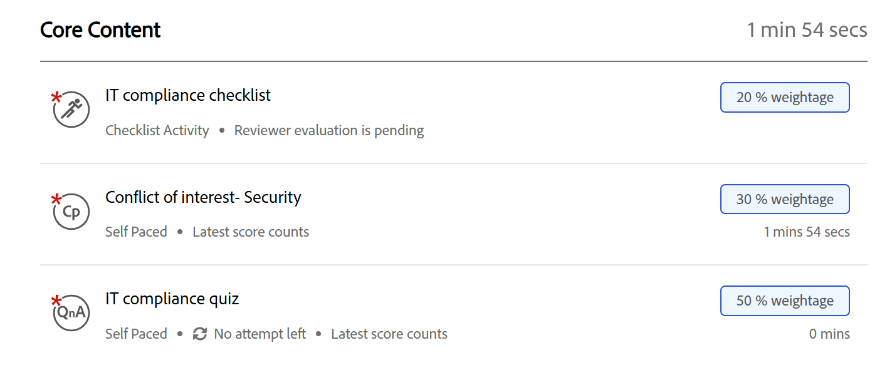
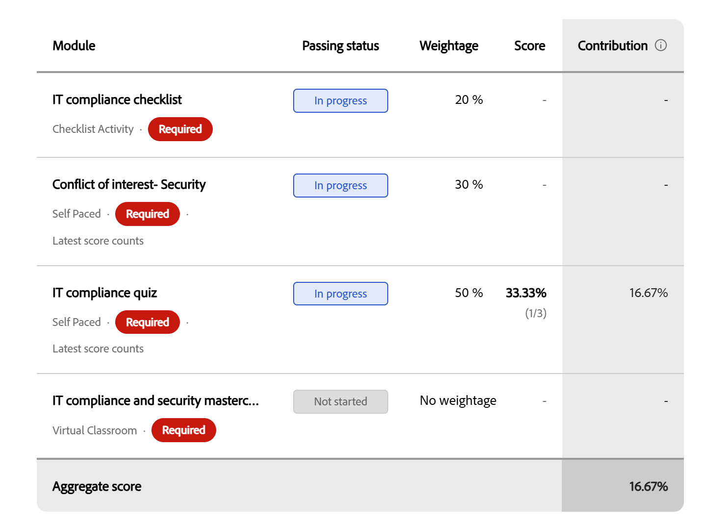
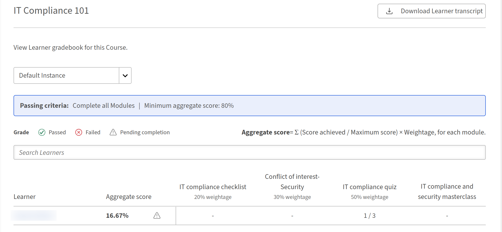

# 學習者成績簿

## 用成績簿開始課程

當 Adobe Learning Manager 啟用並顯示該課程的成績冊時，課程總覽頁面會出現一個 **成績簿** 分頁。 用它來查看你每個模組的加權分數、目前的總分數，以及你是否通過或還需要完成更多課程。

## 成績簿何時可用

**當您的作者或管理員啟用成績簿可見性時，成績簿**&#x200B;分頁會與課程播放器中的模組&#x200B;**、**&#x200B;筆記&#x200B;**和**&#x200B;討論&#x200B;**一同**&#x200B;出現。若分頁未顯示，表示該課程未啟用成績冊，或管理員已關閉學習者可見功能。 分數仍可能被記錄並讓你的管理員看到。

你可以在註冊期間的任何時候開啟 **成績簿** 分頁：

* **開始前：** 報名後，你會看到完整的可評分模組清單，包括其權重百分比、每個模組的最高分數，以及作者設定的及格標準。 這會讓你在開始前清楚看到課程的評分方式。
* **進行中：** 當你完成模組並記錄分數時，成績冊會更新，顯示你目前的分數以及尚未嘗試或等待評分的模組。
* **完成後：** 成績簿會顯示所有期末模組分數、你計算出的課程總分，以及 **標題中的「通過** 」成績。

## 查看成績冊

* 從 **「我的學習」**&#x200B;中選擇你的課程。
* 從課程頁面選擇 **成績簿** 標籤。

  成績冊標題顯示：

  

* **通過標準：**&#x200B;最低總分及所需模組數
* 你完成的必修模組數量佔總數
* 你目前 **的總分** 百分比
* 您目前的課程狀態： **未開始**、 **完成待**&#x200B;完成、 **通過**&#x200B;或 **未通過**

標題下方的模組表顯示每個模組的以下欄位：

| **柱狀** | **它顯示的內容** |
|------------|-------------------|
| **模組** | 模組名稱與類型 |
| **現況** | 您完成本單元的成績或成績狀況（見下方狀態參考） |
| **權重** | 這個模組對你總分的貢獻百分比 |
| **配樂** | 你在這個模組的分數（例如40/100） |
| **貢獻** | 這個模組目前為你的總分增加了多少百分比 |

## 從模組標籤查看模組權重

你也可以在&#x200B;****&#x200B;模組分頁看到每個模組的權重，不用打開成績簿。

從你的課程頁面選擇&#x200B;****&#x200B;模組標籤。

**模組**&#x200B;標籤顯示每個模組的權重百分比及完成課程所需的模組數量。

## 多次嘗試的模組分數

如果某模組允許多次嘗試，成績簿上顯示的分數會依課程作者的設定方式而定：

* **最高：** 顯示所有嘗試中最高分數。 後續嘗試時分數較低不會減少你所記錄的分數。
* **最新：** 你最近一次嘗試的分數總是會顯示。 後續嘗試的分數較低會取代前一次。

## 了解你的模組狀態

成績冊中的每個模組顯示以下狀態之一：

| **現況** | **意義** |
|------------|-------------------|
| **完成** | 模組結束並記錄分數 |
| **進行中** | 模組已開始但尚未完成 |
| **還沒開始** | 尚未開啟的模組 |
| **失敗** | 模組得分，但分數未達及格門檻 |
| **待審核** | 模組已完成，但正在等待講師或行政人員的評分 |
| **沒有權重** | 模組類型不支援評分（PDF、影片等）;不對彙總有貢獻 |

## 你的總分數是如何計算的

你的總分數是每個評分模組加權貢獻的總和：

（取得的分數÷最高分）× 權重百分比 = 模組貢獻

**成績簿中的貢獻**&#x200B;欄位顯示每個模組對你目前總分的貢獻。標示 **為「無權重** 」的模組不在此計算中。

評分標準不必在所有模組間相同。 一個模組得分是 100 分，一個模組得分是 10 分，兩者都正確貢獻。 公式在加權前會對每個指標進行正規化。

## 查看並報告成績冊成績

Adobe Learning Manager 中的管理員可以查看所有已註冊學習者的加權成績本分數，依模組深入分析個別學習者的表現，下載篩選過的學習者成績單，並在內容稽核追蹤報告中追蹤成績簿設定變更。

## 查看課程成績冊

當課程啟用成績簿時，當你打開課程時，左側導覽&#x200B;**的報告**&#x200B;中會出現一個新的 **L2 回饋-成績簿**&#x200B;區塊。

* 以管理員身份登入 Adobe Learning Manager。
* 在左側導覽中，選擇 **課程** 並開啟你想複習的課程。
* 在課程導航中，在報告&#x200B;**中**&#x200B;選擇&#x200B;**「L2 回饋 – 成績簿**」。**「主動回饋成績簿**」頁面開啟。

它顯示：

1. 課程的通過標準（最低模組要求及最低總分）
2. 篩選列可依年級查看學習者： **通過**、 **不及**&#x200B;格或 **待完成**
3. 總分數公式：每個模組的總分數 = Σ（最高分數÷分數）×權重
4. 學習者名單顯示每位學習者的 **綜合分數** 及其對每個可評分模組的分數
5. 一個實例下拉選單，當同一門課有多個實例時，可以在課程實例間切換

尚未嘗試任何計分模組的學習者會在分數欄中顯示破折號。 不支援計分、PDF、影片、音訊等的模組，則不會以分數欄位的形式出現。

## 查看個別學習者的分數

在主動回饋成績本&#x200B;**中**，選擇學習者的名字。

個別學習者視圖顯示：

1. 學員姓名、電子郵件及狀態（**完成待**&#x200B;完成、 **通過**&#x200B;或 **未通過**）
2. 總分數及學習者完成的必修模組數量
3. 一個模組表，顯示：模組名稱、類型、是否必要、狀態、權重、達成分數，以及對彙總的貢獻

模組表包含所有可計分與不可計分的模組。 可評分模組顯示其分數與貢獻。 非計分模組會在分數與貢獻欄中顯示破折號。

## 樂譜模組

管理員與講師的評分行為與現行工作流程相同：

* **當底層內容報告分數時，SCORM、AICC、xAPI 及原生測驗模組** 會自動評分。
* **課堂課程、虛擬課堂課程及活動模組** ，由授課老師或行政人員從 **出席與評分** 頁面評分。

## 下載課程學習者成績單

您可以直接從成績冊頁面下載篩選至本課程的學習者成績單，方式有兩種：

* 在 **主動回饋成績本**&#x200B;中，選擇 **頁面右上角的「下載學習者成績單** 」。
* 在管理員首頁，選擇 **「報告**」，然後選擇 **「自訂報告**」。 從可用報告列表中選擇 **學習者成績單** 。

詳情請參閱新聞稿中的報告變更。

## 內容稽核追蹤活動

內容稽核追蹤記錄了兩個成績簿專屬的設定事件：

| **活動** | **當它出現時** |
|-----------|---------------------|
| **成績單更新** | 當作者啟用或停用課程的成績簿時 |
| **模組重量已更新** | 當作者更改模組的權重百分比時 |

詳情請參閱新聞稿中的報告變更。

利用這些條目追蹤誰更改了成績簿配置及時間，特別是在多位作者共同合作同一課程的環境中。

## 疑難排解

**L2 回饋-成績簿區塊不會出現在課程導覽中**

成績簿必須由課程作者在建立課程時啟用。 確認作者是否啟用了成績冊以創建課程。 若課程是在成績冊尚未提供前建立，則無法追溯新增。 需要新版本的課程。

**即使已完成模組，學習者的總分仍為0**

確認課程中至少有一個可評分模組並賦予權重值。 若學習者完成的所有模組（PDF、影片、音訊）皆為不可評分，則不會計算總分。 另外，確認已評分的模組是否仍處於 **待審核** 狀態。 未評分的模組在教師輸入分數前會被排除在總計中。

**下載的學習者成績單中缺少權重欄位**

此欄位僅在啟用成績冊且至少有一科有權重值儲存時顯示。 確認作者啟用了成績簿，並保存了總共100%的權重值。

**學習者已完成所有必修模組，但顯示「完成待完成」**

一個或多個模組可能仍在等待講師或行政&#x200B;****&#x200B;人員的評分（審核待處理狀態）。課程必須完成所有必修模組並記錄分數。 輸入出勤&#x200B;**與評分的傑出分**&#x200B;數，以清除待定州。
