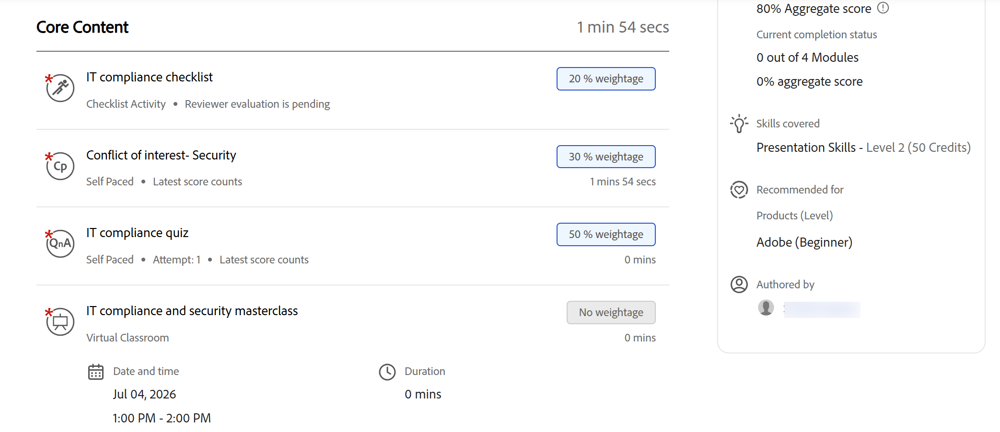
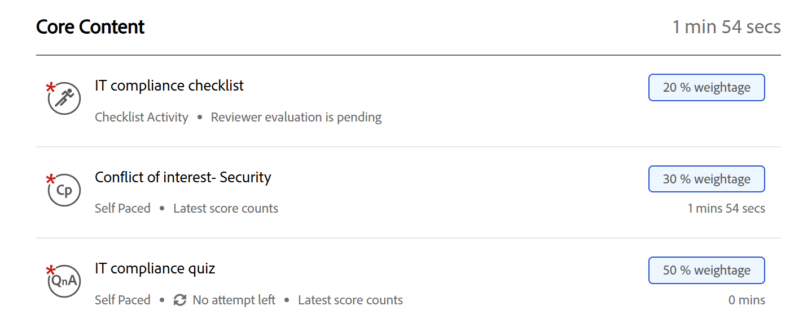

# 學習者成績簿

## 用成績簿開始課程

當 Adobe Learning Manager 啟用並顯示該課程的成績冊時，課程總覽頁面會出現一個 **成績簿** 分頁。 用它來查看你每個模組的加權分數、目前的總分數，以及你是否通過或還需要完成更多課程。

## 成績簿何時可用

**當您的作者或管理員啟用成績簿可見性時，成績簿**&#x200B;分頁會與課程播放器中的模組&#x200B;**、**&#x200B;筆記&#x200B;**和**&#x200B;討論&#x200B;**一同**&#x200B;出現。若分頁未顯示，表示該課程未啟用成績冊，或管理員已關閉學習者可見功能。 分數仍可能被記錄並讓你的管理員看到。

你可以在註冊期間的任何時候開啟 **成績簿** 分頁：

* **開始前：** 報名後，你會看到完整的可評分模組清單，包括其權重百分比、每個模組的最高分數，以及作者設定的及格標準。 這會讓你在開始前清楚看到課程的評分方式。
* **進行中：** 當你完成模組並記錄分數時，成績冊會更新，顯示你目前的分數以及尚未嘗試或等待評分的模組。
* **完成後：** 成績簿會顯示所有期末模組分數、你計算出的課程總分，以及 **標題中的「通過** 」成績。

## 查看成績冊

* 從 **「我的學習」**&#x200B;中選擇你的課程。
* 從課程頁面選擇 **成績簿** 標籤。

  成績冊標題顯示：

  

* **通過標準：**&#x200B;最低總分及所需模組數
* 你完成的必修模組數量佔總數
* 你目前 **的總分** 百分比
* 您目前的課程狀態： **未開始**、 **完成待**&#x200B;完成、 **通過**&#x200B;或 **未通過**

標題下方的模組表顯示每個模組的以下欄位：

| **柱狀** | **它顯示的內容** |
|------------|-------------------|
| **模組** | 模組名稱與類型 |
| **現況** | 您完成本單元的成績或成績狀況（見下方狀態參考） |
| **權重** | 這個模組對你總分的貢獻百分比 |
| **配樂** | 你在這個模組的分數（例如40/100） |
| **貢獻** | 這個模組目前為你的總分增加了多少百分比 |

## 從模組標籤查看模組權重

你也可以在&#x200B;**&#x200B;**&#x200B;模組分頁看到每個模組的權重，不用打開成績簿。

從你的課程頁面選擇&#x200B;**&#x200B;**&#x200B;模組標籤。

**模組**&#x200B;標籤顯示每個模組的權重百分比及完成課程所需的模組數量。

## 多次嘗試的模組分數

如果某模組允許多次嘗試，成績簿上顯示的分數會依課程作者的設定方式而定：

* **最高：** 顯示所有嘗試中最高分數。 後續嘗試時分數較低不會減少你所記錄的分數。
* **最新：** 你最近一次嘗試的分數總是會顯示。 後續嘗試的分數較低會取代前一次。

## 了解你的模組狀態

成績冊中的每個模組顯示以下狀態之一：

| **現況** | **意義** |
|------------|-------------------|
| **完成** | 模組結束並記錄分數 |
| **進行中** | 模組已開始但尚未完成 |
| **還沒開始** | 尚未開啟的模組 |
| **失敗** | 模組得分，但分數未達及格門檻 |

## 你的總分數是如何計算的

你的總分數是每個評分模組加權貢獻的總和：

（取得的分數÷最高分）× 權重百分比 = 模組貢獻

**成績簿中的貢獻**&#x200B;欄位顯示每個模組對你目前總分的貢獻。標示 **為「無權重** 」的模組不在此計算中。

評分標準不必在所有模組間相同。 一個模組得分是 100 分，一個模組得分是 10 分，兩者都正確貢獻。 公式在加權前會對每個指標進行正規化。
