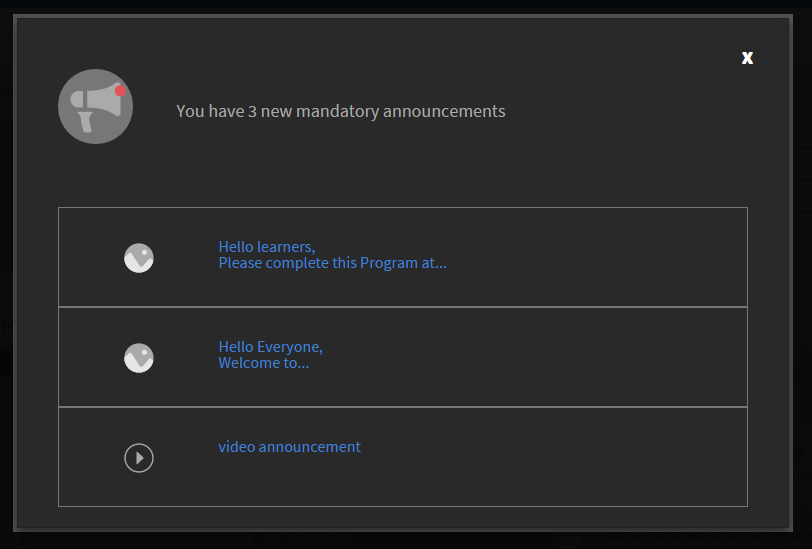
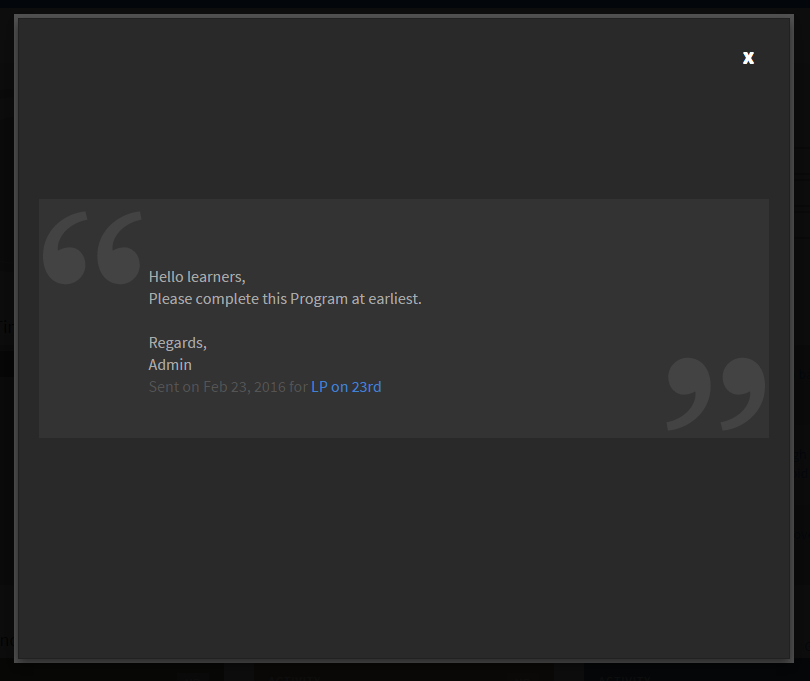

# 公告

宣告是管理員廣播給已定義使用者集合的多媒體訊息（文字、影像或視訊）。

管理員可以將公告廣播給學習者，通知他們事件發生或活動。 當宣告廣播給特定群組或學習物件使用者時，所有與目標群組相關聯的學習者都會收到通知。

## 公告通知 {#announcementsnotification}

通知廣播訊息會以醒目提示的標題列顯示在學習者的控制面板上。 如果學習者公告時未上線，則每當學習者登入Learning Manager應用程式時，都會顯示通知。 學習者還可以檢視通知中的舊公告。

*擱置宣告的通知*

按一下「檢視」時，您可以看到公告清單。 公告清單範例如下：

*檢視所有宣告*

## 宣告範例 {#asampleannouncement}

以下示範公告供您參考。

*檢視宣告的詳細資料*

