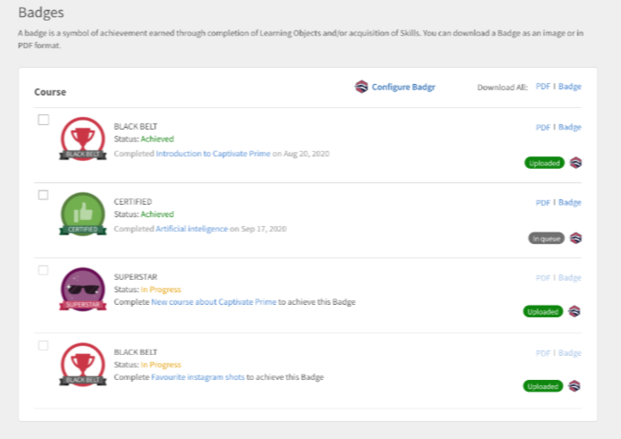

# 徽章

學習如何使用學習管理員學習者應用程式查看及下載徽章。

## 徽章 {#Badges-1}

徽章是員工完成課程後可獲得的成就指標。 Adobe Learning Manager 引入了最新的電子學習概念之一，稱為 Badges。 全球的專業人士將這些徽章視為特定技能或學習成就的象徵。

徽章幫助學習者更明確地定義自我，展示其細緻的技能組合，同時為學習者帶來可信度與良好能見度。

## 查看與下載徽章 {#viewinganddownloadingbadges}

作為學習者，你可以在學習者首頁的「我的成就」小工具中查看徽章。 在頁面頂端、緊鄰你的個人檔案時，會出現一份徽章清單。 首頁最多只能查看七個徽章。 不過，點擊任何徽章時，可以在對話框中查看完整的徽章列表。

最近達成的徽章顯示在列表最左側，接著是尚未達成的徽章。 你可以看到尚未達成的徽章的不透明度比已達成的徽章高出40%，以便更好地辨識。

點擊任何徽章即可查看您所取得的所有徽章清單。 你也可以查看所有可用徽章，並依照相關課程排列。 在尚未達成徽章中，點擊課程名稱以查看與徽章對齊的課程。 以下附上範例快照供參考。

點擊 **[!UICONTROL Download All Badges]** 連結下載您所有已取得的徽章，格式為壓縮檔。 你也可以點擊每個徽章名稱旁邊的方塊圖示，下載一個獨立徽章。

**下載徽章為 PDF**

你也可以下載一組徽章或PDF格式的個人徽章。

* 點擊 **[!UICONTROL Download All Badge Records]** 下載您取得的徽章PDF。
* 要下載個別徽章，請選擇徽章名稱旁的 PDF 圖示。

**對於有過期的證書，即重複發放的證書，Learning Manager 會標示證書的有效日期。 日期會顯示在使用者介面和證書 PDF 中。**

## 開放徽章 {#openbadges}

Learning Manager 支援的 Open Badges 背包平台即將退 **役**。 目前，學習管理員不支援開放徽章。

開放徽章是一種標準，用來識別並驗證學習者的學習狀況。 你可以利用這些徽章在線上展示你的成就。

Learning Manager 支援學習者採用開放徽章的概念。 你可以把下載的徽章當作開放徽章使用。 您下載的每個徽章都包含支持新開放徽章標準的元資料資訊。

## 支援 Badgr 徽章

學習者可以將他們的學習平台帳號與 Badgr 帳號整合。 這讓學習者能透過 Badgr 帳號將徽章分享到社群網站。 Badgr 也提供根據背包標準認證的真實徽章，代表徽章經過驗證。

>[!NOTE]
>
>此功能在 FedRAMP 授權的環境中無法使用。 詳情請參閱 [FedRAMP 環境](/help/migrated/feature-availability-in-fedramp-authorized-environment.md) 的功能可用性。

開放徽章是指在徽章映像中嵌入部分元資料的徽章。 這些元資料提供關於發證人、收件人、完成任務、徽章有效性等資訊。Badgr 背包將可直接從 Learning Manager 存取，提供一個集中存放與共享所有徽章的場所。 學習者可以登入他們的 Badgr 帳號並建立整合。 從此之後，在 Learning Manager 中取得的徽章會自動上傳到 Badgr 帳號。

一旦管理員啟用 Badgr 整合&#x200B;**選項**，學習者即可整合 Badgr 並設定其徽章。要整合，學習者需從學習管理員登入 Badgr 帳號。

>[!NOTE]
>
>Learning Manager 在此整合過程中並未提供 Badgr 帳號。 學習者應該建立自己的帳號並與學習管理員整合。

學習者必須先建立 Badgr 帳戶，才能與學習管理員建立連結。

在學習者應用程式的徽章頁面中，有一個叫做「配置 Badgr」的選項。 點擊該選項後，會跳出對話框，連線狀態應顯示為已連線/未連線。

## 徽章更新

學員可透過選擇徽章並在頁面右上角點擊 **「更新** 」，將徽章更新為最新徽章。 當管理員/作者對徽章影像或學習對象的徽章有變更時，會進行徽章更新。

這種更新頁面的過程稱為手動重新烘焙。 在這種情況下，即使徽章圖片或名稱相同，烘焙完成後徽章會重新上傳到 Badgr 背包。 更新徽章後，學員會收到更新完成的通知。

## 常見問題 {#frequentlyaskedquestions}

**1. 如何以學習者身份下載 Badge？**

在徽章頁面，您可以下載徽章的圖片或PDF格式。 選擇一項技能或課程，然後點擊 **PDF** 或 **徽章**。
