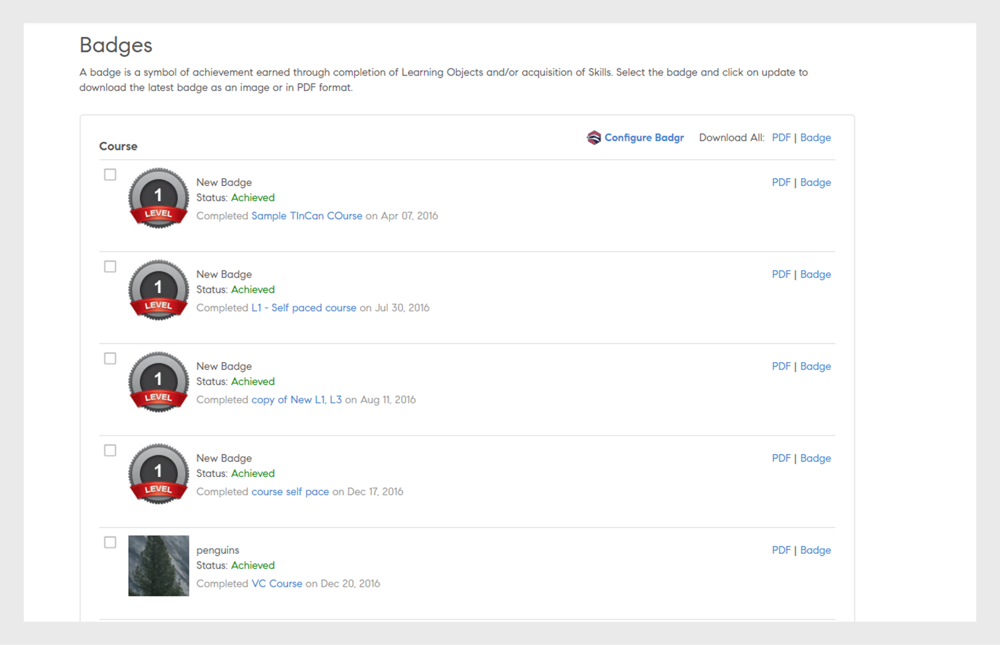

# 徽章

瞭解如何使用Learning Manager學習者應用程式檢視和下載徽章。

## 徽章 {#Badges-1}

徽章是衡量員工完成課程後可取得之成就的指標。 Adobe Learning Manager匯入了名為徽章的最新電子學習概念之一。 全球的專業人員使用這些徽章作為特定技能或學習成績的表示。

徽章除了為學習者帶來信譽和良好的可見度外，也有助於學習者更好地定義自己，並展示其精細的技能組合。

## 檢視和下載徽章 {#viewinganddownloadingbadges}

身為學習者，您可以從學習者首頁上的「我的成就」小工具檢視徽章。 徽章清單會顯示在頁面頂端，與您的設定檔相鄰。 您一次最多只能檢視首頁上的七個徽章。 但是，當您按一下任何徽章時，可以在對話方塊中檢視完整的徽章清單。

最近取得的徽章會顯示在清單的最左側，後面接著尚未取得的徽章。 與已取得的徽章相比，您可以注意到尚未取得的徽章有40%的不透明度，以便更好地識別。

按一下任何徽章以取得您取得的所有徽章清單。 您也可以檢視與個別課程對齊的所有可用徽章。 在尚未完成的徽章中，按一下課程名稱以檢視與徽章對齊的課程。 以下是範例快照集以供您參考。

按一下&#x200B;**[!UICONTROL Download All Badges]**&#x200B;連結，以zip格式下載所有已取得的徽章。 您也可以按一下每個徽章名稱旁邊的多維資料庫圖示，來下載個別徽章。

**將徽章下載為PDF**

您也可以下載一組徽章或PDF格式的個別徽章。

* 按一下&#x200B;**[!UICONTROL Download All Badge Records]**&#x200B;下載您以PDF格式取得的徽章。
* 若要下載個別徽章，請選取徽章並按一下徽章名稱旁邊的pdf圖示。

**對於到期的憑證（即循環憑證），Learning Manager會提及憑證的有效日期。 日期將顯示在UI和憑證PDF中。**

## 開放徽章 {#openbadges}

Learning Manager支援的Open Badges揹包平台即將淘汰&#x200B;**&#x200B;**。 目前Learning Manager不支援開放徽章。

開放徽章是辨識及驗證學習者學習內容的標準。 您可以使用這些徽章線上上展示您的成就。

Learning Manager為其學習者支援開放徽章概念。 您可以使用下載的徽章做為開放徽章。 您下載的每個徽章都包含中繼資料資訊，可支援新的開放徽章標準。

## 支援Badgr預算

學習者可將其學習平台帳戶與Badgr帳戶整合。 這可讓學習者透過其Badgr帳戶在社交網站分享徽章。 Badgr也根據揹包標準提供可驗證的徽章，這表示會驗證徽章。

開放徽章是徽章，其中嵌入了一些中繼資料到徽章影像中。 此中繼資料提供有關簽發者、收件者、完成的工作、徽章有效性的資訊。 Badgr揹包可直接從Learning Manager存取，以便集中儲存所有徽章並共用。 學習者可登入其Badgr帳戶並建立整合。 從那時起，在Learning Manager中取得的徽章會自動上傳到Badgr帳戶。

管理員啟用選項&#x200B;**Badgr整合**&#x200B;後，學習者就可以與Badgr整合併設定其徽章。 若要整合，學習者需要從Learning Manager登入Badgr帳戶。

>[!NOTE]
>
>Learning Manager不在此整合中提供Badgr帳戶。 學習者應建立自己的帳戶，並與Learning Manager整合。

學習者必須先建立Badgr帳戶，才能從Learning Manager建立連線。

在學習者應用程式的「徽章」頁面中，有一個稱為「設定Badgr」的選項。 如果按一下此選項，則會啟動對話方塊，其中連線的狀態應顯示為「已連線/未連線」。

## 徽章更新

學習者可以選取徽章並按一下頁面右上角的「**更新**」，將其徽章更新為最新徽章。 如果管理員/作者對學習物件的徽章影像或徽章進行任何變更，則會進行徽章更新。

此更新頁面的程式稱為手動復原。 在這種情況下，即使徽章具有相同的徽章影像/名稱，烘烤完成之後也會將徽章重新上傳到Badgr揹包。 更新徽章後，學習者會收到更新完成的通知。

## 常見問題 {#frequentlyaskedquestions}

**1. 如何以學習者身分下載徽章？**

在徽章頁面上，您可以將徽章下載為影像或PDF格式。 選擇技能或課程，然後按一下&#x200B;**PDF**&#x200B;或&#x200B;**徽章**。
