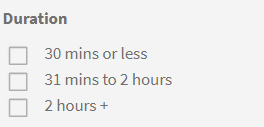

# 目錄

瞭解如何使用Learning Manager中的目錄來檢視合格的學習物件

**目錄**&#x200B;包含公司帳戶中學習者角色可用的所有課程、學習計畫、認證和工作輔助。

學習者可以在&#x200B;**預設目錄**&#x200B;中檢視所有指派的合格學習物件（學習計畫、課程及認證）。 這些學習物件會根據每個學習者的角色、指定、使用者群組、設定檔等而有所不同。

您可以根據不同類別（如產品、工作角色、型別、所需時間、技能及關鍵字）來排序學習物件。 您也可以使用左窗格中的選項進行篩選：依學習物件、技能及完成狀態。

使用頁面頂端的搜尋列，輸入您熟悉的學習物件名稱。 學習者可以選取此圖示，在格線與清單檢視之間切換。

*檢視目錄*

<!--As a learner, you can  filter training based on the format of training, for example, Classroom, Self-paced, or Virtual Classroom. In addition, the learner can also filter the trainings based on Training Duration. Skill Levels filter which is already available, can now be enabled/disabled by Administrator. -->

*根據訓練格式篩選訓練*

您也可以根據訓練持續時間來篩選。 持續時間篩選器不包含預先工作和測試結束的持續時間。

*依課程持續時間篩選*

根據預設執行個體和帳戶偏好地區設定的可用訓練內容來識別訓練&#x200B;**期間**&#x200B;和&#x200B;**格式**&#x200B;篩選器。

發佈培訓後，培訓可能需要長達一小時的時間，才能將資料作為篩選器提供。

## 學習者應用程式中的排序功能

學習者應用程式中的排序功能可根據內容和介面語言提供個人化課程推薦。&#x200B;URL 此增強功能可簡化學習者以偏好語言尋找課程的程式，並運用更多智慧型排序選項。

>[!NOTE]
>
>此功能在網頁和行動應用程式上皆可使用。

您可以依字母順序排序課程：

1. **[!UICONTROL Name (A-Z)]**：按字母順序顯示課程。
2. **[!UICONTROL Name (Z-A)]**：以反向字母順序顯示課程。

課程會根據語言偏好設定以下列優先順序顯示：

1. **[!UICONTROL Content Language]**：以選取內容語言的課程會先出現。
2. **[!UICONTROL Interface Language]**：接下來列出介面語言的課程。
3. **[!UICONTROL Other Languages]**：隨機語言的課程顯示在最後。

如果帳戶中未設定任何內容語言或介面語言，則系統會依照下列順序進行：

1. **[!UICONTROL Browser Language]**：應用程式會根據瀏覽器的語言設定來排定課程的優先順序。
2. **[!UICONTROL Account Language]**：如果無法使用瀏覽器語言，則會考慮ALM帳戶語言。
3. **[!UICONTROL Default to English]**：如果無法使用瀏覽器或帳戶語言，則會以英文顯示課程。

在學習者應用程式中選取&#x200B;**[!UICONTROL Catalogs]**&#x200B;頁面，然後選取您偏好的排序選項： **[!UICONTROL Name (A-Z)]**&#x200B;或&#x200B;**[!UICONTROL Name (Z-A)]**。 系統會根據您選取的排序偏好設定顯示課程，並套用語言優先順序。