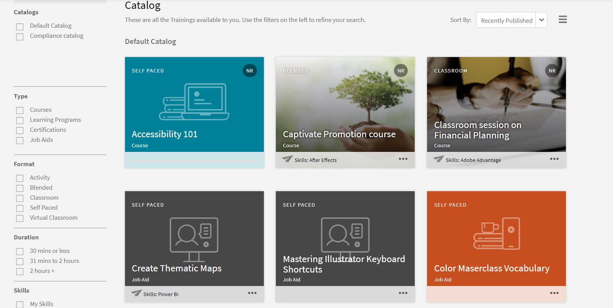
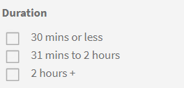

# 目錄

學習如何在 Learning Manager 中使用目錄來查看符合資格的學習物件

**目錄** 包含公司帳戶中所有可提供給學習者角色的課程、學習計畫、認證及工作輔助工具。

學習者可在預設目錄&#x200B;**中查看所有分配且符合資格的學習對象（學習計畫、課程及認證）。**&#x200B;這些學習對象根據其角色、職稱、使用者群組、個人資料等，對每位學習者來說都是獨一無二的。

你可以根據不同類別排序學習對象，如產品、職務角色、類型、所需時間、技能和關鍵字。 你也可以用左側面板的選項篩選：依學習物件、技能和完成狀態篩選。

使用頁面頂端的搜尋欄輸入你熟悉的學習物件名稱。 學習者可透過選擇此  圖示在格子與列表視圖間切換。

*查看目錄*

<!--As a learner, you can  filter training based on the format of training, for example, Classroom, Self-paced, or Virtual Classroom. In addition, the learner can also filter the trainings based on Training Duration. Skill Levels filter which is already available, can now be enabled/disabled by Administrator. -->

*根據訓練形式進行篩選訓練*

你也可以依照訓練的長度篩選。 時長篩選器不包含前期工作與測試結束的時長。

*依課程時長篩選*

訓練 **、時長** 與 **格式** 篩選器會根據預設實例及帳戶偏好所在地的訓練內容來識別。

一旦訓練發布，資料可能需一小時才能以篩選方式取得。

## 學習器應用程式中的排序功能

學習者應用程式的排序功能會根據內容和介面語言提供個人化課程推薦。 此改進簡化了學習者尋找偏好語言課程及更智慧排序選項的過程。

>[!NOTE]
>
>此功能同時可在網頁版和行動應用程式中使用。

你可以按字母順序排序課程：

1. **[!UICONTROL Name (A-Z)]**：按字母順序顯示課程。
2. **[!UICONTROL Name (Z-A)]**：以倒序字母順序顯示課程。

課程依語言偏好依優先順序顯示：

1. **[!UICONTROL Content Language]**： 所選內容語言的課程先顯示。
2. **[!UICONTROL Interface Language]**： 介面語言的課程列在下方。
3. **[!UICONTROL Other Languages]**：隨機語言的課程會最後顯示。

若帳號中未設定內容語言或介面語言，系統會遵循以下順序：

1. **[!UICONTROL Browser Language]**： 應用程式會根據瀏覽器的語言設定來優先排序課程。
2. **[!UICONTROL Account Language]**：若瀏覽器語言無法使用，則考慮使用ALM帳號語言。
3. **[!UICONTROL Default to English]**：若瀏覽器或帳號語言無法使用，課程將以英文顯示。

在學習器應用程式中選擇 **[!UICONTROL Catalogs]** 頁面，然後選擇你偏好的排序選項： **[!UICONTROL Name (A-Z)]** 或 **[!UICONTROL Name (Z-A)]**。 課程會依照你選擇的排序偏好顯示，並依語言優先排序。