# 我的學習

閱讀本文了解如何在學習管理中瀏覽及使用課程。 參與討論並提供回饋。

作者會創建課程。 學習者可以選擇修課，管理員則可根據課程使用量追蹤學習者的表現。

## 概觀 {#overview}

Adobe Learning Manager 讓學習者能夠存取課程、學習計畫及認證。 學習者可透過目錄瀏覽所有可用課程，或自行報名選修課程。 學習者可在學習標籤中查看所有已註冊課程及分配的課程。

>[!NOTE]
>
>學習者也可從蘋果商店安裝 Learning Manager iPad 應用程式，並從 Google Play 安裝 Learning Manager Android 應用程式，並在行動裝置上存取課程。 所有學習者角色的功能也都在應用程式中提供。 學習者也可離線上課，線上後即可無縫存取。 更多資訊請參閱  [iPad 與 Android 平板用戶](ipad-android-tablet-users.md) 功能。

## 檢視學習物件 {#viewingcourses}

你可以以學習者身份查看所有可用課程的清單。 從首頁點擊「我的學習」，或從左側窗格查看您已報名的所有課程。

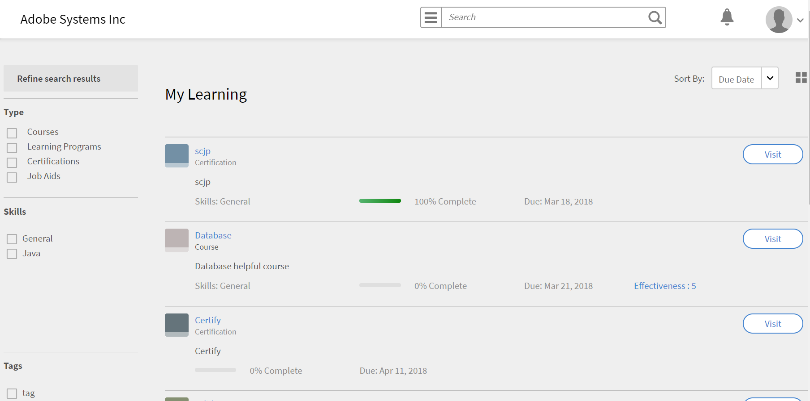
*查看指定課程*

如果你還沒開始課程，可以點擊課程旁的開始按鈕。 如果你已經開始閱讀課程，可以點擊繼續按鈕。

要查看已完成的課程，請點擊課程旁的「重訪」按鈕。

同一球場可以有多個實例。 點擊課程名稱查看詳情。 在右側窗格，你可以看到每個課程實例的截止日期。

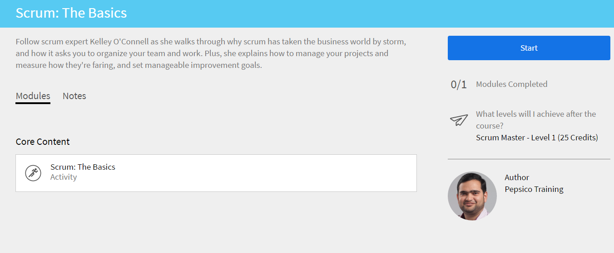
*查看已完成的課程*

## 課程效能 {#courseeffectiveness}

課程效能分數幫助學習者選擇最符合其學習需求的課程。 課程效能評估用以了解課程對學習者的實用性。 它是根據特定課程用戶數量收到的回饋計算而成。 如果給予回饋的學習者比例較高，課程效能評分就會很高。

它是結合學習者對課程內容的回饋結果、學習者的課程測驗結果，以及經理根據課程學習對學習者的回饋評估的綜合結果。

從課程頁面，學習者可如下方快照所示，在課程縮圖上查看課程效能評分。 你可以看到這門課的評分是14分。

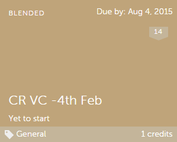

*查看課程效能評分*

欲查看課程效能評分詳情，請點擊課程效能值。 下方會顯示一個彈出視窗。

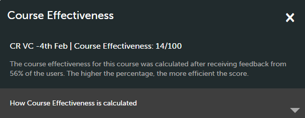
*檢視課程成效*

點擊彈出視窗右下角的下箭頭，即可查看球場效能的計算方式。

*計算水道效能*

## 搜尋課程與學習計畫 {#searchingcoursesandlearningprograms}

Adobe Learning Manager 讓您能更快找到心儀的課程。 您可以以下方式搜尋您的課程：

1. 點擊右上角顯示的搜尋圖示。 會出現一個搜尋欄位。 輸入課程名稱或與課程相關的關鍵字。 你可以透過元資料、筆記、技能、徽章或標籤搜尋課程。 標籤可以在搜尋欄位內搜尋，也就是說，標籤會在你輸入時顯示在搜尋欄位。
1. 學習者可在目錄頁面中，透過類型、技能、標籤及狀態來精煉搜尋結果。

你可以點擊「排序」並從下拉選單中選擇，依相關性、名稱或發布日期排序課程。

在搜尋結果頁面，您可以依 **照課程長度** 及 **課程格式** 進行篩選。 這讓您在尋找課程時更具彈性，確保找到適合您的課程。

## 註冊課程 {#enrollingforcourses}

學習者可透過以下三種方式報名課程：

1. 管理員/經理會根據組織需求為部分學員報名必修課程。
1. 經理會向團隊成員推薦部分課程。 你會收到通知，裡面有接受或拒絕課程/學習計畫的選項。 當學習者接受提名後，他們即被註冊為該課程/學習計畫。
1. 學習者可直接報名課程/學習計畫：

   1. 如果課程/學習計畫是自我報名型，學習者會立即註冊。
   1. 如果課程/學習計畫屬於經理核准類型，學習者則進入&#x200B;**&#x200B;**&#x200B;審核等待狀態。經經理批准後，學習者即被註冊參加課程。
   1. 如果學習者報名了已經在等候名單上的課程（以班級為例），他們必須等到有人退選或行政批准他們。

學習者可依自身選擇選修多種課程。 課程分頁顯示你已註冊/分配的所有課程。

不過，你可以選擇將滑鼠移到目錄上，並點擊探索，來瀏覽目錄中列出的任何課程。 報名頁面會出現。 點擊頁面右上角的「註冊」，以將課程納入課程清單。

一個課程或學習計畫可以有多個實例或課程。 在目錄中，點擊課程/學習計畫的磁貼名稱以查看詳細資訊。 你可以根據每個課程/學習計畫的截止日期，看到註冊到課程/學習計畫實例。

**註冊課程興趣**

您可以註冊以表達任何沒有預定課程的課堂課程的興趣。 課程開始時你會收到加入課程的通知。

>[!NOTE]
>
>若學習者同時報名兩個不同課程或時間重疊，應會看到衝突訊息。

## 交換實例

註冊在特定課程實例的學習者可以查看該課程所有可用實例的清單，並切換到更適合自己的實例。 切換的原因可能是學習者錯過了之前的實例，或是新實例的課程時間更合適，或是其他原因。

學習者在課程中取得的任何進展、學習者測驗分數等，都會帶入新的實例。 此功能主要針對教室與混合課程設計，但我們也會支援各類課程，包括自學進度的課程。

「檢視所有實例」這個選項不論實例切換設定如何都會出現。 學習者現在可以看到一個選項，可以查看所有實例，若同一課程有多個實例。

若啟用實例切換選項，學習者可切換至多個實例直到完成課程。 若該選項被停用，學習者可查看實例，但無法註冊課程。

當學習者選擇 **「檢視所有實例**」時，就能看到所有課程實例。

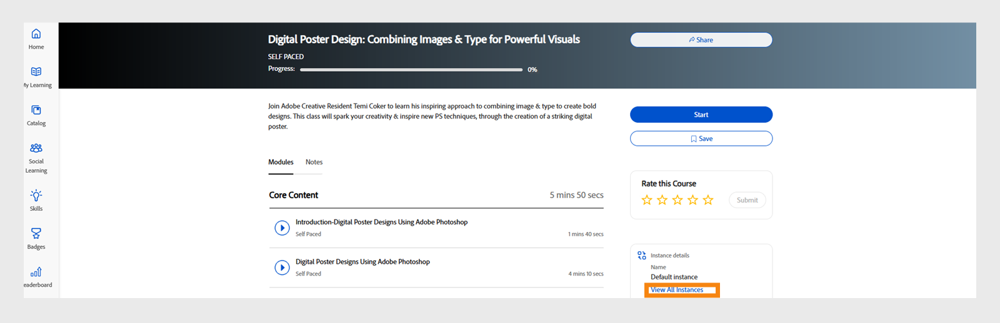

_從學習者主控台查看所有實例頁面_

_從學習者頁面切換實例_

管理員可以為學習者切換實例。 從管理控制台選擇課程，進入該 **[!UICONTROL Learners]** 區塊，選擇使用者，然後點擊按鈕 **[!UICONTROL Action]** 。 然後，選擇 **[!UICONTROL Switch Instance]** 並選擇想要的實例。

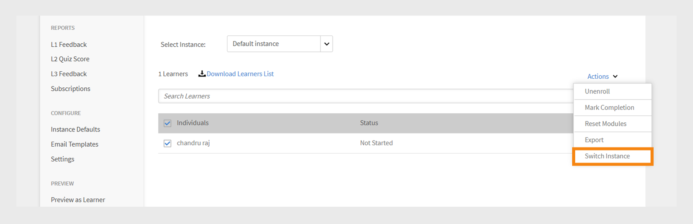
_從管理控制台切換實例_

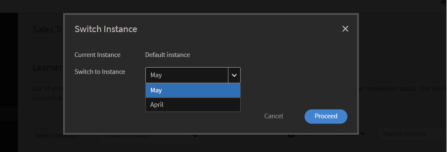
_切換實例提示_

在學習者或管理應用程式完成課程的任何實例之前，你無法切換實例。

作者在建立課程時可以切換啟用或停用「實例切換」。 實例切換僅適用於免費課程。

## 學習者的工作流程

作為學習者，你只能在註冊後評分課程。 您可以在首&#x200B;**頁、**&#x200B;我的學習&#x200B;**頁面和**&#x200B;課程目錄&#x200B;**中查看任何課程**&#x200B;的平均星級評分。

1. 以學習者&#x200B;**身份登入**。這會載 **入首頁**。

1. 請在搜尋欄輸入課程名稱搜尋課程。 或者，你也可以從顯示的課程列表中選擇 **，從左側窗格點擊「我的學習** 」或 **「目錄** 」。

1. 選擇課程後，點擊 **[!UICONTROL Enroll]**。

   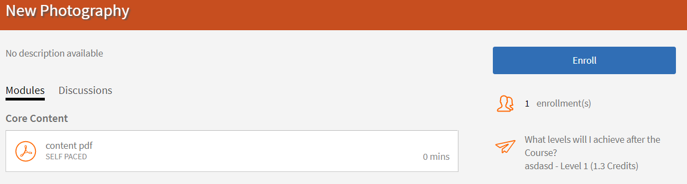
   *報名課程*

1. 選擇幾顆星來評分課程，1 為最低，5 為最佳。 然後點擊 **[!UICONTROL Submit]**。

   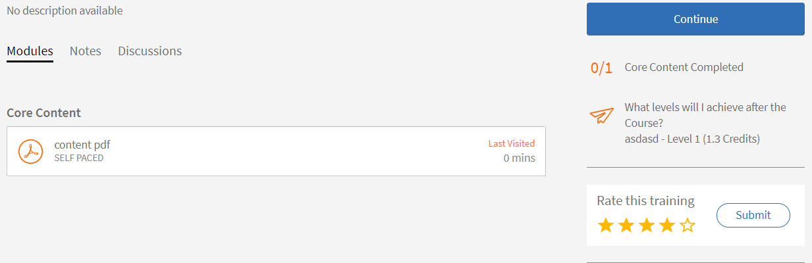
   *提交課程評分*

   學習者可多次提供星級評分，因為以最近的評分為準，重新提交回饋。

1. 提交後會顯示確認訊息。

   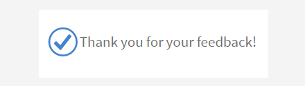
   *回饋確認訊息*

   如果你想重新提交回饋，可以點擊訊息來完成。 評分提交後，訊息會顯示三秒鐘，然後才顯示評分。 如果你想更改評分，可以選擇不同的星級並提交。

課程可依據平均評分排序。 你可以從右上角的「排序方式」下拉選單中排序，該選單可在 **目錄**&#x200B;中取得。

## 修習課程 {#consumingnbspacourse}

註冊課程後，你可以點擊課程開始，點擊開始。 或者，點擊&#x200B;**[!UICONTROL Courses]**&#x200B;分頁。**[!UICONTROL Learning]**&#x200B;選擇你想開始修的課程。

如果你還沒開始課程，請點擊課程名稱旁的開始按鈕。

你可以在瀏覽器視窗中查看課程的所有模組。

**球員特色**

**目錄（TOC** ）- 在選擇賽道時，玩家會在視窗左側窗格顯示該賽道的目錄。 你可以點選每個主題，直接導航到那裡。

**書籤** ——如果任何課程模組有模組目錄，模組目錄中的主題可以加入書籤以便日後參考。 加入書籤後，目錄條目旁會出現一個絲帶圖示。 書籤可透過點擊功能區刪除。

**筆記** - 在修課期間有記錄筆記的功能。 記錄完筆記後，你可以儲存並下載成 PDF，或將筆記寄給任何已註冊學習者的電子郵件帳號。 當你點擊儲存時，會有一個選項可以選擇儲存為 PDF 檔案的位置。

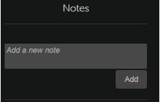

*做課程筆記*

**隱藏字幕** - 對於 Adobe Captivate 開發的課程，若在課程開發期間啟用隱藏字幕，學習者即可查看字幕。 在播放器底部點擊 CC。 隱藏字幕選項僅適用於 Captivate 8.0.2 HTML 內容。 對於其他類型的模組，CC 選項不會出現在遊戲列上。

**重訪課程** - 你可以在兩種可能情境下重溫課程：

* 在課程完整狀態時點擊重訪。
* 當課程處於未完成狀態時，點擊繼續。

**全螢幕** 點擊播放器右下角的全螢幕圖示，可在全螢幕視窗中查看賽道。

**導航按鈕** 你可以點擊上下箭頭，在 pdf、docx 和 pptx 內容中移動投影片。 滑動箭頭可以用來跳到各種類型的主題。

**關閉賽道** ，點擊播放器右上角的關閉（x）圖示即可退出賽道。

*離開課程後，你可以點擊課程說明頁上的「重訪」按鈕重新瀏覽該課程。*

## 多重註冊實例

若課程有多個實例，學習者可選擇並註冊特定實例。 如果需要，他們也能在實例間切換。

## 星級評分

只有在註冊課程後，學習者才能對課程提供星級回饋。 在課程總覽頁面，學習者可將課程評分為星級（最低1星，最高5星）。

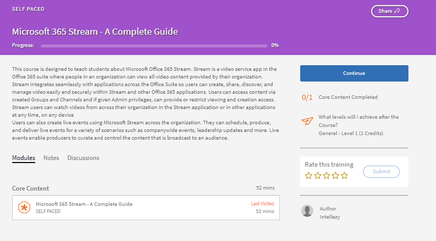
*提供星級評分作為回饋*

學習者可從5顆星中選擇特定星級並提交評分。 學習者也可以透過點擊不同的星級來編輯選擇。 提交後，會顯示感謝您的回饋訊息。

若學習者想重新提交回饋，可點擊訊息。 **提交**&#x200B;按鈕會重新啟用。學員在報名課程後可多次給予星級評分。 最新的評分將始終被考慮。

學習者提供評分後，平均星級評分及提供星級評分的學習人數會顯示 **在課程概覽** 頁面。

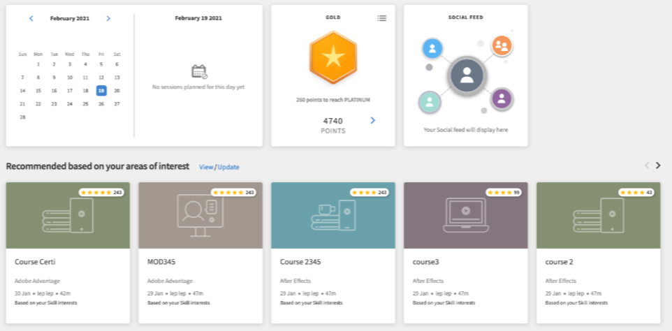
*課程概述*

所有現有帳號的此功能均已停用。 管理員可以從設定中啟用。 只有這樣，學習者才會看到星級評分。

## 內容市集

在學習者應用程式的左側窗格上，內容市集選項就有功能。 點擊選項後，可以看到所有課程/完整目錄和精選播放清單。

在下方頁面，您可以看到整個課程目錄中包含的課程。 每門課程都會顯示其時長及所屬的廣泛主題。 你可以從頁面左側的篩選器中選擇主題。

你可以預覽一整個球場，時間正好只有兩分鐘。

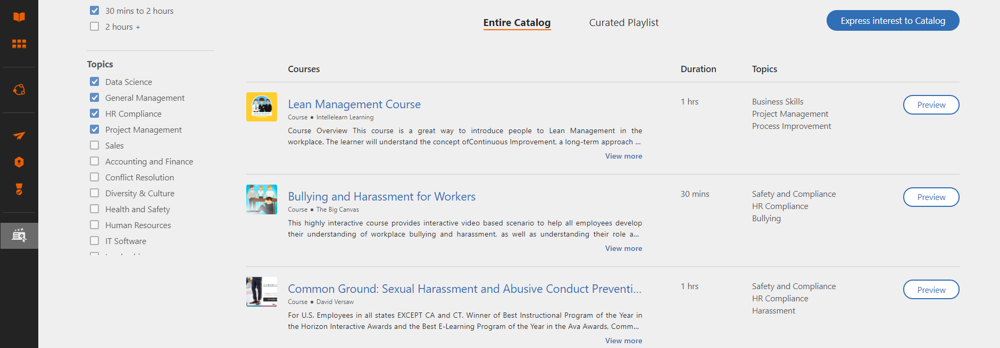
*市場預覽課程*

當管理員邀請你探索並預覽各種課程時，你會看到通知。

作為學習者，你可以在 **「精選播放清單** 」區塊表達對整個目錄或任何精選播放清單的興趣。

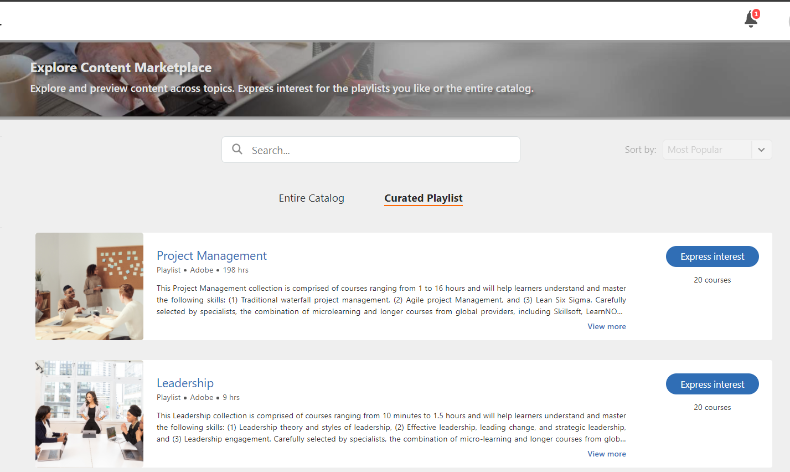
*查看精選播放清單*

當你表達對課程或培訓的興趣後，該興趣會被記錄下來，管理員就可以再取出紀錄。

在學習者應用程式中，所有管理員都能存取內容市集。 若管理員撤銷存取權，學習者將無法看到內容市集標籤。

受管理員邀請的學習者可探索內容市集。

>[!NOTE]
>
>Content Marketplace 不支援 Internet Explorer 11。

所有濾鏡和其他選項都在下方影片中展示。

### 預覽內容

你可以探索並預覽課程，看看課程是否符合你的學習需求。 點擊 **預覽** 按鈕，查看課程預覽。 預覽版長度為兩分鐘。

*市場預覽內容*

## 內容中心

Content Hub 允許管理員與主題專家（SMEs）從學習者應用程式中篩選出所需的播放清單。 一旦入圍，管理員可以下載購買申請表，並與 Adobe 銷售代理分享。

管理員可以邀請主題專家篩選他們感興趣的播放清單。

內容中心以學習者角色提供給所有管理員使用。 管理員允許中小企業篩選他們有興趣購買的播放清單。

內容中心頁面對學習者管理員隨時可見，方便他們篩選播放清單。 為了協助你篩選合適的播放清單，管理員可以在他們的帳號中讓有限的主題專家存取此頁面。 請造訪管理端的企業培訓頁面，並採取措施提供存取權限。

## 選擇課程範例 {#choosecourseinstance}

如果你是正在課程實例註冊且該課程已過期的學習者，現在可以切換到其他課程以取得進展。 這只有在LP彈性的情況下才能做到。

要更改航向實例，請依照以下步驟操作：

1. 開放目錄>學習計畫。

   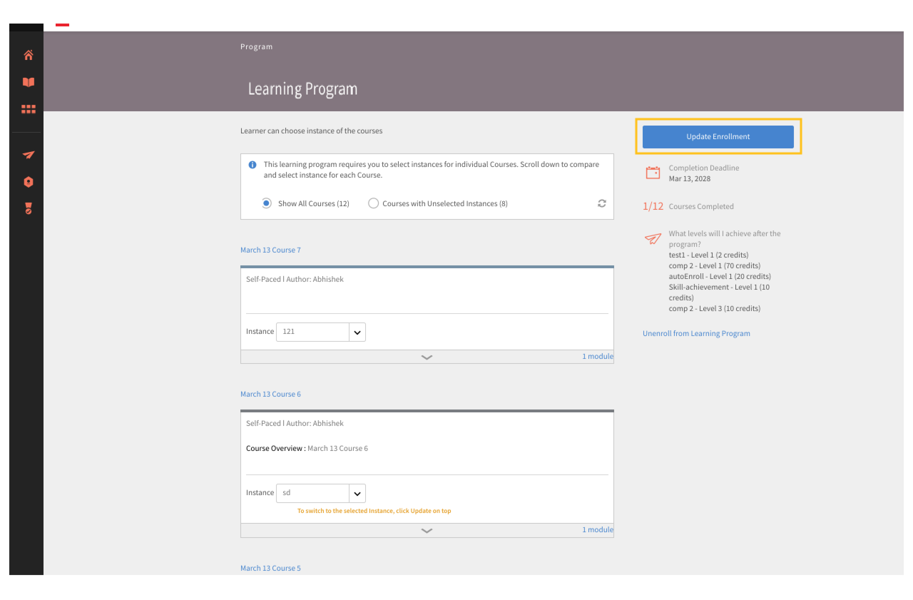
   *選擇學習計畫*

1. 使用單選按鈕選擇要查看所有課程或未選取實例的課程。 請注意，若學習者已完成該實例，則無法切換到其他實例。

   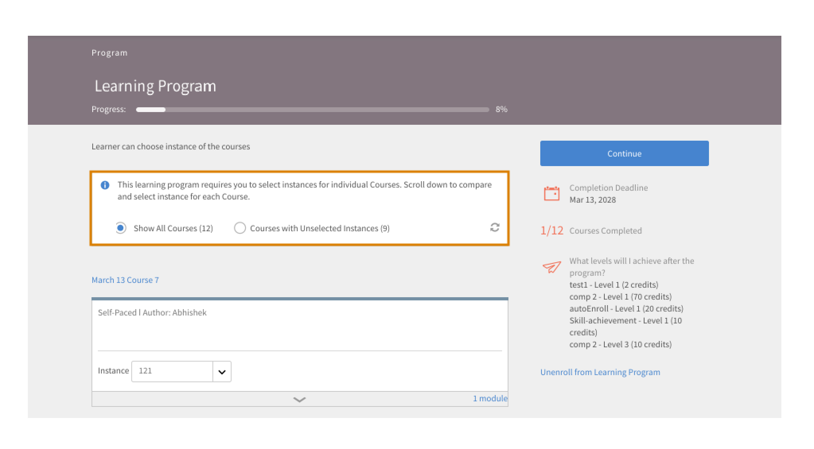
   *查看所有課程或未被選取實例的課程*

1. 課程的實例下拉選單會顯示可用的實例。 從下拉選單中選擇實例。

   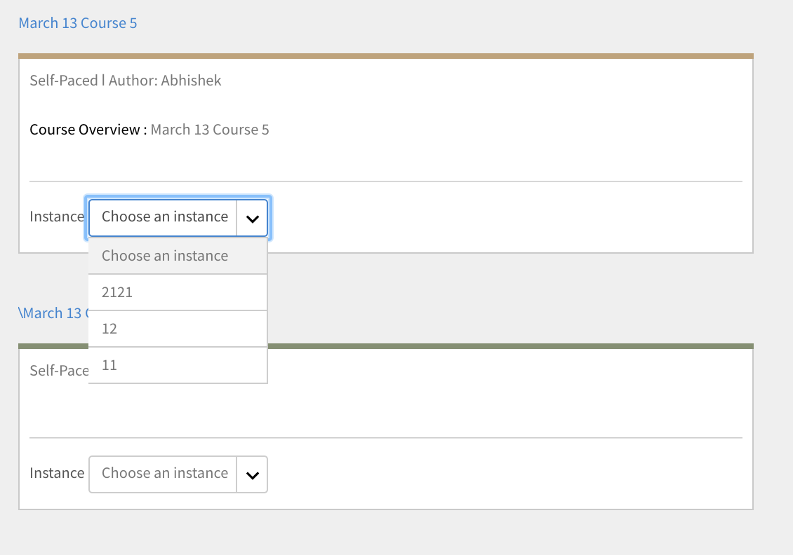
   *選擇一個實例*

1. 要套用所選的實例，請點擊 **[!UICONTROL Update Enrollment]**。 更新登記選項位於頁面右上方。

   新選中的實例已註冊。 若學習者註冊於另一個 LO 的課程實例，並更新該課程實例（該課程實例屬於彈性學習程式），警告後他將自動從其他學習物件中取消註冊。

## 基於語言的進度管理

學習者的進度可依每個地點分別追蹤，確保玩家切換語言不會影響先前的進度。 每個模組的進度在使用者與模組層級皆獨立維護，避免學習者在不同地點探索內容時被覆蓋。

例如，如果學習者英語進度達到75%，然後轉用西班牙語，回到英語的履歷會從75%開始，而不是重置到0%。 每個地點都儲存自己的進度狀態，讓學習者能無縫導航並完成多種語言的內容，而不會失去個人進度。

以下內容類型不支援語言型學習者的進步：

* 不支援影片與音訊內容。
* 第三方內容，包括 Go1、LinkedIn Learning、getAbstract 及 Harvard ManageMentor，均不被支援。
* 未將資料傳送至學習記錄庫（LRS）的內容將不會被追蹤或儲存進度。
* 行動應用程式用戶在離線模式下無法追蹤此功能的進度。

## 完成課程 {#completingacourse}

作為學習者，你可以完成課程中所需的模組數量以完成課程。 課程完成標準取決於作者指定為必修模組的數量。 當你報名有最低完成標準的課程時，可以在課程頁面右側的窗格查看完成條件。

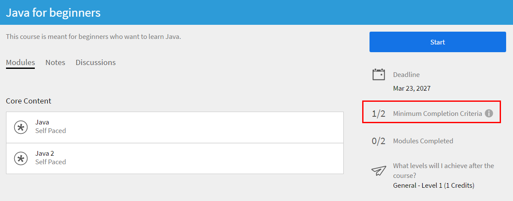
*查看完成標準*

例如，如果某門課程的完成標準是兩個模組中的一個，那麼完成一個模組就代表你完成了該課程。 在這種情況下，當你完成第一個模組時，進度條會顯示 100% 完成度。

如果模組依作者順序設定，你必須依序完成所需的模組數量，從第一個開始。 如果模組是無序的，你可以以任意順序完成指定數量的模組。

完成一門課程且模組數達到要求後，如果你想完成選修模組，可以重新重溫該課程。

## 觀看與參與討論 {#viewingandpariticpatingindiscussions}

作為學習者，你可以透過討論標籤與其他學習者及講師互動。 你可以查看任何你正在瀏覽或報名的課程貼文。 如果管理員啟用了課程的討論，你可以查看該課程筆記標籤旁的討論標籤。

點擊討論區標籤時，可以看到該課程現有的貼文和留言。 如果你已經報名了課程，也可以開始打字或留言讓其他用戶看到。 輸入訊息後，點擊「發佈」。 你的貼文必須至少包含10個字元。

該貼文會立即在討論區分頁中看到。 你可以將貼文排序為「最新第一」或「最舊第一」，並刪除你寫過的那些貼文。 即使你退選了課程，仍然可以查看所有貼文並刪除你寫過的貼文。

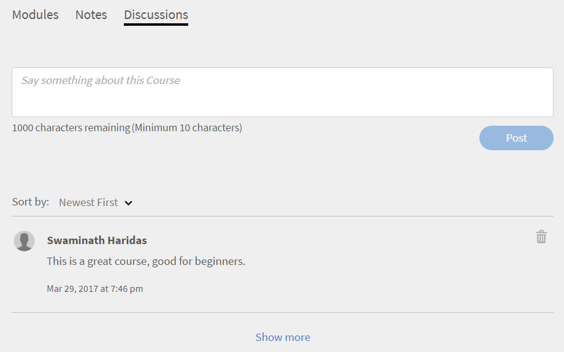
*查看參與者討論*

討論標籤對外部使用者未啟用。

*討論頁籤*

## 註冊課程興趣

學習者可以登記對沒有活躍實例的課程感興趣。

登記興趣：

1. 以學習者身份登入 Adobe Learning Manager。
2. 前往 **[!UICONTROL Catalog]** 並選擇沒有啟用實例的課程。
3. 請在課程總覽頁面選擇 **[!UICONTROL Register Interest]** 。

   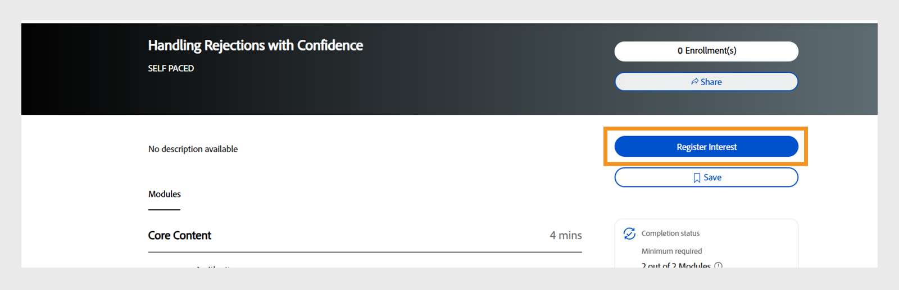
   _學習者介面上的課程總覽區塊，重點顯示「註冊興趣」選項_

## 賽道生命週期 {#courselifecycle}

典型的課程生命週期如下：

**草稿** ——作者完成課程建立並儲存的過程。 目前，課程尚未開放給學習者。

**已出版** - 作者完成課程出版。 在此州，課程對學習者開放報名。

**退休** - 課程出版後，作者若不希望課程出現在學習者的課程目錄中，可以將其移至退休狀態。

**已刪除** - 處於刪除狀態的課程是指該課程從 Adobe Learning Manager 應用程式中完全移除。 課程僅在草稿或退休狀態下，作者可刪除。

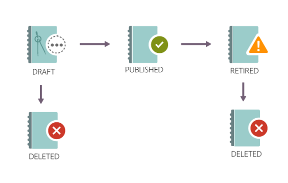
*課程生命週期概述*
