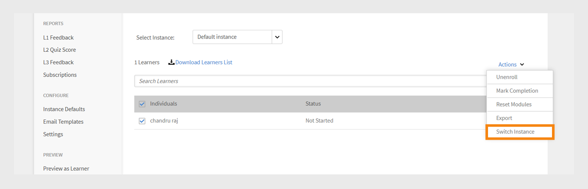

# 我的學習

閱讀本文章，瞭解如何在Learning Manager中檢視和使用課程。 參與討論並提供意見回饋。

作者建立課程。 學習者可以參加課程，管理員可以根據課程使用情況追蹤學習者的成效。

## 概觀 {#overview}

Adobe Learning Manager可讓學習者存取課程、學習計畫和認證。 學習者可使用目錄瀏覽所有可用的課程，或註冊自己選擇的課程。 學習者可以在「學習」標籤中檢視所有已註冊課程和指派給他們的課程。

>[!NOTE]
>
>學習者也可從Apple Store安裝Learning Manager iPad App，以及從Google Play安裝Learning Manager Android App，並存取行動裝置上的課程。 應用程式中也提供所有學習者角色功能。 學習者也可以離線參加課程，並在上線後順暢存取。 如需詳細資訊，請參閱[iPad與Android平板電腦使用者](ipad-android-tablet-users.md)功能。

## 檢視學習物件 {#viewingcourses}

您可以作為學習者檢視所有可用課程的清單。 按一下首頁或左窗格中的「我的學習」 ，以檢視您已註冊的所有課程。

*檢視指派的課程*

如果您尚未開始課程，可以按一下課程旁邊的[開始]按鈕。 如果您已開始使用課程，您可以按一下「繼續」按鈕。

若要檢視完成的課程，請按一下課程旁的「重新造訪」按鈕。

一個課程可以有多個例項。 按一下課程名稱以檢視詳細資訊。 在右窗格，您可以看到課程每個執行個體的截止日期。

*檢視完成的課程*

## 課程效果 {#courseeffectiveness}

課程效果分數可協助學習者以最有效的分數來挑選符合其學習需求的課程。 課程效果評估旨在瞭解課程對學習者的有用性。 它是根據特定課程的使用者人數所收到的意見來計算的。 如果提供意見回饋的學習者比例較高，課程效果評等就較高。

這是學習者對課程內容的意見反應、學習者的課程測驗結果，以及經理根據課程學習情況評估學習者的意見反應所形成的組合。

在課程頁面中，學習者可以在課程縮圖上檢視課程成效評等，如下圖快照所示。 您可以看到此課程的評分為14。

*檢視課程成效評等*

若要檢視課程效果評等的詳細資訊，請按一下課程效果值。 此時會出現快顯視窗，如下所示。

*檢視課程成效*

按一下快顯視窗右下角的向下箭頭，檢視課程效果計算的完成方式。

*課程效果計算*

## 搜尋課程和學習計畫 {#searchingcoursesandlearningprograms}

Adobe Learning Manager讓您更容易快速找到您選擇的課程。 您可以透過下列方式搜尋您的課程：

1. 按一下右上角顯示的搜尋圖示。 搜尋欄位隨即顯示。 輸入課程/學習計畫名稱或與課程相關聯的任何關鍵字。 您可以依中繼資料、附註、技能、徽章或標籤來搜尋課程。 標籤可在搜尋欄位中搜尋，這表示當您輸入時，標籤會顯示在搜尋欄位中。
1. 學習者可使用型別、技能、標籤和狀態來縮小目錄頁面中的搜尋結果。

您可以按一下排序方式，然後從下拉式選單中選擇，依相關性、名稱或發佈日期來排序課程。

在搜尋結果頁面上，您可以根據課程的&#x200B;**持續時間**&#x200B;和課程的&#x200B;**格式**&#x200B;來篩選課程。 這讓您在搜尋課程時擁有更大的彈性，並確保您找到適合自己的課程。

## 課程報名 {#enrollingforcourses}

學習者可透過以下三種可能方式註冊課程：

1. 管理員/經理會根據組織需求，為部分學習者註冊必修課程。
1. 經理會為其團隊成員指派一些課程。 您會收到通知，其中包含接受或拒絕課程/學習計畫的選項。 學習者接受指派時，即會註冊課程/學習計畫。
1. 學習者可直接註冊課程/學習計畫：

   1. 如果課程/學習計畫為自助註冊型別，則學習者會立即註冊。
   1. 如果課程/學習計畫為經理核准型別，則學習者會進入&#x200B;**核准擱置**&#x200B;狀態。 經理核准後，學習者即註冊課程。
   1. 如果學習者註冊已等候的課程（若為教室課程），則必須等到有人退出課程或直到管理員核准課程為止。

學習者可以根據自己的選擇報名參加多種課程。 「課程」標籤會顯示所有已註冊/指派的課程。

不過，您可選擇將滑鼠移至目錄下並按一下「瀏覽」，以瀏覽目錄下的任何課程。 「註冊」頁面便會顯示。 按一下頁面右上角的「註冊」 ，將課程加入課程清單。

課程/學習計畫可以有多個例項/工作階段。 在目錄中，按一下課程/學習計畫磚名稱以檢視詳細資訊。 您可以看到根據課程/學習計畫每個例項的截止日期來註冊課程/學習計畫例項。

**報名課程興趣**

您可以註冊以表達對任何沒有任何計畫工作階段的教室課程的興趣。 每當課程工作階段開始加入課程時，您就會收到通知。

>[!NOTE]
>
>如果學習者同時或重疊註冊兩個不同的工作階段，應該會看到衝突訊息。

## 切換執行個體

已註冊特定課程執行個體的學習者，可檢視該課程所有可用執行個體清單，並切換至對其更適合的其他執行個體。 切換的原因可能是學習者錯過了前一個執行個體，或是新執行個體的工作階段時間更適合或是其他原因。

學習者在該課程中完成的任何進度、學習者測驗分數等，都會延續至新執行個體。 此功能主要用於教室和混合式課程，但我們應支援所有型別的課程，包括自訂進度課程。

無論執行個體切換設定為何，都會顯示「檢視所有執行個體」選項。 如果課程有一個以上的執行個體，學習者現在會檢視檢視所有執行個體的選項。

如果啟用「例項切換」選項，學習者可切換至各種例項，直到完成課程為止。 如果停用該選項，學習者將可檢視例項，但無法註冊課程。

當學習者選取&#x200B;**檢視所有執行個體**&#x200B;時，學習者可以看到所有課程執行個體。

_從學習者主控台檢視所有執行個體頁面_

_從學習者頁面切換執行個體_

管理員可以切換學習者的例項。 從Admin Console選取課程，移至&#x200B;**[!UICONTROL Learners]**&#x200B;區段，選擇使用者，然後選取&#x200B;**[!UICONTROL Action]**&#x200B;按鈕。 然後，選取&#x200B;**[!UICONTROL Switch Instance]**&#x200B;並選擇所需的執行個體。

_從Admin Console切換執行個體_

_切換執行個體提示_

您必須從學習者或管理員應用程式完成課程的任何執行個體後，才能切換執行個體。

作者在建立課程時，可在啟用或停用「例項切換」之間切換。 執行個體切換器僅適用於免費課程。

## 學習者工作流程

作為學習者，您將有權僅對註冊後的課程進行評分。 您可以在&#x200B;**首頁**&#x200B;頁面、**我的學習**&#x200B;頁面和&#x200B;**目錄**&#x200B;上看到任何課程的平均星級評等。

1. 以&#x200B;**學習者**&#x200B;登入。 這會載入&#x200B;**首頁**。

1. 在搜尋列中輸入課程名稱來搜尋課程。 或者，您也可以在左窗格中按一下&#x200B;**我的學習**&#x200B;或&#x200B;**目錄**，從顯示的課程清單中進行選擇。

1. 選取課程後，按一下&#x200B;**[!UICONTROL Enroll]**。

   
   *註冊課程*

1. 選取要據此對課程進行評分的星數，1代表最小值，5代表最佳值。 然後按一下&#x200B;**[!UICONTROL Submit]**。

   
   *提交課程評等*

   學習者可多次提供星級評等，在考慮最近評等的情況下，重新提交意見反應。

1. 提交後會顯示確認訊息。

   
   *回饋確認訊息*

   如果您想要重新提交意見反應，可以按一下訊息來執行。 提交評等後，訊息會顯示3秒，然後顯示評等。 如果您想要變更評等，可以選取其他星號並提交。

課程可依提供的平均評分排序。 您可以從&#x200B;**目錄**&#x200B;右上角的「排序依據」下拉式清單中排序案例。

## 參加課程 {#consumingnbspacourse}

註冊課程後，按一下課程中的「開始」即可開始參加課程。 或者，按一下&#x200B;**[!UICONTROL Learning]**&#x200B;索引標籤中的&#x200B;**[!UICONTROL Courses]**。 選擇您要開始學習的課程。

如果您尚未開始課程，請按一下課程標題旁邊的「開始」按鈕。

您可以在瀏覽器視窗中檢視課程的所有模組。

**播放器功能**

**目錄** — 播放器上課時，會在視窗的左窗格中顯示該特定課程的內容表。 您可以按一下每個主題並直接導覽至該主題。

**書籤** — 如果任何課程模組具有模組TOC，則模組TOC中的主題可以加入書籤以便稍後參考。 加入書籤時，目錄專案旁會出現功能區圖示。 再次按一下功能區可刪除書籤。

**備註** — 在您參加課程時，提供錄製備註的資源。 錄製附註後，您可以將其儲存並下載為PDF，或透過電子郵件將附註傳送給任何註冊學習者的電子郵件ID。 按一下「儲存」時，您會看到一個選項，可選擇要將其儲存為PDF檔案的位置。

*做課程備註*

**隱藏式字幕** — 針對Adobe Captivate開發的課程，如果在課程開發期間啟用隱藏式字幕，則學習者可檢視字幕。 按一下播放器底部的「副本」 。 隱藏式字幕選項僅適用於Captivate 8.0.2 HTML內容。 對於所有其他型別的模組，CC選項不會出現在播放列上。

**重新造訪課程** — 您可以在兩種可能的情況下以兩種模式重新造訪課程：

* 當課程處於完成狀態時，按一下「重新造訪」 。
* 當課程處於未完成狀態時，按一下「繼續」。

**全熒幕**&#x200B;按一下播放器右下角的「全熒幕」圖示，即可在全熒幕視窗中檢視課程。

**導覽按鈕**&#x200B;您可以按一下上/下箭頭，在pdf、docx和pptx內容中的幻燈片間移動。 幻燈片箭頭可用來移至所有內容型別的下一個主題。

**關閉課程**&#x200B;按一下播放器右上角的關閉(x)圖示以結束課程。

*結束課程後，您可以按一下課程說明頁面上的[重新造訪]按鈕來重新造訪課程。*

## 多個註冊例項

如果課程有多個例項，學習者可選擇選擇並註冊特定例項。 如有需要，他們也可以切換執行個體。

## 星級評等

註冊課程後，學習者才能提供課程的星級意見回饋。 在課程的課程總覽頁面中，學習者可將課程評為星級（最低為1，最高為5）。

*提供星級評等做為回饋意見*

學習者將能選取特定星號（共5顆星）並提交評分。 學習者也可以按一下其他星號來編輯選取範圍。 提交後，畫面會顯示感謝您的意見回饋訊息。

如果學習者想要重新提交意見回饋，可以按一下訊息來執行。 **提交**&#x200B;按鈕將重新啟用。 學習者可在註冊課程後多次提供星級評等。 系統會一律考慮最近的評分。

當學習者提供評等後，即代表平均星級評等以及已在&#x200B;**課程總覽**&#x200B;頁面中提供星級評等功能的學習者人數。

*課程總覽*

對於所有現有帳戶，此功能已停用。 管理員可以從「設定」啟用它。 只有到時候，學習者才會看到星級評等。

## 內容市集

內容市集選項適用於學習者應用程式的左側窗格。 按一下選項後，即可檢視所有課程/整個目錄及已組織的播放清單。

在下方頁面中，您可以檢視整個目錄中的課程。 每個課程會顯示其持續時間及其所屬更廣泛的主題。 您可以從頁面左側的篩選條件中選擇主題。

您可以預覽課程剛好兩分鐘。

*在Marketplace中預覽課程*

當管理員邀請您探索並預覽廣泛的課程時，您會看到通知。

身為學習者，您可以在&#x200B;**已組織的播放清單**&#x200B;區段中，表達對整個目錄或任何已組織的播放清單的興趣。

*檢視已組織的播放清單*

在您表達對課程/訓練的興趣後，興趣就會被記錄，然後管理員就可以擷取記錄。

在學習者應用程式中，所有管理員都能存取Content Marketplace。 如果管理員撤銷了存取權，學習者將無法看到Content Marketplace索引標籤。

獲管理員邀請的學習者可以探索Content Marketplace。

>[!NOTE]
>
>Internet Explorer 11不支援內容市集。

所有濾鏡和其他選項都會顯示在下列影片中。

### 預覽內容

您可以探索和預覽課程，看看課程是否符合您的學習需求。 按一下「**預覽**」按鈕，檢視課程預覽。 預覽可用兩分鐘。

*在Marketplace預覽內容*

## Content Hub

Content Hub可讓管理員和主題專家(SME)從學習者應用程式中將所需的播放清單加入候選清單。 列入短名單後，管理員可以下載購買申請表，並與Adobe銷售代理程式共用。

管理員可以邀請SME將他們感興趣的播放清單加入候選清單。

Content Hub適用於所有管理員，學習者角色為。 管理員可讓SME列出他們想要購買的播放清單。

管理員可隨時以學習者角色看到Content Hub頁面，方便他們將播放清單加入候選清單。 為協助您甄選合適的播放清單，管理員可讓帳戶中有限的主題專家存取此頁面。 造訪管理員端的企業培訓頁面，並採取措施提供存取權。

## 選擇課程例項 {#choosecourseinstance}

如果您是已註冊課程例項（工作階段已過期）的學習者，現在可切換至其他工作階段以進行進度。 只有在LP有彈性時，才能進行這項作業。

若要變更課程例項，請遵循下列步驟：

1. 開啟「目錄>學習計畫」。

   
   *選取學習計畫*

1. 使用選項按鈕來選擇是否要檢視所有課程或包含未選取例項的課程。 請注意，如果學習者已完成例項，則無法切換至其他例項。

   
   *檢視所有課程或包含未選取執行個體的課程*

1. 課程的執行個體下拉式選單會顯示可用的執行個體。 從下拉式清單中選擇執行個體。

   
   *選取執行個體*

1. 若要套用選取的執行個體，請按一下&#x200B;**[!UICONTROL Update Enrollment]**。 更新註冊選項可在頁面右上方使用。

   新選取的執行個體已註冊。 如果學習者註冊了屬於另一個學習對象一部分的課程例項，並且更新了屬於彈性學習計劃一部分的課程例項，則在出現警告後，他將會自動從其他學習物件中取消註冊。

## 完成課程 {#completingacourse}

作為學習者，您可以在課程中完成課程所需的模組數量。 課程完成條件取決於作者已將多少模組設定為必修。 當您註冊具有最低完成條件的課程時，您可以在「課程」頁面的右窗格中檢視完成條件。

*檢視完成條件*

例如，如果特定課程具有完成條件，且為兩個模組之一，則僅完成一個模組即代表您完成該課程。 在這種情況下，當您完成第一個模組時，進度列會顯示100%完成狀態。

如果模組依作者所排序的方式設定，您必須從頭開始依序完成所需數量的模組。 如果模組未排序，您可以以任何順序完成指定數量的模組。

完成具有所需數量模組的課程後，如果要完成選用模組，則可重新造訪課程。

## 檢視並參與討論 {#viewingandpariticpatingindiscussions}

身為學習者，您可以使用「討論」標籤與其他學習者和您的講師互動。 您可以檢視任何您檢視或註冊課程的貼文。 如果管理員已啟用課程的討論，您可以檢視該課程「附註」標籤旁的「討論」標籤。

按一下「討論」標籤後，即可看到該課程的現有文章和註解。 如果您已註冊此課程，您也可以開始輸入貼文或註解以供其他使用者檢視。 輸入訊息後，按一下「發佈」。 您的文章必須至少包含10個字元。

貼文會立即顯示在「討論」標籤中。 您可以將貼文排序為最新優先或最舊優先，並刪除您撰寫的貼文。 即使您取消課程註冊，仍可檢視所有貼文，並刪除您撰寫的貼文。

*檢視參與者討論*

外部使用者未啟用[討論]索引標籤。

*討論區標籤*

## 課程生命週期 {#courselifecycle}

典型的課程生命週期如下所示：

**草稿** — 作者完成建立課程並儲存時。 在此狀態下，課程尚無法供學習者使用。

**已發佈** — 作者完成發佈課程時。 在此狀態，此課程可供學習者註冊。

**已淘汰** — 發佈課程後，如果作者不希望課程出現在學習者的課程目錄中，可以將課程移至淘汰狀態。

**已刪除** — 處於已刪除狀態的課程是從Adobe Learning Manager應用程式中完全移除的課程。 課程僅於處於草稿或已淘汰狀態時才能由作者刪除。

*課程生命週期概觀*
