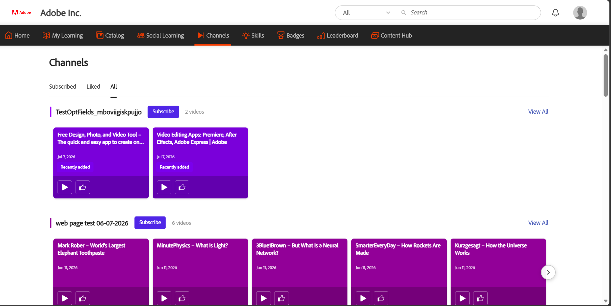

# 發掘並參與頻道

頻道協助學習者發現並存取 Adobe Learning Manager 中網頁及雲端匯流頁面中精選的影片非正式學習內容。 管理員透過連結企業網頁或雲端匯流頁面來建立頻道，這些頁面會承載錄製的知識分享與知識轉移會議。

你不必在多個內部網站間搜尋，而是直接在 Learning Manager 中瀏覽頻道內容。 頻道提供一個集中的平台，讓你發現相關影片、隨時掌握新內容，並參與組織的自節奏學習資源。

**主要優點**

- 在同一地點存取企業網頁與雲端匯流頁面的影片內容。
- 在不需瀏覽多個內部網站的情況下，探索學習資源。
- 訂閱頻道，隨時掌握新內容更新。
- 直接在 Adobe Learning Manager 裡觀看並按讚影片。
- 參與討論，並與其他學習者圍繞共享內容合作。
- 探索與你職務和興趣相關的精選影片收藏。

## 尋找頻道

使用 **頻道** 頁面來發掘新內容、存取你訂閱的頻道，並觀看你喜歡的影片。

1. 登入 Adobe Learning Manager。

1. 從上方導航欄選擇 **頻道** 。

    ****&#x200B;頻道頁面預設&#x200B;**顯示「全部**」標籤。

   

   *頻道頁面的「全部」標籤，讓你發現並訂閱可用頻道。*

1. 請使用以下分頁瀏覽頻道內容：

   | **分頁** | **描述** |
   |----|----|
   | **全部** | 顯示所有可用頻道。 使用此分頁發現並訂閱新頻道。 |
   | **訂閱中** | 只會顯示你訂閱的頻道。 |
   | **喜歡** | 顯示你在不同頻道按讚的所有影片。 |

1. 選擇 **「全部觀看** 」以瀏覽該頻道內所有影片。

## 訂閱頻道

訂閱頻道，快速取得最相關的內容，並在新增影片時隨時更新最新動態。

1. 在「 **全部」** 標籤中，導覽到你想訂閱的頻道。

1. 選擇 **訂閱** 按鈕。

     該頻道會被加入 **訂閱** 標籤。

1. 選擇 **「已** 訂閱」標籤。

     這會顯示你訂閱的所有頻道。

   

   *您的訂閱頻道會被收集在「訂閱」標籤下，方便快速存取。*

### 取消訂閱頻道

如果你不想再追蹤某個頻道，請再次點擊 **「訂閱」** 按鈕。 該頻道會從你的 **訂閱分** 頁移除，並保留在 **「全部** 」分頁中，你可以隨時存取。

## 觀看影片

觀看貴組織頻道的影片，取得精選的知識分享與學習內容。

要觀看影片，請前往頻道並選擇影片縮圖或播放圖示。 在影片詳情頁面，選擇 **觀看影片** 按鈕即可開啟並播放影片。

## 像是影片

按讚影片可以存到 **你的「讚** 」分頁，方便之後快速找到。

要按讚影片，請在顯示卡或影片詳情頁面點選 **「讚」** 按鈕。 按讚數會更新，影片也會被加入你的 **「按讚** 」標籤，方便存取。

喜歡的標籤頁，會儲存你喜歡的影片，方便之後找到。

## 加入討論

利用每支影片的討論分享見解、給予回饋並提出問題。 每支影片都有自己的討論串。

要發表評論：

1. 打開你想討論的影片。

1. 請前往 **「開始討論** 」區塊。

1. 請在「 **新增留言」欄位輸入你的留言** 。

1. 選擇 **貼文**。

     該留言會被加入討論串，並對其他觀看影片的學習者可見。

   

   *觀看影片、觀看按讚和觀看次數，並從影片詳情頁面加入討論。*
