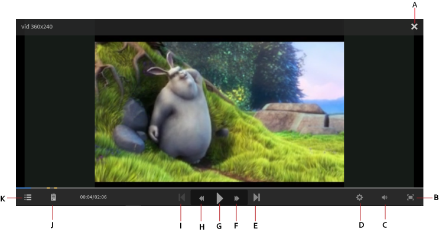
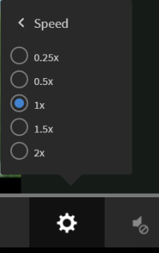

# 流體播放器

閱讀本文章，瞭解如何使用流體播放器來播放課程。

流體播放器是學習者使用內容的平台，能提供不間斷的混合式學習體驗。 所有支援的格式在此播放器中的播放方式均一致。 作者和管理員可以使用播放器預覽內容。

## 播放器功能 {#playerfeatures}

<!---->

**目錄** — 播放器上課時，會在視窗的左窗格中顯示該課程的內容表。 您可以按一下每個主題並直接導覽至該主題。

**書籤** — 如果任何課程模組具有模組TOC，則模組TOC中的主題可以加入書籤以便稍後參考。 加入書籤時，目錄專案旁會出現星號圖示。 再次按一下星號即可刪除書籤。

**備註** — 在您參加課程時，提供錄製備註的資源。 錄製附註後，您可以將其儲存並下載為PDF，或透過電子郵件將附註傳送給任何註冊學習者的電子郵件ID。 當您按一下「儲存」時，您會看到一個選項，可用來選擇將它儲存為PDF檔案的位置。

*做課程備註*

**隱藏式字幕** — 針對Adobe Captivate開發的課程，如果在課程開發期間啟用隱藏式字幕，則學習者可檢視字幕。 按一下播放器底部的「副本」 。

**重新造訪課程** — 您可以在兩種可能的情況下以兩種模式重新造訪課程：

* 當課程處於完成狀態時，按一下「重新造訪」 。
* 當課程處於未完成狀態時，按一下「繼續」。

**全熒幕**&#x200B;按一下播放器右下角的「全熒幕」圖示，即可在全熒幕視窗中檢視課程。

**導覽按鈕**&#x200B;使用向上或向下箭頭在pdf、docx和pptx內容中的幻燈片間移動。 幻燈片箭頭可用來移至所有內容型別的下一個主題。

**向前跳轉/向後跳轉**&#x200B;在播放課程時，您可以使用圖示向後跳轉10秒，並使用圖示向前跳轉10秒。

**修改播放速度**&#x200B;按一下圖示以開啟設定對話方塊。 您可以看到顯示「速度」的快顯視窗。 按一下「速度」即可檢視五個可用的速度設定：0.25x、0.5x、1x、1.5x和2x。 1x是預設值，一般播放速度。

*選取正確的播放速度*

**修改音量設定：**&#x200B;當您參加課程時，請使用[音量控制]按鈕來修改音量。 向上或向下拖曳音量控制項以變更音量設定。

*調整音量*

**關閉課程**&#x200B;按一下播放器右上角的關閉(x)圖示以結束課程。

結束課程後，您可以按一下課程說明頁面上的&#x200B;**重新造訪** / **繼續**&#x200B;按鈕來重新造訪課程。

您也可以使用Learning Manager API將流體播放器內嵌於外部網站或應用程式中。

行動流體播放器具有下列功能：

* 觸控或點選畫面不應暫停播放器。 相反地，它應該會顯示播放器導覽列。
* 如果導覽列未互動，則會在3秒後消失。
* 在關閉導覽功能表專案（目錄、附註、設定）之前，導覽列將保持活動狀態。
