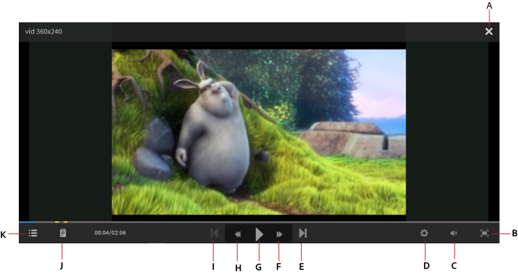
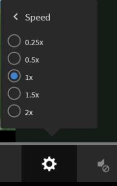
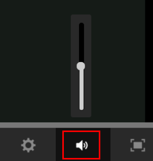

# 流體演奏者

閱讀這篇文章，了解如何使用流體球員來進行賽道操作。

Fluidic Player 是一個讓學習者能以不間斷且混合式學習體驗的方式消費內容的平台。 所有支援的格式在此播放器中都能穩定播放。 作者與管理員可透過播放器預覽內容。

## 球員特色 {#playerfeatures}

<!---->

**TOC** - 在選擇賽道時，玩家會在視窗左側窗格顯示該賽道的目錄。 你可以點選每個主題，直接導航到那裡。

**書籤** ——如果任何課程模組有模組目錄，模組目錄中的主題可以加入書籤以便日後參考。 加入書籤後，目錄條目旁會出現一個星形圖示。 書籤可透過再次點擊星號刪除。

**筆記** - 在修課期間有記錄筆記的功能。 記錄完筆記後，你可以儲存並下載成 PDF，或將筆記寄給任何已註冊學習者的電子郵件帳號。 當你點擊儲存時，會有一個選項可以選擇儲存為 PDF 檔案的位置。

*做課程筆記*

**隱藏字幕** - 對於 Adobe Captivate 開發的課程，若在課程開發期間啟用隱藏字幕，學習者即可查看字幕。 在播放器底部點擊 CC。

**重訪課程** - 你可以在兩種可能情境下重溫課程：

* 在課程完整狀態時點擊重訪。
* 當課程處於未完成狀態時，點擊繼續。

**全螢幕** 點擊播放器右下角的全螢幕圖示，可在全螢幕視窗中查看賽道。

**導航按鈕** 使用向上或向下箭頭來移動 pdf、docx 和 pptx 內容中的投影片。 滑動箭頭可以用來跳到各種類型的主題。

**快轉/倒退** 在遊玩賽道時，你可以使用圖示跳回十秒，並使用圖示跳回十秒。

**修改播放速度** 點擊  圖示開啟設定對話框。 你會看到一個顯示「速度」的彈出視窗。 點擊速度可查看五種可用速度設定：0.25x、0.5x、1x、1.5x 和 2x。 1x 是預設的正常播放速度。

*請選擇正確的播放速度*

**修改音量設定：** 上課時使用音量控制按鈕調整音量。 把音量控制往上或往下拖來調整音量設定。

*調整音量*

**關閉賽道** ，點擊播放器右上角的關閉（x）圖示即可退出賽道。

離開課程後，你可以點擊 **課程說明頁上的「重訪** / **繼續** 」按鈕重新瀏覽該課程。

**自動播放**：Adobe Learning Manager 的 Fluidic Player 沒有內建自動停止影片播放的選項。 影片是否會自動播放取決於你的瀏覽器設定，而不是播放器本身。

流體播放器也可以透過學習管理器 API 嵌入外部網站或應用程式中。

移動流體播放器具備以下功能：

* 點擊或觸控螢幕不應該讓玩家暫停。 相反地，它應該會顯示玩家導航欄。
* 若未操作導航列，3秒後會消失。
* 導航列會持續開啟，直到導航選單項目（目錄、備註、設定）關閉為止。

**支援 11 種語言**：流體型玩家支援 11 種語言。 它們是：

| 語言 | 領土 | IBM 識別碼 |
|---|---|---|
| 阿拉伯語 | 沙烏地阿拉伯 | 阿爾-薩 |
| 中繁 | 中國香港特別行政區 | zh-hant-HK |
| 中繁 | 台灣 | 茲-漢特-TW |
| 捷克語 | 捷克共和國 | cs-CZ |
| 丹麥語 | 丹麥 | 達-DK |
| 希伯來語 | 以色列 | 他-伊爾 |
| 匈牙利語 | 匈牙利 | 呼呼 |
| 印尼 | 印尼 | id-ID |
| 羅馬尼亞語 | 羅馬尼亞 | 滾滾 |
| 泰語 | 泰國 | 那、那 |
| 烏克蘭語 | 烏克蘭 | 英國-聯合 |
