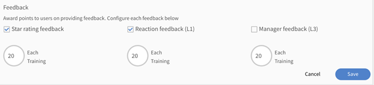

# 遊戲

在Learning Manager中使用遊戲化技術吸引使用者。

遊戲化是指在非遊戲情境下使用遊戲思維和遊戲機制，讓使用者在學習時獲得收益點。

## 概觀 {#overview}

若要與學習者互動並激勵他們使用遊戲技術達成目標，請使用Learning Manager中的遊戲化功能。 學習者可與同事競爭各種學習活動的分數，並取得銅、銀、金和白金級成績。

學習者也可以根據已獲得的點數來檢視成就層級。 層級包括快速學習者、自我驅動等。 **內部學習者和外部學習者都可以存取此功能。**

## 排行榜 {#leaderboard}

排行榜是遊戲化功能，可作為計分板來顯示領先競爭對手的排名分數。 學習者可使用排行榜檢視其遊戲點數。

在學習者的首頁上，按一下左窗格中的&#x200B;**[!UICONTROL Gamification]**。 若要檢視排行榜，請按一下排行榜連結。 此功能可讓學習者瞭解他們如何面對特定團隊成員。 它也會顯示他們相對於團隊其他成員的排名位置。

適用於學習者的排行榜的部分功能：

* 已註冊學習計畫執行個體的學習者，可在該執行個體啟用遊戲化時檢視彼此的點數。
* 按一下&#x200B;**[!UICONTROL Add colleagues]**&#x200B;以包含您要比較的團隊成員。 您的團隊成員個人資料圖片會新增到排行榜頁面頂端的時間軸比例尺中。 當您獲得的點數超過專案團隊成員時，這個時間軸比例表會在開頭顯示您的點，並將您的位置向右移動。 您只能將其與相同群組的其他成員進行比較。
* **使用者群組：**&#x200B;您隨時可以使用&#x200B;**[!UICONTROL Rank Me With]**&#x200B;選項，選擇要與排名比較的團隊成員設定檔。 從「選取使用者群組」欄位中，輸入並選擇群組。 所有專案團隊成員的清單及其最新點列於下方。 內部和外部使用者都可以檢視清單，但只有內部使用者才能搜尋其他內部學習者。

* 此外，「排在您前後的人員」對話方塊會顯示與您同層級以上、以下或相同的團隊成員名稱。
* 當外部使用者轉換為內部使用者時，時間軸會自動更新。

## 持續學習的點數

Adobe Learning Manager推出新的遊戲化工作，鼓勵使用者以一致的方式存取學習平台並參與學習活動。 為了支援此任務，管理員現在可以設定新規則，如果學習者在一週、月或季度內進行1、2、3或4天的學習活動，則獎勵點數。

請注意，此規則的遊戲化點數每24小時會獎勵一次。 例如，如果學習者今天上午8點太平洋標準時間(PST)執行學習活動，並收到今天的遊戲點數，則明天只有當他在上午8點後任何時間執行學習活動時，才會被視為遊戲點數。

下列活動視為學習活動：

* 在流體播放器中使用課程、學習路徑或認證。
* 下載工作輔助。
* 正在下載附件。
* 新增附註。
* 存取社交學習儀表板。
* 在社交學習儀表板發表評論。
* 在社交學習儀表板上張貼。

提供L1和L3意見反應和星級評等的&#x200B;**遊戲點數**

Adobe Learning Manager現在可讓管理員啟用遊戲化標準，當使用者提供L1意見回饋、L3意見回饋和星級評等時，就會將點數獎勵給使用者。

*檢視意見評等*

此功能鼓勵使用者主動提供意見回饋，讓學習者和管理員受益，他們現在可以更瞭解學習者的觀點，並更能評估課程的效率。

## 任務 {#tasks}

學習者有五個遊戲化任務。 您可以在學習者首頁的視窗右上角的圓圈內檢視遊戲化點。 若要檢視每個任務的配置，請按一下「遊戲化」。

系統會顯示「遊戲化」頁面，以下顯示所有學習者的任務和分數：

>[!NOTE]
>
>特定任務中的遊戲點不累積。 但是，如果學習者完成不同任務的這些點數，就會將這些點數累加到學習者帳戶中。
>
>將課程指派給分數時，管理員必須確保學習者以漸進方式取得分數。

快速學習者&#x200B;****

此任務適用於學習者在一個月/季/年內完成某些課程的情況。 此工作是鼓勵快速學習者。

您可以看到下列可能的情況：

1. 當學習者在一個月/季/年內完成兩門課程時，會獲得20分。
1. 當學習者在一個月/季/年內完成四門課程時，會獲得100分。
1. 當學習者完成八門課程時，會獲得300分。
1. 當學習者完成十門課程時，會獲得500分。

>[!NOTE]
>
>管理員可以修改時間週期和需要完成的課程數量以獲得相應的點數。
>
>在任務中，分數不會累計分配給學習者。 例如，假設學習者完成單一課程並獲得20分。 當學習者完成兩個課程時，他們會獲得100分，但不會考慮現有20分。

**適用於自我導向學習者(a)**

此任務適用於學習者註冊指定數量的課程並在一個月/季/年內完成的情況。 在這種情況下，管理員可以啟用此工作來配置點並鼓勵它們。

可能的情況：

1. 當學習者在一個月/季/年內註冊一門課程時，會獲得50分。
1. 當學習者在一個月/季/年內註冊兩門課程時，會獲得150分。

>[!NOTE]
>
>管理員可以修改時間週期和課程數。

**適用於自我導向學習者(b)**

當學習者註冊並完成超過一個月/季/年內完成所需數量的課程時，此工作適用。 在這種情況下，管理員可以啟用此工作來配置點並鼓勵它們。

學習者註冊課程以及所分配課程的可能情況：

1. 當學習者在一個月/季/年內註冊一門課程時，會獲得20分。
1. 當學習者在一個月/季/年內註冊兩門課程時，會獲得100分。
1. 當學習者在一個月/季/年內註冊三門課程時，會獲得額外300分。
1. 當學習者在一個月/季/年內註冊四門課程時，會獲得額外500分。

>[!NOTE]
>
>管理員可以修改時間週期和課程數。 例如，第三個案例可以修改成五個課程，而非三個課程以獲得80分。

**提升技能(a)**

此任務適用於完成多項能力的學習者。 管理員可選擇此任務來鼓勵學習者儘可能獲得更多能力。

能力中提升技能的可能情況：

1. 當學習者獲得一項能力時，就會獲得100分。
1. 當學習者獲得兩種能力時，就會獲得300分。
1. 當學習者獲得三個能力時，就會獲得600分。
1. 當學習者獲得四個能力時，就會獲得900分。

>[!NOTE]
>
>時段不適用於此任務。 管理員可以修改每個情境的課程數。

**提升技能(b)**

只要學習者完成能力內的每個較高層級，此工作即適用。

特定能力內各層級中提升技能的可能案例：

1. 學習者達到一個層級時，會獲得100分。
1. 學習者達到兩個層級時，會獲得200分。
1. 學習者達到三個層級時，會獲得500分。

>[!NOTE]
>
>時段不適用於此任務。 管理員可以修改每個案例的層級數目。 如果學習者獲得較高層級，然後獲得較低層級的能力，則他們只會獲得較高層級的分數。

**提早完成點**

此任務適用於成為前N個完成課程的學習者。

可能的情況：\
當學習者成為完成課程的前10名學習者之一時，他/她會獲得100分。

**按時完成點數**

此任務適用於在課程完成期限之前的規定天數內完成課程的學習者。

可能的情況：\
當學習者在課程開始後的10天內完成課程時，會獲得100分。

**達到層級**

「學習者等級」的狀態會顯示在頁面右上角的「我的課程」頁面，以圓形顯示。 根據學習期間獲得的點數，學習者可以達成以下不同層級：

1. 銅級 — 當學習者達到1500點時。
1. 銀級 — 當學習者達到2500點時。
1. 金級 — 當學習者達到3000點時。
1. 白金 — 當學習者達到5000點時。

## 常見問題 {#frequentlyaskedquestions}

**1. 如何以學習者身分檢視排行榜？**

在學習者應用程式上，按一下左窗格中的&#x200B;**[!UICONTROL Social Learning]**。 您可以在頁面的右下角看到社交排行榜。
