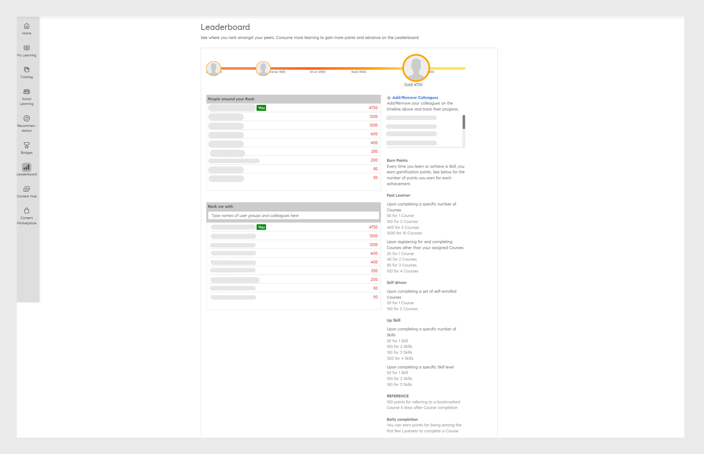
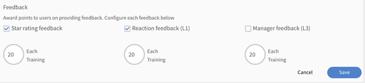

# 遊戲化

在學習管理器中運用遊戲化技術吸引使用者。

遊戲化是指在非遊戲情境中運用遊戲思維與遊戲機制，讓使用者在學習過程中獲得積分。

## 概觀 {#overview}

為了吸引學習者並激勵他們透過遊戲技巧達成目標，請使用 Learning Manager 中的遊戲化功能。 學習者可與同事競爭，爭取各種學習活動的積分，並獲得銅、銀、金及白金等級。

學習者也能根據所獲得的分數，查看成就等級。 這些等級包括快速學習者、自主駕駛者等等。 **內部學習者與外部學習者皆可使用此功能。**

## 排行榜 {#leaderboard}

排行榜是一個遊戲化功能，作為計分板展示領先選手的排名分數。 學習者可以透過排行榜查看遊戲化點數。

從學習者首頁，從左側窗格點擊 **[!UICONTROL Gamification]** 。 要查看排行榜，請點擊排行榜連結。 此功能讓學習者了解自己與特定團隊成員的表現。 同時也會顯示他們相對於其他隊員的排名。

Leaderboard 為學習者提供的一些功能：

* 在學習程式實例中註冊的學習者，若該實例啟用遊戲化功能，則可以看到彼此的分數。
* 點擊 **[!UICONTROL Add colleagues]** 以包含你想比較的團隊成員。 你團隊成員的頭像會被加入排行榜頁面頂端的時間軸刻度中。 這個時間軸刻度會顯示你在起點的位置，當你得分超過隊友時，位置會往右移動。 你只能和同一群體的其他成員比較。
* **使用者群組：** 你可以隨時選擇想要比較排名的團隊成員資料，並使用該 **[!UICONTROL Rank Me With]** 選項。 在「選擇使用者群組」欄位，輸入並選擇群組。 所有隊員名單及其最新得分如下。 內部與外部使用者皆可查看清單，但只有內部使用者可搜尋其他內部學習者。

* 此外，「你階級周圍的人」對話框會顯示與你等級較高、低於或同等級的隊員姓名。
* 當外部使用者轉換成內部使用者時，時間軸會自動更新。

## 持續學習的加分

Adobe Learning Manager 引入了一項新的遊戲化任務，鼓勵使用者持續使用學習平台並參與學習活動。 為了支援此任務，管理員現在可以設定新規則，若學習者在一週、一個月或一季中執行1、2、3或4天的學習活動，則可獲得積分。

請注意，此規則的遊戲化點數每 24 小時發放一次。 例如，若學習者今天太平洋標準時間上午8點執行學習活動，且已獲得今日的遊戲化積分，那麼明天只有在太平洋時間上午8點之後進行學習活動時，才會被考慮遊戲化積分。

以下活動被視為學習活動：

* 在流體玩家中學習課程、學習路徑或認證。
* 下載工作輔助工具。
* 正在下載附件。
* 補充音符。
* 正在存取社交學習儀表板。
* 在社交學習儀表板上留言。
* 在社交學習儀表板上發文。

**提供 L1 和 L3 回饋與星級的遊戲化積分**

Adobe Learning Manager 現在允許管理員啟動遊戲化標準，當用戶提供 L1、L3 回饋及星級評分時，即可獲得積分。

*查看回饋評分*

此功能鼓勵使用者積極提供回饋，這對學習者與管理員都有利，管理員能更了解學習者的觀點，並能更準確評估課程的效率。

## 任務 {#tasks}

學習者有五項遊戲化任務。 你可以在學習者首頁視窗右上角的圓圈內查看遊戲化點。 要查看每個任務的分配，請點擊遊戲化。

系統顯示遊戲化頁面，展示所有學習者的任務與分數如下：

>[!NOTE]
>
>特定任務中的遊戲化點數並非累積性。 但如果學習者在不同任務中達成這些點數，這些點數會累積到學習者帳戶中。
>
>在分配課程點數時，管理者必須確保學習者逐步獲得積分。

**給快速學習者**

當學習者在一個月/一季/一年內完成部分課程時，此任務適用。 這項任務是為了鼓勵快速學習者。

你可以看到以下可能的情況：

1. 當學習者在一個月/一季/一年內完成兩門課程時，可獲得20分。
1. 當學習者在一個月/一季/一年內完成四門課程時，可獲得100分。
1. 當學習者完成八門課程時，可獲得300分。
1. 當學習者完成十門課程時，可獲得500分。

>[!NOTE]
>
>管理員可以調整時間範圍及完成課程數量以獲得相應積分。
>
>在任務中，學習者不會累積獲得分數。 例如，假設一名學習者完成單一課程並獲得20分。 當學習者完成兩門課程時，可獲得100分，但現有的20分不予計算。

**對於自學型學習者（a）**

此任務適用於學生在規定數量課程中註冊並在一個月/一季/一年內完成時。 在這種情況下，管理員可以啟用此任務來分配點數並鼓勵他們。

可能的情況：

1. 當學習者在一個月/一季/一年內選修一門課時，可獲得50分。
1. 當學習者在一個月/一季/一年內選修兩門課程時，可獲得150分。

>[!NOTE]
>
>管理員可修改課程時段及課程數量。

**對於自我驅動學習者（b）**

當學習者在每月/季度/一年內註冊並完成超過所需完成的課程數量時，此任務適用。 在這種情況下，管理員可以啟用此任務來分配點數並鼓勵他們。

學習者除分配課程外還可能選修課程的情況：

1. 當學習者在一個月/一季/一年內選修一門課時，會獲得20分。
1. 當學習者在一個月/一季/一年內修讀兩門課時，可獲得100分。
1. 當學習者在一個月/一季/一年內修讀三門課程時，會額外獲得300分。
1. 當學習者在一個月/一季/一年內修讀四門課程時，可額外獲得500分。

>[!NOTE]
>
>管理員可修改課程時段及課程數量。 例如，第三個劇本可以將賽道從三道改為五道，以獲得80分。

**關於提升技能（a）**

當學習者完成多項能力時，這項任務就適用。 管理員可以選擇此任務，鼓勵學習者盡可能多地掌握能力。

能力提升的可能情境：

1. 當學習者達成一項能力時，可獲得100分。
1. 當學習者達成兩項能力時，可獲得300分。
1. 當學習者達成三項能力時，可獲得600分。
1. 當學習者達成四項能力時，可獲得900分。

>[!NOTE]
>
>此任務不適用於時間範圍。 管理員可以調整每種情境的課程數量。

**為了提升技能（b）**

當學習者完成某一能力的更高等級時，此任務皆適用。

在特定能力範圍內提升技能的可能情境：

1. 當學習者達到一級時，可獲得100分。
1. 當學習者達到兩個等級時，可獲得200分。
1. 當學習者達到三個等級時，可獲得500分。

>[!NOTE]
>
>此任務不適用於時間範圍。 管理員可以修改每個情境的關卡數量。 若學習者達到較高水準後，能力等級降低，則僅因較高等級獲得分數。

**提前完成積分**

此任務適用於成為首位完成課程的N級學習者。

可能的情況：\
當學習者成為前10名完成課程的學員之一時，他/她可獲得100分。

**及時完成分**

此任務適用於學習者，前提是他們在課程完成截止日前的規定天數內完成課程。

可能的情況：\
當學員在課程開始後10天內完成課程時，將獲得100分。

**達成等級**

學習者等級狀態會以圓圈形式顯示在頁面右上角的「我的課程」頁面。 學習者可根據學習期間所取得的積分數達成以下不同等級：

1. 銅牌——當學習者達到1500分時。
1. 銀級——當學習者達到2500分時。
1. 金牌——當學習者達到3000分時。
1. 白金獎——當學習者達到5000分時。

## 常見問題 {#frequentlyaskedquestions}

**1. 作為學習者，如何查看排行榜？**

在學習者應用程式的左側窗格，點擊 **[!UICONTROL Social Learning]**。 你可以在頁面右下角看到社群排行榜。
