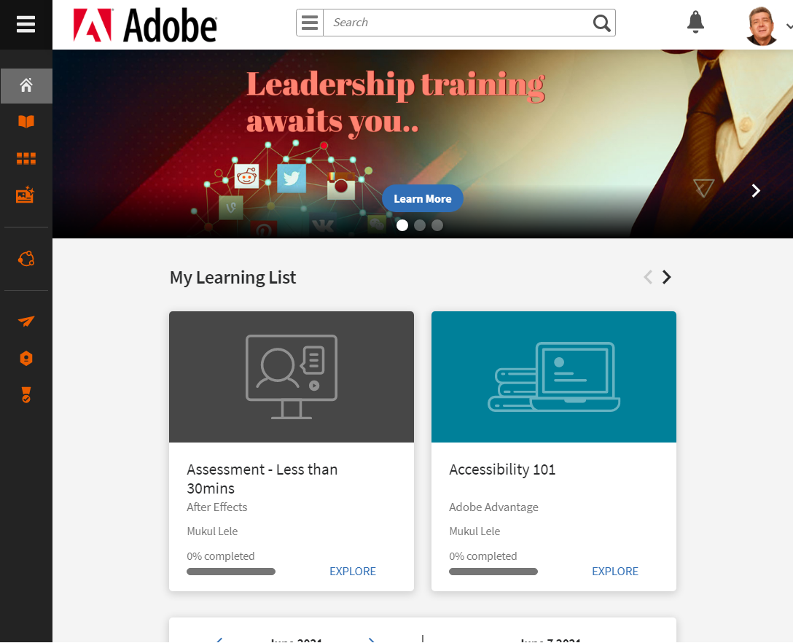
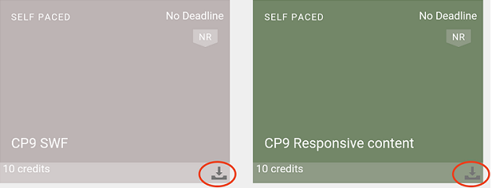
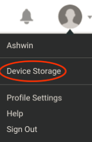
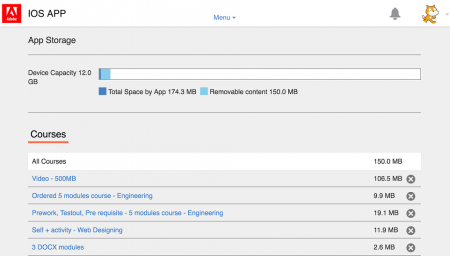

# 學習者快速入門

開始使用Learning Manager中的學習者應用程式

Learning Manager中的學習者應用程式完全以Widget為基礎，只要按一下或按兩下，即可協助您瀏覽各種功能。

在Learning Manager網路應用程式中，以學習者身分登入後，您可在首頁中看到下列介面工具集：

*檢視Widget以進行學習*

**我的學習**：您可以依型別和截止日期檢視及按一下學習物件。 按一下「我的學習」Widget中的圓形，直接前往學習物件型別，或依截止日期檢視學習物件。

**我的技能**：您也可以在該頁面的右上角檢視技能圖。 參考  [技能圖](skills-levels.md)功能以取得詳細資訊。

**學習物件Widget**：此專案位於「我的學習」的正下方，顯示使用者的學習物件。 在「我的學習」下方可檢視所有  [課程](courses.md)，  [學習計畫](learning-programs.md) 和  [認證](certifications.md) 您所註冊或指派給您的活動。 您可以直接開始使用學習物件，或從此介面工具重新造訪學習物件。

**學習行事曆**：此Widget顯示貴組織每季的近期學習及計畫學習清單。 如果您已註冊特定課程，其註冊狀態為已註冊。

**建議學習**：在此介面工具中，您可以檢視公司管理員/經理為您的設定檔建議的所有課程。 您可以按一下這些連結，導覽至課程頁面。

**我的成就**：您完成課程後會取得徽章。 這些徽章會顯示在頁面頂端的設定檔旁邊。 按一下「徽章」以取得特定資訊。 有關徽章的詳細資訊，請參閱  [徽章](badges.md) 功能。

此Widget也會顯示學習者的遊戲點數。 按一下「遊戲化」連結，可檢視「遊戲化」中的詳細點數和其他功能。 有關遊戲點與導板的詳細資訊，請參閱  [遊戲](gamification.md) 功能。

如果您是使用iPad或Android平板電腦存取Learning Manager，請參閱本頁面的iPad和Android分頁應用程式主題區段。

## 學習時間表 {#learningtimeline}

學習時間表會顯示學習者排程以及需要完成的課程。 在本節中，您可以依照截止日期的遞增順序，檢視所有課程、認證和學習計畫的通知。 每個學習活動的截止日期都會顯示在左窗格。

按一下左側圖磚上的每個學習物件，在右側窗格中檢視課程卡的相關資訊。 您可以按一下課程/學習計畫/認證圖磚，以檢視每個學習物件的完整資訊。

將滑鼠停留在時間軸區域上，即可檢視右側的卷軸。 使用卷軸向上或向下移動，並檢視更多警報。

## iPad和Android應用程式使用者 {#ipadandandroidappusers}

在iPad或Android平板電腦上的Learning Manager應用程式中，以學習者身分登入後，您可在「首頁」索引標籤中看到以下資訊：

*應用程式上的首頁標籤*

若要導覽至學習和目錄功能，請點選 **選單** 下拉式清單，然後選擇適當的選項。

*功能表下拉式清單中的專案*

### 離線存取應用程式

您可以在iPad和Android平板電腦中離線存取Learning Manager應用程式。 以離線模式下載及學習課程，並在連線至網路時，將內容同步回線上應用程式。

1. 點選頂端的「選單」下拉式清單，然後點選「學習」選項。 所有可用課程的清單會以圖磚顯示。
1. 點選每個學習物件圖磚底部的下載圖示，即可下載學習內容。

*下載課程*

1. 當您線上上時，應用程式頂端的列會顯示提示，以檢查您是否要線上上同步處理內容。 如果您的答案是肯定的，請點選紅色長條。 綠色列表示您的內容與線上應用程式同步。

<!--### Track device storage

You can monitor your device storage periodically.

Tap the profile icon at the upper-right corner of the app and tap **Device Storage** menu option.

An app storage information dialog appears as shown below.

Using the app storage information, you can check the total space of device, app and the downloaded courses. This information enables you to download courses accordingly. To delete the downloaded courses in the device, tap X icon adjacent to each course name.-->
