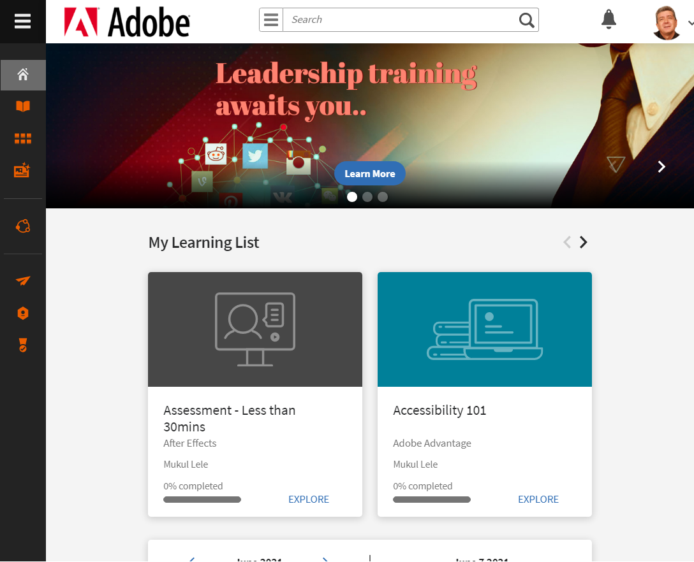
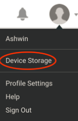
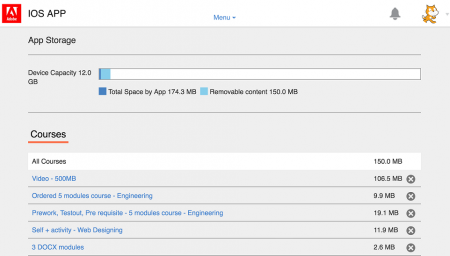

# 作為學習者的起步

在 Learning Manager 開始使用 Learner 應用程式

學習管理員中的學習者應用程式完全以小工具為基礎，幫助你只需一兩次點擊就能瀏覽各種功能。

在 Learning Manager 網頁應用程式中，當你以學習者身份登入後，可以在首頁看到以下小工具：

*檢視學習小工具*

**我的學習：**&#x200B;你可以依照類型和截止日期瀏覽並點擊學習物件。 點擊「我的學習」小工具中的圓圈可直接進入學習物件類型，或依截止日期查看學習物件。

**我的技能**：你也可以在頁面右上角查看技能地圖。 更多資訊請參閱  [技能地圖](skills-levels.md) 功能。

**學習物件小工具**：這就在「我的學習」下方，會顯示使用者的學習物件。 在「我的學習」下方，您可以查看您已報名或分配給您的所有  [課程](courses.md)、  [學習計畫](learning-programs.md) 與  [證照](certifications.md) 。 你可以直接開始使用學習物件，或從這個小工具重新檢視學習物件。

**學習行事曆**：此小工具顯示您組織每季即將及計畫中的學習清單。 如果你已經註冊特定課程，註冊狀態會顯示為已註冊。

**推薦學習**：在此小工具中，您可以查看公司管理員/經理推薦的所有課程。 您可以點擊這些連結前往課程頁面。

**我的成就**：完成課程後會獲得徽章。 這些徽章會顯示在頁面頂端你的個人資料旁邊。 點擊徽章以獲取詳細資訊。 欲了解更多徽章資訊，請參閱  [徽章](badges.md) 功能。

此小工具同時顯示學習者的遊戲化點數。 點擊遊戲化連結以查看詳細重點及遊戲化的其他功能。 欲了解更多遊戲化點數與排行榜資訊，請參閱  [遊戲化](gamification.md) 功能。

如果你是使用 iPad 或 Android 平板存取 Learning Manager，請參考本頁的 iPad 與 Android 分頁應用程式主題區塊。

## 學習時間軸 {#learningtimeline}

學習時間軸顯示學習者排程及所需完成的課程。 在這個區塊中，你可以依截止日期由高到低看到所有課程、證照和學習計畫的提醒。 每個學習活動的截止日期會顯示在左側窗格。

點擊左側圖塊上的每個學習物件，即可在右側窗格以課程卡片形式查看相應資訊。 你可以點擊課程/學習計畫/認證圖塊，查看每個學習物件的完整資訊。

將滑鼠移至時間軸區域，即可查看右側的滾動列。 使用滾動列向上或向下移動並查看更多警報。

## iPad 和 Android 應用程式使用者 {#ipadandandroidappusers}

在 iPad 或 Android 平板的 Learning Manager 應用程式中，登入學習者後，您可以在 Home 分頁看到以下資訊：

*應用程式的主頁頁籤*

要進入學習與目錄功能，請點選 **單** 下拉選單並選擇相應選項。

*選單下拉選單中的項目*

### 離線存取應用程式

你可以在 iPad 和 Android 平板上離線使用 Learning Manager 應用程式。 下載並以離線模式修課，連接網路時將內容與線上應用程式同步。

1. 點選最上方的選單下拉選單，然後點選學習選項。 所有可用球場的清單以圖塊形式顯示。
1. 點擊每個學習物件圖塊底部的下載圖示，即可下載學習內容。

*下載課程*

1. 當你在線上時，應用程式頂端的欄會跳出一個提示，讓你檢查是否要同步你的內容。 如果你的答案是肯定，請點擊紅色條。 綠色條表示你的內容與線上應用程式同步。

<!--
### Track device storage

You can monitor your device storage periodically.

Tap the profile icon at the upper-right corner of the app and tap **Device Storage** menu option.

An app storage information dialog appears as shown below.

Using the app storage information, you can check the total space of device, app and the downloaded courses. This information enables you to download courses accordingly. To delete the downloaded courses in the device, tap X icon adjacent to each course name.
-->
