# 適用於行動裝置和平板電腦的學習者應用程式

請閱讀本文章，瞭解如何下載適用於智慧型手機和平板電腦的Learning Manager學習者應用程式。 瞭解如何使用行動裝置或平板電腦參加課程。

## 概觀 {#overview}

適用於學習者的Learning Manager應用程式適用於Android手機使用者和iPhone使用者。 前往Google Play市集(Android作業系統)或iTunes (macOS)，然後下載Learning Manager應用程式。

下載並安裝此應用程式後，請使用學習者憑證登入應用程式。 開啟Learning Manager行動應用程式時，預設會顯示下列畫面。

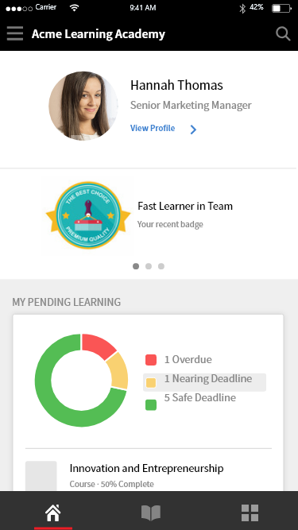

*Learning Manager應用程式首頁*

## 首頁 {#homepage}

對於啟用「沈浸式配置」選項的所有帳戶，都有全新的首頁可支援「沈浸式配置」。 首頁會整理為下列內容的卡片清單：

| 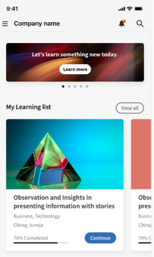 | 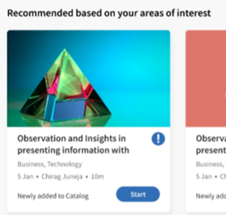 |
|---|---|
| 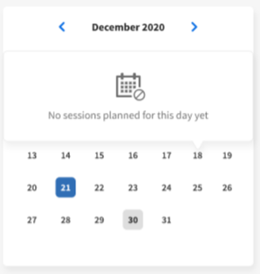 | 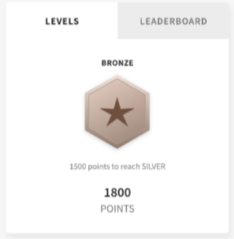 |

*首頁上的卡片清單*

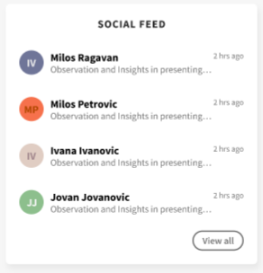

學習者的&#x200B;*社交摘要*

## 意見反應評等 {#feedbackrating}

Learning Manager會提示學習者提供有關行動應用程式體驗的反饋。 此意見回饋會每月顯示一次，並提供足夠的時間間隔，讓使用者體驗應用程式，然後提供意見回饋。

<!--
| 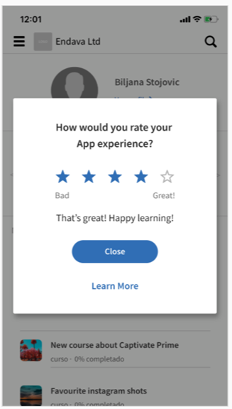 | 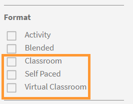|
|---|---|
-->

若是現有使用者，當他們在將應用程式更新至最新版本後首次關閉播放器時，應該會看到快顯意見回饋。

請注意，意見收集是匿名的，且僅針對已透過「應用程式設定」中的設定啟用選項&#x200B;**共用使用資料**&#x200B;的使用者顯示。

## 下載徽章 {#downloadbadge}

學習者可以下載PDF和影像格式的徽章。 在使用者設定檔區段中，向下捲動，然後按一下任何連結以下載徽章。 下載的徽章會儲存在預設的裝置資料夾中。 應用程式可讓您在下載完成後立即開啟資料夾或檔案。

| 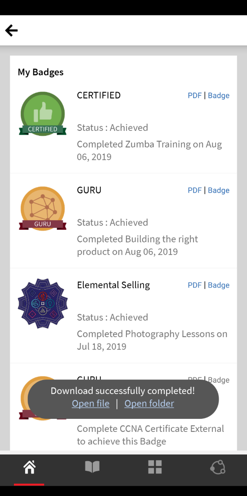 |
|---|

*下載徽章*

## 行動網路回應式佈局 {#responsive}

完全回應式的行動網站體驗，可確保學習者即使未安裝行動應用程式，仍可使用裝置參加訓練。

當您第一次透過裝置上的瀏覽器登入學習者應用程式時，學習者應用程式會以方便使用的行動版面配置顯示。

只有當帳戶&#x200B;**設定為僅限沈浸式配置**&#x200B;時，行動網站回應式UI支援才可用。 回應式UI **不適用於傳統版面**。

<!--
<table>
 <tbody>
  <tr>
   <td>
    
<strong>Home page</strong>

    
<strong>View options</strong>
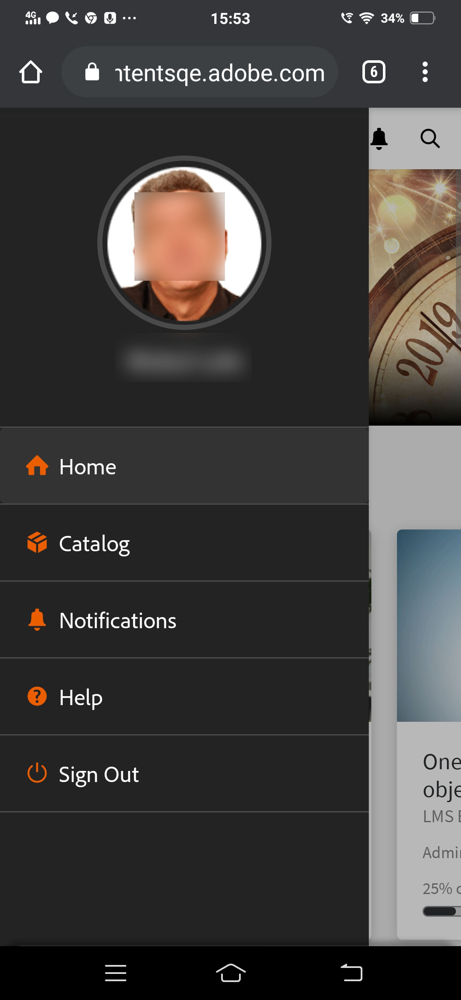
    
<strong>Start course</strong>
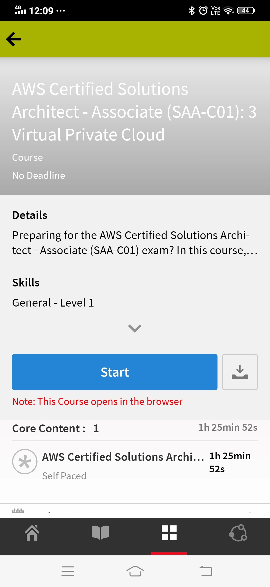</td>
   <td>
    
<strong>My Learning List</strong>

    
<strong>View catalog</strong>
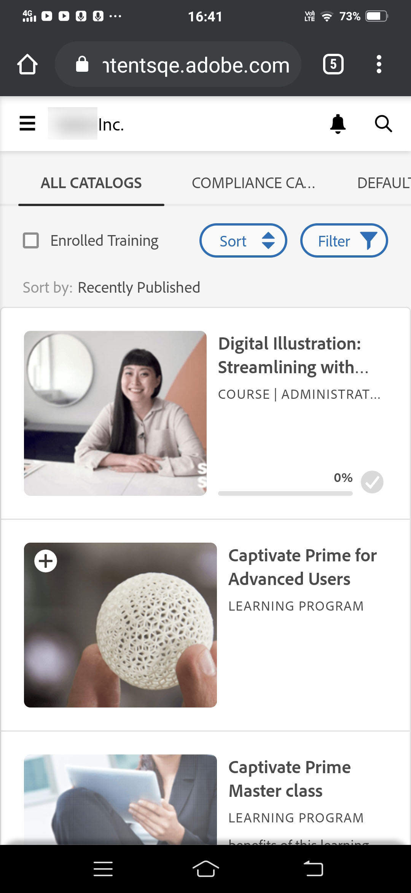
    
<strong>Apply filters</strong>
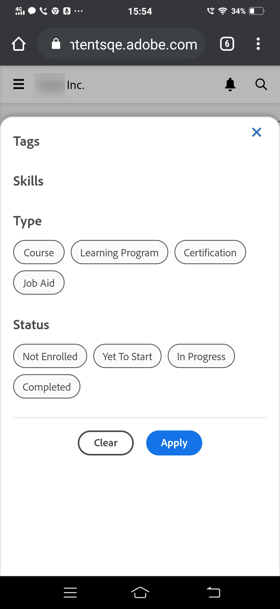</td>
   <td>
    
<strong>Recommendations based on interest</strong>
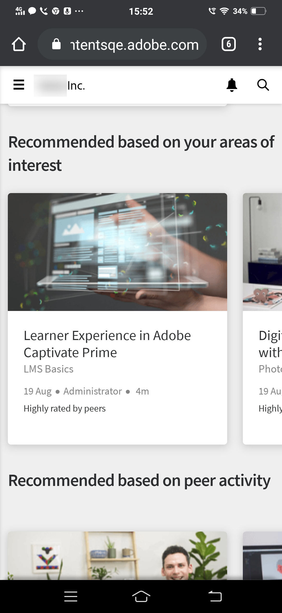
    
<strong>View notifications</strong>
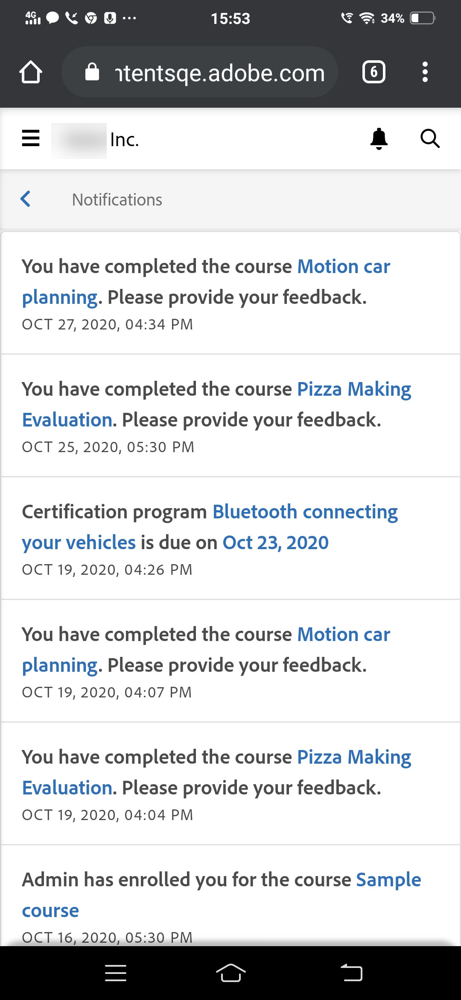
    
<strong>Share url</strong>
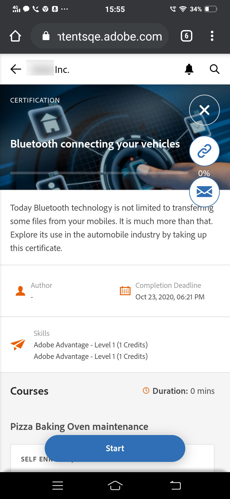</td>
  </tr>
 </tbody>
</table>
-->

## 在ALM網頁中下載提示

當使用者開啟ALM連結或在行動裝置上使用ALM網頁時，應該會看到提示並要求他們下載應用程式，以獲得更好的體驗。

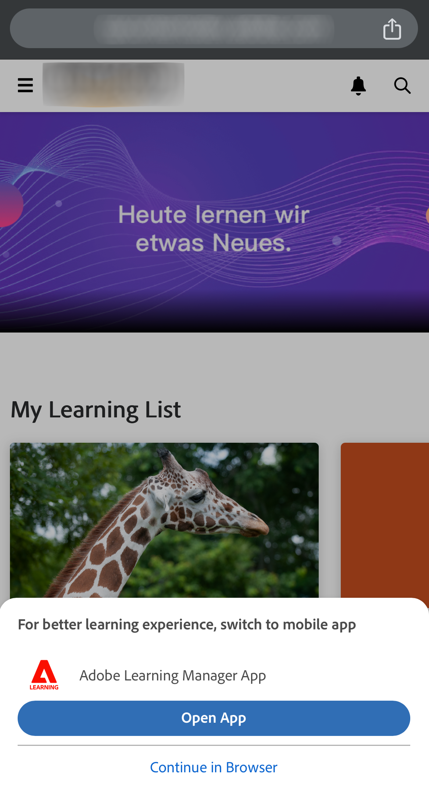
_下載ALM應用程式_

## 行動沈浸式體驗中不支援的功能 {#unsupportedfeaturesinmobileimmersiveexperience}

學習者的傳統體驗會顯示下列工作流程：

* 多重嘗試
* Flexi LP
* 檔案上傳情況
* 提供L1意見回饋

其他不支援的應用程式功能包括：

* 社交應用程式：如果學習者按一下首頁上的Social Widget，系統會將學習者重新導向至傳統體驗
* 設定檔設定/編輯設定檔
* 檢視徽章/技能
* 排行榜：如果學習者按一下首頁上的排行榜Widget，則會重新導向至傳統體驗
* 正在下載工作輔助。
* 搜尋中的篩選選項。

社交學習現在支援行動沈浸式網頁體驗。

行動沈浸式應用程式不支援某些功能。 這些功能包括：

| **區域** | **不支援** |
|---|---|
| 展示板 | 展示板建立、展示板編輯、複製URL 、刪除、報告、排序、篩選 |
| Post | 輪詢型別帖子建立、編輯、多個帖子附件、複製URL、釘選到頂端 |
| 評論/回覆 | 編輯、標示為正確答案、在評論或回覆中上傳影像/視訊/音訊 |
| 媒體 | 擷取音訊；僅上傳音訊檔案 |
| 其他 | 通知、貼文檢視、社交排行榜、我關注的人、使用者設定檔 |

## 讓學習者下載工作輔助 {#download-job-aid}

在行動沈浸式模式中，學習者可以下載工作輔助。 點選&#x200B;**設定**，然後點選&#x200B;**目錄**。 從出現的清單下載「工作輔助」。

| 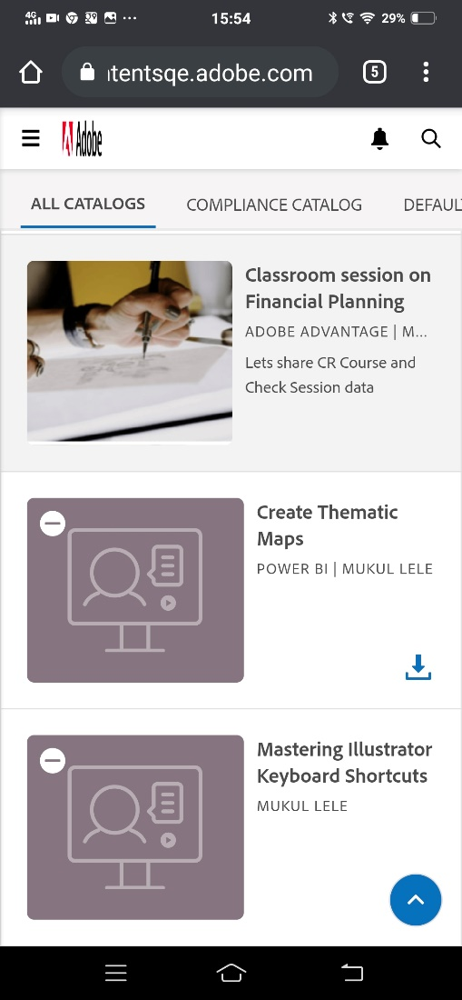 |
|---|

*下載工作輔助*

## 讓學習者下載學習者成績單 {#download-learner-transcript}

在行動沈浸式模式中，學習者可下載學習者成績單。

| 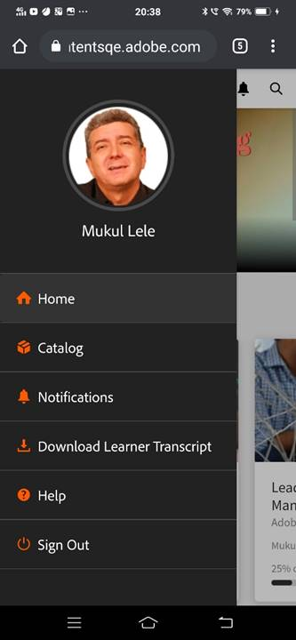 | 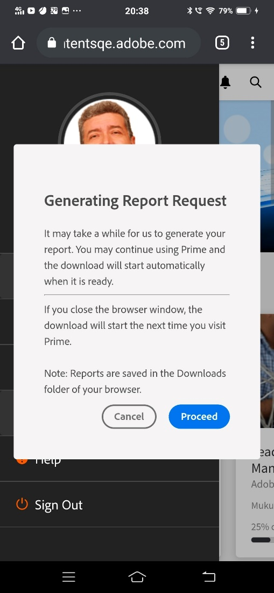 |
|---|---|

*下載學習者成績單*

## 檢視徽章和技能 {#viewbadgesandskills}

**檢視徽章、技能與遊戲點數**

預設畫面會在您的設定檔資訊下方顯示您最近取得的徽章、技能和遊戲化點。 如果您使用電話，會顯示最近取得的徽章。 向右撥動以檢視詳細資訊。

**我的待處理學習**

依預設，畫面會顯示您已註冊的課程。 環圈圖顯示逾期的學習、接近期限的學習及正軌的學習。

點選課程可檢視課程的詳細資訊、您的完成日期（如適用）。 您可以繼續或從此畫面重新造訪課程，視您的完成狀態而定。

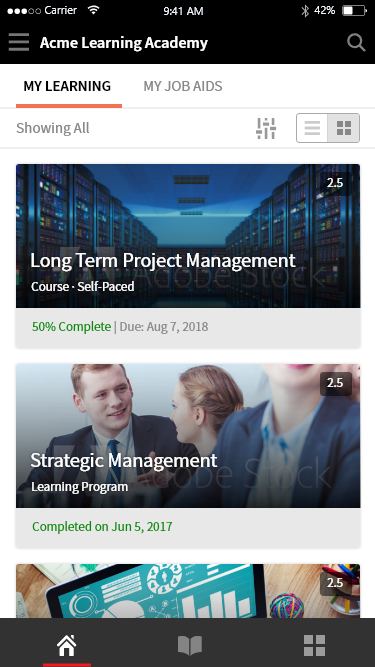

*檢視擱置中的學習*

**檢視目錄**

點選畫面底部書本圖示旁的圖示。 您可以立即檢視包含所有關聯學習物件的目錄。 您可以選擇以網格版面配置檢視它們，或選擇詳細檢視。 選取建議，以根據您的學習歷程檢視課程建議。

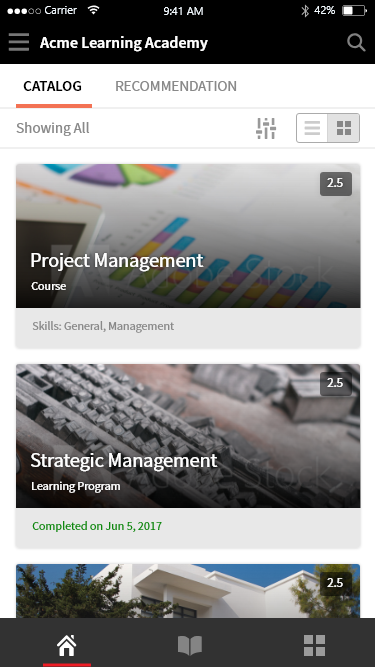

*檢視課程建議*

## 排序和篩選學習物件 {#sortandfilterlearningobjects}

**排序和篩選**

按一下課程或目錄畫面右上角的排序圖示，以字母順序（遞增或遞減）或按發佈日期排序學習物件。 您也可以依型別、完成狀態、技能或標籤來篩選學習物件。 點選並選取篩選器，然後點選「套用」以套用篩選器。

**使用搜尋功能**

在手機熒幕的右上方，您可以看到搜尋圖示。 點選該圖示，依課程中繼資料、唯一ID、技能等搜尋學習物件。

**管理設定檔、設定和通知**

點選畫面左上角的功能表以檢視您的設定檔、通知以及帳戶設定。

此功能表也可讓您掃描QR碼，標籤課程的出席情況。

您只需要點選&#x200B;**掃描QR碼**&#x200B;選項並掃描代碼。

**課程的離線使用**

當您線上上使用下載的課程時，Learning Manager會存取下載的課程，而非進行伺服器呼叫。

## 掃描要註冊的二維碼 {#qrcode}

您可以掃描二維碼並註冊課程。 學習管理員產生二維碼後，您就可以從應用程式掃描此二維碼，並註冊課程。

1. 若要掃描QR碼，請點選畫面左上角的。
1. 點選&#x200B;**掃描QR碼**。

掃描QR功能可讓學習者根據學習管理員產生的QR碼，執行下列任一動作：

* **註冊：**&#x200B;這可讓學習者透過掃描QR碼來註冊課程。
* **完成：**&#x200B;這可讓學習者掃描QR碼，將課程標示為已完成。
* **註冊與完成：**&#x200B;這可讓學習者透過掃描QR碼，同時註冊並標籤完成。
* **標籤出席情況：**&#x200B;這可讓學習者透過掃描QR碼，標籤特定工作階段的出席情況。

## 重新命名學習物件 {#renaminglearningobjects}

管理員可重新命名學習物件術語。 若要重新命名，請參閱[重新命名學習物件](../../administrators/feature-summary/settings.md#main-pars_header_1570157145)。

## 社交學習 {#socialmobile}

在此更新中，不支援下列功能。 您無法：

* 建立或遵循展示板。
* 將URL複製到貼文。
* 新增貼文作為內文，或新增貼文作為我的最愛，或釘選到最上層。
* 檢視社交主管展示板。

社交學習是Learning Manager行動應用程式中的一個平台，可讓使用者在非正式環境中分享想法和有意義的見解。 這是一種補充傳統學習想法的方法。

社交學習讓使用者能夠運用其相關的專業知識，以取得正確且簡潔的資訊。 學習者可以快速套用該資訊以完成任務並達成目標。

使用行動應用程式時，使用者可以透過共用內容來互相互動，並獲得共用內容的驗證。

在這個平台上，可以分享的不同內容型別有視訊、音訊、熒幕擷圖、文字、問題和投票。 使用者也可以與同業分享他們的線上學習。

只有在管理員啟用帳戶的&#x200B;**社交學習**&#x200B;後，裝置應用程式才能使用此功能。

## 在應用程式上啟動社交學習 {#launchsociallearningontheapp}

啟動應用程式後，點選&#x200B;**社交**&#x200B;圖示。

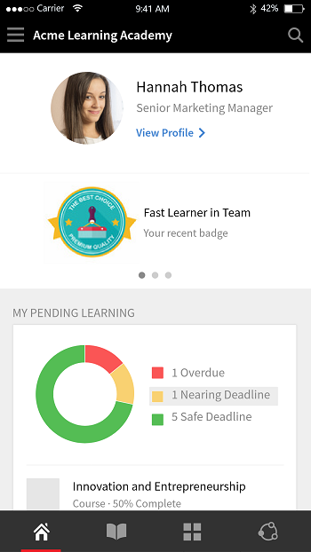

*檢視社交學習*

## 在展示板中建立貼文 {#createapostinaboard}

如同任何其他社交平台，在Learning Manager行動應用程式中，您可以在展示板中建立貼文，讓屬於相同展示板的所有學習者都能檢視您的貼文、發表評論，以及連同評論一起上傳檔案。

若要建立貼文，請點選畫面右下角的圖示。

下列畫面隨即顯示。

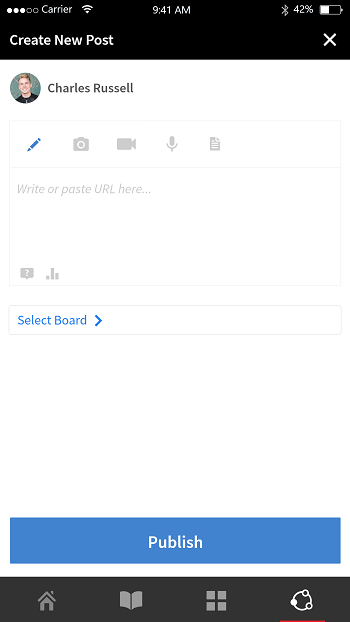

*新增貼文*

<table>
 <tbody>
  <tr>
   <td>
    

</td>
   <td>
    
撰寫貼文或貼上任何URL。
</td>
  </tr>
  <tr>
   <td>
    

</td>
   <td>
    
使用行動相機拍照，並隨貼文上傳。
</td>
  </tr>
  <tr>
   <td>
    

</td>
   <td>
    
使用行動相機錄製視訊。
</td>
  </tr>
  <tr>
   <td>
    
 
</td>
   <td>
    
使用行動裝置錄製音訊。
</td>
  </tr>
  <tr>
   <td>
    

</td>
   <td>
    
上傳展示板中的任何檔案或檔案。
</td>
  </tr>
  <tr>
   <td>
    
 
</td>
   <td>
    
提出問題。
</td>
  </tr>
  <tr>
   <td>
    
 
</td>
   <td>
    
使用您的貼文建立意見調查。
</td>
  </tr>
 </tbody>
</table>

## 支援的內容格式 {#supportedcontentformat}

<table>
 <tbody>
  <tr>
   <td>
    
<strong>內容型別</strong>
</td>
   <td>
    
<strong>擴充功能</strong>
</td>
  </tr>
  <tr>
   <td>
    
影片
</td>
   <td>
    
wmv， f4v， asf， 3gp， 3g2， avi， mov， h264， m4v， mp4， MPEG， mpg
</td>
  </tr>
  <tr>
   <td>
    
音訊
</td>
   <td>
    
mp3、amr、m4a、wav、wma、aac
</td>
  </tr>
  <tr>
   <td>
    
靜態檔案
</td>
   <td>
    
PDF， ppt， pptx， doc， docx， xls， xlsx
</td>
  </tr>
  <tr>
   <td>
    
影像
</td>
   <td>
    
jpg、jpeg、png、bmp、gif
</td>
  </tr>
 </tbody>
</table>

建立貼文後，選擇要上傳貼文的展示板。 點選「選取面板」並搜尋所需的面板。

在您建立貼文後，點選「貼文」並張貼您的註解給其他學習者，以便檢視您的貼文。

在行動應用程式中，您無法建立展示板。 若要建立展示板，您必須以學習者身分登入網頁應用程式。 如需建立討論區的詳細資訊，請參閱[Learning Manager](/help/migrated/learners/feature-summary/social-learning-web-user.md)中的社交學習。

## 可在貼文上執行的動作 {#actionsthatcanbeperformedonapost}

* 評論貼文，並根據許可權，在展示板中檢視貼文。
* 編輯或刪除展示板中的註解。
* 根據許可權編輯或刪除貼文。
* 如果貼文侵犯隱私權或其內容不適當，請舉報不當使用。 回報貼文後，會傳送通知給討論區管理員和版主，以供進一步動作。
* 喜歡或不喜歡   貼文。
* 喜歡或不喜歡註解。

## 在其他展示板中建立貼文 {#createapostinotherboards}

您也可以在其他展示板中建立貼文。

點選「**所有展示板**」，您就可以檢視其他學習者在展示板中執行的活動。

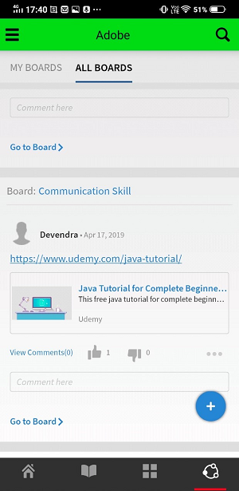

*檢視所有展示板活動*

導覽至所需的主機板並張貼您的評論。

## 在展示板中共用媒體 {#sharemedia}

<!--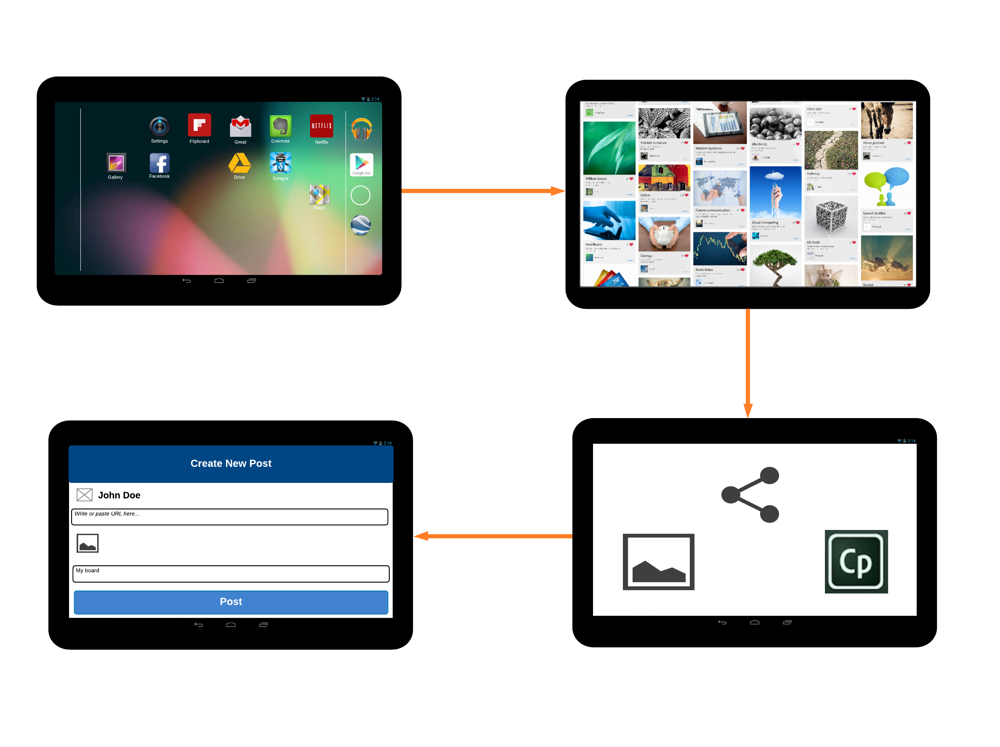-->

將圖片、檔案、音訊或視訊檔案分享至任何展示板，讓其他展示板成員可以檢視您的貼文並開始互動。 若要共用任何媒體，

1. 開啟您要共用的媒體。
1. 點選共用按鈕，然後選擇Learning Manager。
1. 選擇您要共用媒體的主機板。
1. 點選&#x200B;**Post**。

您也可以從外部應用程式張貼任何內容，例如，您可以分享Reddit或Quora的註解。

## 上傳外部憑證中的資產作為完成證明 {#externalcert}

請遵循下列步驟：

1. 使用您的學習者憑證登入裝置應用程式。
1. 搜尋作者建立的憑證。
1. 從外部憑證清單中，選擇所需的憑證，然後註冊憑證。
1. 點選&#x200B;**完成證明**&#x200B;並上傳檔案，例如pdf或影像。

   | 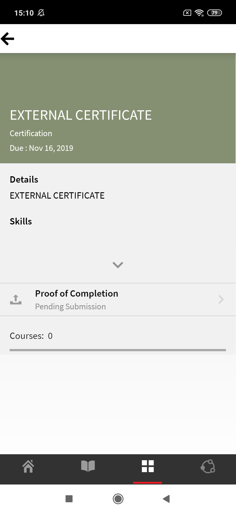 | 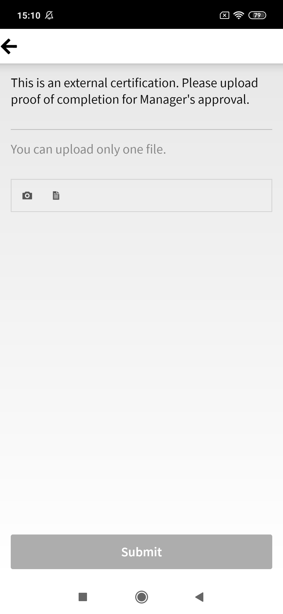 |
   |---|---|

*上傳完成證明*

1. 上傳檔案後，索引標籤&#x200B;**提交**。 確認訊息隨即顯示。

**正在上傳檔案**

1. 上傳檔案後，點選&#x200B;**提交**。

   您只能上傳一個檔案作為完成證明。 當您嘗試上傳多個檔案時，會顯示以下訊息：

   **您所做的變更將會遺失。 您要繼續嗎？**

1. 狀態變更為&#x200B;**未決核准**，以橘色顯示。

   您無法在行動應用程式上檢視或下載已上傳的檔案。

在經理核准提交後，狀態會變更為&#x200B;**已核准**，以綠色顯示。

如果管理員拒絕提交，則狀態會變更為&#x200B;**已拒絕**，以紅色顯示。

| 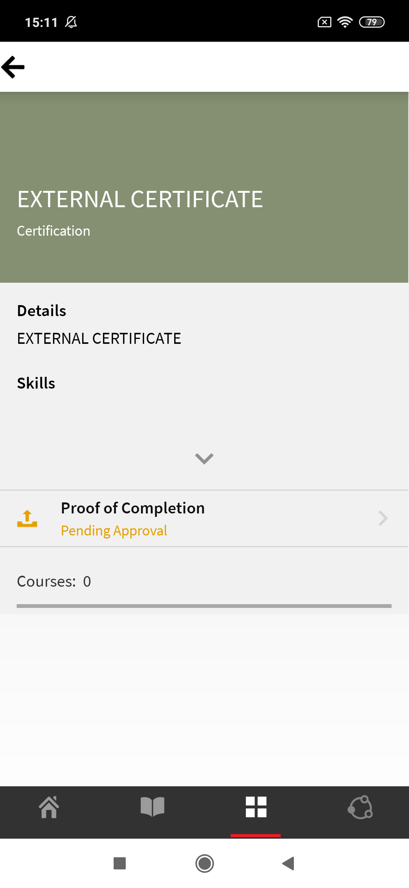 | 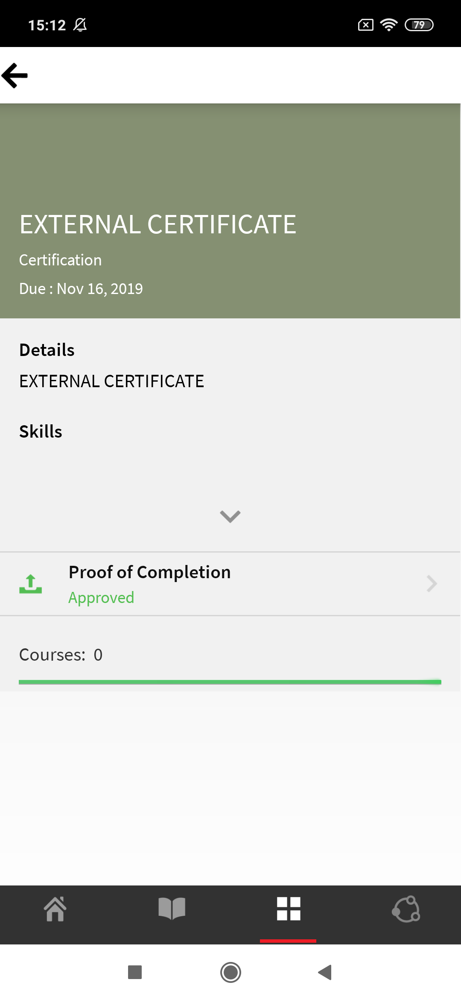 | 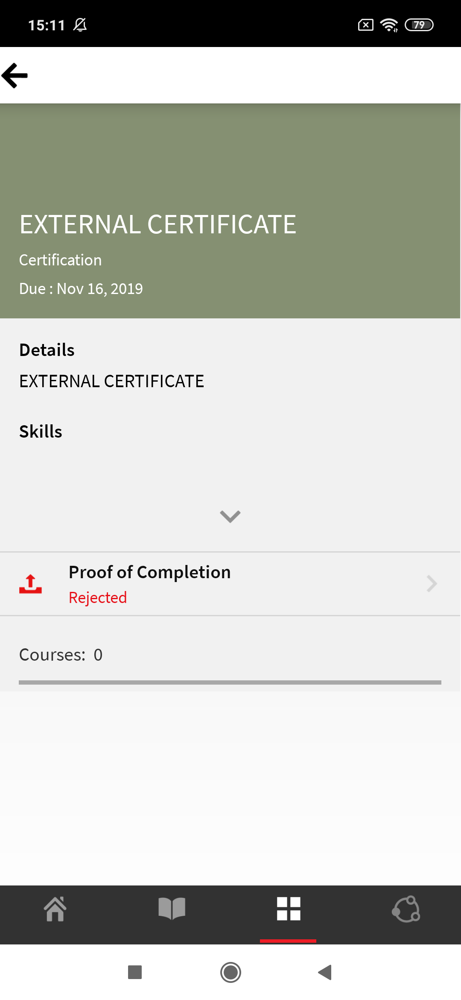 |
|---|---|---|

*檢視提交狀態*

拒絕後，您可以上傳檔案作為完成證明。

* 您只能在狀態為&#x200B;**擱置提交且已拒絕**&#x200B;時提交檔案。
* 狀態為&#x200B;**未決核准和已核准**&#x200B;時，您無法提交檔案。

## 從LinkedIn學習中參加課程 {#linkedin}

Learning Manager已可支援LinkedIn學習平台內的課程。 現在，學習者可以在Learning Manager行動應用程式中參加這類LinkedIn學習課程。 在裝置應用程式中，搜尋課程，然後開始課程。

如果您已安裝LinkedIn應用程式，課程將在應用程式中開啟，否則課程將在預設瀏覽器中開啟；您必須使用LinkedIn憑證登入。

如果您透過LinkedIn應用程式參加課程，系統不會在Learning Manager中追蹤您的進度。 因此，建議在瀏覽器中啟動課程，而非LinkedIn學習應用程式。

>[!NOTE]
>
>只有當您有使用中的網際網路連線時，才能參加課程。

|  | 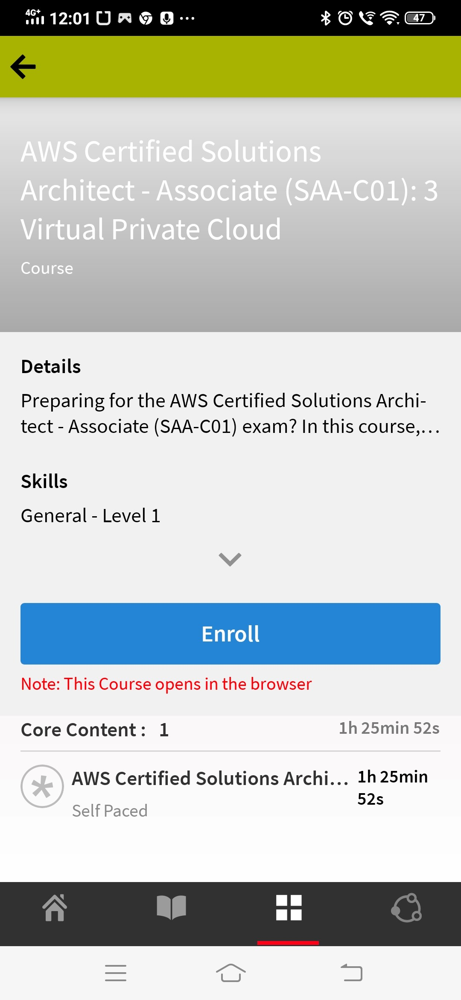 | 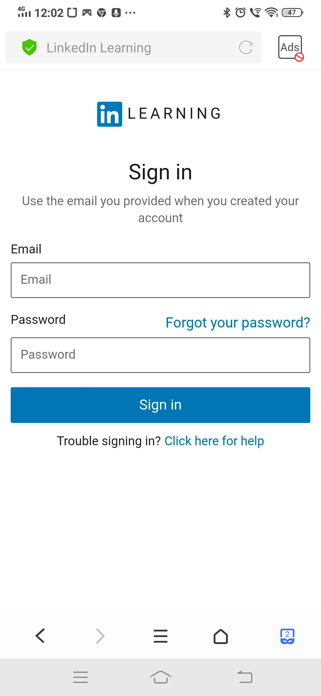 |
|---|---|---|

*在LinkedIn學習中註冊課程*

linkedIn學習課程所花費的學習時間會由LinkedIn內容/LinkedIn平台傳送至Learning Manager學習平台。

如果LinkedIn學習未傳送學習時間，我們的學習平台便無法記錄該時間。 在這種情況下，Learning Manager顯示的學習時間為零。

## 提交教室和活動模組的檔案 {#submitfile}

作為學習者，您可以向您的教師提交檔案作為課程完成的證明。 然後，講師可以根據檔案內容核准或拒絕您的提交。

作者只能建立教室和活動模組，以供學習者在行動應用程式中使用。

學習者開始課程後，學習者在畫面上可看到狀態&#x200B;**檔案提交**&#x200B;為擱置中，以及上傳檔案的連結，如下方熒幕擷取所示。

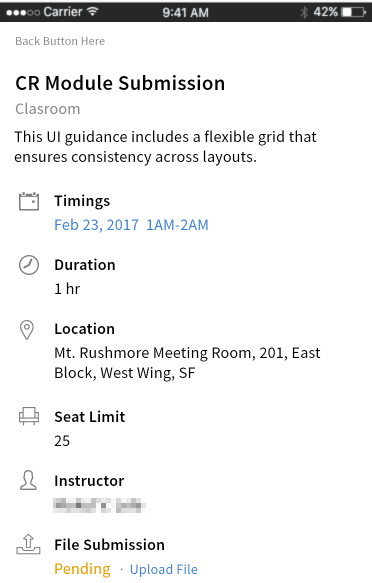

*檔案提交狀態*

若要上傳檔案，請按一下[上傳檔案]。****

上傳任何檔案並按一下&#x200B;**提交**&#x200B;按鈕。

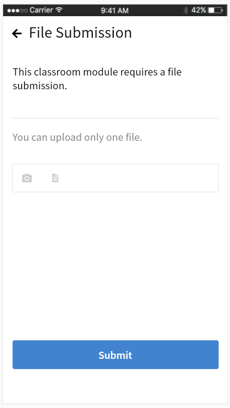 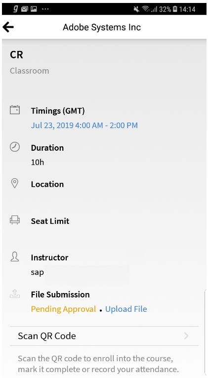

*提交檔案*

## 支援上傳的檔案型別 {#supportedfiletypesforupload}

<table>
 <tbody>
  <tr>
   <td>
    
<b>內容型別</b>
</td>
   <td>
    
<b>擴充功能</b>
</td>
  </tr>
  <tr>
   <td>
    
影片
</td>
   <td>
    
wmv， f4v， asf， 3gp， 3g2， avi， mov， h264， m4v， mp4， MPEG， mpg
</td>
  </tr>
  <tr>
   <td>
    
音訊
</td>
   <td>
    
mp3、amr、m4a、wav、wma、aac
</td>
  </tr>
  <tr>
   <td>
    
靜態檔案
</td>
   <td>
    
PDF， ppt， pptx， doc， docx， xls， xlsx
</td>
  </tr>
  <tr>
   <td>
    
影像
</td>
   <td>
    
jpg、jpeg、png、bmp、gif
</td>
  </tr>
 </tbody>
</table>

## 核准或拒絕提交 {#approvalorrejectionofsubmission}

上傳檔案後，狀態會變更為&#x200B;**未決核准。**。 然後講師會檢視[擱置提交](/help/migrated/instructors/feature-summary/learners.md)的清單，並核准或拒絕透過講師網頁應用程式提交。

當講師核准提交時，學習者行動應用程式上的狀態會變更為&#x200B;**已核准**。

<!--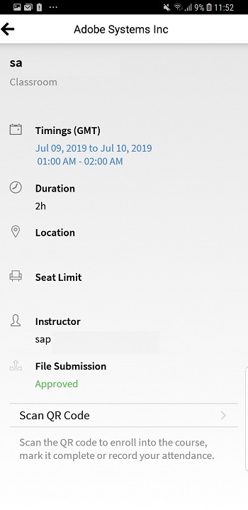-->

當講師拒絕提交時，學習者行動應用程式上的狀態會變更為&#x200B;**已拒絕**。

<!--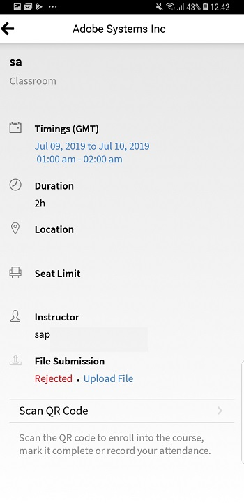-->

若要再次提交檔案，請按一下連結&#x200B;**上傳檔案**。

## iPad和平板電腦版Learning Manager {#captivateforipadandtablets}

在iPad或Android平板電腦上的Learning Manager應用程式中，以學習者身分登入後，您會看到下列&#x200B;**首頁**&#x200B;畫面：

<!---->

若要導覽至學習和目錄功能，請點選&#x200B;**功能表**&#x200B;下拉式清單，然後選擇適當的選項。

<!---->

您可以選擇在清單檢視中檢視課程集，而不是以圖磚/卡片檢視。

## 離線存取應用程式 {#accesstheappoffline}

您可以在iPad和Android平板電腦中離線存取Learning Manager應用程式。 您可以下載課程和學習計畫。 參加課程、以離線模式使用學習程式，並在連線至網路時，將內容同步回線上應用程式。

1. 點選頂端的&#x200B;**功能表**&#x200B;下拉式清單，然後點選&#x200B;**學習**&#x200B;選項。 所有可用課程的清單會以圖磚顯示。
1. 點選每個學習物件圖磚底部的下載圖示，即可下載學習內容。

   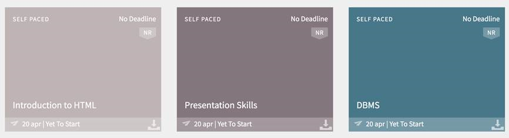

   *下載內容*

   應用程式頂端的列會顯示提示，指出裝置的網路狀態。

   * 紅色長條表示裝置無法使用網路。
   * 綠色長條表示網路已重新上線。

使用者可以按一下綠色列上的&#x200B;**檢視線上內容**&#x200B;按鈕，切換回線上模式。 當使用者切換到線上模式時，會同步處理裝置中的內容。

## 行動沈浸式裝置上的多專案購物車支援

學習者現在可以將數個課程、學習路徑或認證新增到購物車中，並一起購買。 檢視ALM](/help/migrated/learners/feature-summary/multi-item-cart.md)中的[多專案購物車

<!--## Track device storage {#trackdevicestorage}

You can monitor your device storage periodically.

Tap the profile icon at the upper-right corner of the app and tap **Device Storage** menu option.

An app storage information dialog appears as shown below.

Using the app storage information, you can check the total space of device, app and the downloaded courses. This information enables you to download courses accordingly. To delete the downloaded courses in the device, tap delete icon adjacent to each course name.-->
