# 適用於行動裝置與平板電腦的學習者應用程式

閱讀本文了解如何下載 Learning Manager Learner 應用程式，適用於智慧型手機和平板電腦。 學習如何使用手機或平板學習課程。

## 概觀 {#overview}

學習者專用的學習管理應用程式同時適用於 Android 手機用戶和 iPhone。 前往 Google Play 商店（Android 系統）或 iTunes（macOS），下載 Learning Manager 應用程式。

下載並安裝此應用程式後，請使用您的學習者憑證登入應用程式。 當你開啟 Learning Manager 行動應用程式時，預設會顯示以下畫面。

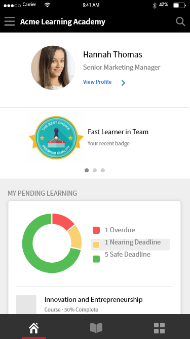

*學習管理軟體應用程式的首頁*

## 首頁 {#homepage}

對於所有啟用沉浸式版面配置的帳號，都有全新的首頁支援沉浸式版面配置。 首頁以以下卡片列表形式組織：

| 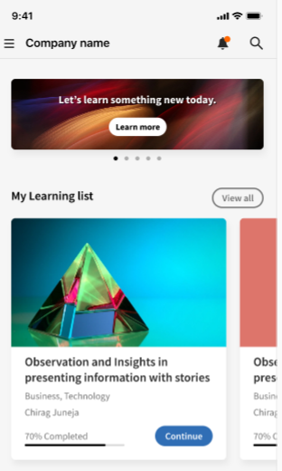 | 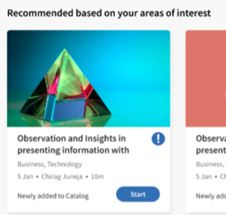 |
|---|---|
| 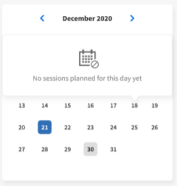 | 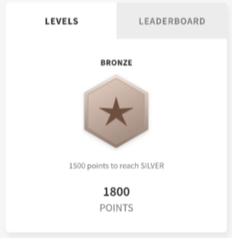 |

*首頁卡片列表*

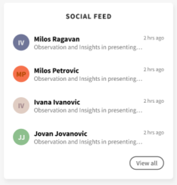

*學習者的社交動態*

## 回饋評分 {#feedbackrating}

學習管理員會提示學習者對行動應用程式的使用經驗提供回饋。 這些回饋每月出現一次，並提供足夠時間讓使用者體驗應用程式後再提供回饋。

<!--
| 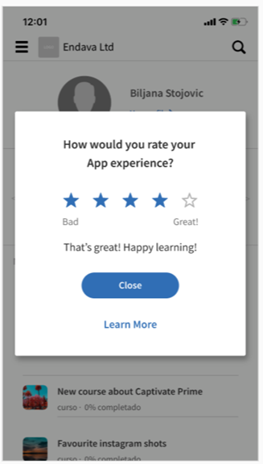 | 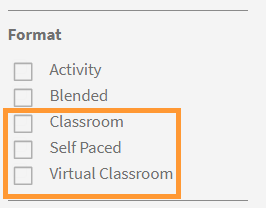|
|---|---|

-->

對於現有使用者，他們在更新應用程式到最新版本後，第一次關閉播放器時應該會看到回饋彈出視窗。

請注意，回饋收集是匿名的，僅會顯示給在應用程式設定中啟用「分享使用資料&#x200B;**」選項**&#x200B;的用戶。

## 下載徽章 {#downloadbadge}

學習者可下載其徽章的PDF及圖片格式。 在使用者資料區塊，往下滑，點擊任一連結下載徽章。 下載的徽章會儲存在預設裝置資料夾裡。 該應用程式允許你在下載完成後立即開啟資料夾或檔案。

| 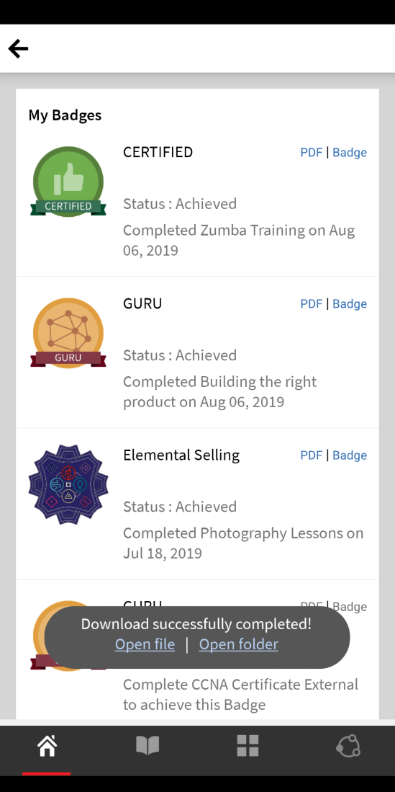 |
|---|

*下載徽章*

## 行動網頁響應式版面配置 {#responsive}

完全響應式的行動網頁體驗，確保學習者即使未安裝行動應用程式，也能使用裝置來獲取培訓內容。

當你第一次透過裝置上的瀏覽器登入學習器應用程式時，學習者應用程式會以行動友善且響應式的介面顯示。

行動網頁響應式介面支援僅在帳號 **設定為沉浸式版面時**&#x200B;才可用。 經典版面&#x200B;**設計無法支援響應式介面**。

<!--
<table>
 <tbody>
  <tr>
   <td>
    
<strong>Home page</strong>
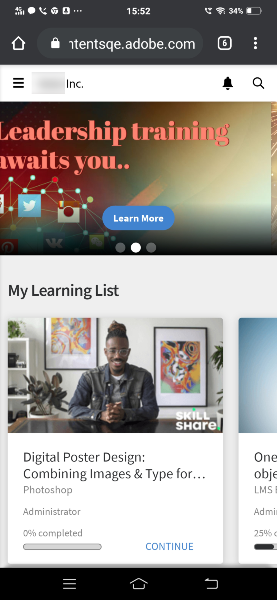
    
<strong>View options</strong>
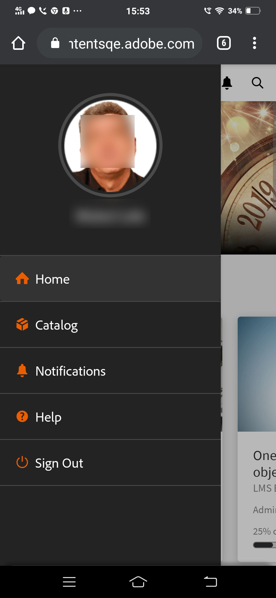
    
<strong>Start course</strong>
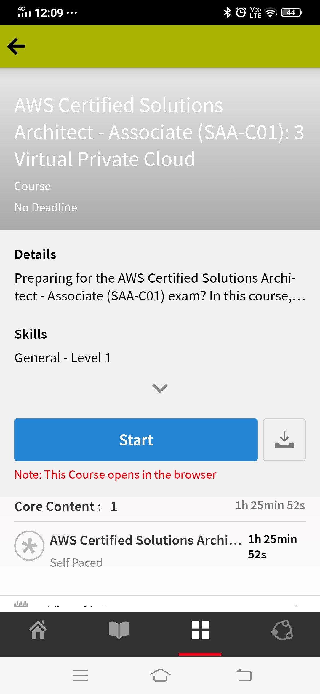</td>
   <td>
    
<strong>My Learning List</strong>

    
<strong>View catalog</strong>

    
<strong>Apply filters</strong>
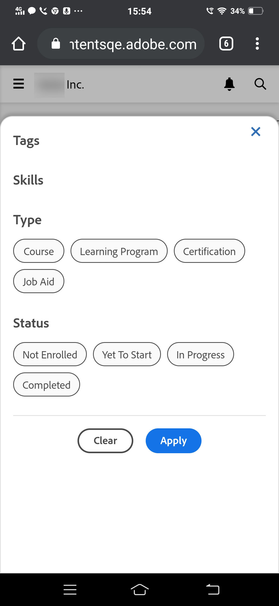</td>
   <td>
    
<strong>Recommendations based on interest</strong>
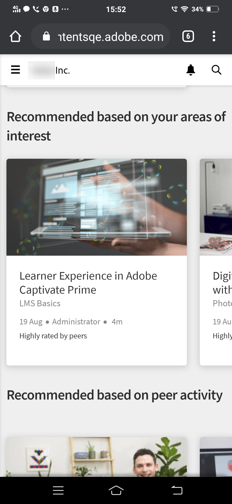
    
<strong>View notifications</strong>
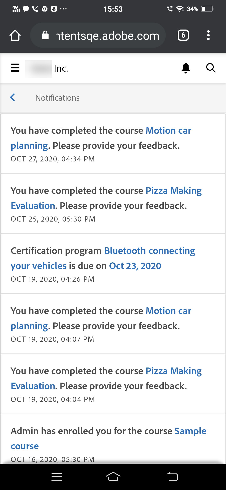
    
<strong>Share url</strong>
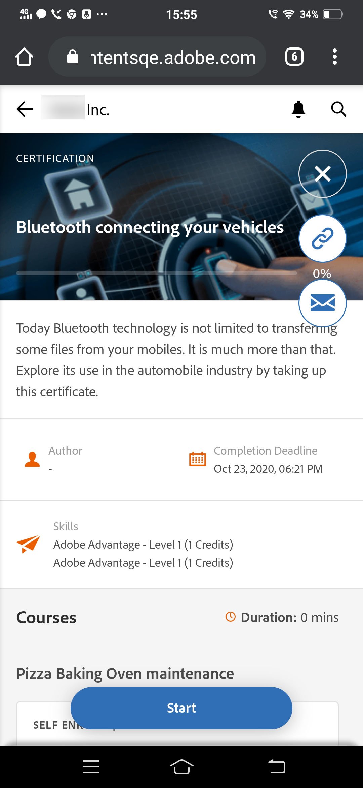</td>
  </tr>
 </tbody>
</table>

-->

## ALM 網頁版的下載提示

當使用者開啟 ALM 連結或在行動裝置上使用 ALM 網頁時，應該會看到一個提示，要求他們下載該應用程式以獲得更好的體驗。

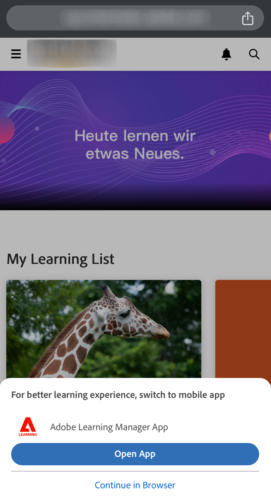
_下載 ALM 應用程式_

## 行動沉浸式體驗中未支援的功能 {#unsupportedfeaturesinmobileimmersiveexperience}

以下工作流程會出現在學習者的經典體驗中：

* 多次嘗試
* 彈性黑膠唱片
* 檔案上傳情境
* 提供第一語言回饋

其他不支援的應用程式功能包括：

* 社交應用程式：學習者點擊首頁的社交小工具時，會被導向經典體驗
* 設定檔設定/編輯設定檔
* 查看徽章/技能
* 排行榜：若學習者點擊首頁的排行榜小工具，將被導向至經典體驗
* 下載工作輔助工具。
* 搜尋中的篩選選項。

社交學習現在支援行動沉浸式網路體驗。

有些功能不支援行動沉浸式應用程式。 這些包括：

| **面積** | **不支援** |
|---|---|
| 董事會 | 看板建立、看板編輯、複製網址、刪除、舉報、排序、篩選 |
| 後續 | 投票類型 貼文建立、編輯、多重附件、複製網址、釘選至頂端 |
| 留言/回覆 | 編輯，標記為正確答案，並在留言或回覆中上傳圖片/影片/音訊 |
| 媒體 | 錄音;僅上傳音訊檔案 |
| 其他 | 通知、貼文檢視、社群排行榜、我追蹤的人、使用者個人檔案 |

## 讓學習者能夠下載 Job Aid（工作援助） {#download-job-aid}

在行動沉浸模式中，學習者可以下載工作輔助工具。 點選 **設定** ，然後點選 **目錄**。 從出現的清單中下載一份工作輔助工具。

| 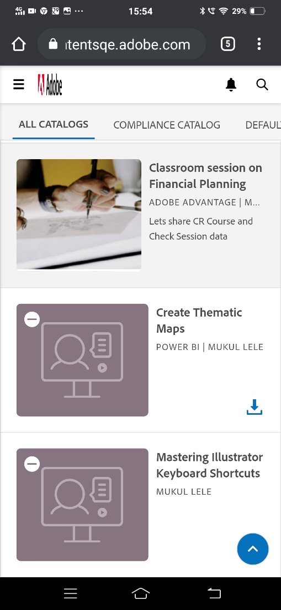 |
|---|

*下載工作輔助工具*

## 讓學習者能夠下載學習者成績單 {#download-learner-transcript}

在行動沉浸模式中，學習者可以下載學習者成績單。

| 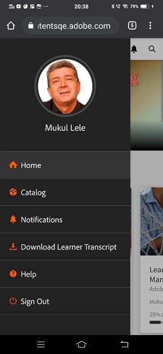 | 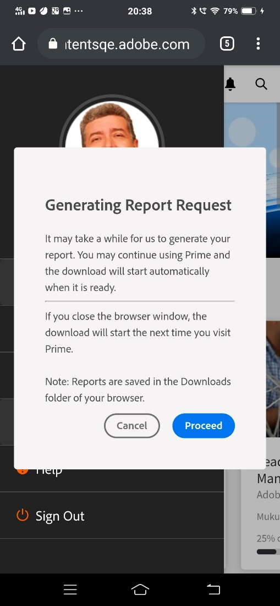 |
|---|---|

*下載學習者成績單*

## 查看徽章與技能 {#viewbadgesandskills}

**查看徽章、技能與遊戲化點數**

預設畫面會顯示你最近獲得的徽章、技能和遊戲化點數，就在你的個人資料下方。 如果你使用手機，最近獲得的徽章會顯示出來。 向右滑動以查看更多資訊。

**我尚未完成的學習**

預設畫面會顯示你所選修的課程。 甜甜圈圖表顯示逾期學習進度、接近截止日期的學習進度，以及進度上的學習進度。

點擊課程可查看課程詳情及完成日期（如適用）。 您可以從此畫面繼續或重訪課程，視完成狀態而定。

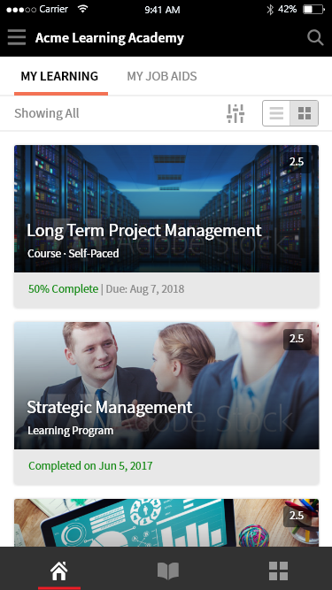

*查看待進行中的學習*

**觀看目錄**

點擊螢幕底部書籍圖示旁邊的圖示。 你可以立即查看目錄中所有相關的學習物件。 你可以選擇以格狀配置查看，或選擇詳細視圖。 選擇推薦，即可根據您的學習經歷查看課程推薦。

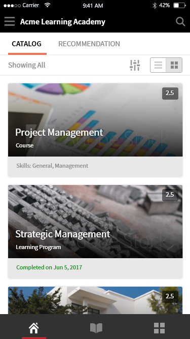

*查看課程推薦*

## 排序與篩選學習物件 {#sortandfilterlearningobjects}

**排序與篩選**

點擊課程或目錄畫面右上角的排序圖示，可依字母順序（升序或降序）或發佈日期排序學習資料。 你也可以依照類型、完成狀態、技能或標籤來篩選學習對象。 點擊並選擇篩選器，然後點選套用以套用篩選器。

**使用搜尋功能**

在手機螢幕右上角，你可以看到一個搜尋圖示。 點擊該圖示即可依課程元資料、獨特ID、技能等搜尋學習對象。

**管理個人檔案、設定與通知**

點擊  螢幕左上角的選單，即可查看個人檔案、通知及帳號設定。

此選單還允許掃描 QR 碼，標記課程出席。

你只需要點擊掃描 **QR 碼** 選項，然後掃描該密碼即可。

**離線課程的學習**

當你在線上時閱讀已下載的課程，學習管理員會直接存取已下載的課程，而不是進行伺服器呼叫。

## 掃描 QR 碼報名 {#qrcode}

你可以掃描 QR 碼報名課程。 學習管理員產生 QR 碼後，你可以從應用程式掃描該 QR 碼，註冊課程。

1. 要掃描 QR 碼，請點擊  螢幕左上角。
1. 點擊 **掃描 QR 碼**。

掃描 QR 功能允許學習者根據學習管理員產生的 QR 碼執行以下提及的動作之一：

* **註冊：** 這讓學習者透過掃描 QR 碼註冊課程。
* **完成：** 這讓學習者透過掃描 QR 碼來標記課程已完成。
* **註冊與完成：** 這讓學習者能同時掃描 QR 碼註冊並標記完成。
* **標記出席：** 這讓學習者透過掃描 QR 碼來標記特定課程的出席。

## 重新命名學習物件 {#renaminglearningobjects}

管理員可以重新命名學習物件的術語。 如需重新命名，請參見 [「重新命名學習物件](../../administrators/feature-summary/settings.md#main-pars_header_1570157145)」。

## 社會學習 {#socialmobile}

本次更新中，以下功能不予支援。 你不能：

* 建立或跟隨一個板子。
* 複製一個網址到貼文上。
* 新增貼文為限時動態，或將貼文加為最愛，或置圖到頂端。
* 查看社群排行榜。

Social Learning 是 Learning Manager 行動應用程式中的一個平台，讓使用者在非正式環境中分享想法與有意義的見解。 這是一種補充傳統學習理念的方法論。

社交學習讓使用者能運用周遭專業知識，獲得正確且簡潔的資訊。 學習者能迅速運用這些資訊完成任務並達成目標。

透過行動應用程式，使用者可以透過分享內容彼此互動，並獲得對分享內容的驗證。

在這個平台上，可分享的內容類型包括影片、音訊、截圖、文字、提問和投票。 使用者也可以與同儕分享線上學習成果。

此功能僅在管理員啟用 **社交學習** 後，裝置應用程式才能使用。

## 在應用程式上啟動社交學習 {#launchsociallearningontheapp}

啟動應用程式後，點擊 **社群** 圖示。

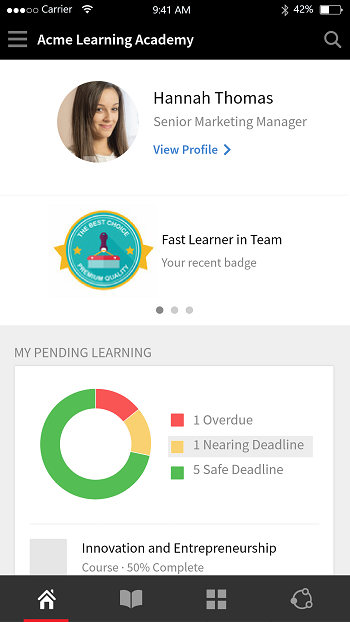

*查看社會學習*

## 在論壇中發表文章 {#createapostinaboard}

和其他社交平台一樣，在 Learning Manager 行動應用程式中，你可以在討論區建立貼文，讓所有同看板的學習者都能查看你的貼文、留言，並上傳留言檔案。

要建立貼文，請點擊  。

以下畫面會出現。

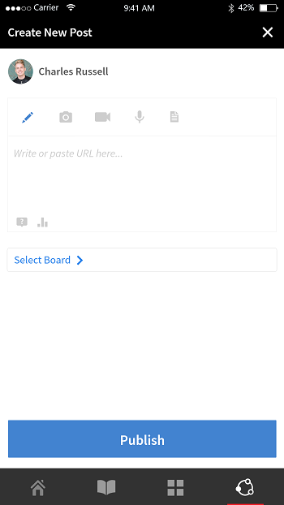

*新增一篇文章*

<table>
 <tbody>
  <tr>
   <td>
    

</td>
   <td>
    
寫一篇文章或貼上任何網址。
</td>
  </tr>
  <tr>
   <td>
    

</td>
   <td>
    
用手機相機拍照，然後和你的貼文一起上傳。
</td>
  </tr>
  <tr>
   <td>
    

</td>
   <td>
    
用手機攝影機錄影。
</td>
  </tr>
  <tr>
   <td>
    
 
</td>
   <td>
    
用手機錄音。
</td>
  </tr>
  <tr>
   <td>
    

</td>
   <td>
    
上傳任何文件或檔案到板子裡。
</td>
  </tr>
  <tr>
   <td>
    
 
</td>
   <td>
    
問個問題。
</td>
  </tr>
  <tr>
   <td>
    
 
</td>
   <td>
    
用你的貼文創建投票。
</td>
  </tr>
 </tbody>
</table>

## 支援內容格式 {#supportedcontentformat}

<table>
 <tbody>
  <tr>
   <td>
    
<strong>內容類型</strong>
</td>
   <td>
    
<strong>延伸</strong>
</td>
  </tr>
  <tr>
   <td>
    
影片
</td>
   <td>
    
WMV、F4V、ASF、3GP、3G2、AV、MOV、H264、M4V、MP4、MPEG、MPG
</td>
  </tr>
  <tr>
   <td>
    
音效
</td>
   <td>
    
MP3、AMR、M4A、WAV、WMA、AAC
</td>
  </tr>
  <tr>
   <td>
    
靜態檔案
</td>
   <td>
    
PDF、ppt、pptx、doc、docx、xls、xlsx
</td>
  </tr>
  <tr>
   <td>
    
圖片
</td>
   <td>
    
jpg、jpeg、png、BMP、GIF
</td>
  </tr>
 </tbody>
</table>

建立文章後，選擇你想上傳文章的板子。 點擊「選擇板」並搜尋所需的板子。

建立文章後，點擊「發佈」並發表你的留言，讓其他學習者查看你的文章。

在行動應用程式中，你無法建立看板。 要建立看板，你必須以學習者身份登入網頁應用程式。 欲了解更多建立看板的資訊，請參閱學習管理工具[&#128279;](/help/migrated/learners/feature-summary/social-learning-web-user.md)中的社會學習。

## 可以在貼文上執行的動作 {#actionsthatcanbeperformedonapost}

* 在貼文下留言，並根據授權在看板上查看貼文。
* 編輯或刪除討論區的留言。
* 根據權限編輯或刪除貼文。
* 如果貼文侵犯隱私或內容不當，請舉報濫用貼文。 一旦貼文被舉報，會通知版主管理員及版主採取後續行動。
* 按讚    或按讚     貼文。
* 按讚   或不按讚  留言。

## 在其他版塊發文 {#createapostinotherboards}

你也可以在其他論壇發文。

點擊 **「所有看板」** ，你可以查看其他學習者在看板上執行的活動。

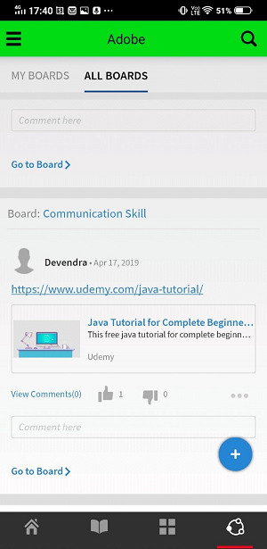

*查看所有董事會活動*

請前往指定的看板並發表你的評論。

## 在看板中分享媒體 {#sharemedia}

<!--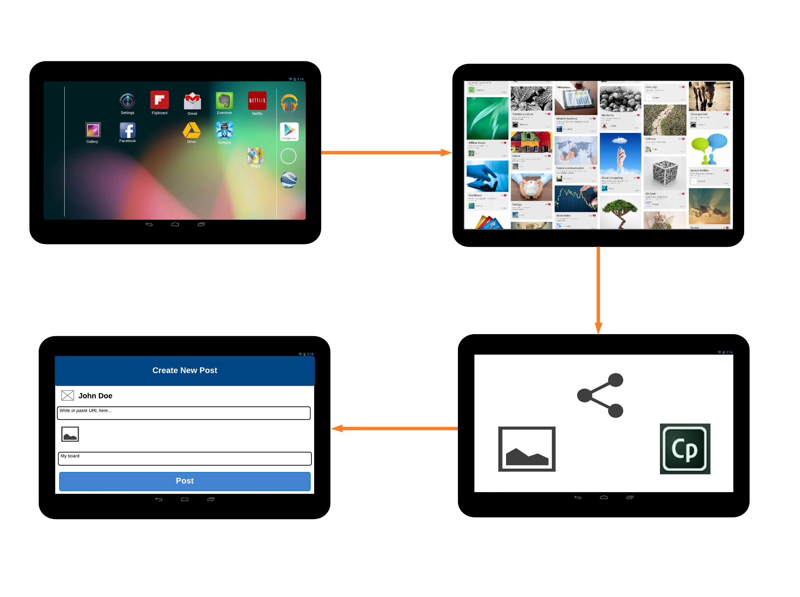-->

將照片、文件、音訊或影片檔案分享給任何版塊，讓其他版主能看到你的貼文並開始互動。 分享任何媒體，

1. 打開你想分享的媒體。
1. 點擊分享按鈕並選擇學習管理員。
1. 選擇你想分享媒體的版面。
1. 敲打 **郵件**。

你也可以從外部應用程式發佈任何內容，例如你可以分享 Reddit 或 Quora 的留言。

## 將資產上傳到外部證書作為完成證明 {#externalcert}

請依照以下步驟操作：

1. 用你的學習者憑證登入裝置應用程式。
1. 搜尋作者所建立的憑證。
1. 從外部證書列表中，選擇所需的證書並註冊該證書。
1. 點擊 **完成** 證明並上傳檔案，例如PDF或圖片。

   | 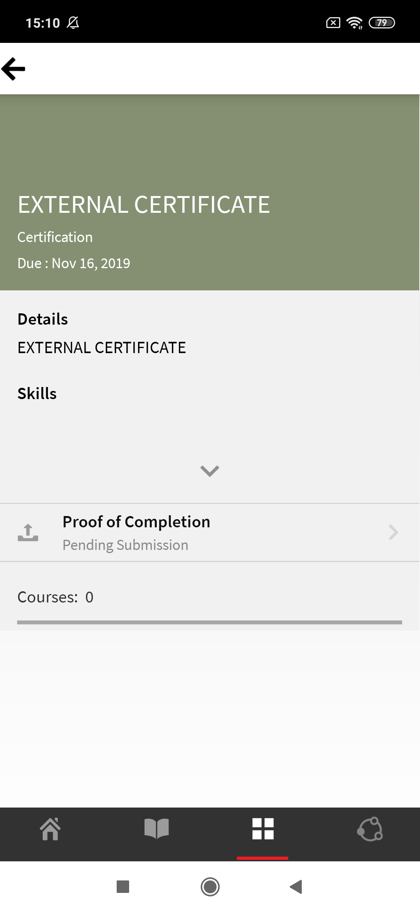 | 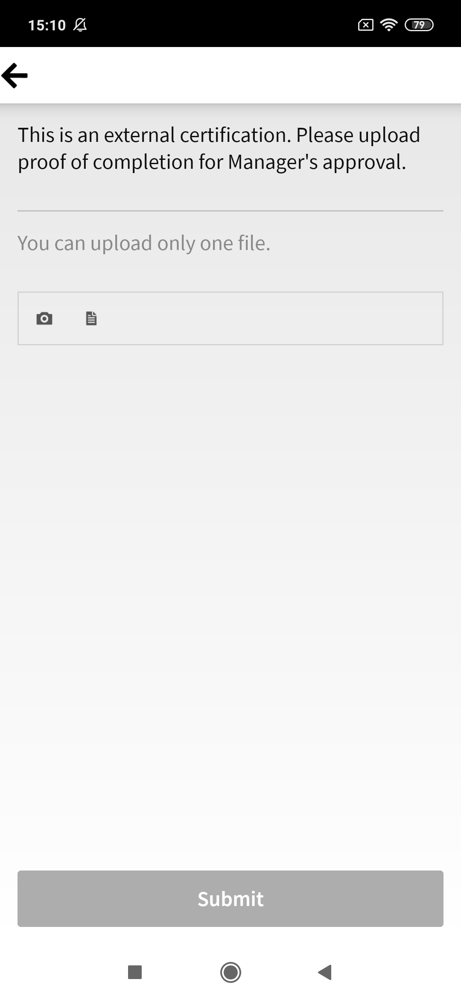 |
   |---|---|

*上傳完成證明*

1. 上傳檔案後，選擇 **「提交**」標籤。 確認訊息會出現。

**上傳檔案**

1. 上傳檔案後，點擊 **「提交**」。

   你只能上傳一個檔案作為完成的證明。 當你嘗試上傳多個檔案時，會出現以下訊息：

   **你所做的改變將會消失。 你想繼續嗎？**

1. 狀態會變成 **「待核准**」，並以橘色顯示。

   你無法在手機應用程式上查看或下載上傳的檔案。

經理批准提交後，狀態會變成 **綠色的已批准**。

若經理拒絕提交，狀態會改為 **紅色顯示的拒絕**。

| 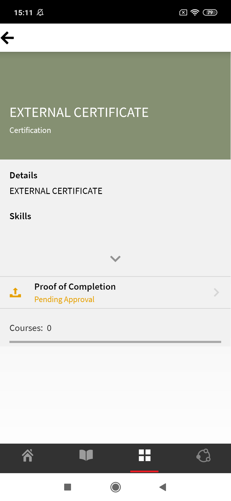 | 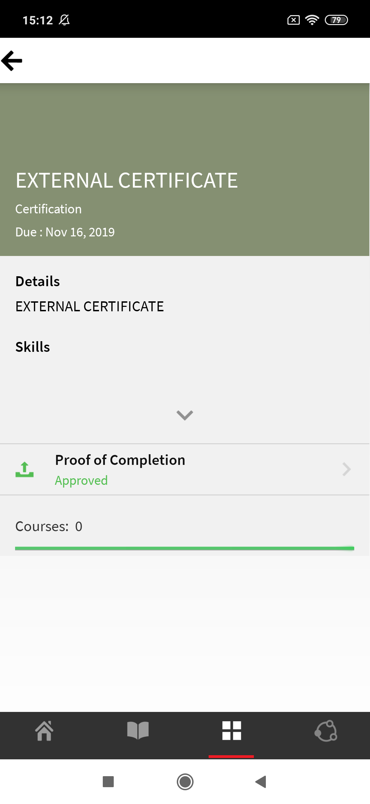 | 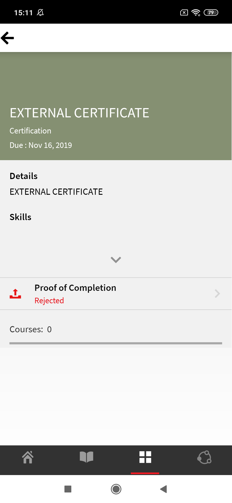 |
|---|---|---|

*查看提交狀態*

被拒絕後，你可以上傳檔案作為完成的證明。

* 只有當檔案狀態為 **待提交且被拒絕**&#x200B;時，才能提交檔案。
* 當狀態為待批准且已 **批准**&#x200B;時，無法提交檔案。

## 從 LinkedIn Learning 修課 {#linkedin}

Learning Manager 已經在學習平台上支援 LinkedIn Learning 課程。 現在，學習者可以在 Learning Manager 行動應用程式中修習這類 LinkedIn Learning 課程。 在裝置應用程式中搜尋課程，然後開始課程。

如果你已經安裝了 LinkedIn 應用程式，課程會在應用程式中開啟，否則課程會從預設瀏覽器開啟，必須用你的 LinkedIn 登入憑證登入。

如果你是透過 LinkedIn 應用程式修課，學習管理員不會追蹤你的進度。 因此，建議課程在瀏覽器中啟動，而非 LinkedIn Learning 應用程式。

>[!NOTE]
>
>只有你有活躍的網路連線才能修課。

|  | 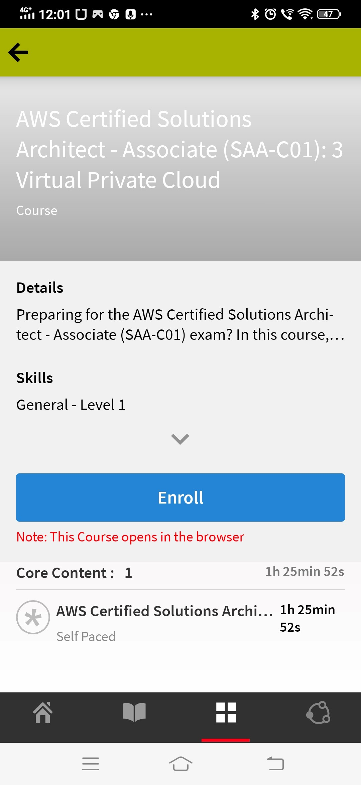 | 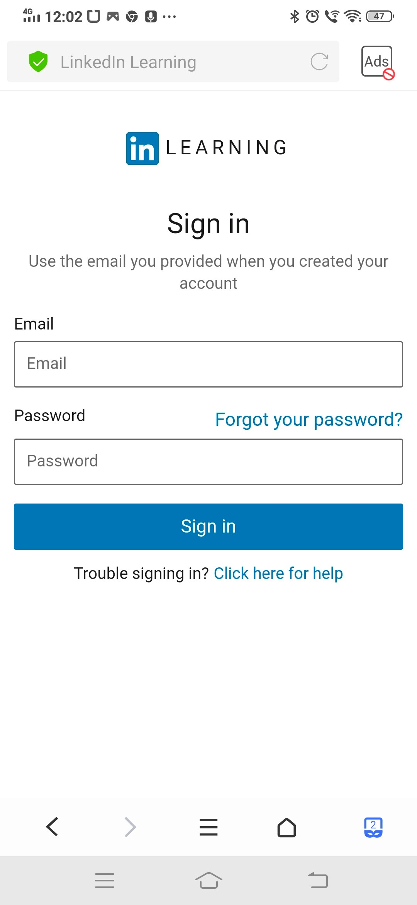 |
|---|---|---|

*在 LinkedIn Learning 註冊課程*

LinkedIn Learning 課程中所花費的學習時間會透過 LinkedIn 內容/平台傳達給學習經理學習平台。

若 LinkedIn Learning 沒有發送學習時間，我們的學習平台無法記錄。 此時，學習管理器顯示的學習時間為零。

## 提交教室及活動模組檔案 {#submitfile}

作為學習者，你可以提交完成課程的檔案給你的講師。 指導老師可根據檔案內容批准或拒絕你的申請。

作者只能為學習者建立課堂和活動模組，讓學習者在行動應用程式中閱讀。

學習者開始課程後，可以在螢幕上看到檔案 **提交** 狀態及上傳檔案連結，如下方截圖所示。

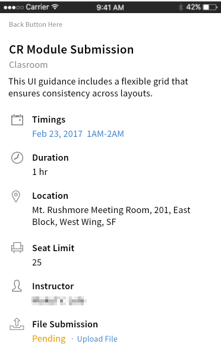

*檔案提交狀態*

要上傳檔案，請點擊 **「上傳檔案**」。

上傳任意檔案並點擊 **提交** 按鈕。

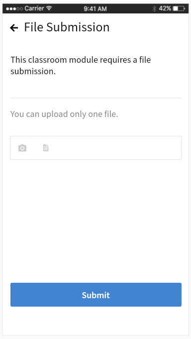 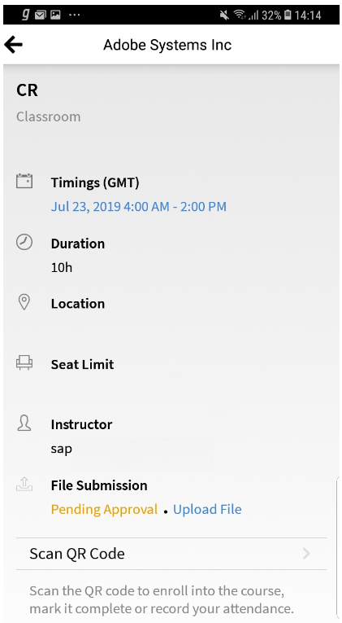

*提交檔案*

## 支援上傳檔案類型 {#supportedfiletypesforupload}

<table>
 <tbody>
  <tr>
   <td>
    
<b>內容類型</b>
</td>
   <td>
    
<b>延伸</b>
</td>
  </tr>
  <tr>
   <td>
    
影片
</td>
   <td>
    
WMV、F4V、ASF、3GP、3G2、AV、MOV、H264、M4V、MP4、MPEG、MPG
</td>
  </tr>
  <tr>
   <td>
    
音效
</td>
   <td>
    
MP3、AMR、M4A、WAV、WMA、AAC
</td>
  </tr>
  <tr>
   <td>
    
靜態檔案
</td>
   <td>
    
PDF、ppt、pptx、doc、docx、xls、xlsx
</td>
  </tr>
  <tr>
   <td>
    
圖片
</td>
   <td>
    
jpg、jpeg、png、BMP、GIF
</td>
  </tr>
 </tbody>
</table>

## 提交的批准或拒絕 {#approvalorrejectionofsubmission}

上傳檔案後，狀態會變成&#x200B;**待審核......**&#x200B;講師會查看待提交[&#128279;](/help/migrated/instructors/feature-summary/learners.md)清單，並透過講師網頁應用程式批准或拒絕提交。

當講師核准提交時，學習者行動應用程式的狀態會變 **為「已**&#x200B;批准」。

<!--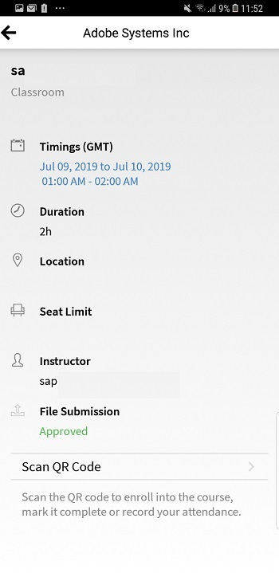-->

當教師拒絕提交時，學習者行動應用程式的狀態會變 **為「拒絕**」。

<!--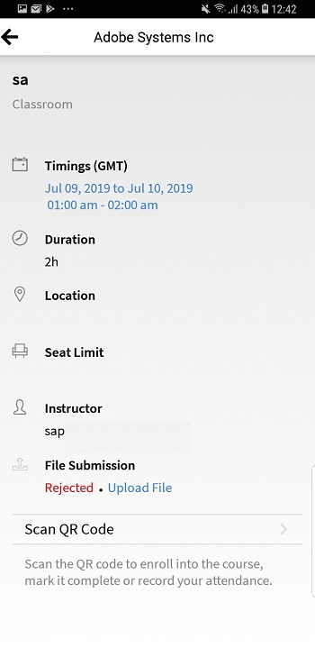-->

要重新提交檔案，請點擊「上傳檔案&#x200B;**」連結**。

## iPad 與平板電腦學習管理器 {#captivateforipadandtablets}

在 iPad 或 Android 平板的 Learning Manager 應用程式中，當你以學習者身份登入後，可以看到以下 **的主** 畫面：

<!---->

要進入學習與目錄功能，請點選 **單** 下拉選單並選擇相應選項。

<!---->

你可以選擇以清單視圖查看課程集合，而不是磁貼或卡片視圖。

## 離線存取應用程式 {#accesstheappoffline}

你可以在 iPad 和 Android 平板上離線使用 Learning Manager 應用程式。 你可以下載課程和學習程式。 修課、離線使用學習程式，並在連接網路時將內容與線上應用程式同步。

1. 點選 **最上方的選單** 下拉選單，然後點選 **學習** 選項。 所有可用球場的清單以圖塊形式顯示。
1. 點擊每個學習物件圖塊底部的下載圖示，即可下載學習內容。

   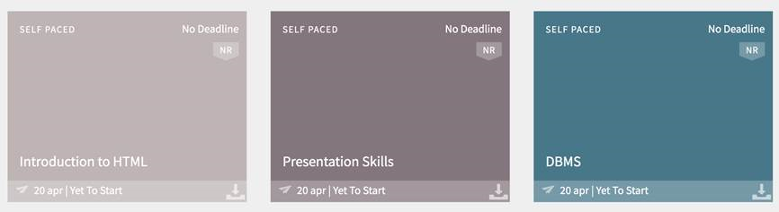

   *下載內容*

   應用程式頂端的欄會顯示裝置的網路狀態。

   * 紅色條表示該裝置無法使用網路。
   * 綠色條表示網路已恢復連線。

使用者可點擊 **綠色欄上的「查看線上內容** 」按鈕，切換回線上模式。 使用者切換到線上模式時，裝置內的內容會同步。

## 行動沉浸式購物車支援

學習者現在可以將多門課程、學習路徑或證照加入購物車，並一併購買。 在 ALM 中查看 [多項目購物車](/help/migrated/learners/feature-summary/multi-item-cart.md)

<!--
## Track device storage {#trackdevicestorage}

You can monitor your device storage periodically.

Tap the profile icon at the upper-right corner of the app and tap **Device Storage** menu option.

An app storage information dialog appears as shown below.

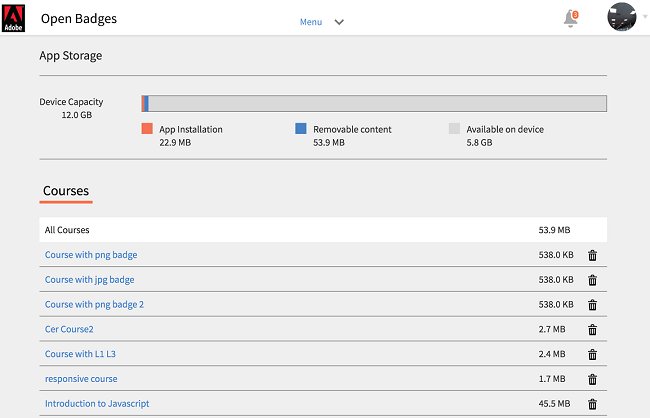

Using the app storage information, you can check the total space of device, app and the downloaded courses. This information enables you to download courses accordingly. To delete the downloaded courses in the device, tap delete icon adjacent to each course name.
-->
