# 學習者首頁

## 概觀 {#overview}

管理員啟用沈浸式版面配置後，系統會在使用者登入應用程式時，以完全改版的使用者介面來歡迎學習者。

>[!NOTE]
>
>IE11瀏覽器不支援沈浸式版面。

## 適用於沈浸式版面的新學習者UI

>[!IMPORTANT]
>
>我們將分階段推出新的學習者UI。

我們以更時尚和更新的設計重新整理了學習者UI。 新UI旨在跨&#x200B;**[!UICONTROL Learner Home]**、**[!UICONTROL My Learning]**、**[!UICONTROL Catalog]**&#x200B;和&#x200B;**[!UICONTROL Course Overview]**&#x200B;登陸頁面提供一致的使用者體驗。 新的視覺元素遵循目前的設計樣式，讓產品看起來更易於使用且更具吸引力。 此更新包含新的刊頭、側面板和當代Widget。

>[!NOTE]
>
>改版的使用者介面僅適用於沈浸式版面。 行動網頁/應用程式尚不支援這些變更，將在未來版本中更新。

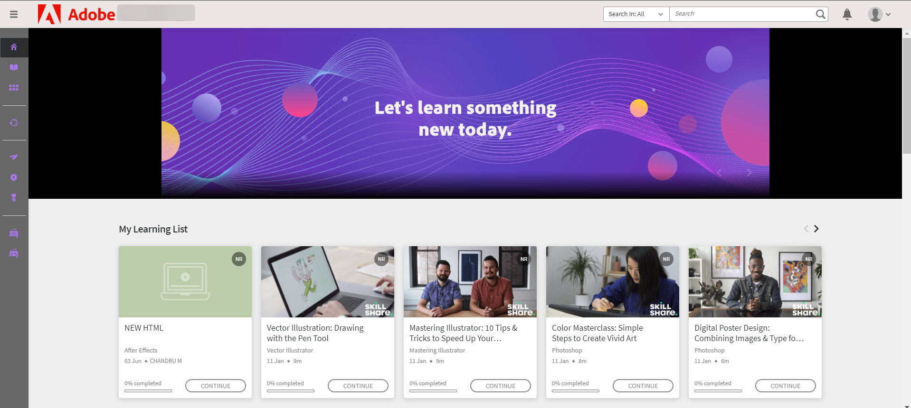
_舊使用者介面_

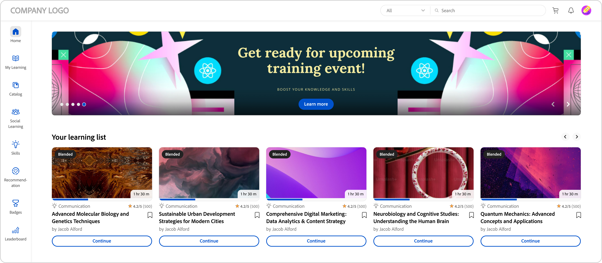
_新使用者介面_

### 首頁

首頁採用全新設計，並改良側面板、頂端標題、增強課程卡和Widget。

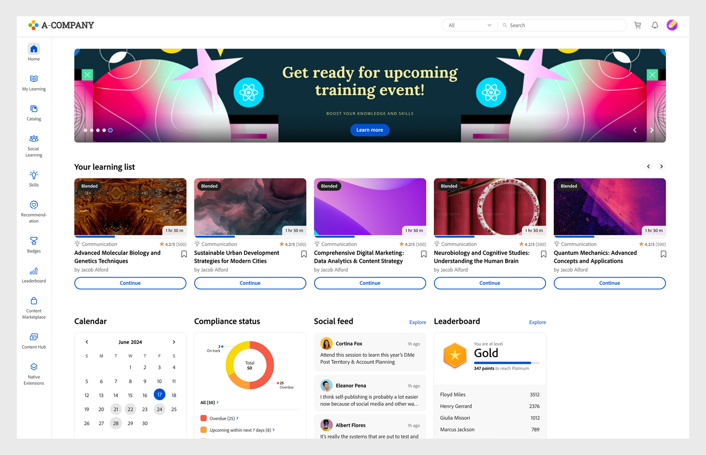
_新首頁_

### 目錄頁面

「目錄」頁面具有新外觀，其中包含已整理的篩選器和增強型課程卡，可提供更佳的使用者體驗。

_目錄頁面_

### 課程總覽頁面

課程總覽頁面具有新外觀，其中包含有關課程的更多詳細資訊。 此頁面可協助學習者取得所有需要的資訊。

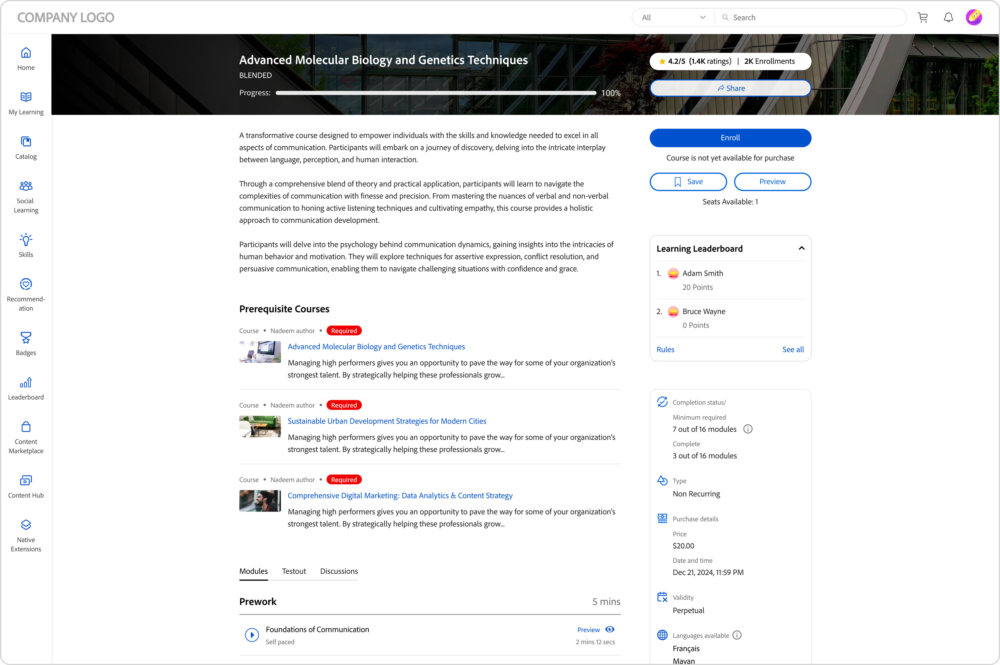
_課程概觀頁面_

### 課程卡

課程卡片也採用重新設計的版面配置，以更有效地顯示詳細資料。 改版課程卡片強調註冊所需的相關中繼資料。 此中繼資料包括正確的發佈或到期日期、評分、說明，以及作者或提供者。

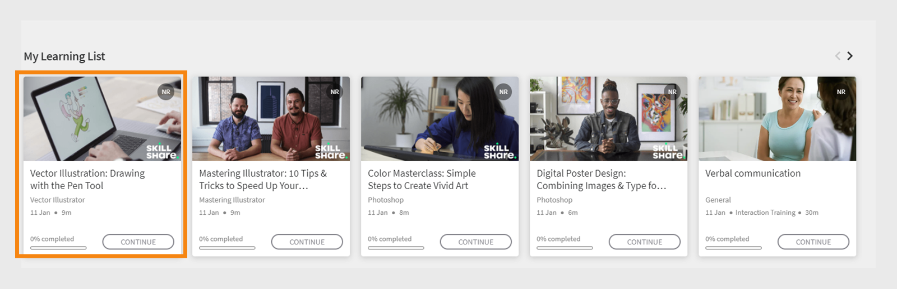
_舊課程卡_

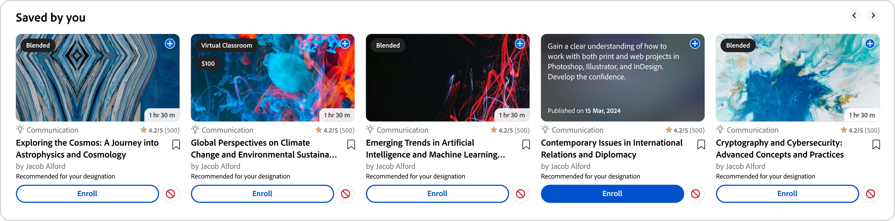
_新課程卡_

對於從&#x200B;**LinkedIn**&#x200B;和&#x200B;**Go1**&#x200B;平台匯入的課程，課程卡會顯示原始出版日期(從&#x200B;**LinkedIn**&#x200B;和&#x200B;**Go1**)。 您也可以在使用者介面中檢視這些特定出版日期。

### 側欄和搜尋列

側邊欄會更新為新的UI元素，以便外觀更乾淨。 新的搜尋列沒有搜尋按鈕，看起來更乾淨。 學習者可以輸入關鍵字，然後按Enter鍵以開始搜尋，或選取搜尋列下方的結果。

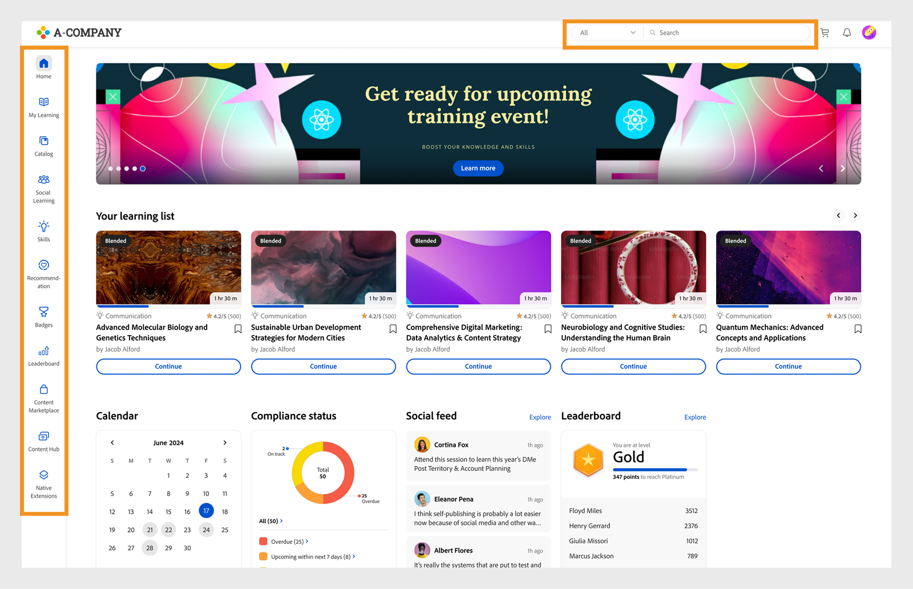
_側欄和搜尋列_

### 刊頭 {#masthead}

提供內嵌URL的視訊或影像輪播。 [管理員可以上傳任何影像或視訊](../../administrators/feature-summary/announcements.md#masthead)資產作為刊頭，並為學習者群組設定其可見度。

*檢視刊頭*

### 我的學習清單 {#mylearninglist}

顯示學習者已接受的訓練。 這些培訓會顯示為水準排列的卡片。 您可以按一下右側或左側按鈕來瀏覽課程。

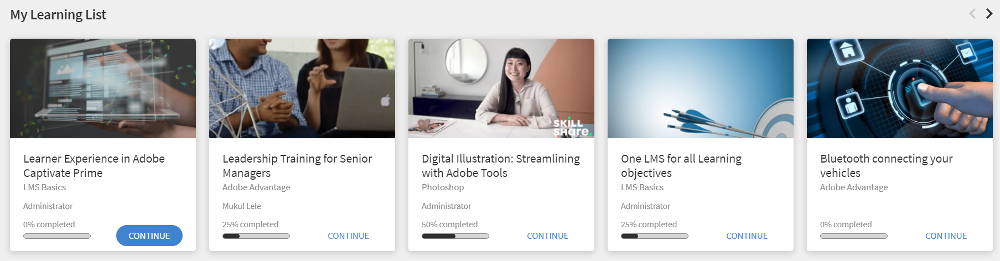

*檢視我的學習清單*

您也可以向左向右滑動，導覽清單。

若要繼續課程，請按一下卡片上的&#x200B;**[!UICONTROL Continue]**，播放器就會啟動。

管理員可透過管理員應用程式啟用/停用每個訓練卡上圖示的外觀（**設定** > **一般** > **啟用訓練卡圖示**）。

**新增至我的學習清單**

如果您將游標停留在&#x200B;**根據您興趣區域推薦的課程卡**&#x200B;和&#x200B;**根據同事活動清單推薦的課程卡**&#x200B;上，您可以看到一個選項以將課程新增到&#x200B;**我的學習清單**。 按一下課程卡上的「**[!UICONTROL +]**」，此課程即會新增至「**我的學習清單**」。

*新增至我的學習清單*

## 選擇技能等級 {#chooseskilllevels}

身為學習者，您可以根據下列層級篩選課程目錄：

* 初學者
* 中級
* 進階

選擇一個選項，您就可以根據選項檢視課程目錄。

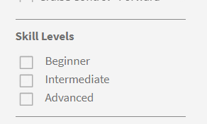

*選取技能等級*

## 合規性儀表板Widget

合規性儀表板Widget可讓學習者使用合規性標籤來篩選截止日期即將到來的課程/學習路徑/認證。 此功能適用於所有學習者應用程式，包括ALM Teams應用程式、AEM、行動應用程式、沈浸式和SF應用程式。

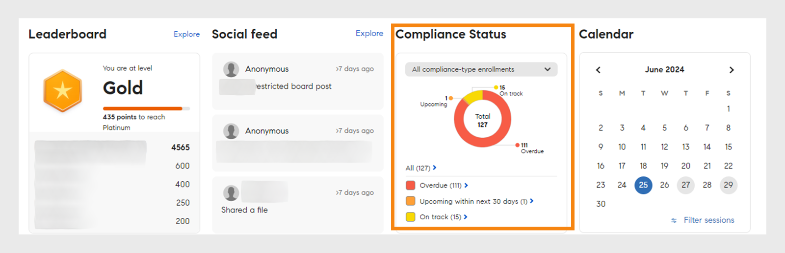
_法規遵循儀表板Widget_

## 行事曆 {#calendar}

顯示已排程的工作階段和訓練。 瀏覽行事曆以檢視後續月份的訓練。

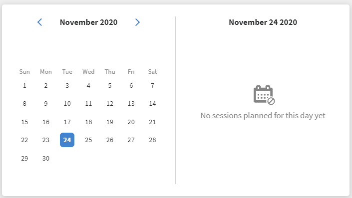

*檢視排程工作階段的行事曆*

行事曆Widget具備下列功能。 您可以檢視：

* 按月訓練。 向左或向右捲動。
* 即將推出的教室或VC訓練課程，可供您註冊。
* 您註冊的近期教室或VC訓練。
* 經理核准的教室或VC訓練。

## 社交摘要 {#socialfeed}

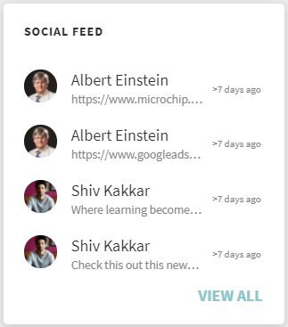

*檢視社交摘要*

檢視其他使用者在談論什麼。

Widget會彙總期間的活動。 它：

* 顯示作用中使用者及其屬於您範圍或群組之使用者的活動。
* 顯示過去兩週的貼文。

## 設定檔技能 {#profileskills}

設定檔技能用於課程推薦。 如果管理員將技能指派給使用者或使用者群組，則該技能會新增到學習者的設定檔技能。 如果學習者將技能新增至其設定檔，則會將技能的所有層級新增至學習者的設定檔技能。 當學習者暫留在技能上時，他/可以看到技能的名稱、新增技能的方法、等級、技能的完成百分比和積分。

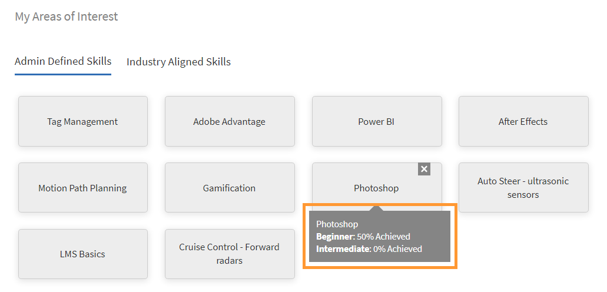
*檢視設定檔技能*

如果學習者註冊了課程，則只有基於分數的外部技能會新增到設定檔技能中。 此外，學習者可以搜尋、選取並將外部技能新增至其設定檔。如果學習者已首次登入學習者應用程式，且已存在學習者技能，則技能會顯示在「我的設定檔」中。

## 根據您感興趣的領域提供建議 {#recommendationbasedonyourareaofinterest}

根據您選擇的興趣區域顯示訓練。 建議由機器學習演演算法驅動。

*檢視建議的課程*

如需更具針對性的建議，您可以按一下&#x200B;**檢視/更新**&#x200B;來更新您的技能。

新增技能後，未來的建議將根據您的偏好設定變得更加鎖定目標和專注。

如果管理員停用&#x200B;**探索技能**&#x200B;選項，您就可以對自己的技能增加興趣。

建議的課程會顯示為卡片。 將滑鼠游標停留在卡片上時，您可以看到課程的更多詳細資料。

也支援產品術語。

**業界公認的技能**

如果管理員在管理員應用程式中啟用了選項&#x200B;**產業一致**，您就能檢視技能的網路圖表。

只有當管理員將培訓型別設定為「業界一致」時，才能檢視這些技能。

在「技能圖」視覺效果中，您可以搜尋技能或技能並新增這些技能。

*技能圖視覺效果*

若要顯示您帳戶中的所有技能，請啟用選項&#x200B;**「顯示我的帳戶中有培訓的技能」**。

新增技能後，您可以看到以所選技能作為主要頂點的力導引圖，以及以較小的頂點作為相關技能的力導引圖。

您選擇的技能也會顯示在&#x200B;**選取的技能**&#x200B;區段中。

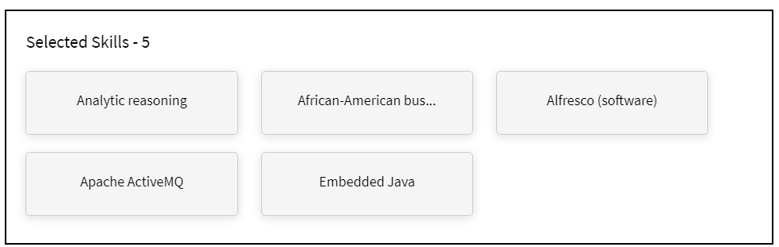

*選取的技能*

若要新增技能，請按一下&#x200B;**[!UICONTROL Add]**。

## 根據同儕節點活動提出的建議 {#recommendationbasedonpeeractivity}

根據您的同事正在參加的活動顯示培訓。 這同樣是由機器學習演演算法所驅動。 這些建議是根據自訂和業界公認學習者的培訓而提供。
