# 學習者首頁

## 概觀 {#overview}

管理員啟用沉浸式版面後，學習者登入應用程式時會看到全新設計的使用者介面。

>[!NOTE]
>
>IE11 瀏覽器不支援沉浸式佈局。

## 沉浸式版面的新學習者介面

>[!IMPORTANT]
>
>我們將分階段釋出新的學習者介面。

我們已更新學習者介面，設計更流暢且更新。 新的使用者介面旨在提供跨越&#x200B;**[!UICONTROL Learner Home]**、、**[!UICONTROL My Learning]****[!UICONTROL Catalog]****[!UICONTROL Course Overview]**&#x200B;及著陸頁的一致使用者體驗。新的視覺元素遵循現有設計風格，使產品看起來更易使用且更具吸引力。 這次更新包括新的桅杆頭、側邊面板和現代化的小工具。

>[!NOTE]
>
>重新設計的使用者介面僅適用於沉浸式版面。 行動網頁/應用程式目前尚未支援這些變更，未來版本會更新。

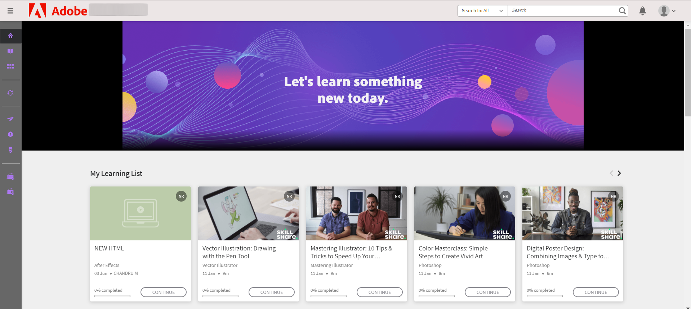
_舊使用者介面_

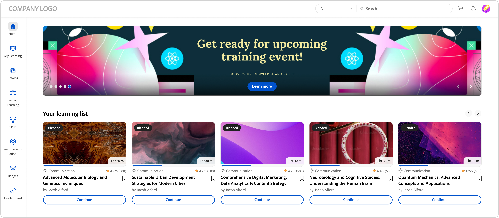
_全新使用者介面_

### 首頁

首頁採用全新設計，側邊面板、頂部頁首、強化課程卡及小工具。

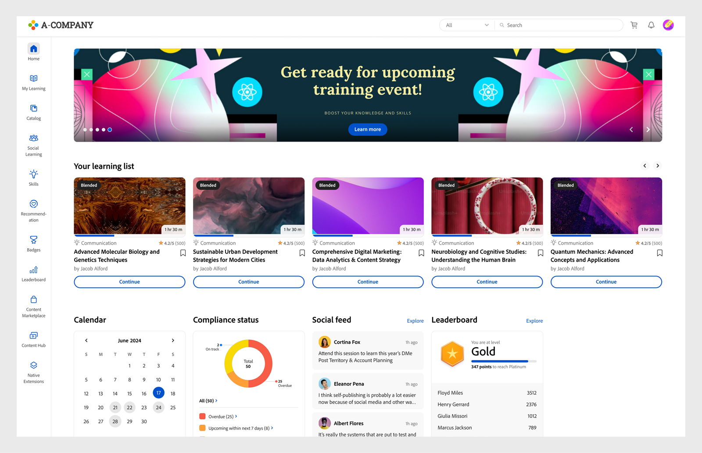
_新首頁_

### 目錄頁面

目錄頁面呈現全新面貌，包含有組織的篩選功能和強化的課程卡片，以提供更佳的使用者體驗。

_目錄頁面_

### 課程總覽頁面

課程總覽頁面有了全新版面，包含更多課程細節。 此頁面幫助學習者獲得所有所需資訊。

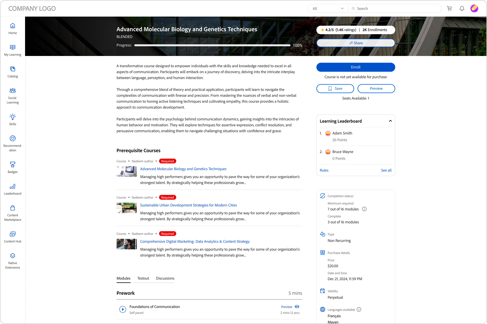
_課程總覽頁面_

### 課程卡

課程卡也重新設計了版面，以更有效地顯示細節。 重新設計的課程卡會強調報名所需的相關元資料。 此元資料包含正確的發表或截止日期、評分及描述，以及作者或提供者。

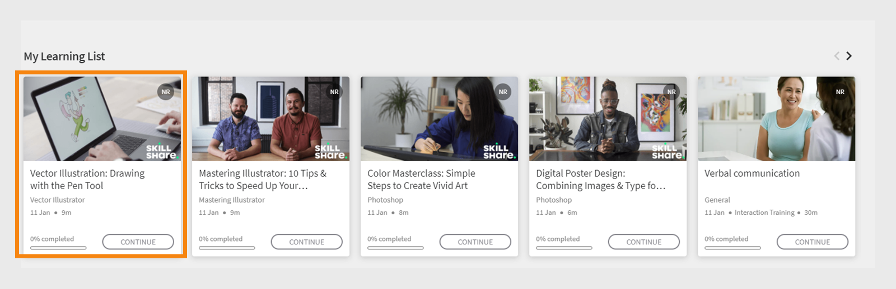
_舊課程卡_

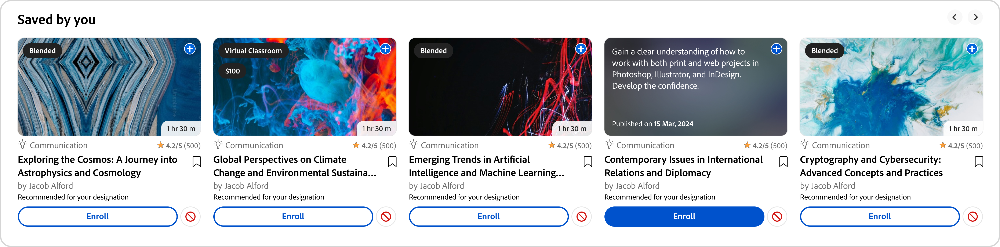
_新課程卡_

對於從 LinkedIn 和 Go1 **平台匯入的課程，課程卡片會顯示 LinkedIn** 和 **Go1** 的原始出版日期&#x200B;**。******&#x200B;您也可以在使用者介面上查看這些特定的出版日期。

### 側邊欄與搜尋欄

側邊欄更新了新的介面元素，讓外觀更乾淨俐落。 新的搜尋欄沒有搜尋按鈕，讓畫面更乾淨俐落。 學習者可輸入關鍵字並按 Enter 開始搜尋，或在搜尋欄下方選擇結果。

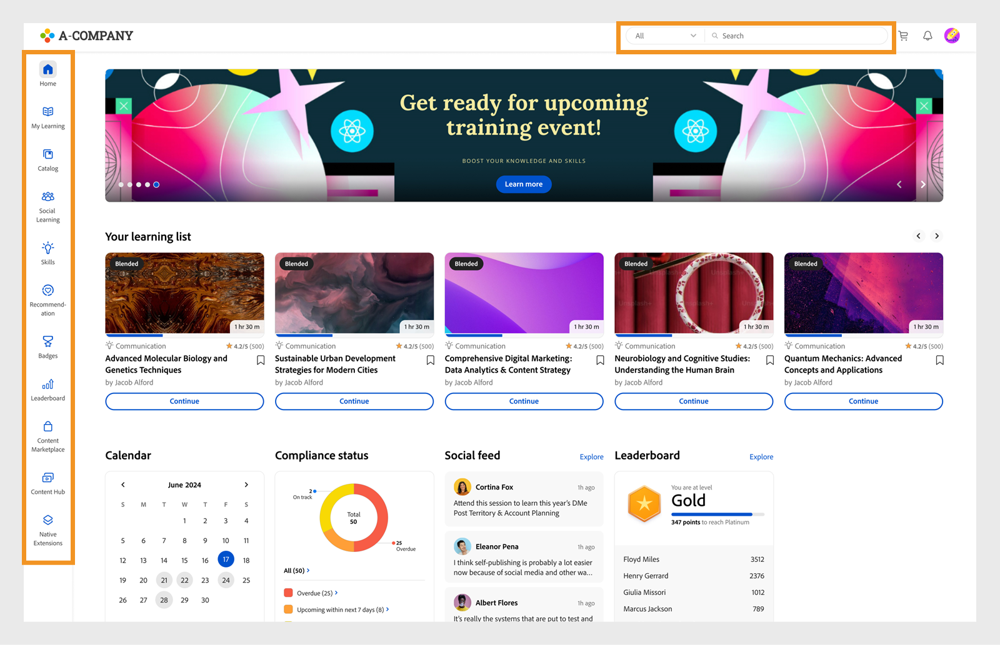
_側邊欄與搜尋欄_

### 報頭 {#masthead}

包含帶有嵌入網址的影片或圖片輪播。 [管理員可以上傳任何圖片或影片](../../administrators/feature-summary/announcements.md#masthead)素材作為主頁，並設定其對一群學習者的可見性。

*查看報頭*

### 我的學習清單 {#mylearninglist}

展示學習者所接受的訓練。 這些訓練以水平排列的卡片形式顯示。 你可以點擊右鍵或左鍵瀏覽課程。

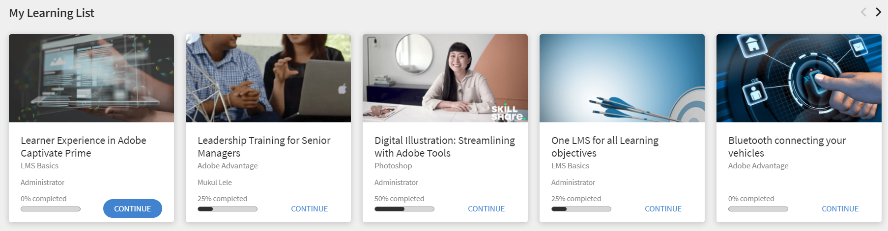

*查看我的學習清單*

你也可以向左或向右滑動來瀏覽清單。

要繼續賽道，點擊 **[!UICONTROL Continue]** 卡片，玩家就會啟動。

每張訓練卡上的圖示顯示由管理員透過管理員應用程式&#x200B;**（設定**> **** 一般 >**啟用訓練卡圖示**）來啟用或停用。

**加入我的學習清單**

如果你在「推薦課程卡片」（根據興趣&#x200B;****&#x200B;領域）和「推薦課程卡片（根據同儕活動清單&#x200B;**推薦）中移動，**&#x200B;可以看到將課程&#x200B;**加入「我的學習清單**」的選項。點擊 **[!UICONTROL +]** 課程卡片，該課程將被加入 **我的學習清單**。

*加入我的學習清單*

## 選擇技能等級 {#chooseskilllevels}

作為學習者，你可以依以下層級篩選課程目錄：

* 初學者
* 中級
* 進階

選擇一個選項後，你就可以根據所選的課程目錄查看。

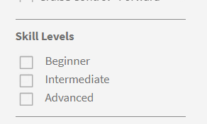

*選擇技能等級*

## 合規儀表板小工具

合規儀表板小工具允許學習者使用合規標籤篩選有截止日期的課程/學習路徑/認證。 此功能適用於所有學習者應用程式，包括 ALM Teams 應用程式、AEM、行動應用程式、沉浸式應用程式及 SF 應用程式。

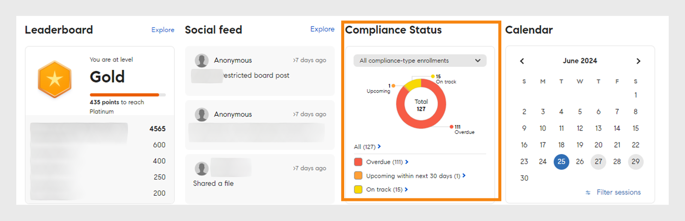
_合規儀表板小工具_

## 賽程表 {#calendar}

顯示你排定的訓練和訓練。 瀏覽行事曆，查看接下來幾個月的訓練安排。

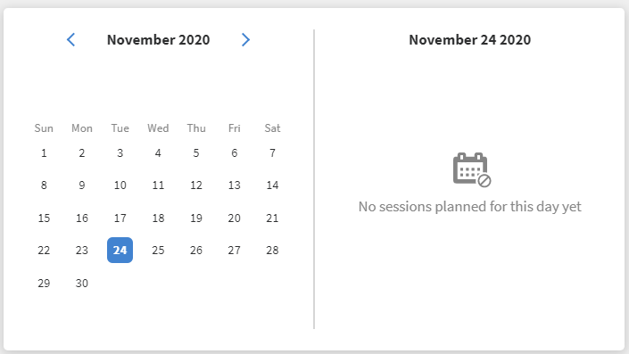

*查看排定課程行事曆*

行事曆小工具具備以下功能。 您可以瀏覽：

* 按月訓練。 往左或向右滑動。
* 即將到來的課堂或VC培訓，供你註冊使用。
* 你即將報名的教室或風險投資培訓。
* 您完成的教室或虛擬課程
* 經經理核准的教室或風險投資培訓。

你可以套用篩選 **[!UICONTROL View enrolled sessions only]** 器，只查看已註冊的課程。

## 社群動態 {#socialfeed}

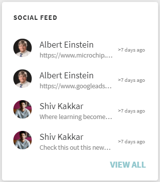

*查看社群動態*

看看其他用戶在討論什麼。

這個小工具會總結一段時間內的活動。 它：

* 顯示活躍用戶及其在你範圍或群組內使用者的活動。
* 展示過去兩週內發表的貼文。

## 側寫技能 {#profileskills}

個人檔案技能用於課程推薦。 若管理員指派技能給使用者或使用者群組，該技能會加入學習者的個人檔案技能中。 如果學習者將某項技能加入其檔案，該技能的所有等級都會被加入其檔案技能中。 當學習者將滑鼠移到某項技能上時，他可以看到該技能名稱、技能的加入方式、等級、完成率以及學分。

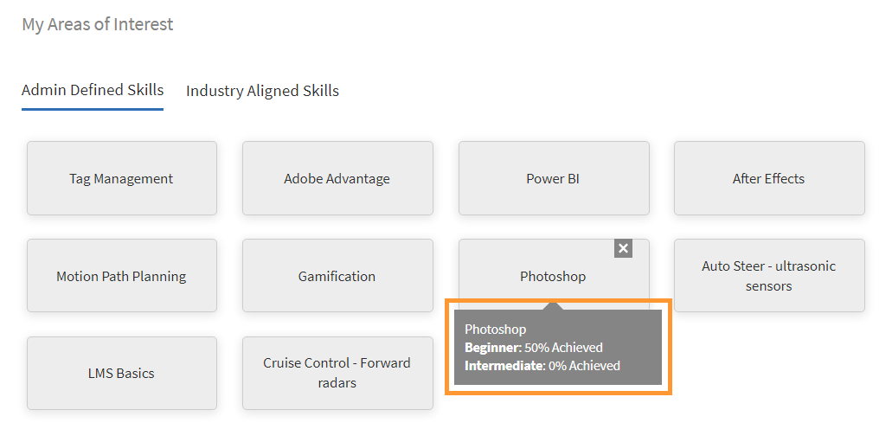
*查看個人檔案技能*

若學習者報名課程，只有基於分數的外部技能會被加入個人檔案技能。 此外，學習者還能搜尋、選擇並新增外部技能到個人檔案中。如果學習者首次登入學習者應用程式，且已具備技能，技能會顯示在我的個人檔案中。

## 根據你的興趣領域推薦 {#recommendationbasedonyourareaofinterest}

展示根據你選擇的興趣領域進行訓練。 這項推薦是由機器學習演算法驅動的。

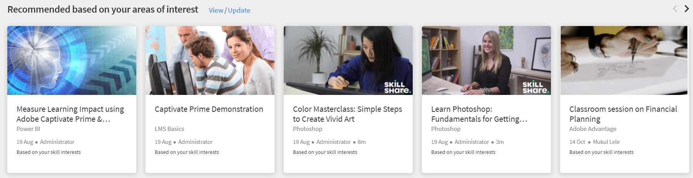

*查看推薦課程*

若想獲得更針對性的推薦，可以點擊 **「檢視/更新**」來更新你的技能。

新增技能後，未來的推薦會根據你的偏好變得更有針對性和重點。

如果管理員關閉 **了探索技能**&#x200B;選項，你就能為你的技能增添趣味。

推薦的球場會以卡片形式顯示。 當你將滑鼠懸停在卡片上時，可以看到更多賽道細節。

同時也支援產品術語。

**產業相關技能**

如果管理員在管理員應用程式中啟用了「產業對齊&#x200B;**」選項**，你就能看到技能的網路圖。

這些技能只有在管理員將訓練類型設為產業對齊時才能查看。

在技能地圖視覺化中，你可以搜尋一個或多個技能，然後加入它們。

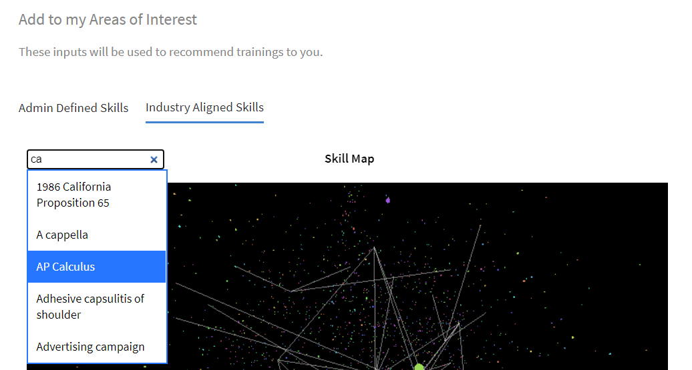

*技能圖視覺化*

如果你想顯示帳號中所有技能，請啟用 **「顯示我帳號**&#x200B;中有哪些訓練的技能」。

新增技能後，你會看到以所選技能為主頂點、相關技能以較小頂點呈現的力導向圖。

你選擇的技能也會顯示在 **「已選技能** 」區塊中。

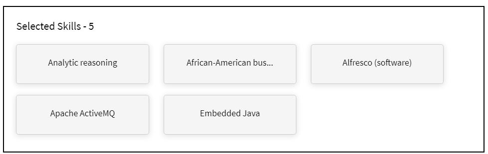

*精選技能*

要新增技能，請點擊 **[!UICONTROL Add]**。

## 基於同儕活動的推薦 {#recommendationbasedonpeeractivity}

根據同儕正在接受的課程來展示訓練內容。 這同樣是由機器學習演算法驅動的。 這些建議基於針對客製化與產業連結學習者的訓練。
