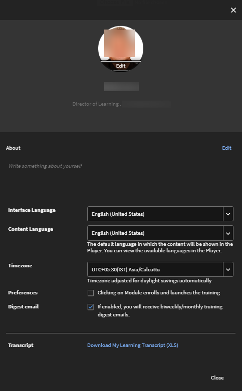
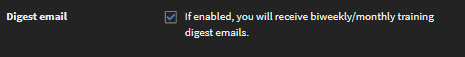
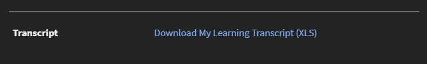

# 設定檔設定

閱讀本文章，瞭解如何設定學習者設定檔設定並新增設定檔像片。 瞭解如何下載設定檔的學習者成績單。

## 設定設定檔設定 {#configuringprofilesettings}

1. 在頁面的右上角，按一下您的設定檔或像片旁邊的下拉箭頭。
1. 選取「設定檔設定」。
1. 從出現的彈出式對話方塊中，您可以執行下列動作：

   * 新增/更新設定檔像片：將游標暫留在像片上。 按一下「上傳並新增像片」。 按一下「編輯」以變更像片。
   * 刪除像片：將游標停留在設定檔像片上。 按一下「刪除」。
   * 按一下下方文字區域以新增「關於我」內容。
   * 按一下欄位旁的「編輯」，修改「關於我」內容。
   * 設定設定檔的地區設定。 從地區設定下拉式清單中選取您選擇的語言。
   * 設定設定檔的目前地區設定。
   * 設定設定檔的時區。
   * 下載含有您資料的學習者成績單。

   
   *檢視學習者偏好設定*

   當您按一下「下載我的學習成績單XLS」連結時，系統就會下載Excel工作表。 此Excel工作表包含您使用的學習物件詳細資訊、每個學習物件的完成狀態、對應的到期日、習得的技能等。 下載此工作表，快速取得學習設定檔的一些整體資料。

1. 如果管理員啟用了摘要電子郵件，而您不在DND清單中，則您可以訂閱或取消訂閱摘要電子郵件。 啟用下列選項。

   
   *訂閱或取消訂閱摘要電子郵件*

   根據管理員您設定的頻率，學習者會每兩週或每月收到一封電子郵件。

## 取消訂閱摘要電子郵件 {#unsubscribefromdigestemails}

當您收到郵件時，可以按一下 **取消訂閱** 電子郵件底部的連結。

在您按一下 **[!UICONTROL Unsubscribe]**，您會重新導向至 **設定檔設定** 頁面，您可以在此停用接收電子郵件的選項。

## 摘要電子郵件的剖析 {#anatomyofadigestemail}

摘要電子郵件包含下列區段：

<table>
 <tbody>
  <tr>
   <td>
    
<b>章節</b>
</td>
   <td>
    
<b>說明</b>
</td>
  </tr>
  <tr>
   <td>
    
個人訓練摘要
</td>
   <td>
    
本節透過提及培訓所花費的分鐘數，將學習者的培訓量度個人化。

    
根據學習者逗留時間，內容會根據下列定義的規則自訂：

    
如果(time_spent) &gt;= 60分鐘，則會出現下列文字：

    
<i>「在過去兩週/一個月內，您已採用 <b>（逗留時間）</b> 幾分鐘的訓練以提升自己的技能。 以下列出可讓您瞭解更多資訊的一些建議。」 </i>

    
 如果（逗留時間）&lt; 60分鐘，則會出現下列文字：

    
<i>「在過去兩週/一個月內，您已採用 <b>（逗留時間）</b> 幾分鐘的訓練以提升自己的技能。 以下列出一些建議，希望您對開始和繼續使用有所幫助。」</i>
</td>
  </tr>
  <tr>
   <td>
    
訓練活動
</td>
   <td>
    
此區段會顯示該帳戶之培訓活動的組織層級摘要。

    
訓練活動摘要包含下列專案： 

    <ul>
     <li>帳戶中可用的培訓數。</li>
     <li>一直積極使用培訓活動的共同學習者人數。</li>
     <li>同事花費的學習時數。</li>
     <li>同事在帳戶中提升技能所花費的平均時間（分鐘）。</li>
    </ul></td>
  </tr>
  <tr>
   <td>
    
建議的課程
</td>
   <td>
    
此為個人化區段，包含對學習者的建議培訓。 在本節中，學習者可以看到推薦引擎挑選的三個培訓。

    
每個訓練都有一個「探索」按鈕，按一下按鈕後，會重新導向至學習者應用程式的首頁。  
</td>
  </tr>
  <tr>
   <td>
    
排行榜
</td>
   <td>
    
顯示長條圖，每個長條代表學習者，以及每個學習者的遊戲化點（僅限管理員已為所有學習者啟用遊戲化時）。

    
排行榜會顯示下列專案：

    <ul>
     <li>學習者獲得的點數。</li>
     <li>達到下一個層級所需的點數。</li>
    </ul>
    
此外還有一個迷你排行榜，顯示該使用者範圍內的領導者，以及兩個最接近該學習者的學習者。

    
如果排行榜空白，此區段不會顯示在電子郵件中。
</td>
  </tr>
  <tr>
   <td>
    
<a>社交貼文</a>
</td>
   <td>
    
此區段顯示最近三個社交貼文。

    
學習者可檢視建立日期、討論區名稱、貼文標題（如有）、使用者名稱和建立者的圖示。 貼文也可以包含視訊、檔案、PDF或任何其他檔案。

    
每個貼文都有連結，可將學習者重新導向至學習者應用程式上的社交學習頁面。

    
如果沒有最近的貼文，則學習者看不到電子郵件上的此區段。
</td>
  </tr>
 </tbody>
</table>

## 常見問題 {#frequentlyaskedquestions}

**1. 如何以學習者身分下載學習者成績單？**

在右上角，按一下 **[!UICONTROL user profile]** > **[!UICONTROL Profile Settings]**. 在出現的對話方塊上，按一下 **下載我的學習成績單(XLS)**.

*下載學習者成績單*
