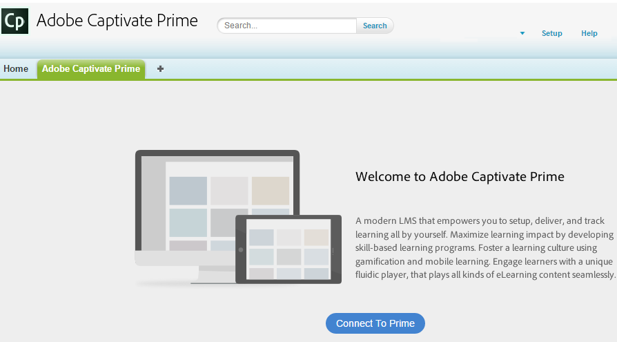
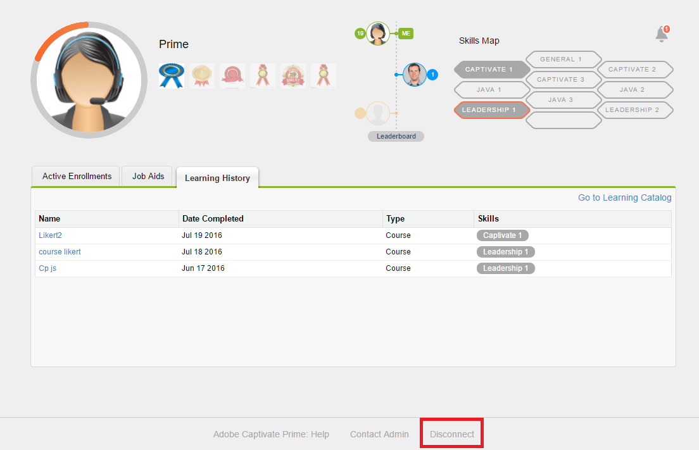

# 適用於Salesforce的Learning Manager應用程式

## 概觀 {#overview}

Salesforce™是銷售和行銷團隊中最受歡迎的CRM解決方案。 在Salesforce中使用Adobe Learning Manager應用程式時，學習者可以從其Salesforce介面存取其所有學習內容。 學習者可以從Salesforce記憶體取其指派的學習內容，例如課程、學習方案及工作輔助。 使用者也可以從管理員接收有關其註冊和公告的通知。

只有當Learning Manager帳戶管理員完成所需的設定活動時，您才能在Salesforce中使用此應用程式。 如需詳細資訊，請參閱[適用於Salesforce的Learning Manager應用程式](../../integration-admin/feature-summary/sfdc-app.md)，並請求您的管理員安裝適用於Salesforce的Learning Manager應用程式。

## 在Salesforce中尋找應用程式 {#locateappinsalesforce}

身為學習者，您可以按一下頁面右角的&#x200B;**應用程式**&#x200B;下拉式清單，然後選取Adobe Learning Manager。

如果您在下拉式清單中找不到應用程式，請聯絡您的Salesforce管理員。

選取應用程式後，您可以切換至Adobe Learning Manager應用程式，如下面的快照所示。

<!---->

## 登入和使用說明 {#loginandusageinstructions}

如上述快照所示，在Adobe Learning Manager中按一下「**[!UICONTROL Connect to Learning Manager]**」，並使用您的Learning Manager帳戶憑證登入。

您可以連線至Learning Manager應用程式，並在Salesforce中使用它。

或者，您也可以使用首頁左側窗格的Adobe Learning Manager通知元件，登入Salesforce中的Learning Manager帳戶。 只有當管理員在Salesforce中設定Adobe Learning Manager Notifications元件時，學習者才能看到此元件。

Adobe Learning Manager應用程式學習者檢視的代表性快照如下所示，以供您參考。

*檢視Adobe Learning Manager應用程式*

## 中斷與應用程式的連線 {#disconnectfromtheapp}

您可以按一下學習者頁面底部的「中斷連線」連結（如上述快照中所標示），以&#x200B;**中斷與Adobe Learning Manager應用程式的連線**。 中斷連線後，系統會將您重新導向至Adobe Learning Manager應用程式的歡迎頁面。

您可以不限次數地連線或中斷與應用程式的連線。
