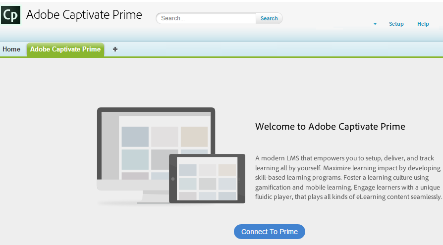
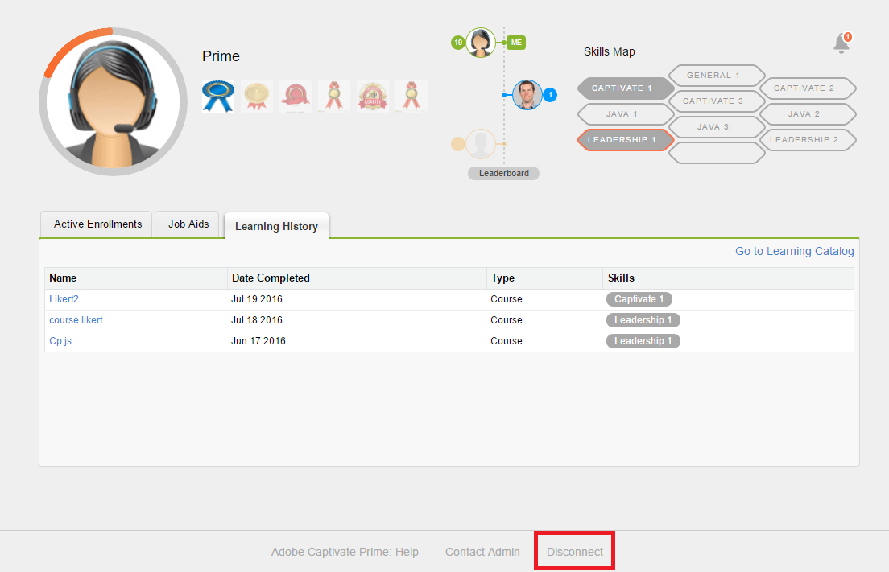

# Salesforce 學習管理應用程式

## 概觀 {#overview}

Salesforce™ 是銷售與行銷團隊中最受歡迎的 CRM 解決方案。 使用 Salesforce 中的 Adobe Learning Manager 應用程式，學習者可以在 Salesforce 介面中存取所有學習內容。 學習者可以在 Salesforce 內存取分配的學習內容，如課程、學習計畫及工作輔助工具。 使用者也能收到管理員提供的註冊通知及公告。

這個應用程式只有在你的 Learning Manager 帳號管理員完成所需的設定活動後，才會在 Salesforce 中開放。 欲了解更多細節，請參閱 [Salesforce](../../integration-admin/feature-summary/sfdc-app.md) 學習管理應用程式，並請求管理員安裝 Salesforce 學習管理應用程式。

## 在 Salesforce 中尋找應用程式 {#locateappinsalesforce}

作為學習者，你可以點擊頁面右角的 **應用程式** 下拉選單，選擇 Adobe 學習管理員。

如果你在下拉選單找不到該應用程式，請聯絡你的 Salesforce 管理員。

選擇應用程式後，你可以切換到下方快照所示的 Adobe Learning Manager 應用程式。

<!---->

## 登入與使用說明 {#loginandusageinstructions}

如上圖所示，點入 **[!UICONTROL Connect to Learning Manager]** Adobe Learning Manager，並以您的 Learning Manager 帳號憑證登入。

你可以連接 Learning Manager 應用程式，並在 Salesforce 內使用它。

或者，你也可以在 Salesforce 的首頁左側窗格中，透過 Adobe Learning Manager 通知元件登入 Learning Manager 帳號。 學習者只有在管理員在 Salesforce 中設定 Adobe Learning Manager 通知元件時，才能看到此元件。

以下展示了 Adobe Learning Manager 應用程式學習者視圖的代表性快照，供您參考。

*Adobe Learning Manager 應用程式的檢視*

## 從應用程式中斷開 {#disconnectfromtheapp}

你可以點擊學習者頁面底部的「斷線連結」，如上方快照所示，從 **Adobe Learning Manager 應用程式中斷開連結** 。 一旦你斷線，就會被導向 Adobe Learning Manager 應用程式的歡迎頁面。

你可以無限次連接或斷開應用程式。

## 在 Salesforce 應用程式中重設建議

學習者可以重置角色與學習偏好，無需離開 Salesforce 或登入原生 Adobe Learning Manager 應用程式。 Adobe Learning Manager 的 Salesforce 應用程式現在包含了一個 **[!UICONTROL Reset Interests]** 按鈕。

要重設 Salesforce 應用程式中的興趣與推薦：

1. 以學習者身份登入 Adobe Learning Manager 的 Salesforce 應用程式。
2. 選擇 **[!UICONTROL Reset Interests]** 底部的選項。

學習者的推薦或興趣將從 Adobe Learning Manager Salesforce 應用程式中重置。
