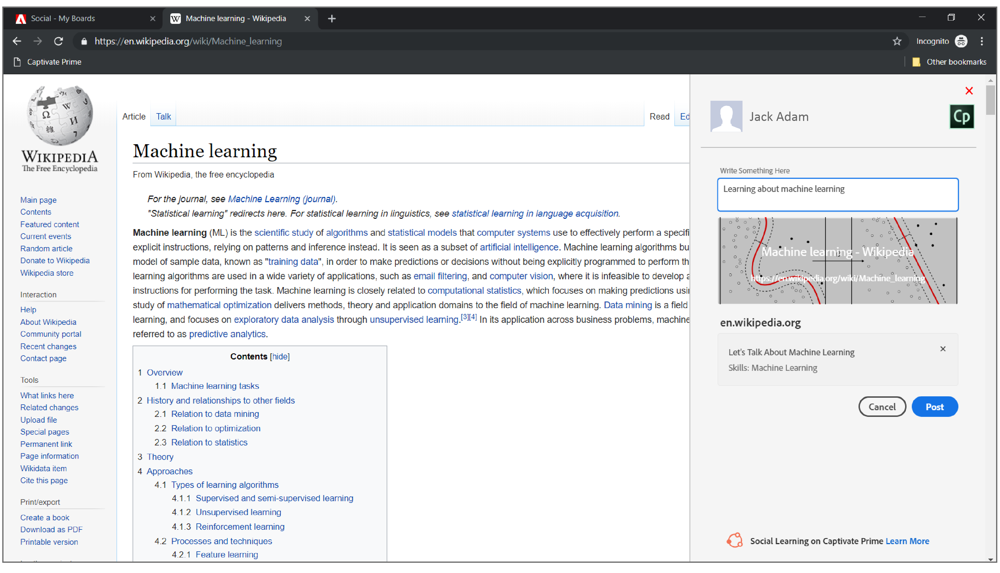
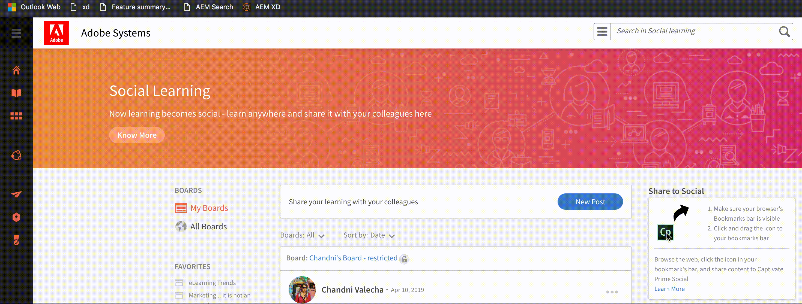

# 分享至社交學習

瞭解如何使用社交書籤小程式，將使用者的線上學習立即分享至社交網路。

「分享至社交學習」是書籤小程式，可讓學習者與其他人分享他們的線上學習，例如網頁和部落格。 此功能僅在桌上型瀏覽器上支援。

從書籤列按一下此書籤小程式，就會根據要共用的瀏覽器，在網頁內或網頁內以快顯視窗開啟。

<!---->

請確定您的瀏覽器允許快顯視窗。

如果您已登入Learning Manager，則書籤小程式會自動登入您的帳戶，否則您必須使用學習管理員憑證登入。

新增貼文的說明，然後選取您要貼文的展示板，並按一下 **[!UICONTROL Post]**. 展示板會張貼在您的控制面板上，您可以按一下加以檢視 **移至貼文**.

## 將分享新增至社交書籤小程式，並新增至書籤列 {#addsharetosocialbookmarklettothebookmarksbar}

**若要將此書籤小程式新增至瀏覽器上的書籤列，請執行下列動作：**

1. 確認瀏覽器中已啟用書籤標籤。
1. 以學習者身分登入Learning Manager。
1. 從左側導覽面板按一下「社交學習」 。 如果看不到，請連絡管理員。
1. 拖曳 **分享到Social** 圖示移至瀏覽器中的書籤列。

   在Mac中的Chrome和Windows上的Microsoft Edge等少數瀏覽器上，拖放無法運作。 如需詳細資訊， [按一下這裡](share-to-social.md#add%20bookmarkl-let%20manually).

   <!---->

## 在不同瀏覽器上啟用書籤列 {#enablingthebookmarksbarondifferentbrowsers}

## 鉻黃 {#chrome}

* 按一下主功能表按鈕，代表瀏覽器視窗右上角的三個點。
* 從下拉式選單中選取設定。 也可以透過輸入以下內容來存取設定畫面 **chrome://settings** 至瀏覽器位址列。
* 找出「外觀」區段，該區段包含一個標示為顯示書籤列並附核取方塊的選項。 若要確保在載入頁面時一律顯示書籤列，請核取此核取方塊，只要按一下即可。 若要停用此功能，只要移除勾號即可。

## Mozilla Firefox {#mozillafirefox}

* 按一下功能表按鈕並選取自訂。
* 按一下畫面底部的「工具列」下拉式功能表，然後選擇「書籤」工具列。
* 按一下「完成」。

## Internet Explorer {#internetexplorer}

* 在瀏覽器右上角的設定圖示上按一下滑鼠右鍵。 或使用 **Alt + C** 在鍵盤上以開啟我的最愛列視窗。
* 若要在瀏覽器上顯示我的最愛列，請按一下 **[!UICONTROL Favorites bar]**.

## Microsoft Edge {#microsoftedge}

* 按一下右上角三個點所代表的主功能表按鈕>「設定>我的最愛列」。
* 若要啟用我的最愛列，請按一下開啟/關閉開關。

## Safari {#safari}

* 按一下「檢視」功能表>「顯示我的最愛列」。 (鍵盤快速鍵： **Command + Shift + B**)

## 如何手動將書籤小程式新增至不同瀏覽器上的書籤列 {#add-bookmark-let-manually}

若要手動將書籤小程式新增至書籤列，請在 **分享到Social** 圖示> **複製連結地址**，並遵循下列程式：

## Mac作業系統中的Chrome {#chromeinmacos}

1. 從瀏覽器按一下摺疊的功能表圖示>  **書籤** > **書籤管理員。**
1. 按一下「書籤」功能表選項> **新增書籤。**
1. 快顯對話方塊中出現兩個輸入欄位。 輸入您所選書籤的名稱，例如 **分享到Social** 在第一個欄位中。
1. 貼上 **分享至社交** 連結位址（在第二個欄位中）。

## Windows中的Microsoft Edge {#microsoftedgeinwindows}

1. 確定您的最愛列是可見的。 在我的最愛列上按一下滑鼠右鍵> **建立新資料夾**.
1. 若要將URL新增至您喜歡的我的最愛列資料夾，請按一下 **書籤中心** 圖示> **書籤圖示**.
1. 將任何線上頁面儲存至資料夾，並將其重新命名為「分享至社交」。
1. 選取書籤中心圖示>分享到社交>編輯URL。
1. 貼上連結位址，然後按一下輸入按鈕。
