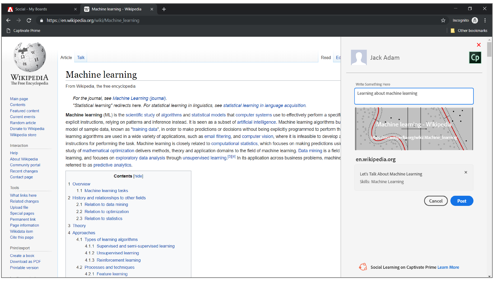
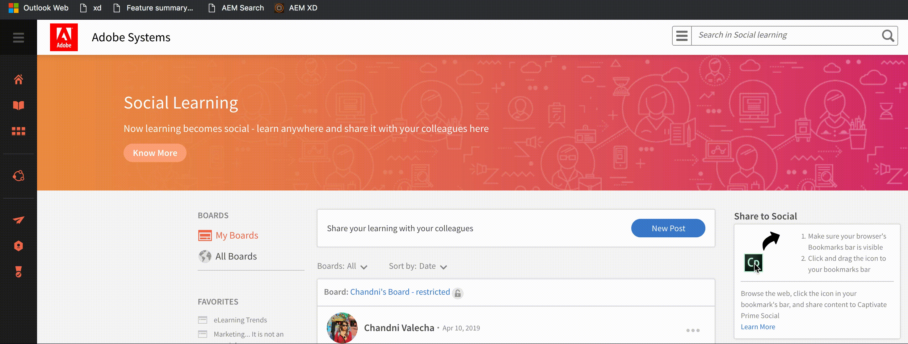

# 分享給社會學習

學習如何使用 Social 書標，將用戶的線上學習即時分享到社群網路上。

Share to Social Learning 是一個書籤小工具，讓學習者能與同儕分享他們的線上學習，如網頁和部落格。 此功能僅支援桌面瀏覽器。

從書籤列點擊此書籤小組後，它會以彈出視窗的形式開啟，內容會依據要分享的瀏覽器，與網頁內或一同開啟。

<!---->

請確保瀏覽器中允許彈出視窗。

如果你已經登入 Learning Manager，書籤小程式會自動登入你的帳號，否則你必須以學習者的身份使用 Learning Manager 的登入資料。

為你的貼文添加說明，然後選擇你想發文的版塊並點擊 **[!UICONTROL Post]**。 該公告板會張貼在您的儀表板上，點擊 **「前往發佈**」即可查看。

## 在書籤欄中新增分享到社交書籤清單 {#addsharetosocialbookmarklettothebookmarksbar}

**要將此書籤小程式加入瀏覽器的書籤列，請執行以下步驟：**

1. 請確保瀏覽器中的書籤標籤已啟用。
1. 以學習者身份登入學習管理員。
1. 從左側導航面板點擊「社交學習」。 如果看不到，請聯絡你的管理員。
1. 將「分享到社群&#x200B;**」圖示拖**&#x200B;到瀏覽器的書籤欄。

   拖放功能在少數瀏覽器上無法使用，例如Mac的Chrome和Windows的Microsoft Edge。 欲了解更多資訊，請 [點此](share-to-social.md#add%20bookmarkl-let%20manually)。

   <!---->

## 在不同瀏覽器啟用書籤列 {#enablingthebookmarksbarondifferentbrowsers}

## 鉻 {#chrome}

* 點擊瀏覽器視窗右上角的三個點，點擊主選單按鈕。
* 從下拉選單選擇設定。 設定畫面也可以透過在瀏覽器的網址列輸入 **chrome://settings** 來進入。
* 找到「外觀」區塊，裡面有一個標示為「顯示書籤列」並附有勾選框的選項。 為了確保書籤列在載入頁面時總是顯示，請點擊一次勾選方塊。 要停用此功能，只需移除勾選標記即可。

## Mozilla Firefox {#mozillafirefox}

* 點選選單按鈕並選擇自訂。
* 點擊螢幕底部的工具列下拉選單，選擇書籤工具列。
* 點擊完成。

## Internet Explorer {#internetexplorer}

* 從瀏覽器右上角右鍵點擊設定圖示。 或者用 **鍵盤上的 Alt + C** 鍵開啟收藏清單視窗。
* 要讓瀏覽器中的收藏列顯示，請點擊 **[!UICONTROL Favorites bar]**。

## Microsoft Edge {#microsoftedge}

* 點擊從設定>收藏清單>右上角的三個點代表的主選單按鈕。
* 要啟用收藏列，請點擊開關。

## 野生動物園 {#safari}

* 點擊「檢視」選單>「顯示最愛」列。 （鍵盤快捷鍵： **Command + Shift + B**）

## 如何在不同瀏覽器手動將書籤小程式加入書籤列 {#add-bookmark-let-manually}

若要手動將書籤清單加入書籤欄，請右鍵點擊 **「分享到社群** 」圖示> **複製連結地址**，並依照以下步驟操作：

## Mac OS 中的 Chrome {#chromeinmacos}

1. 從瀏覽器點擊摺疊選單圖示>  **書籤** > **書籤管理員。**
1. 點選書籤選單選項> **新增書籤。**
1. 彈出視窗中會出現兩個輸入欄位。 在第一個欄位輸入你喜歡的名字作為書籤，就像 **分享到社群** 媒體一樣。
1. 在第二個欄位將 **分享到社群** 連結地址。

## Windows 中的 Microsoft Edge {#microsoftedgeinwindows}

1. 確保你的收藏欄是可見的。 右鍵點擊收藏夾欄> **建立新資料夾**。
1. 要將網址加入你喜歡的收藏列資料夾，請點擊 **書籤中心** 圖示> **書籤圖示**。
1. 將任何線上頁面儲存到資料夾，並重新命名為「分享到社群」。
1. 選擇書籤中心圖示>分享到社群>編輯網址。
1. 貼上連結地址，然後按下 Enter 鍵。
