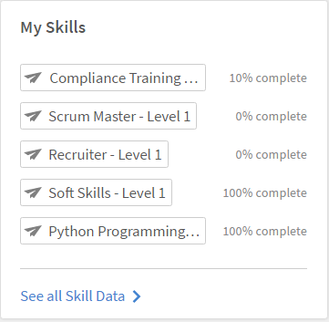
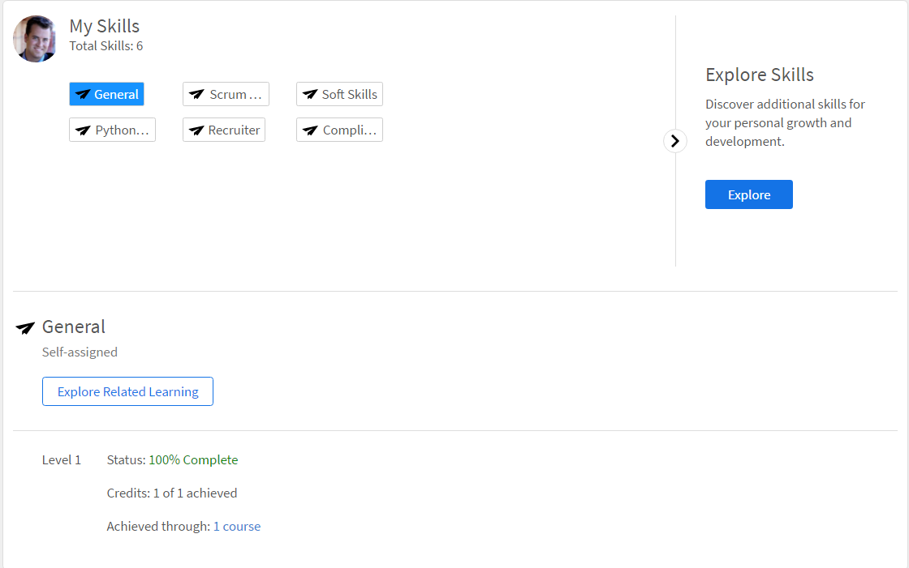

# 技能與等級

閱讀本文章，瞭解如何作為學習者在Learning Manager中習得技能。

技能圖是組織中員工技能組、知識和特徵的分組。 這些技能可協助公司/組織設定或提升員工的績效期望。 技能可讓員工調整其行為以符合組織的期望。

Adobe學習管理員可讓您使用技能Widget，根據學習者的技能組合來對應學習者的績效。 當學習者完成某些課程時，學習者可以按一下學習者首頁上的「技能」，瞭解自己對於每項技能的優勢。

## 檢視技能 {#viewskills}

若要檢視技能，請按一下「學習者」頁面上「技能」介面工具集中的任何技能名稱。 技能與其鄰接的層級一起顯示。

*檢視所有技能*

每項技能的完成百分比可在Widget上該技能旁邊取得。 當您按一下每項技能時，應用程式會帶您前往「技能」頁面，您可以在其中檢視您點按的技能詳細資訊。

「技能」頁面會顯示您點按的技能狀態。 例如，Java。 「技能」頁面顯示狀態 — 例如「進行中」，以及積分 — 例如「已達成10個中的2個」。

在此頁面中，您可以按一下您的各項技能，以檢視對應的資料。

*檢視每項技能*

只有管理員可以建立並指派技能給學習者。 系統會自動為學習者指派與已註冊課程/學習計畫相對應的技能。

## 獲得技能 {#achieveskill}

當學習者完成所指定的課程/學習計畫並擁有所指定的技能積分時，就能習得技能。 學習者也可自行註冊屬於特定技能的課程並完成該課程，藉此掌握技能。
