# Learning Manager中的社交學習

瞭解如何以學習者身分使用社交學習網路

社交學習是Learning Manager中的平台，可讓使用者在非正式環境中分享想法和有意義的見解。 它是對傳統學習觀念的補充。 完成線上課程並不會讓使用者在社交層級與同儕互動。

僅僅參加培訓並不能保證使用者保留所有已教授的內容。 另一方面，社交學習讓使用者能夠運用周圍的專業知識，精確取得所需的資訊。 反過來，使用者可以快速套用該資訊以完成任務並達成目標。

同樣地，Learning Manager社交學習功能可讓使用者透過分享內容並從中學習來彼此互動。

在這個平台上，可以分享的不同內容型別有視訊、音訊、熒幕擷圖、文字、問題和投票。 使用者也可以使用&#x200B;**分享至社交書籤小程式**，與同儕分享他們的線上學習。 如需詳細資訊，請參閱[分享至社交學習](share-to-social.md)。

透過&#x200B;**Adobe Learning Manager案頭應用程式**，內容也可以張貼在展示板內。 如需詳細資訊，請參閱[案頭版Adobe Learning Manager應用程式](../adobe-learning-manager-app-for-desktop.md)。

只有當管理員啟用社交學習時，學習者才能看到該功能。

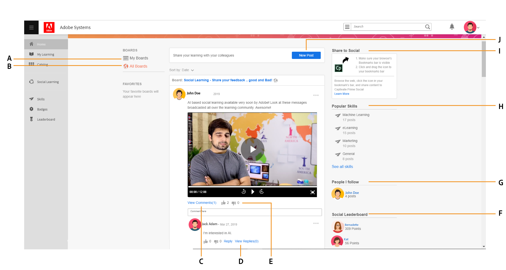 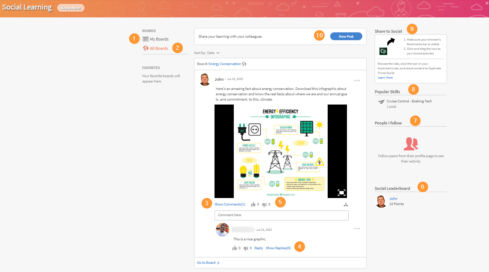

*檢視學習儀表板*

<table>
 <tbody>
  <tr>
   <td>
    
<b>sl. 不適用。</b>
</td>
   <td>
    
<b>術語或概念</b>
</td>
   <td>
    
<b>簡短說明</b>
</td>
  </tr>
  <tr>
   <td>
    
1
</td>
   <td>
    
我的展示板
</td>
   <td>
    
討論區是使用者建立的<code>
      collection
     </code>個帖子。 我的展示板會顯示使用者已參與、建立及追蹤的所有貼文。
</td>
  </tr>
  <tr>
   <td>
    
2
</td>
   <td>
    
所有展示板
</td>
   <td>
    
在「所有面板」頁面中，使用者可以檢視由共用活動範圍的所有學習者建立的面板。
</td>
  </tr>
  <tr>
   <td>
    
3
</td>
   <td>
    
註解
</td>
   <td>
    
使用者可以評論和檢視在面板中建立的貼文。 
</td>
  </tr>
  <tr>
   <td>
    
4
</td>
   <td>
    
回覆
</td>
   <td>
    
使用者可以回覆在展示板內張貼時發表的評論。
</td>
  </tr>
  <tr>
   <td>
    
5
</td>
   <td>
    
贊成票/反對票
</td>
   <td>
    
按一下向上投票和向下投票按鈕來喜歡或不喜歡貼文。
</td>
  </tr>
  <tr>
   <td>
    
6
</td>
   <td>
    
社交排行榜
</td>
   <td>
    
在社交排行榜中，使用者可以檢視學習者名稱以及他們透過參與社交學習獲得的點數。
</td>
  </tr>
  <tr>
   <td>
    
7
</td>
   <td>
    
我關注的人員
</td>
   <td>
    
使用者可在此檢視他們關注的其他學習者名稱以及已建立的貼文數。
</td>
  </tr>
  <tr>
   <td>
    
8
</td>
   <td>
    
熱門技能
</td>
   <td>
    
在「所有面板」區段中，可檢視學習者經常使用的技能，以及他們使用該技能建立的貼文數。
</td>
  </tr>
  <tr>
   <td>
    
9
</td>
   <td>
    
分享至社交
</td>
   <td>
    
「分享到Social」是書籤小程式，可讓使用者直接與Learning Manager Social學習分享他們的線上學習，例如網頁和部落格。
</td>
  </tr>
  <tr>
   <td>
    
10
</td>
   <td>
    
新增貼文
</td>
   <td>
    
「新增貼文」按鈕可讓使用者在展示板上建立和張貼內容。
</td>
  </tr>
 </tbody>
</table>

## 建立內容作為貼文 {#creatingcontentasapost}

內容會建立為展示板內的貼文。 若要建立貼文，請遵循下列步驟：

1. 按一下&#x200B;**[!UICONTROL New Post].**

   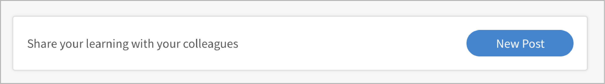
   *選取新貼文*

1. 選取下列任何要張貼的內容型別：文字、問題、視訊、音訊、投票和熒幕擷圖。 現有內容可從使用者系統或Adobe Learning Manager案頭應用程式庫中上傳。

   使用Adobe Learning Manager案頭應用程式來錄製視訊或熒幕、音訊以及熒幕擷圖。 如需詳細資訊，請參閱[Adobe Learning Manager案頭應用程式](../adobe-learning-manager-app-for-desktop.md)。

   <!--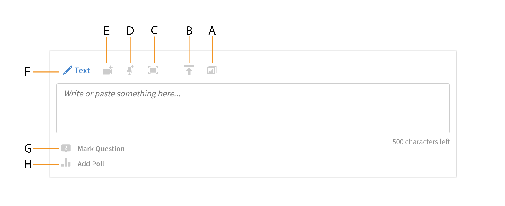-->

1. 搜尋與貼文相關的面板或技能。 如果展示板不存在，請按一下&#x200B;**[!UICONTROL Create a New Board]**。

   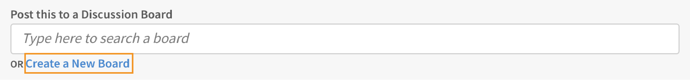

   *建立展示板*

   如果您是外部或內部使用者，而且管理員已授予您建立展示板的存取權，您就可以建立展示板。 如果您沒有建立展示板的許可權，連結&#x200B;**建立新展示板**&#x200B;就不會出現。

1. 從彈出式對話方塊中，填入詳細資訊，選取下列電路板型別：

   * **公用** — 所有使用者都可參與和檢視貼文。
   * **私人** — 只有展示板的建立者、版主和加入展示板的使用者可以看到貼文。
   * **已限制** — 只有展示板擁有者、管理員和展示板版主才能建立貼文。 其他使用者可以透過評論/回覆、向上投票/向下投票等方式參與。

   <!--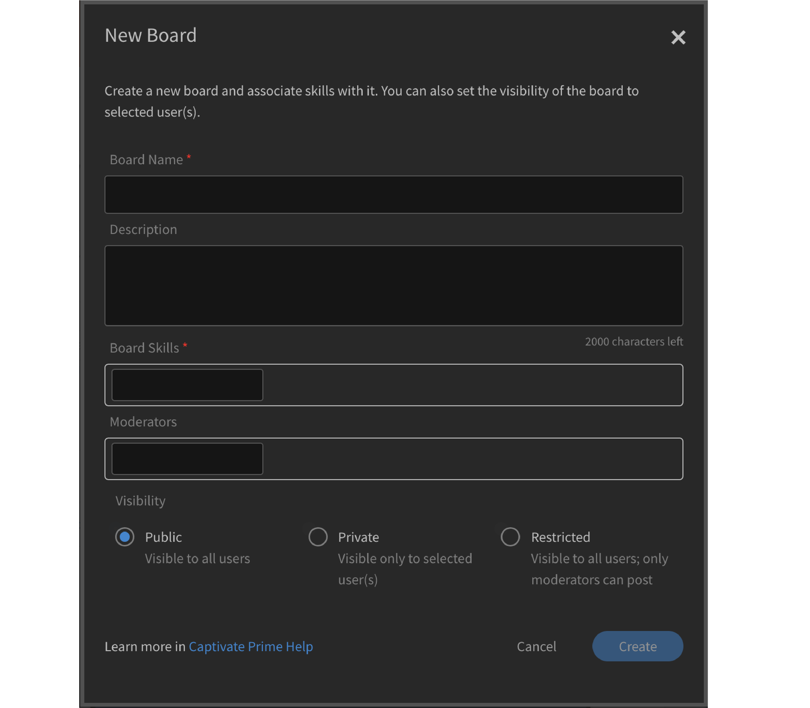-->

   >[!NOTE]
   >
   >在社交學習者應用程式中，只有&#x200B;**管理員**&#x200B;能夠與使用者群組（內部/外部）建立私人討論區。
   >
   >管理員、作者、學習者、經理、講師等任何其他使用者。 **無法**&#x200B;以使用者群組建立私人展示板。 在建立私人展示板時，他們看不到中&#x200B;**使用者群組**&#x200B;的區段。

   僅限管理員 — 當您選擇&#x200B;**私人**&#x200B;時，您會看到兩個選項 — **使用者**&#x200B;和&#x200B;**使用者群組**。 選擇選項&#x200B;**「使用者群組**」，然後新增您想要共用私人展示板的使用者群組。

   在「使用者群組」欄位中，您可以選擇內部、外部或自訂群組。 然後所有指定的使用者群組都能看見您的私人展示板，無論範圍設定為何。

1. 若要共用內容，請按一下&#x200B;**[!UICONTROL Post]**。 按一下「發佈」時，使用者會收到通知。

   內容是根據[討論區版主/主題專家](social-learning-web-user.md#HowtobecomeaSubjectMatterExpertSME)為社交學習內容所設定的組織設定而張貼。

   <!--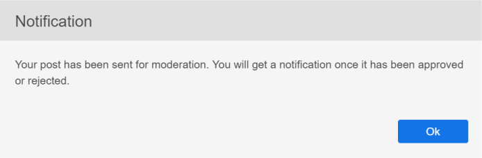-->

1. 如果管理員已將組織設定設為僅手動組織，使用者在核准或拒絕其貼文時會收到通知。 如果貼文被拒絕，請按一下&#x200B;**按一下以檢閱**&#x200B;超連結，以檢閱討論區版主或主題專家(SME)提供的註解。

   使用者建立的內容由版主或主題專家組織。

   <!--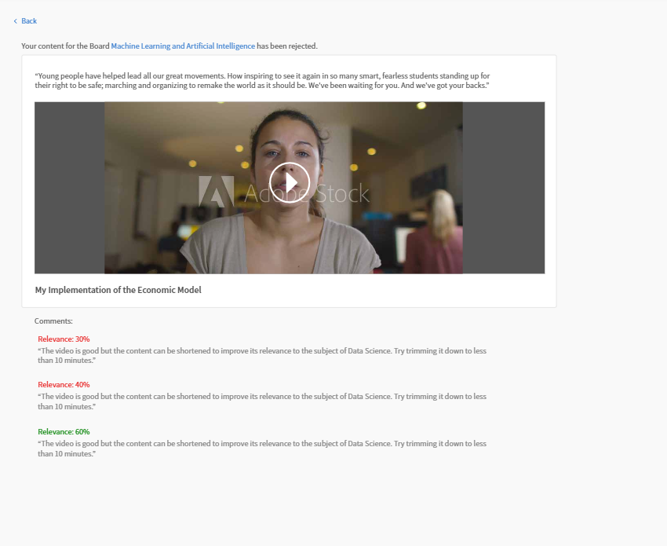-->

在社交學習中建立或回覆貼文時，您可以使用RTF編輯器撰寫貼文，並套用不同型別的格式。

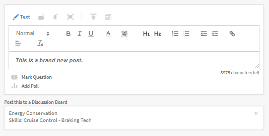

*使用RTF編輯器建立貼文*

此外，建立展示板時，您可以在RTF編輯器中存取相同的選項集。

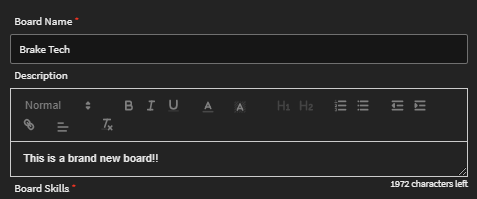

*使用RTF編輯器建立貼文*

## 檢視核准的內容 {#viewingapprovedcontent}

貼文獲得核准後，會顯示在「社交學習」面板中。 使用者現在可以對貼文進行評論、回覆、投贊成票/投反對票。

使用者可以使用以下型別的內容來發表評論：錄製熒幕、網路攝影機或兩者、錄製音訊、擷取熒幕擷圖、上傳檔案、Learning Manager收藏館。

<!--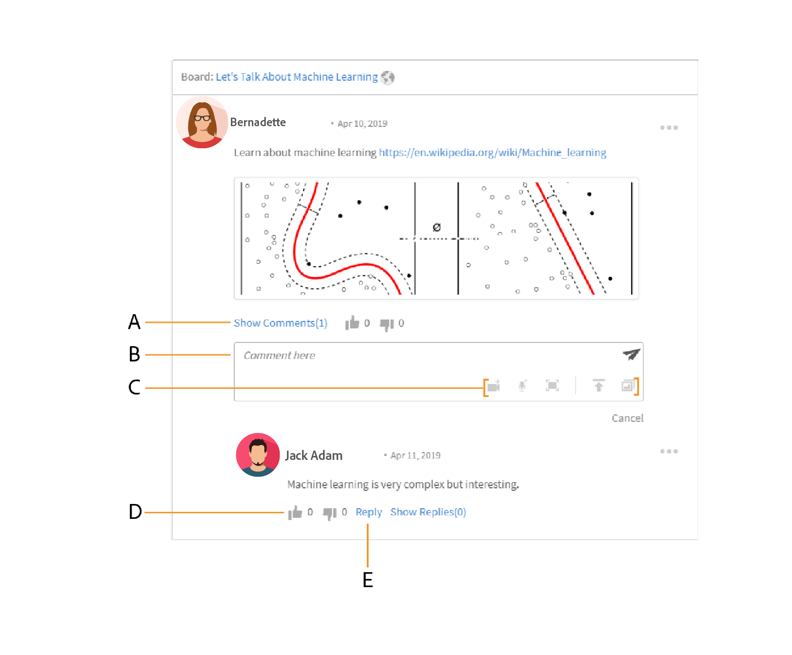-->

## 社交播放器中的內容 {#contentinsocialplayer}

在Learning Manager中，影片、簡報和影像等靜態內容會張貼在展示板的Social播放器內。 您可以透過Adobe Learning Manager案頭應用程式，從系統上傳檔案、錄製視訊/熒幕，以及擷取熒幕擷圖。

使用者發佈完某些內容後，其他學習者可在活動範圍中檢視這些內容。 在社交播放器上，學習者可以檢視、評論/回覆、投贊成票/否決票及回報不當行為。

<!--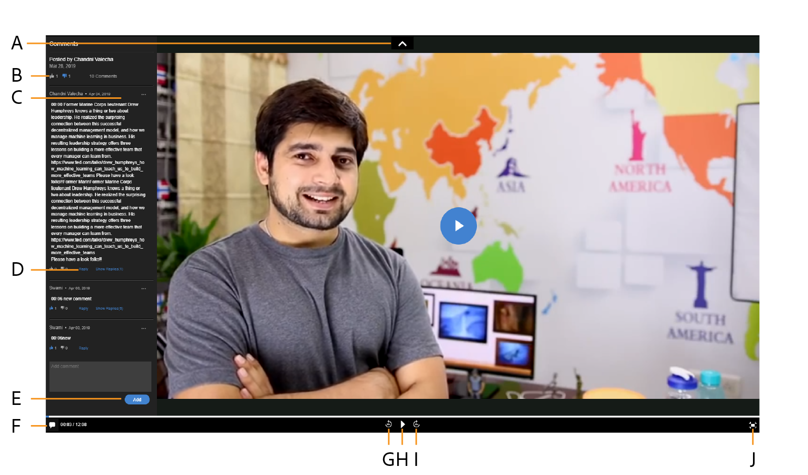-->

**若要在社交播放器上評論/回覆、投票/否決投票，請遵循下列步驟：**

1. 從社交播放器的右下角，按一下全熒幕按鈕。
1. 若要在熒幕上檢視播放器控制項，請按一下向下箭頭。
1. 若要檢視註解區段，請按一下畫面左下角的註解圖示。
1. 使用者可以發表評論/回覆、投票/否決票以及回報不當行為。
1. 按一下Esc鍵以結束全熒幕模式。

## 社交中的展示板檢視 {#board-view-social}

學習者可以在清單檢視中檢視所有面板。 登入學習者應用程式，然後在您的「社交學習」頁面中，按一下按鈕，如下所示：

*社交中的展示板檢視*

以展示板格式檢視貼文時，您可以根據&#x200B;**貼文**&#x200B;和&#x200B;**投稿人**&#x200B;來排序貼文。

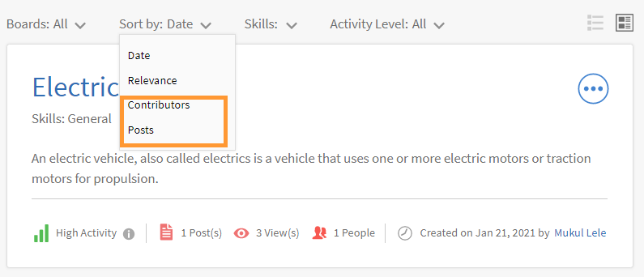

* 如果您選擇&#x200B;**貼文**，面板會根據面板中貼文的數量排序。
* 如果您選擇&#x200B;**貢獻者**，面板會根據在對話串中評論或回覆的使用者數量排序。

## 在社交面板中標籤使用者

具有Social展示板存取權的學習者可使用@username格式，在社交學習貼文和評論中標籤其他使用者。 標籤可透過應用程式或API運作。 只有可存取展示板的使用者才能加上標籤，確保互動相關且隱私。

* 標籤的使用者取得應用程式內通知和電子郵件通知
* 通知包括內容的直接連結
* 無法標籤展示板外的使用者
* 已刪除的使用者顯示為「匿名」

>[!NOTE]
>
>學習者無法標籤使用者群組或使用@all提及內容來防止垃圾訊息。

### 在社交討論區貼文中標籤使用者

您可以使用@username在貼文或評論中標籤特定的展示板成員。 標籤僅限可存取該展示板的成員使用。
若要在Social展示板中標籤使用者：

1. 以學習者身分登入Adobe Learning Manager。
2. 在左側導覽窗格中選取&#x200B;**[!UICONTROL Social Learning]**。

   
   _選取「社交學習」以存取討論區、分享見解和標籤互動式參與的使用者，以啟用合作學習_

3. 選取&#x200B;**[!UICONTROL New Post]**。

   
   _在社交學習中選取[新貼文]以開始新的討論，與標籤的使用者分享知識_

4. 在標籤使用者之前，請從&#x200B;**[!UICONTROL Post this to a Discussion Board]**&#x200B;選項中選取展示板。

   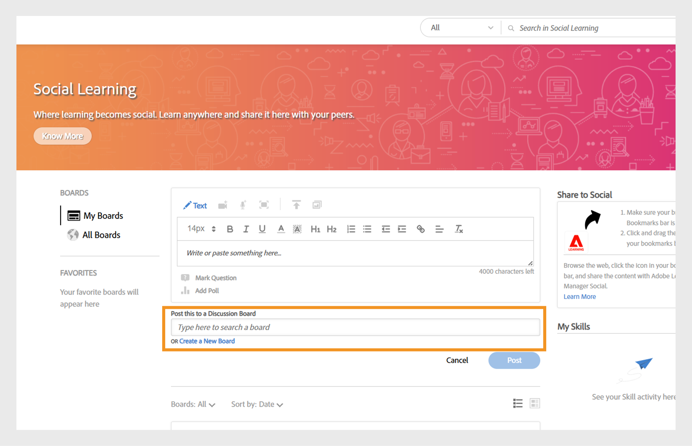
   _選取討論區以張貼和標籤使用者，在社交學習中啟用目標合作對話_

5. 輸入您的貼文詳細資料，然後輸入@並加上使用者的名稱(例如@andrew)來標籤使用者。 當您輸入@，後面接著使用者名稱的前三個字母時，就會出現相符的使用者清單。

   
   _在討論區貼文標籤使用者，方法是輸入@，接著輸入使用者名稱，以在Social Learning展示板上啟用目標式共同作業_

6. 從清單中選取所需的使用者。
7. 選取&#x200B;**[!UICONTROL Post]**。

標籤的使用者會收到應用程式內和電子郵件通知，其中包含貼文的直接連結。 這使討論更具針對性和合作性。

### 根據展示板的範圍標籤使用者

範圍受限制的標籤可讓您僅標籤具有存取特定展示板許可權的學習者。 這可防止標籤範圍外的使用者，藉以維護隱私權。

如果您嘗試標籤討論區範圍外的學習者，將不會出現任何建議，而且您將無法標籤他們。

### 標籤已刪除的使用者

如果刪除的使用者在「社交學習」貼文中被標籤，其名稱在貼文中會顯示為「匿名」。 上下文仍可看見註解和標籤，但不會顯示設定檔連結或詳細資訊。

_社交學習貼文，重點說明已刪除使用者在標籤時如何顯示為匿名_

### 技能篩選器 {#skillfilter}

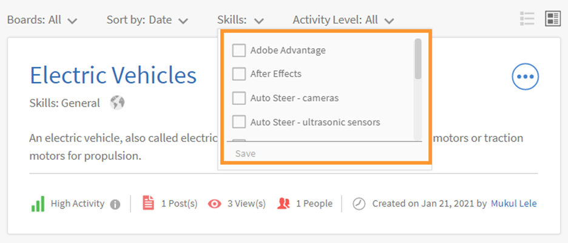

*排序貼文*

使用「技能」篩選器，您可以選取多個技能來篩選面板。 選取技能後，您也可清除篩選器。

### 活動層級篩選 {#activitylevelfilter}

*篩選活動層級*

使用「活動」篩選器，您可以根據面板中互動的大小來排序面板。 您可以根據下列專案對這些專案排序：

* 高活動
* 正常活動
* 活動率低

在電路板檢視中，您可以執行一般電路板層級的動作。

<!---->

## 下載貼文 {#downloadposts}

學習者可以從Social Learning Platform下載包含附件的內容，離線使用此內容。

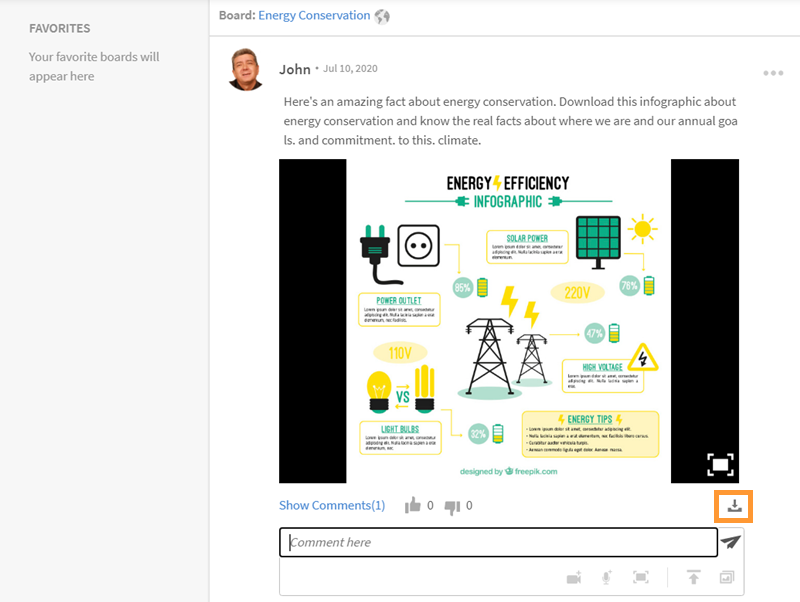

*在社交網站下載貼文*

您可以從「貼文」或「評論」或「回覆」區段下載內容。 您一次只能下載一個檔案。

這兩種使用者（內部或外部）都必須能夠下載內容。

您也可以在貼文、評論或回覆的搜尋結果中看見「下載」按鈕。

您還無法在裝置應用程式中下載貼文。 此功能即將推出。

## 支援的內容格式 {#supportedcontentformats}

<table>
 <tbody>
  <tr>
   <td>
    
<b>內容型別</b>
</td>
   <td>
    
<b>擴充功能</b>
</td>
  </tr>
  <tr>
   <td>
    
影片
</td>
   <td>
    
wmv， f4v， asf， 3gp， 3g2， avi， mov， h264， m4v， mp4， MPEG， mpg
</td>
  </tr>
  <tr>
   <td>
    
音訊
</td>
   <td>
    
mp3、amr、m4a、wav、wma、aac
</td>
  </tr>
  <tr>
   <td>
    
靜態檔案
</td>
   <td>
    
PDF， ppt， pptx， doc， docx， xls， xlsx
</td>
  </tr>
  <tr>
   <td>
    
影像
</td>
   <td>
    
jpg、jpeg、png、bmp、gif
</td>
  </tr>
 </tbody>
</table>

## 僅對選取的使用者可見的展示板 {#selected-users}

同時具有&#x200B;**管理員**&#x200B;角色的學習者可以將使用者群組新增至私人討論區。 任何使用者群組都可以新增至私人展示板，而屬於該使用者群組的使用者只能存取該展示板。

如果將新使用者新增到使用者群組，則兩個使用者都可以看到私人展示板。

如果從私人展示板中移除任何使用者，則使用者無法再看到私人展示板。

如果將多個使用者群組新增到私人展示板，則兩個群組的所有使用者都可以存取私人展示板。

<!--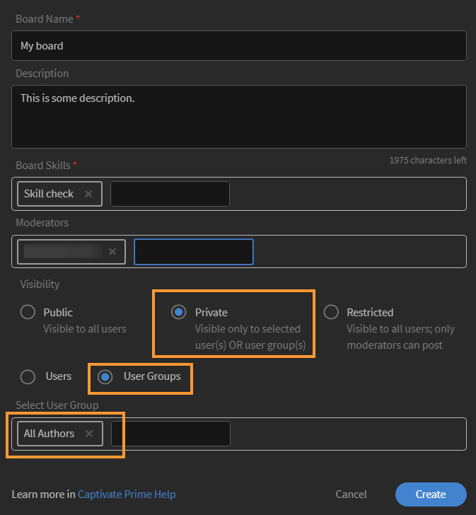-->

## 可在貼文上完成的動作 {#actionsthatcanbedoneonapost}

按一下貼文右上角的摺疊功能表圖示，檢視其選項。 會顯示下列功能表清單：「編輯」、「新增至我的內文」、「複製URL」、「刪除」和「報告」。

只有部分使用者有權執行特定工作。 下列型別的使用者是內容擁有者、展示板版主和組織管理員。

<table>
 <tbody>
  <tr>
   <td>
    
<b>sl. 不適用。</b>
</td>
   <td>
    
<b>動作</b>
</td>
   <td>
    
<b>說明</b>
</td>
  </tr>
  <tr>
   <td>
    
1
</td>
   <td>
    
編輯
</td>
   <td>
    
編輯可讓內容建立者更正或修改其貼文。
</td>
  </tr>
  <tr>
   <td>
    
2
</td>
   <td>
    
新增至我的劇本
</td>
   <td>
    
劇本是使用者組織的內容集合。 使用者可以將內容的可見度設定為「私人」或「公開」。
</td>
  </tr>
  <tr>
   <td>
    
3
</td>
   <td>
    
複製URL
</td>
   <td>
    
此選項可讓所有使用者複製展示板或貼文的URL並加以共用。
</td>
  </tr>
  <tr>
   <td>
    
4
</td>
   <td>
    
刪除
</td>
   <td>
    
刪除選項會在使用者確認後移除貼文。
</td>
  </tr>
  <tr>
   <td>
    
5
</td>
   <td>
    
報告
</td>
   <td>
    
如果貼文侵犯使用者的隱私權，或其內容不當，每位使用者都有權檢舉不當使用。

    
回報貼文後，會傳送通知給討論區管理員和版主，以供進一步動作。
</td>
  </tr>
 </tbody>
</table>

**新增到我的劇本**

社交劇本可讓使用者新增或建立包含他們或其他使用者所建立之貼文的劇本。

若要新增貼文至內文，請遵循下列步驟：

1. 按一下文章右上角的摺疊功能表圖示，然後按一下&#x200B;**[!UICONTROL Add to my Story]**。

   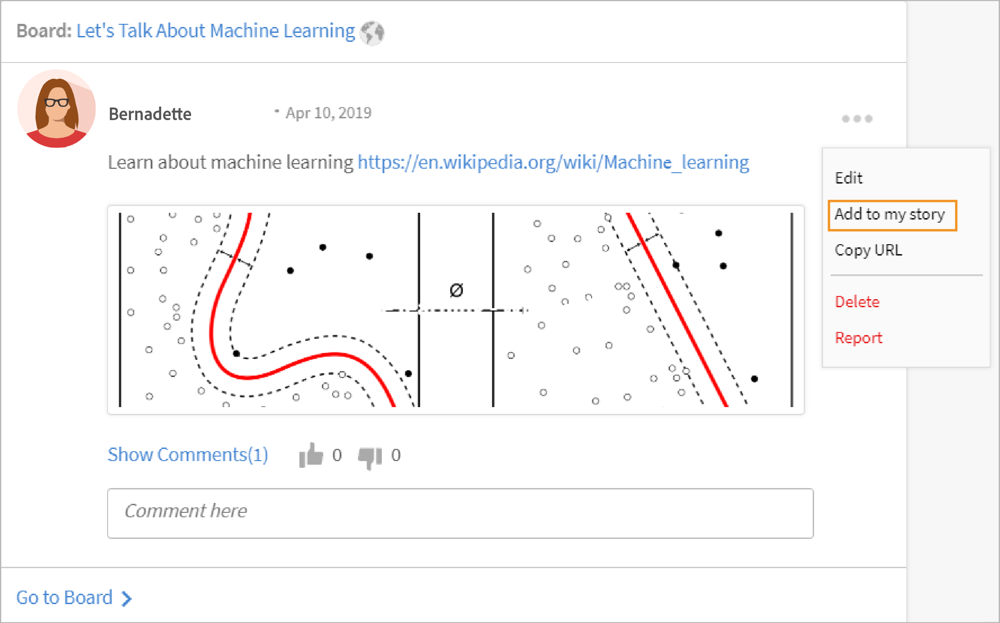

   *新增到劇本*

1. 從&#x200B;**選取劇本**&#x200B;對話方塊中，選取相關劇本以新增貼文。 如果沒有相關的現有劇本，請按一下&#x200B;**新增劇本**&#x200B;來建立劇本。

   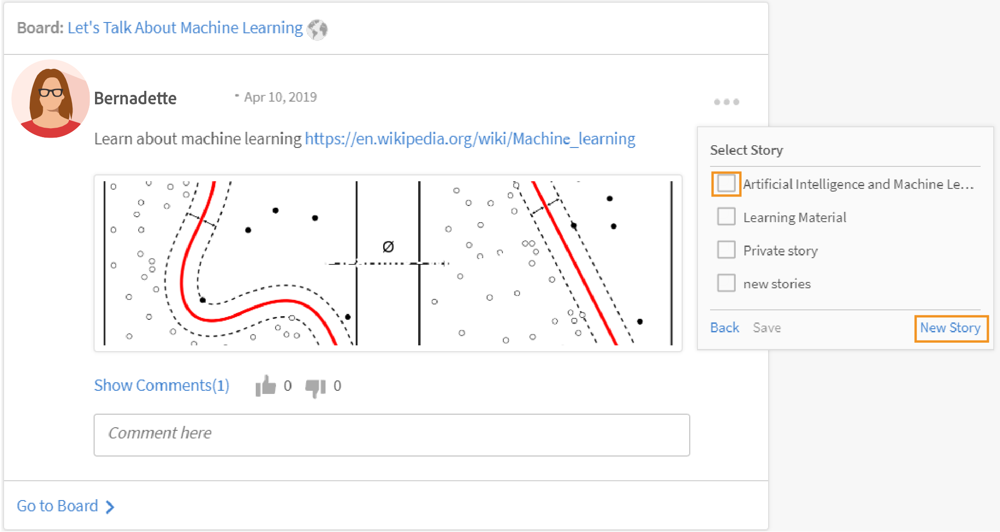

   *建立劇本*

1. 在「新增內文」對話方塊中，填寫「內文名稱」和「說明」欄位。 您也可以將劇本的可見度設定為「公用」或「私用」。

   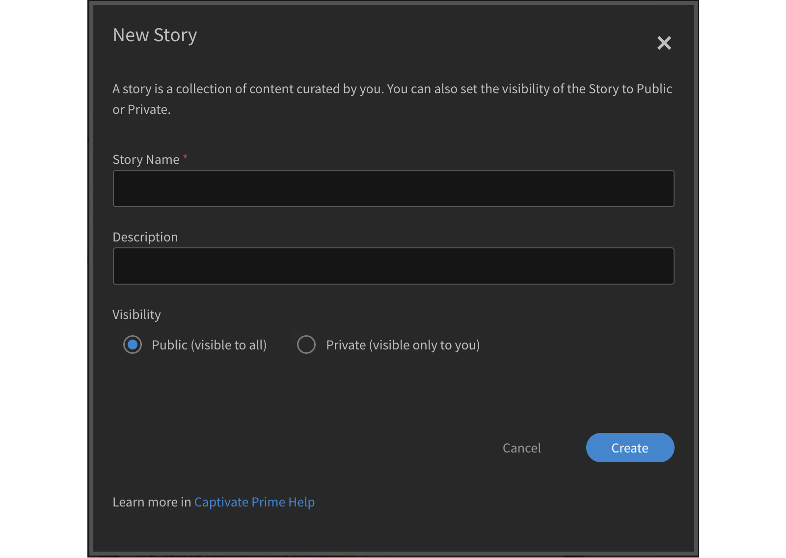

   *新增劇本名稱和描述*

   若要檢視使用者建立的劇本，請從設定檔功能表選項中按一下使用者姓名。

## 對貼文執行動作的使用者許可權 {#userprivilegesforperformingtheactionsonapost}

<table>
 <tbody>
  <tr>
   <td>
    
 
</td>
   <td>
    
<b>內容擁有者</b>
</td>
   <td>
    
<b>任何使用者</b>
</td>
   <td>
    
<b>展示板版主</b>
</td>
   <td>
    
<b>管理員</b>
</td>
  </tr>
  <tr>
   <td>
    
<b>編輯</b>
</td>
   <td>
    
是
</td>
   <td>
    
否
</td>
   <td>
    
否
</td>
   <td>
    
否
</td>
  </tr>
  <tr>
   <td>
    
<b>新增至我的劇本</b>
</td>
   <td>
    
是
</td>
   <td>
    
是
</td>
   <td>
    
是
</td>
   <td>
    
是
</td>
  </tr>
  <tr>
   <td>
    
<b>複製URL</b>
</td>
   <td>
    
是
</td>
   <td>
    
是
</td>
   <td>
    
是
</td>
   <td>
    
是
</td>
  </tr>
  <tr>
   <td>
    
<b>刪除</b>
</td>
   <td>
    
是
</td>
   <td>
    
否
</td>
   <td>
    
是
</td>
   <td>
    
是
</td>
  </tr>
  <tr>
   <td>
    
<b>報告</b>
</td>
   <td>
    
是
</td>
   <td>
    
是
</td>
   <td>
    
是
</td>
   <td>
    
是
</td>
  </tr>
 </tbody>
</table>

## 檢視面板中的內容 {#viewingcontentinboards}

面板是貼文的集合。 Social Learning中的每個板都是根據技能建立的。 在社交學習中，使用者可以檢視&#x200B;**所有面板**&#x200B;頁面和&#x200B;**我的面板**&#x200B;頁面。

在「所有面板」頁面中，可看見活動範圍中所有使用者建立的貼文或面板。 但在「我的展示板」頁面中，只會顯示已建立、後面接著且有使用者參與的展示板。

在「我的看板」頁面中，可見的看板可依下列條件篩選： **全部**、**由我建立**、**由我註解**、**後面跟著我**。

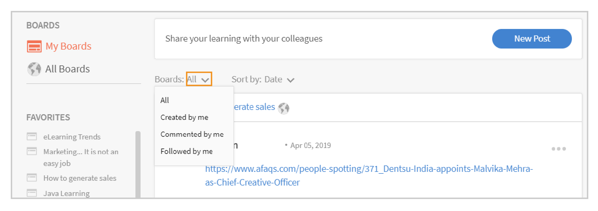

*篩選可見的展示板*

在「我的面板」和「所有面板」中，使用者都可以依&#x200B;**關聯性**&#x200B;或&#x200B;**日期**&#x200B;來排序面板。

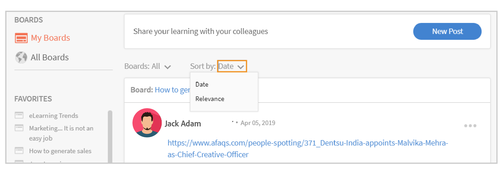

*依關聯性和日期排序展示板*

建立貼文時，如果貼文沒有相關面板，請按一下[建立新面板]。  若要檢視、編輯、刪除、報告、複製URL並將展示板新增至您最喜愛的展示板清單，請遵循下列步驟：

1. 按一下主機板名稱或按一下&#x200B;**[!UICONTROL Go to board]**。
1. 在面板頁面中，按一下摺疊的功能表圖示，然後從下拉式清單中選取選項。

   <!--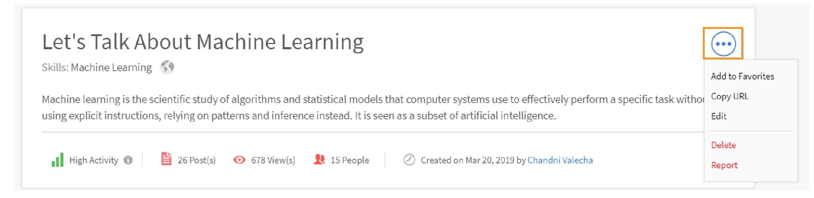-->

**使用者可以在展示板頁面上檢視下列選項：**

* 此頁面上會顯示貼文、檢視和關注展示板的人數。 展示板建立者的名稱和建立展示板的日期也會與展示板的頂級SME一起顯示。

* 也會顯示新增至使用者最愛的主機板清單的主機板名稱。

<!--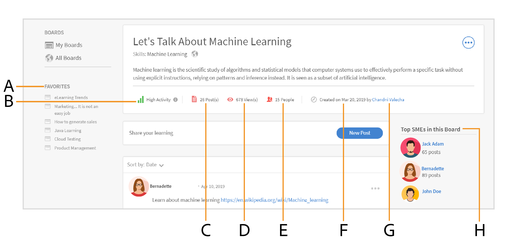-->

## 分享到Social {#sharetosocial}

「分享至Social」是書籤小程式，可讓使用者透過貼文直接在社交頁面上分享他們的線上學習，例如網頁和部落格。 如需詳細資訊，請參閱[分享至社交學習](share-to-social.md)。

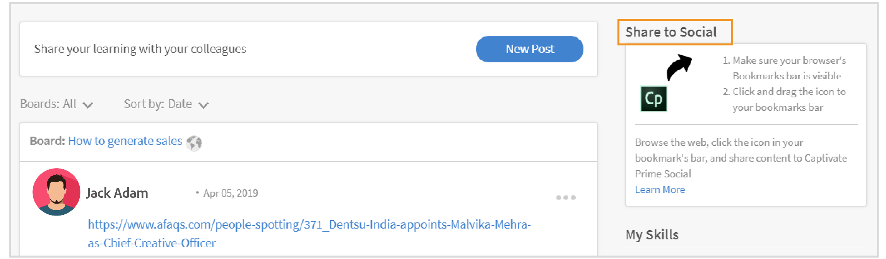

*分享至社交學習*

## 我的技能 {#myskills}

使用者可以在「我的看板」頁面中檢視技能及使用技能建立的貼文或看板數目。 若要檢視使用者在建立展示板時所使用的所有技能，請按一下&#x200B;**[!UICONTROL See all Skills]**。

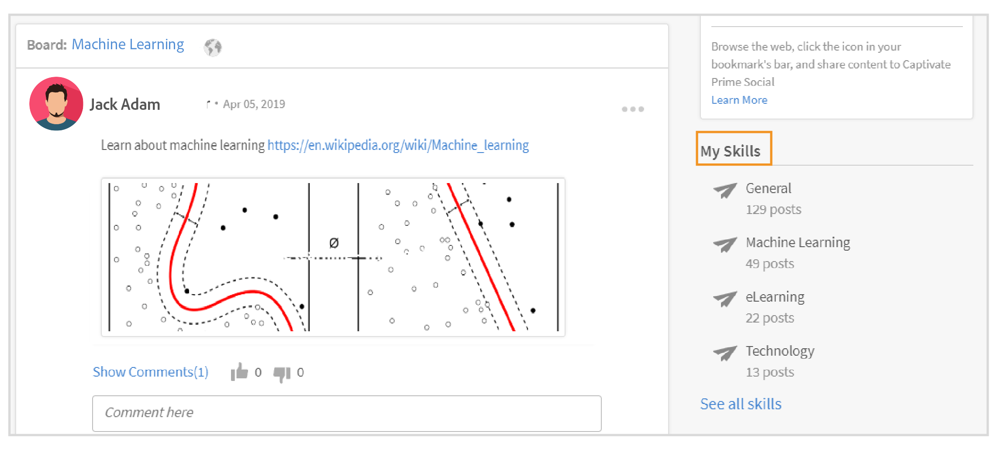

*檢視所有技能*

## 我追蹤的人員 {#peopleifollow}

在「我的看板」頁面中，使用者可以檢視其所關注的人的名稱以及已建立的貼文數。

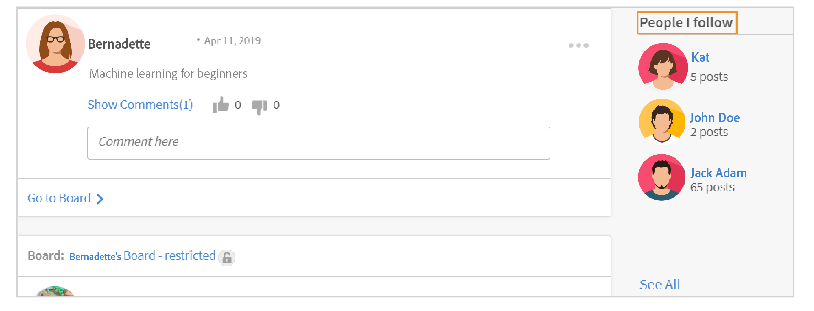

*學習者追蹤的人員*

若要追蹤其他使用者，請遵循下列步驟：

1. 若要檢視其他使用者的設定檔頁面，請按一下其名稱。
1. 按一下「跟隨/取消跟隨」按鈕以執行所需的動作。

   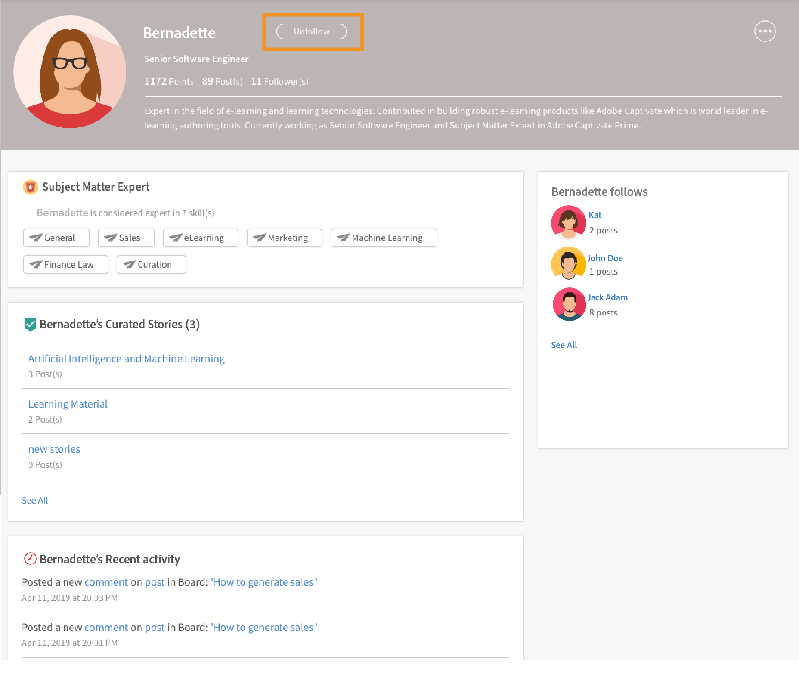

   *關注或取消關注使用者*

## 社交主管展示板 {#socialleaderboard}

社交排行榜強化gamification。 建立新貼文/展示板時、獲得其貼文贊成票時、提供問題的正確答案時，以及其他參與社交學習的使用者會獲得活動點數。

在社交排行榜清單中，相同範圍內所有使用者的分數和新貼文總數。 分數上限的學習者會出現在社交排行榜清單上方，隨後是其他學習者。

按一下「**[!UICONTROL Go to Leaderboard]**&#x200B;我的看板&#x200B;**」頁面中的「**」以檢視所有學習者及其獲得的分數。

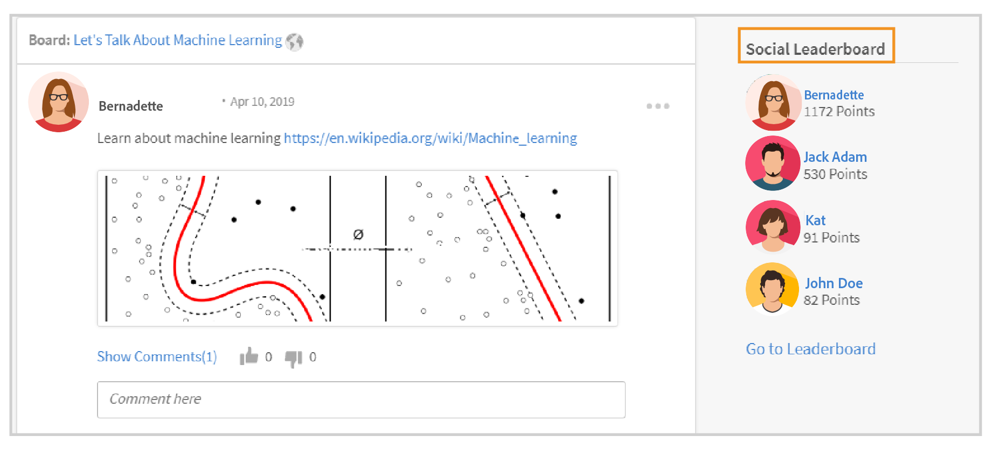

*檢視所有學習者*

## 活動點 {#activitypoints}

指定給使用者的活動點數是根據所執行的社交活動。

**活動點數會授與下列專案的使用者：**

* 建立展示板需要5點。
* 將貼文新增為文字或問題型別時獲得5點。
* 任何貼文評論2點。
* 第一次開始使用展示板的使用者會獲得1分。 該展示板上張貼的前20個新貼文，使用者一共可獲得20分。

## 如何成為主題專家(SME) {#howtobecomeasubjectmatterexpertsme}

主題專家(SME)是具有特定技能之專門知識的人。 在Learning Manager社交學習中，系統會根據授予使用者某項技能的最大活動點數將使用者指定為SME。

頂尖的SME有許可權在學習者內容發佈至Social Learning的展示板前組織學習者內容。

組織的管理員還有權為學習者新增更多分數，以使他們成為某項技能的SME。

## 如何組織SME的內容？ {#howtocuratecontentasasme}

1. 當使用者建立新貼文或討論區時，SME會收到通知，顯示討論區上的貼文正在等待監管。

   <!--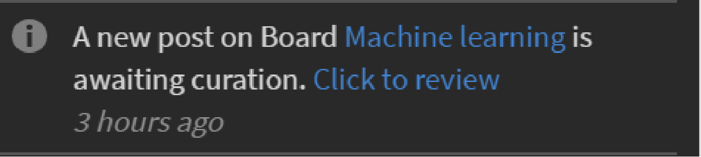-->

1. 若要稽核貼文，請按一下&#x200B;**按一下以檢閱**&#x200B;連結。 此動作會將SME導覽至內容稽核頁面，如下方熒幕擷圖所示。

   <!--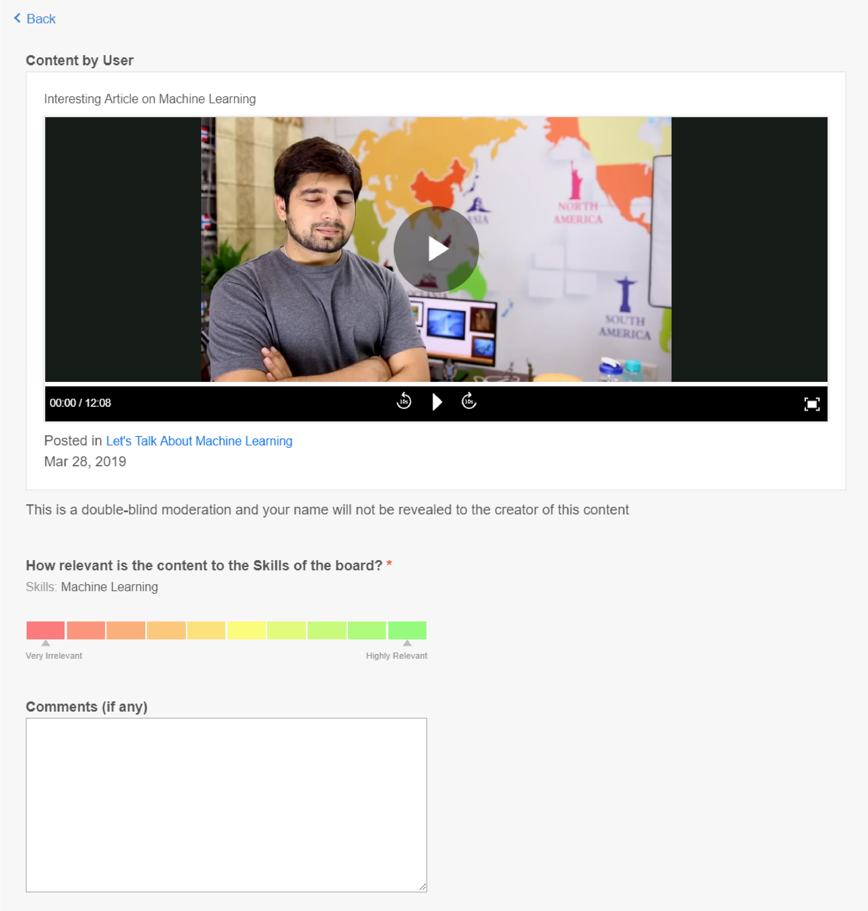-->

1. 若要根據內容與展示板技能的相關性百分比來評定內容，請選取相關程度中的顏色。 第一種顏色被評為不相關（10%相關性），而最後一種顏色代表非常相關（100%相關性）。
1. 建議SME根據指定的特定關聯性分數輸入註解。 使用者在閱讀評論時，可更清楚瞭解自己的貼文被拒絕的原因。

<!--## AI-enabled auto curation {#autocuration}-->

## 在正式和非正式學習中搜尋 {#searchinformalandinformallearning}

「社交學習」中的每個頁面都有搜尋欄位，可讓使用者尋找任何展示板、技能或內容。 在搜尋欄位中輸入，然後按一下搜尋圖示或按鍵盤上的Enter鍵進行搜尋。

<!--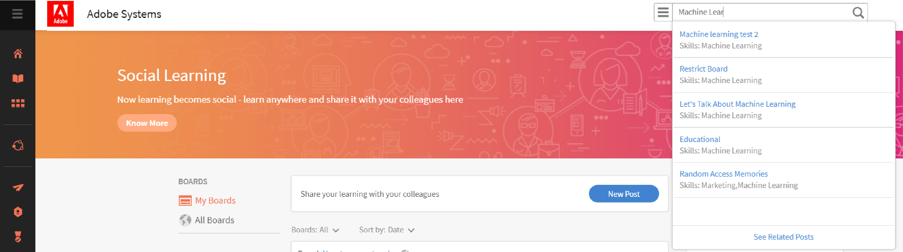-->

非正式學習中的下列頁面有搜尋欄位： **我的展示板**、**所有展示板**、**展示板頁面**、使用者的&#x200B;**個人資料頁面**&#x200B;和&#x200B;**其他學習者的個人資料頁面**。

當使用者在非正式學習中搜尋內容時，會顯示在Learning Manager的非正式和正式學習中內容的搜尋結果總數。

同樣地，在正式學習頁面中搜尋內容時，也會顯示在非正式學習中找到的搜尋結果數量。

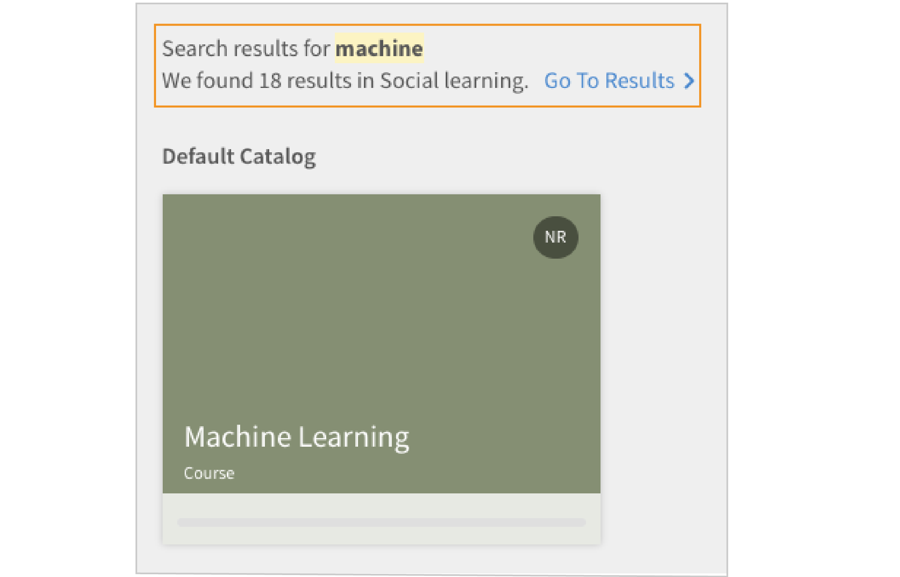

*學習的搜尋結果*

在非正式學習委員會的頁面中，只能進行與委員會相關的搜尋。 不會顯示任何與展示板無關的搜尋。

## 檢視使用者設定檔 {#viewuserprofile}

如果為學習者啟用了Social Learning，則使用者可以按一下Social Learning右上角的設定檔影像，然後從下拉式清單中按一下其名稱來檢視其設定檔。

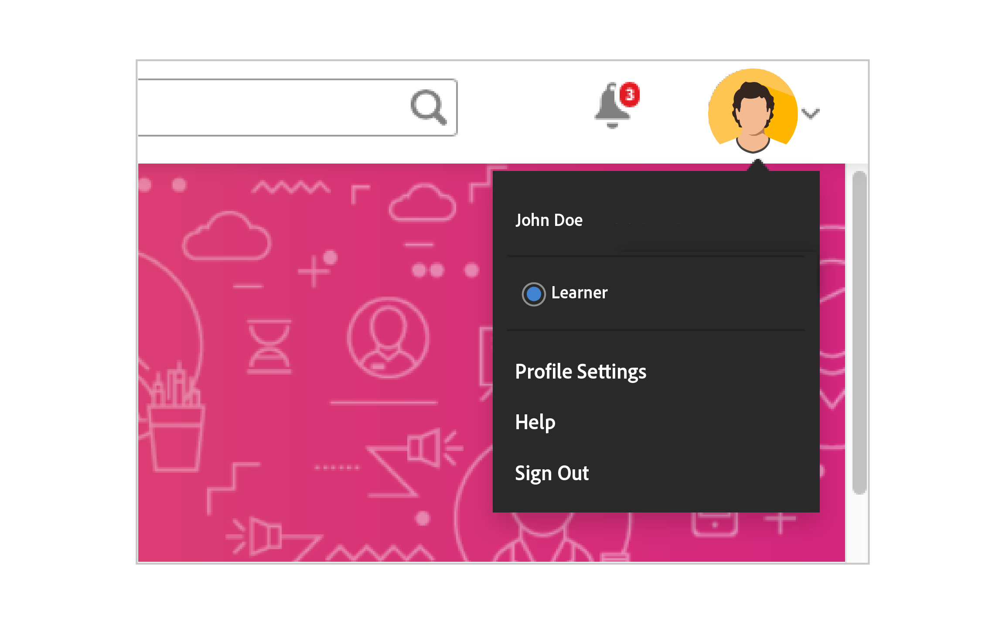

*檢視使用者設定檔*

在設定檔頁面中，學習者可檢視獲得的點數總計、建立的貼文數以及他們擁有的關注者數。

學習者也可檢視其指定為「主題專家」的技能。

學習者的頁面也會顯示學習者的&#x200B;**已監管內文**、**已執行的最近活動**&#x200B;以及由他們追蹤的&#x200B;**人員**。

## 通知 {#notifications}

SME核准或拒絕貼文時，使用者會收到通知，按一下視窗右上角的通知圖示即可檢視通知。 使用者可以檢視社交學習和正式學習活動的通知。

<!--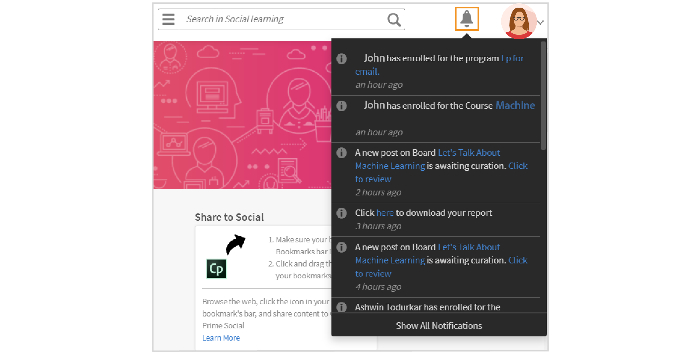-->
