# 學習管理中的社會學習

學習如何作為學習者使用社交學習網路

Social Learning 是 Learning Manager 中的一個平台，讓使用者在非正式環境中分享想法與有意義的見解。 這是一種補充傳統學習理念的方法論。 完成線上課程並不會讓使用者在社交層面上與同儕互動。

僅僅參加培訓並不保證使用者能記住所學內容。 另一方面，社交學習讓使用者能利用周遭的專業知識，精確獲得所需的資訊。 使用者能迅速應用這些資訊完成任務並達成目標。

同樣地，學習管理員的社交學習功能讓使用者能夠透過分享與學習內容來互動。

在這個平台上，可分享的內容類型包括影片、音訊、截圖、文字、提問和投票。 使用者也可以透過「分享到社交」書籤分享&#x200B;****&#x200B;他們的線上學習成果。欲了解更多資訊，請參閱  [「分享至社會學習](share-to-social.md)」。

內容也可以透過 Adobe Learning Manager 桌面應用程式&#x200B;**，將內容張貼在看板**&#x200B;內。欲了解更多資訊，請參閱  [桌面](../adobe-learning-manager-app-for-desktop.md)版 Adobe Learning Manager 應用程式。

只有當管理員啟用社交學習時，該功能才會對學習者可見。

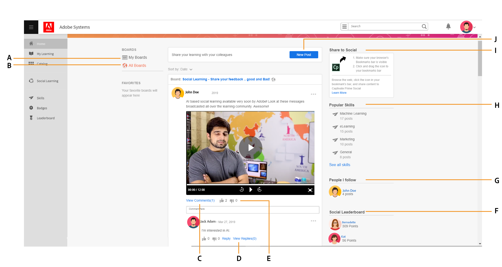 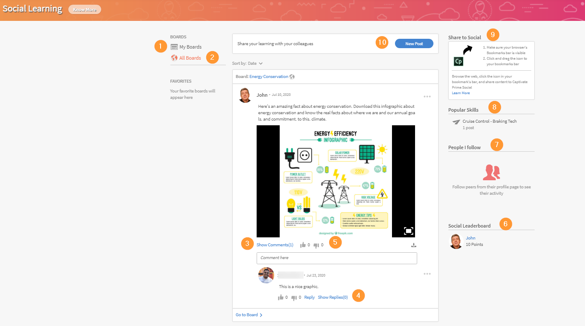

*檢視學習儀表板*

<table>
 <tbody>
  <tr>
   <td>
    
<b>SL。 不。</b>
</td>
   <td>
    
<b>術語或概念</b>
</td>
   <td>
    
<b>簡要說明</b>
</td>
  </tr>
  <tr>
   <td>
    
1
</td>
   <td>
    
我的滑板
</td>
   <td>
    
板是 <code>
      collection
     </code> 用戶所創建的貼文。 我的看板會顯示用戶參與、創建並追蹤的所有貼文。
</td>
  </tr>
  <tr>
   <td>
    
2
</td>
   <td>
    
所有董事會
</td>
   <td>
    
在「所有板」頁面，使用者可以看到所有學習者建立的共享活動範圍的板子。
</td>
  </tr>
  <tr>
   <td>
    
3
</td>
   <td>
    
留言
</td>
   <td>
    
用戶可以留言並瀏覽在看板上所建立的貼文。 
</td>
  </tr>
  <tr>
   <td>
    
4
</td>
   <td>
    
回覆
</td>
   <td>
    
用戶可以回覆在論壇內貼文上的留言。
</td>
  </tr>
  <tr>
   <td>
    
5
</td>
   <td>
    
讚/負
</td>
   <td>
    
點擊讚與踩按鈕來按讚或按讚貼文。
</td>
  </tr>
  <tr>
   <td>
    
6
</td>
   <td>
    
社交排行榜
</td>
   <td>
    
在社交排行榜中，使用者可以看到學習者的名字及參與社交學習所獲得的積分。
</td>
  </tr>
  <tr>
   <td>
    
7
</td>
   <td>
    
我追蹤的人
</td>
   <td>
    
在這裡，使用者可以看到他們追蹤的其他學習者的名字以及他們已發表的貼文數量。
</td>
  </tr>
  <tr>
   <td>
    
8
</td>
   <td>
    
熱門技能
</td>
   <td>
    
在「所有版」區塊中，可以查看學習者常用的技能以及他們使用該技能所發表的文章數量。
</td>
  </tr>
  <tr>
   <td>
    
9
</td>
   <td>
    
分享到社群媒體
</td>
   <td>
    
Share to Social 是一個書籤小工具，讓使用者能直接分享他們的線上學習內容，如網頁和部落格，給學習管理員社交學習。
</td>
  </tr>
  <tr>
   <td>
    
10
</td>
   <td>
    
新職位
</td>
   <td>
    
新增發佈按鈕允許用戶在論壇內創建並發布內容。
</td>
  </tr>
 </tbody>
</table>

## 以貼文形式創作內容 {#creatingcontentasapost}

內容是以公告板內的貼文形式產生的。 要建立文章，請依照以下步驟操作：

1. 點擊 **[!UICONTROL New Post]。**

   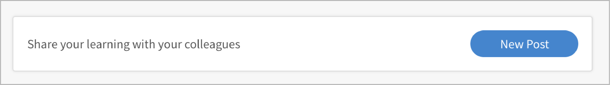
   *選擇新文章*

1. 請選擇以下任一類型的內容來發布：文字、提問、影片、音訊、投票及截圖。 現有內容可從使用者系統或Adobe Learning Manager桌面應用程式的圖庫上傳。

   使用 Adobe Learning Manager 桌面應用程式錄製影片或螢幕、音訊，並截圖。 欲了解更多資訊，請參閱 [Adobe Learning Manager 桌面應用程式](../adobe-learning-manager-app-for-desktop.md)。

   <!--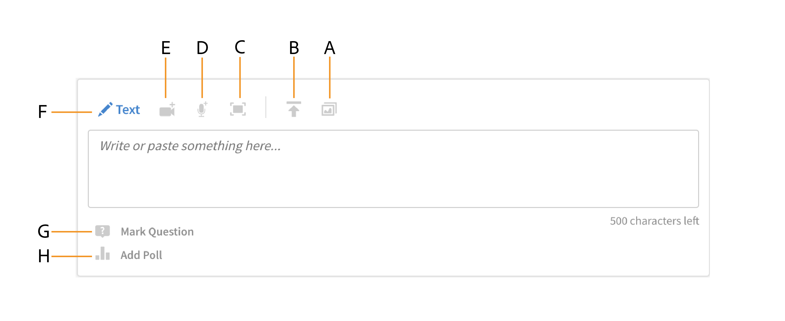-->

1. 搜尋與該職位相關的板塊或技能。 如果該板不存在，請點擊 **[!UICONTROL Create a New Board]**。

   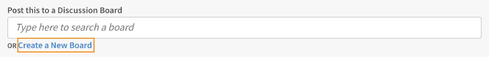

   *建立一個看板*

   如果你是外部或內部使用者，且管理員已授權你建立看板，你可以放棄看板。 如果您沒有建立看板的權限，「建立新看板&#x200B;**」這個連結**&#x200B;將不會出現。

1. 從彈出視窗中填寫細節，選擇以下類型的棋盤：

   * **公開** - 所有用戶均可參與並展示貼文。
   * **私人** - 貼文僅對論壇創建者、版主及新增的用戶開放。
   * **受限** - 只有版主、管理員和版主才能發文。 其他用戶也可以透過留言/回覆、點讚/反對票等方式參與。

   <!--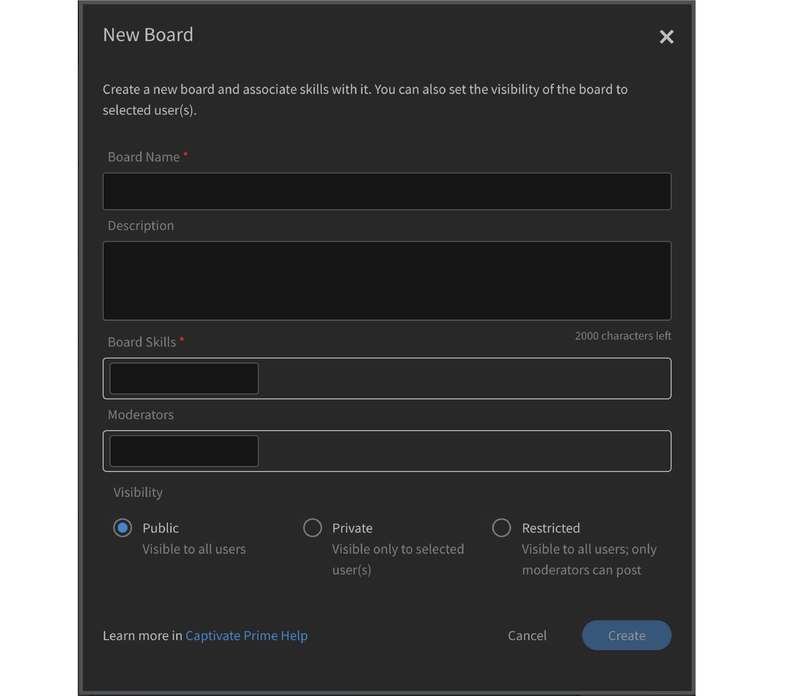-->

   >[!NOTE]
   >
   >在 Social Learner 應用程式中，只有 **管理員** 有能力建立包含使用者群組（內部/外部）的私人看板。
   >
   >除了管理員、作者、學習者、經理、講師等以外的其他使用者。 **無法** 建立包含使用者群組的私人看板。 他們無法在建立私人板時看到使用者群組&#x200B;**的區塊**。

   僅管理員——當你選擇 **私人**&#x200B;時，你會看到兩個選項—— **使用者** 和 **使用者群組**。 選擇 **「使用者群組**」選項，然後將使用者群組加入你想要共享的私人看板。

   在使用者群組欄位中，您可以選擇內部、外部或自訂群組。 你的私人板將被所有指定的使用者群組看到，無論範圍設定如何。

1. 要分享內容，請點擊 **[!UICONTROL Post]**。 點擊「發佈」後，使用者會收到通知。

   內容依據管理員設定的社交學習內容策展設定發布，該設定可由  [版主/主題專家](social-learning-web-user.md#HowtobecomeaSubjectMatterExpertSME)策劃。

   <!--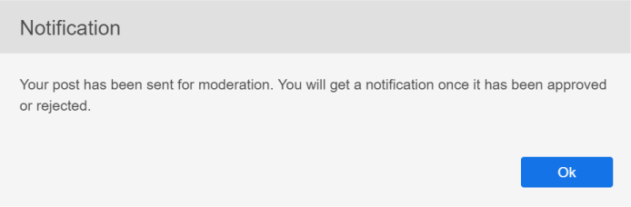-->

1. 若管理員將策展設定為僅手動策展，使用者會在貼文被批准或拒絕時收到通知。 若貼文被拒，請點擊 **「點擊審查** 」超連結，以檢視董事會版主或主題專家（SMEs）所提出的意見。

   用戶創作的內容由版主或主題專家策劃。

   <!--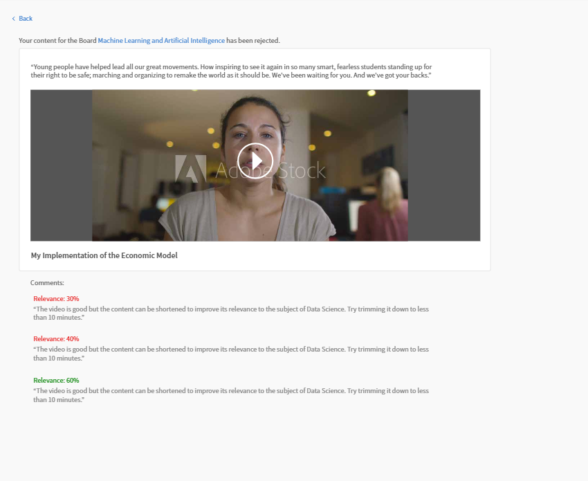-->

在Social Learning中建立或回覆貼文時，你可以使用富文字編輯器撰寫文章，並套用不同格式。

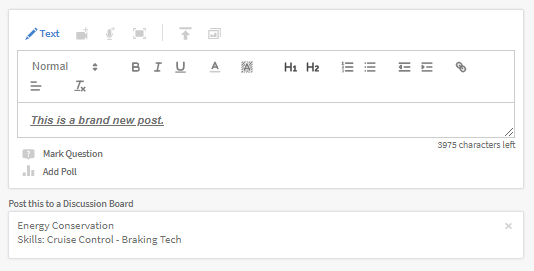

*使用富文字編輯器來建立一篇文章*

此外，在建立看板時，你也可以在富文字編輯器中使用相同的選項。

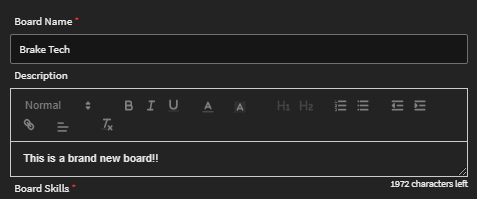

*使用富文字編輯器來建立一篇文章*

## 瀏覽核准內容 {#viewingapprovedcontent}

一旦貼文獲批，就會顯示在社交學習看板上。 用戶現在可以留言、回覆、點贊或按倒讚。

使用者可以使用以下類型的內容發表評論：錄影螢幕、網路攝影機或兩者兼具、錄製音訊、截圖、上傳檔案、學習管理員圖庫。

<!--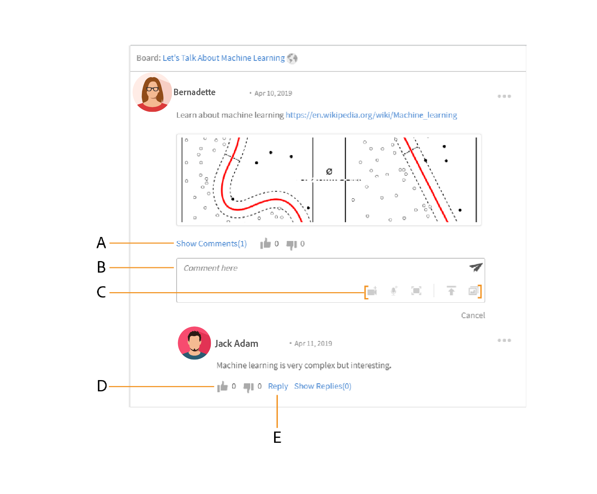-->

## Social Player 中的內容 {#contentinsocialplayer}

在學習管理器中，影片、靜態內容如簡報和圖片會被貼在 Social Player 的板子裡。 你可以從系統上傳檔案、錄製影片或螢幕，並透過 Adobe Learning Manager 桌面應用程式擷取截圖。

使用者完成發布內容後，其他學習者在其活動範圍內即可查看。 在社群媒體上，學習者可以查看、留言/回覆、點贊/反對，並舉報濫用行為。

<!--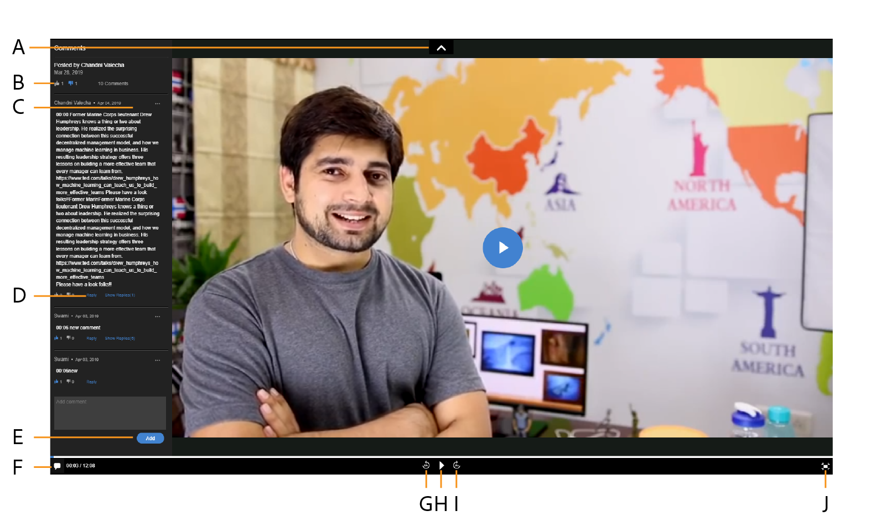-->

**要在社群玩家上留言/回覆、按讚/反對，請依照以下步驟操作：**

1. 點擊社交玩家右下角的全螢幕按鈕。
1. 要在螢幕上查看玩家操作，請點擊向下的箭頭。
1. 要查看留言區，請點擊螢幕左下角的留言圖示。
1. 用戶可以留言/回覆、按讚/按負，並舉報濫用行為。
1. 點擊 Esc 鍵即可退出全螢幕模式。

## 社群中的董事會視圖 {#board-view-social}

學習者可以在清單視圖中看到所有板。 登入你的學習者應用程式及社交學習頁面，點擊下方所示的按鈕：

*社群中的董事會視圖*

當你以板板格式瀏覽文章時，可以依照貼文&#x200B;**和**&#x200B;貢獻者&#x200B;**排序**。

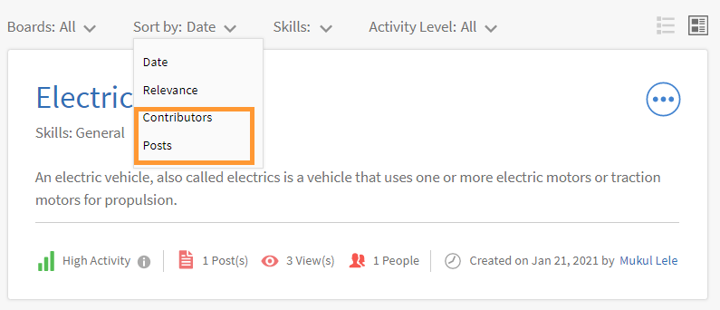

* 如果你選擇 **「**&#x200B;貼文」，討論區會依照發帖數量排序。
* 如果你選擇&#x200B;****&#x200B;貢獻者，討論區將依照在討論串中留言或回覆的用戶數量排序。

## 社群論壇中的標籤用戶

有社群論壇存取權的學習者，可以使用@username格式在社群學習貼文和留言中標記其他用戶。 標籤是透過應用程式或 API 來運作的。 只有有權限進入看板的用戶才能被標記，保持互動的相關性與隱私。

* 被標記的用戶會收到應用程式內和電子郵件通知
* 通知包含內容的直接連結
* 板外用戶無法被標記
* 被刪除的使用者會顯示為「匿名」

>[!NOTE]
>
>學習者無法標記使用者群組或使用@all提及來防止垃圾訊息。

### 在社群板貼文中標註使用者

你可以在貼文或留言中標註特定董事會成員，使用@username。 標籤僅限於有該公告板存取權限的會員。要在社群論壇中標記用戶：

1. 以學習者身份登入 Adobe Learning Manager。
2. 在左側導覽窗格選擇 **[!UICONTROL Social Learning]** 。

   
   _透過選擇「社交學習」來開啟討論區、分享見解，並標註使用者以促進互動互動，從而實現協作學習_

3. 選擇 **[!UICONTROL New Post]**。

   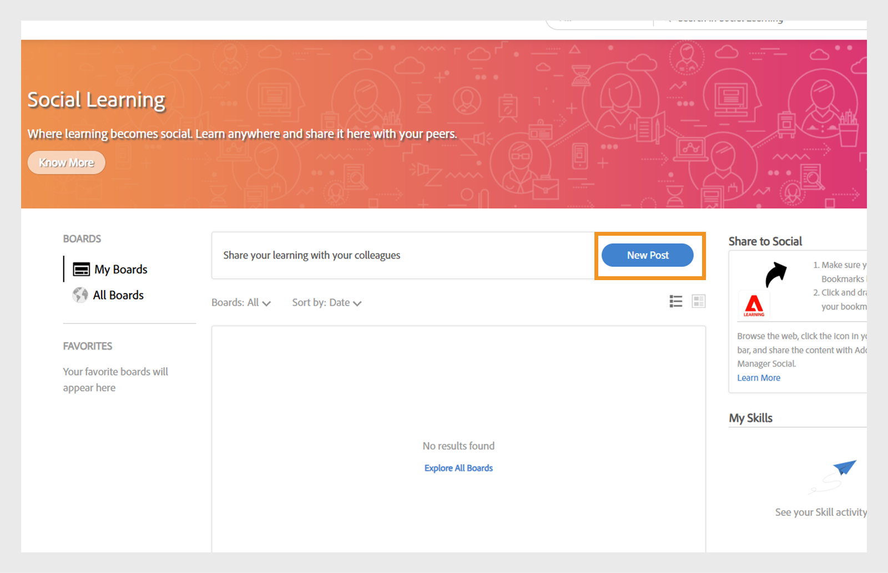
   _在社交學習中選擇新文章，與被標記的用戶分享知識，開始新討論_

4. 在標記使用者之前，先從 **[!UICONTROL Post this to a Discussion Board]** 選項中選擇該看板。

   
   _選擇討論區來發布並標註使用者，促進針對性的協作對話，促進社交學習中的目標性對話_

5. 輸入你的貼文細節，然後輸入 @ 加上用戶名字（例如 @andrew）。 當你輸入 @ 後接使用者名字的前三個字母時，會出現一個匹配的使用者清單。

   
   _在你的討論貼文中，輸入 @ 並加上用戶名，以啟用針對性的社群學習版合作_

6. 從列表中選擇想要的使用者。
7. 選擇 **[!UICONTROL Post]**。

被標記的用戶會收到應用程式內和電子郵件通知，並附有貼文的直接連結。 這使得討論更具針對性和協作性。

### 根據委員會的範圍標註使用者

範圍限制標籤讓你只標記有權限存取特定看板的學習者。 此舉透過防止用戶被標記超出範圍來維護隱私。

如果你嘗試標記不在板子範圍外的學習者，建議就不會出現，也無法標記他們。

### 標籤已刪除使用者

如果被刪除的用戶在 Social Learning 貼文中被標記，貼文中會顯示其姓名為「匿名」。 留言和標籤仍可見以提供上下文，但個人檔案連結或細節不會顯示。

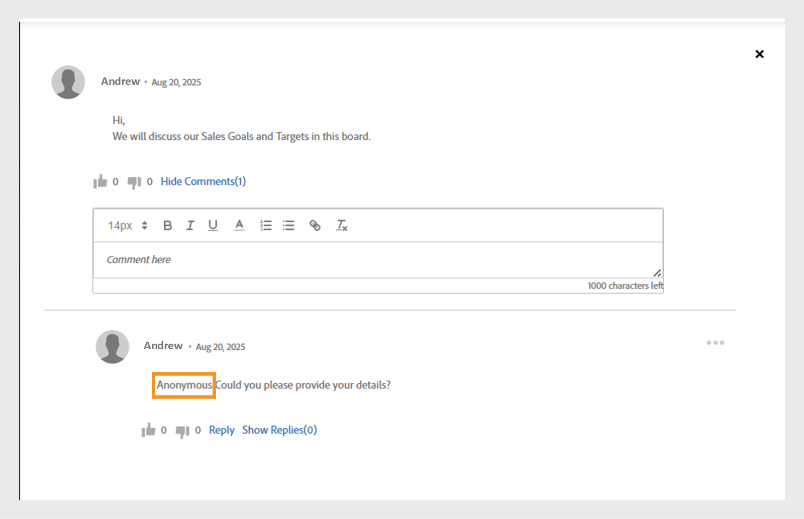
_社群學習貼文指出刪除用戶在被標籤時會顯示為匿名_

### 技能篩選器 {#skillfilter}

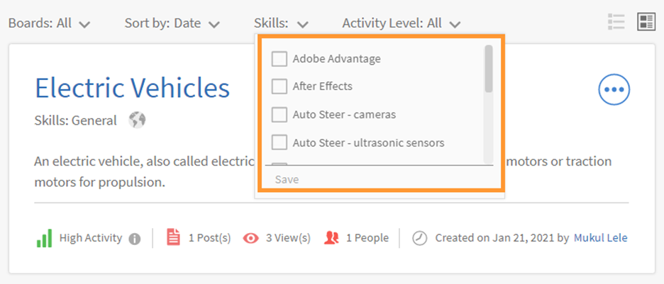

*整理貼文*

利用技能篩選器，你可以選擇多個技能來篩選板面。 選擇技能後，也可以清除篩選條件。

### 活動層級過濾器 {#activitylevelfilter}

*過濾器活性等級*

利用活動篩選器，你可以根據板內互動的大小來排序板塊。 你可以依照以下方式分類：

* 高活動
* 正常活動
* 低活性

在棋盤視圖中，你可以執行通常的棋盤層級動作。

<!---->

## 下載文章 {#downloadposts}

學習者可從社交學習平台下載內容並附帶附件，以便離線使用。

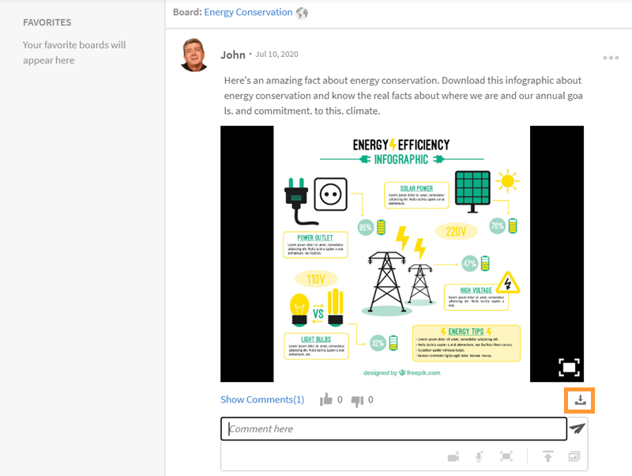

*在社群媒體下載貼文*

你可以從貼文、留言或回覆區下載內容。 你一次只能下載一個檔案。

兩種使用者（內部或外部）都必須能夠下載內容。

下載按鈕也會出現在貼文、留言或回覆的搜尋結果中。

你目前還無法在裝置應用程式中下載貼文。 此功能將很快上線。

## 支援的內容格式 {#supportedcontentformats}

<table>
 <tbody>
  <tr>
   <td>
    
<b>內容類型</b>
</td>
   <td>
    
<b>延伸</b>
</td>
  </tr>
  <tr>
   <td>
    
影片
</td>
   <td>
    
WMV、F4V、ASF、3GP、3G2、AV、MOV、H264、M4V、MP4、MPEG、MPG
</td>
  </tr>
  <tr>
   <td>
    
音效
</td>
   <td>
    
MP3、AMR、M4A、WAV、WMA、AAC
</td>
  </tr>
  <tr>
   <td>
    
靜態檔案
</td>
   <td>
    
PDF、ppt、pptx、doc、docx、xls、xlsx
</td>
  </tr>
  <tr>
   <td>
    
圖片
</td>
   <td>
    
jpg、jpeg、png、BMP、GIF
</td>
  </tr>
 </tbody>
</table>

## 該板僅對特定使用者可見 {#selected-users}

同時擔任 **管理員** 角色的學習者可以將使用者群組加入私人看板。 任何使用者群組都可以加入私人板，且屬於該用戶群的使用者只能存取板子。

如果新增使用者加入使用者群組，兩位使用者都能看到私人看板。

若有使用者被移除私人看板，該使用者將無法再看到該私有看板。

如果將多個使用者群組加入私人板，所有群組的使用者都能存取私有板。

<!--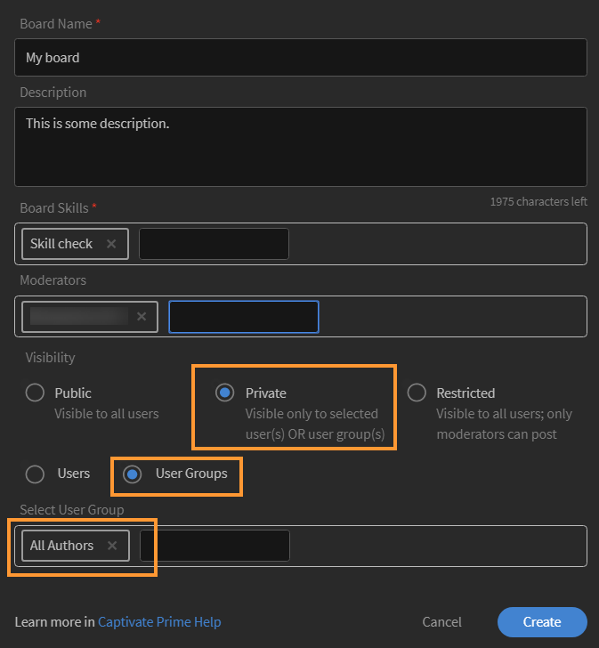-->

## 貼文中可執行的動作 {#actionsthatcanbedoneonapost}

點擊文章右上角的摺疊選單圖示即可查看其選項。 以下選單清單顯示：編輯、新增至我的故事、複製網址、刪除及檢舉。

只有部分使用者擁有執行特定任務的權限。 以下類型的使用者包括內容擁有者、版主及組織管理員。

<table>
 <tbody>
  <tr>
   <td>
    
<b>SL。 不。</b>
</td>
   <td>
    
<b>動作</b>
</td>
   <td>
    
<b>說明</b>
</td>
  </tr>
  <tr>
   <td>
    
1
</td>
   <td>
    
編輯
</td>
   <td>
    
編輯功能允許內容創作者更正或修改他們的貼文。
</td>
  </tr>
  <tr>
   <td>
    
2
</td>
   <td>
    
加入我的故事
</td>
   <td>
    
故事是由使用者策劃的內容集合。 使用者可將內容的可見性設定為私人或公開。
</td>
  </tr>
  <tr>
   <td>
    
3
</td>
   <td>
    
複製網址
</td>
   <td>
    
此選項允許所有使用者複製版塊或貼文的網址並分享。
</td>
  </tr>
  <tr>
   <td>
    
4
</td>
   <td>
    
刪除
</td>
   <td>
    
刪除選項會在用戶確認後移除貼文。
</td>
  </tr>
  <tr>
   <td>
    
5
</td>
   <td>
    
賽事報導
</td>
   <td>
    
每位用戶都有權在貼文侵犯隱私或內容不當時舉報濫用貼文。

    
一旦貼文被舉報，會通知版主管理員及版主採取後續行動。
</td>
  </tr>
 </tbody>
</table>

**加入我的故事**

社群限時動態讓使用者可以新增或創建由自己或其他用戶發表的貼文。

要為限時動態添加貼文，請依照以下步驟操作：

1. 點擊文章右上角的摺疊選單圖示，然後點選 **[!UICONTROL Add to my Story]**。

   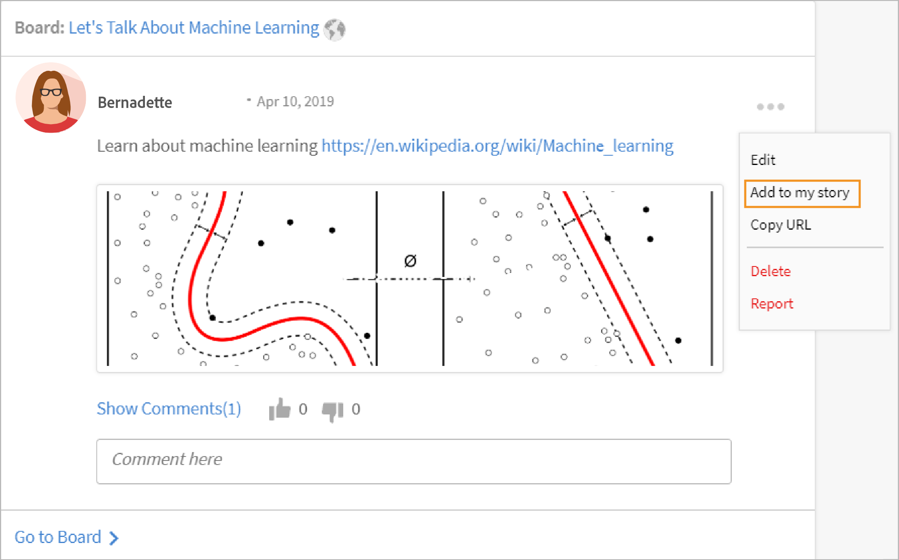

   *加入故事*

1. 在 **「選擇故事** 」對話框中，選擇一個相關故事來加入貼文。 如果沒有相關的現有故事，請點擊 **新故事**&#x200B;來建立故事。

   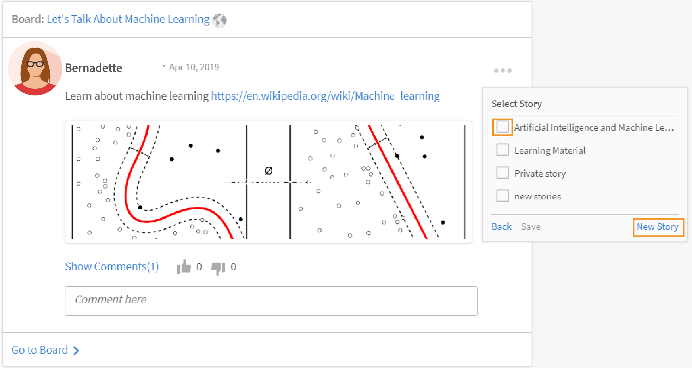

   *創造一個故事*

1. 在新故事對話框中，填寫故事名稱和描述欄位。 你也可以將故事的可見度設為公開或私密。

   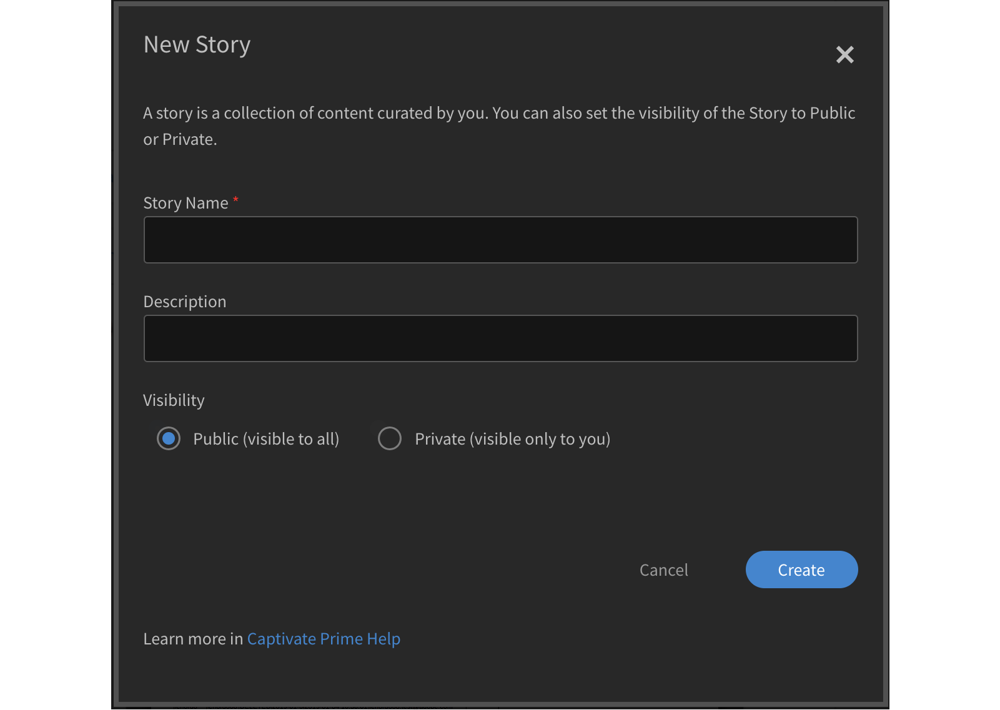

   *新增故事名稱與描述*

   要查看用戶創建的故事，請從個人檔案選單中點擊使用者名稱。

## 使用者執行貼文操作的權限 {#userprivilegesforperformingtheactionsonapost}

<table>
 <tbody>
  <tr>
   <td>
    
 
</td>
   <td>
    
<b>內容擁有者</b>
</td>
   <td>
    
<b>任何使用者</b>
</td>
   <td>
    
<b>董事會主持人</b>
</td>
   <td>
    
<b>行政長官</b>
</td>
  </tr>
  <tr>
   <td>
    
<b>編輯</b>
</td>
   <td>
    
是的
</td>
   <td>
    
不
</td>
   <td>
    
不
</td>
   <td>
    
不
</td>
  </tr>
  <tr>
   <td>
    
<b>加入我的故事</b>
</td>
   <td>
    
是的
</td>
   <td>
    
是的
</td>
   <td>
    
是的
</td>
   <td>
    
是的
</td>
  </tr>
  <tr>
   <td>
    
<b>複製網址</b>
</td>
   <td>
    
是的
</td>
   <td>
    
是的
</td>
   <td>
    
是的
</td>
   <td>
    
是的
</td>
  </tr>
  <tr>
   <td>
    
<b>刪除</b>
</td>
   <td>
    
是的
</td>
   <td>
    
不
</td>
   <td>
    
是的
</td>
   <td>
    
是的
</td>
  </tr>
  <tr>
   <td>
    
<b>賽事報導</b>
</td>
   <td>
    
是的
</td>
   <td>
    
是的
</td>
   <td>
    
是的
</td>
   <td>
    
是的
</td>
  </tr>
 </tbody>
</table>

## 在看板中瀏覽內容 {#viewingcontentinboards}

看板是一組貼文的集合。 社會學習中的每個板子都是基於一項技能建立的。 在社交學習中，使用者可以查看 **「所有看板** 」頁面和 **「我的看板」** 頁面。

在「所有論壇」頁面中，所有使用者在活動範圍內創建的貼文或討論區都會被看到。 但在「我的看板」頁面中，只有使用者創建、追蹤並參與的看板會被看到。

在我的看板頁面中，可見的看板可以依以下篩選方式篩選：全部、由我&#x200B;**創建、**&#x200B;由我&#x200B;****&#x200B;留言、隨後由我&#x200B;**。******

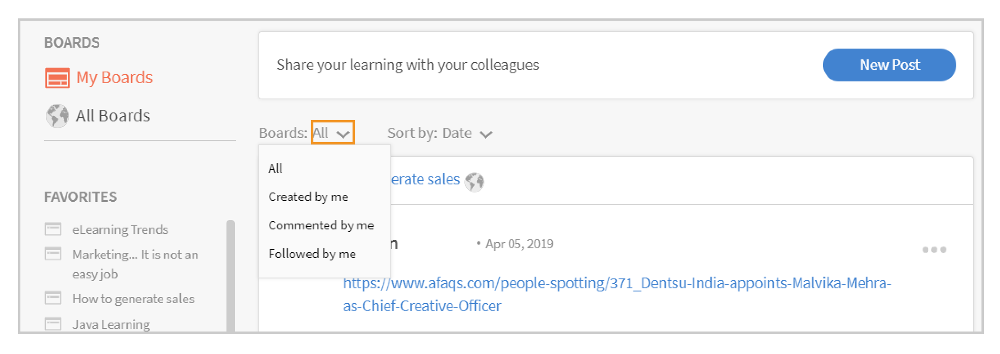

*過濾可見板*

在「我的看板」和「全部看板」中，使用者都可以依 **相關性** 或 **日期**&#x200B;排序看板。

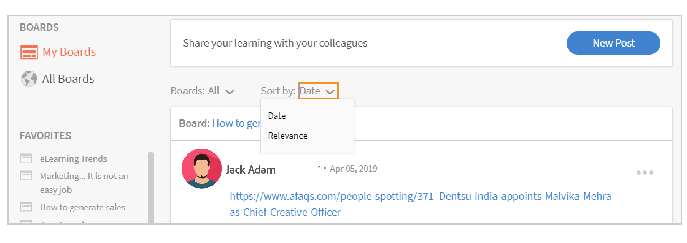

*依相關性與日期排序看板*

在建立文章時，如果沒有相關的看板，請點擊 [建立新看板](social-learning-web-user.md#Creatingcontentasapost)。  要查看、編輯、刪除、檢舉、複製網址，以及將看板加入你最愛的看板清單，請依照以下步驟操作：

1. 點擊看板名稱或點擊 **[!UICONTROL Go to board]**。
1. 從看板頁面點擊摺疊選單圖示，從下拉選單中選擇選項。

   <!--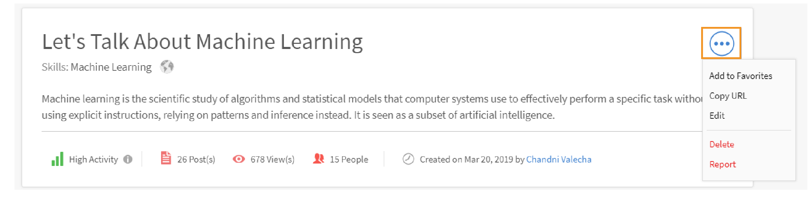-->

**使用者可以在板子頁面查看以下選項：**

* 本頁可見貼文數量、瀏覽量及追蹤者數。 板上也會顯示創建者名稱及創建日期，以及該板的頂尖專家。

* 新增到使用者最愛滑板清單的棋盤名稱也會顯示。

<!--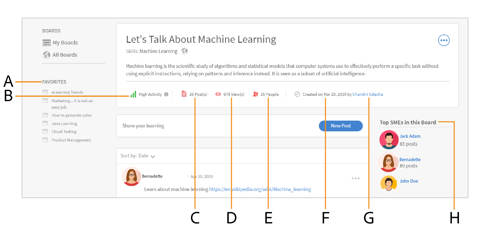-->

## 分享到社群媒體 {#sharetosocial}

Share to Social 是一個書籤小工具，讓使用者能將他們的線上學習，如網頁和部落格，直接分享到社群頁面上，作為一篇文章。 欲了解更多資訊，請參閱 [「分享至社會學習](share-to-social.md)」。

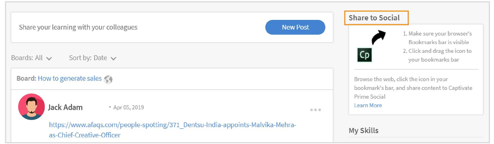

*分享給社會學習*

## 我的技能 {#myskills}

使用者可以在「我的看板」頁面查看使用該技能創建的技能及貼文或論壇數量。 要查看使用者在建立看板時所使用的所有技能，請點擊 **[!UICONTROL See all Skills]**。

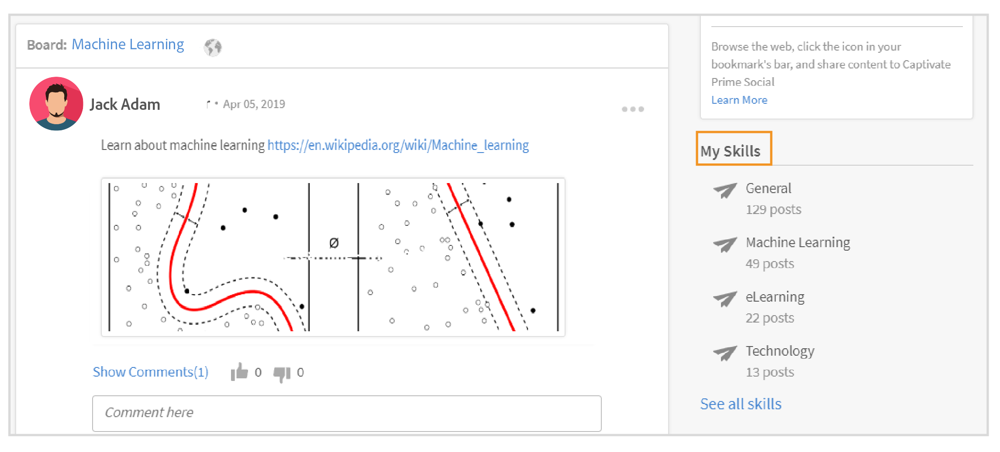

*查看所有技能*

## 我追蹤的人 {#peopleifollow}

在「我的論壇」頁面中，使用者可以看到他們追蹤的人名以及他們已發表的貼文數量。

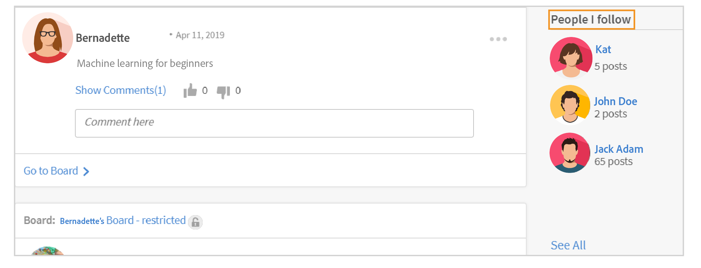

*學習者會跟隨的人*

要追蹤其他用戶，請依照以下步驟操作：

1. 要查看其他使用者的個人頁面，請點擊他們的名字。
1. 點擊追蹤/取消追蹤按鈕即可執行所需的動作。

   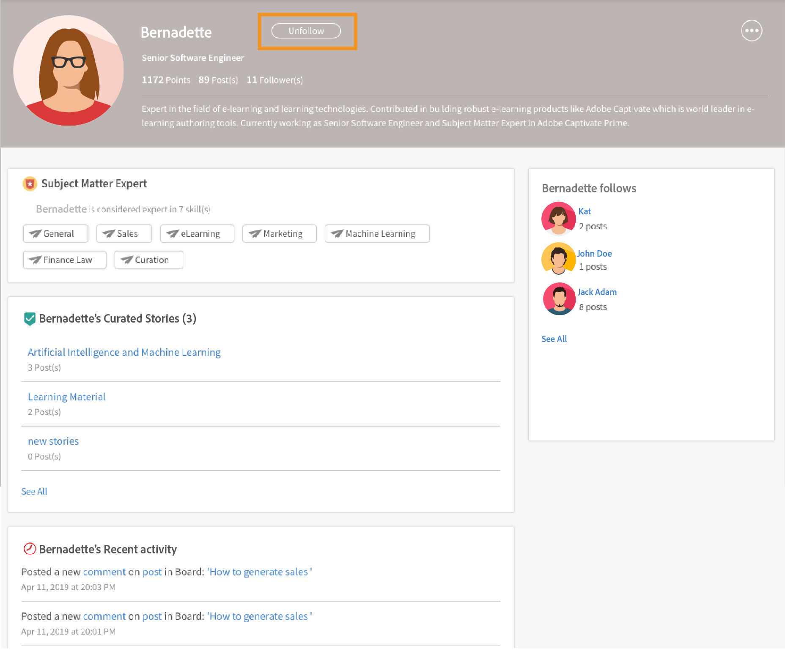

   *追蹤或取消追蹤某用戶*

## 社交排行榜 {#socialleaderboard}

社群排行榜強化遊戲化。 活動點數會頒給用戶，透過創建新貼文/討論區、獲得讚好、提供正確問題答案及其他社交學習參與。

同一範圍所有用戶的總點數與新貼文數會在社群排行榜列表中顯示。 積分最高的學習者會排在社交排行榜的最前面，其他學習者依序排在後。

點擊&#x200B;**[!UICONTROL Go to Leaderboard]****「我的考試**」頁面查看所有學習者及其所獲得的積分。

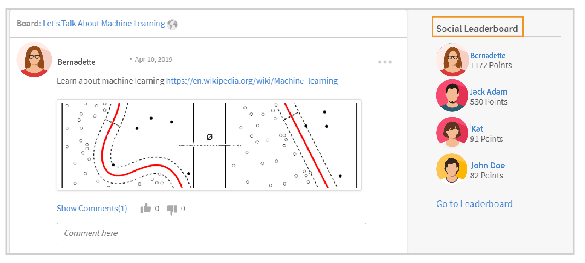

*查看所有學習者*

## 活動點 {#activitypoints}

給予用戶的活動點數是根據所完成的社交活動而定。

**以下行為可獲得活動點數：**

* 製作棋盤可得5分。
* 新增貼文作為文字或問題類型，得5分。
* 在任何貼文留言加2分。
* 第一個開始使用棋盤的玩家可獲得1分。 用戶在該公告板上發表前20篇新貼文，總共可獲得20分。

## 如何成為主題專家（SME） {#howtobecomeasubjectmatterexpertsme}

主題專家（SME）是指在某項特定技能上具備專業知識的人。 在學習管理社會學習中，使用者依據技能獲得的最高活動點數被指定為 SME。

頂尖的專家有權在學習者內容發布於 Social Learning 的公告板前，先為其策劃內容。

組織管理者也有權為學習者增加點數，使其成為某項技能的專家。

## 作為專家，如何策劃內容？ {#howtocuratecontentasasme}

1. 當使用者建立新文章或論壇時，SME 會收到通知，顯示該論壇上的文章正在等待策展。

   <!--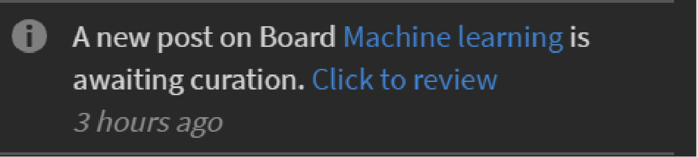-->

1. 要管理文章，請點擊「 **點擊檢視** 」連結。 此操作會引導 SME 進入內容審核頁面，該頁面看起來如下方截圖所示。

   <!--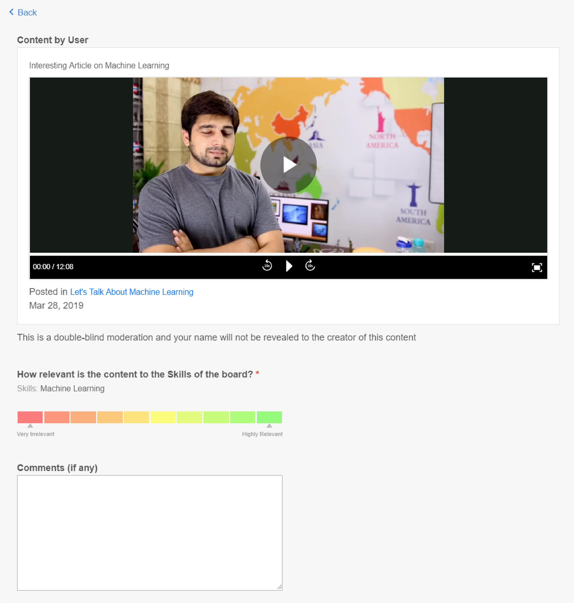-->

1. 要根據內容與板上技能的相關性比例來評分，請選擇相關性等級中的顏色。 第一種顏色被評為無關緊要（10% 相關性），最後一種顏色則代表非常相關（100% 相關性）。
1. 建議專家根據特定的相關性分數來撰寫評論。 使用者在閱讀留言後，能更清楚為何自己的貼文被拒絕。

<!--## AI-enabled auto curation {#autocuration}-->

## 正式與非正式學習中的搜尋 {#searchinformalandinformallearning}

Social Learning 的每個頁面都有搜尋欄位，讓使用者可以搜尋任何板、技能或內容。 請輸入搜尋欄，點擊搜尋圖示或按鍵盤上的 Enter 鍵搜尋。

<!--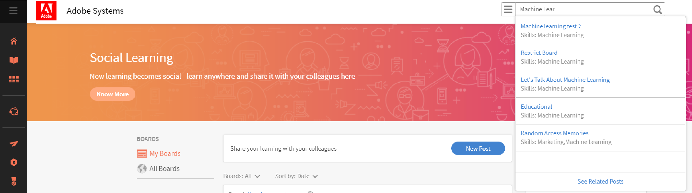-->

以下非正式學習頁面有搜尋欄位： **我的板子**、 **全部板**、 **板子頁面**、使用者 **個人檔案頁**，以及 **其他學習者的個人檔案頁**。

當使用者在非正式學習中搜尋內容時，會顯示學習管理器中該內容的總搜尋結果數。

同樣地，在正式學習頁面搜尋內容時，會顯示非正式學習中搜尋結果的數量。

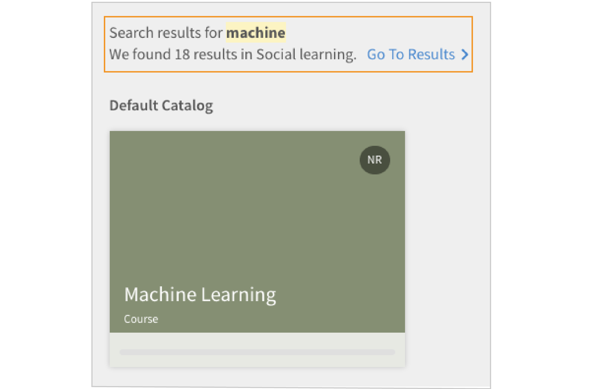

*學習搜尋結果*

在非正式學習委員會的頁面中，只能進行與委員會相關的搜尋。 任何與棋盤無關的搜尋都不會顯示。

## 查看使用者資料 {#viewuserprofile}

若學習者啟用了社交學習，使用者可點擊 Social Learning 右上角的個人檔案圖片，並從下拉選單中點選姓名即可查看。

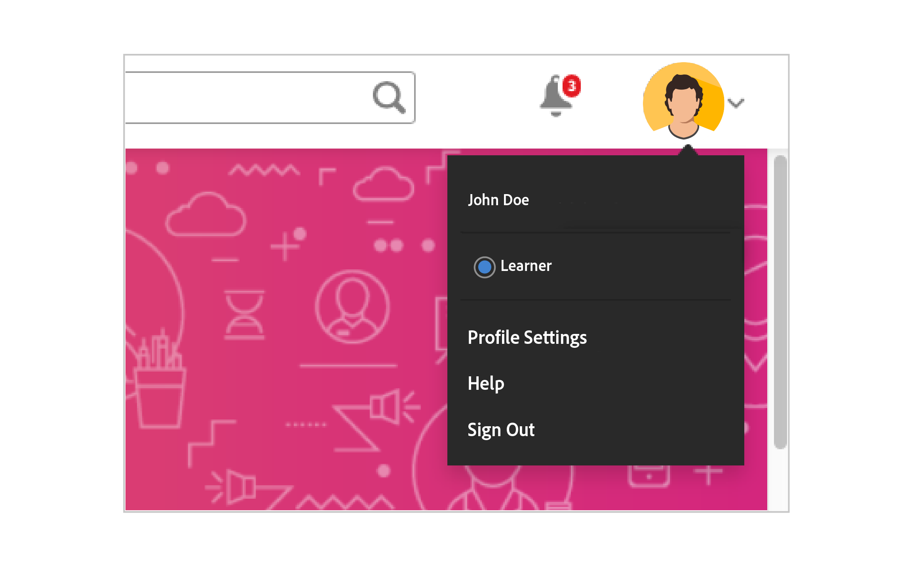

*查看使用者資料*

在個人頁面中，學習者可以看到累積的總分數、已發表的貼文數量以及追蹤者數量。

學習者也可查看其被指定為主題專家的技能。

學習者頁面同時展示&#x200B;**學習者策劃的故事**、**近期執行的活動**，以及追蹤&#x200B;**者。**

## 通知 {#notifications}

當 SME 批准或拒絕貼文時，使用者會收到通知，點擊視窗右上角的通知圖示即可查看。 使用者可查看通知、社交學習及正式學習活動。

<!--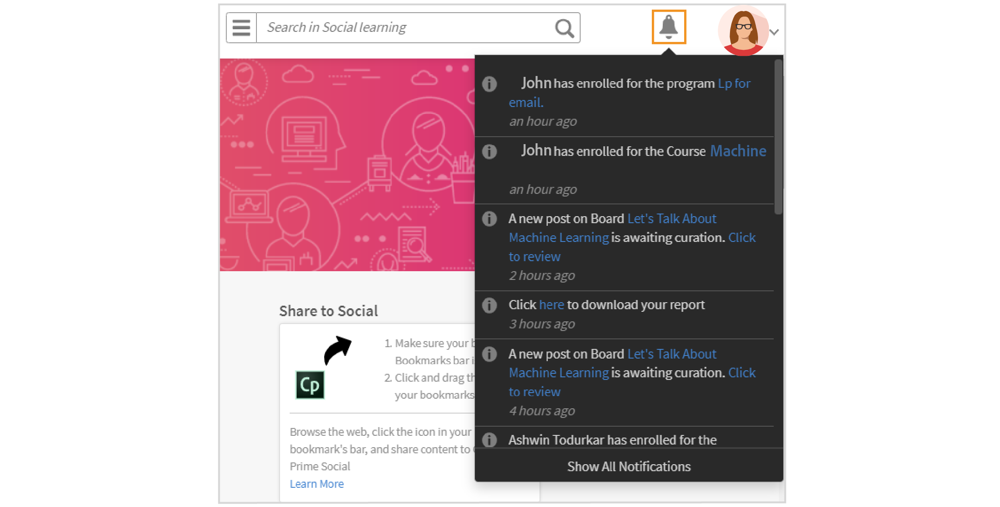-->
