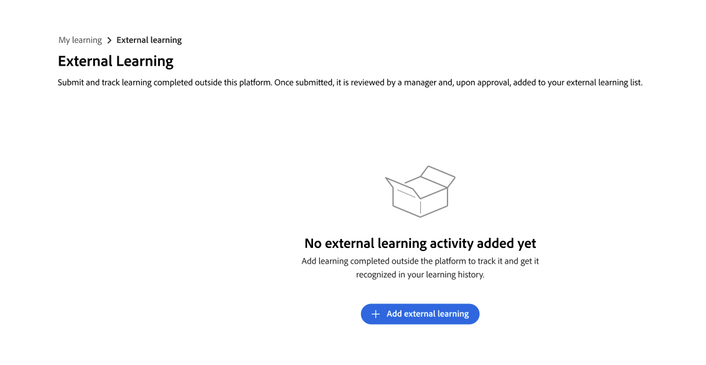

# 以學習者的身份提交外部學習

在 Adobe Learning Manager 中，你可以透過外部學習&#x200B;**功能記錄你在平台外完成的培訓——例如工作坊、認證考試、研討會或線上課程**。每份投稿都會交給你的主管審核。 一旦核准，該活動將顯示在您的學習者成績單中。

## 外部學習提交流程的運作方式

外部學習提交遵循三個步驟：

1. 你只需填寫一份提交表格，說明你完成的培訓內容，並可選擇性地上傳證明。

2. 你的主管會收到平台內通知並審核你的投稿。

3. 你的主管會批准或拒絕你的請求。 您會收到平台內的決定通知。

核准的提交會以完成的外部學習活動形式顯示在您的 **學習者成績單** 中。

你可以提交任意數量的外部學習申請。 你可以創建的投稿數量沒有限制。

**在導航中尋找外部學習**

外部學習可透過 **主導航的「我的學習** 」頁面取得。 選擇 **外部學習** 以查看您的投稿歷史並建立新投稿。

<!---->

如果你沒有看到 **外部學習** 選項，可能是你的管理員沒有啟用這個功能。 請聯絡你的管理員尋求協助。

### 提交外部學習申請

1. 在左側導覽中，選擇 **「我的學習**」。

2. 選擇 **外部學習** 選項。

3. 選擇 **新增外部學習**。   

4. 請填寫提交表格：

   1. **標題：** 輸入訓練名稱。 這個欄位是必修的。

   2. **說明/備註：** 請加入任何有助於主管理解培訓內容的細節，例如提供者名稱或學習目標。

   3. **開始日期：** 選擇訓練開始的日期。

   4. **結束日期：** 選擇培訓完成日期。

   5. **持續時間：** 輸入你在訓練上花費的總時間（以小時計）。

   6. **分數：** 若訓練包含評量，請輸入您的分數。

   7. **附件：** 上傳證書、逐字稿或其他文件作為證據。支援的檔案格式有 PDF、DOC、DOCX、PNG、JPEG 及 JPG。最大檔案大小為 50 MB。      

   8. 請填寫管理員設定的額外自訂欄位。

5. 選擇 **提交**。

你的主管會收到應用程式內通知，告知有新的外部學習請求正在等待審核。你的提交會出現 **在外部學習** 清單中，狀態為 **「待審核**」。<!---->

>[!NOTE]
>
>當你的主管批准或拒絕你的投稿時，你會收到平台內通知。

### 編輯待發表的文章

你可以在提交狀態為 **待審核**&#x200B;時編輯。 一旦主管批准或拒絕，你就不能再編輯該投稿了。

1. 在 **外部學習** 標籤中，找到你想更新的投稿。

2. 選擇提交內容即可開啟。

3. 選擇 **編輯**。

4. 必要時更新欄位。 表單顯示管理員設定的最新欄位配置，可能包含你最初提交時未出現的欄位。

5. 選擇 **提交**。

你的主管會收到新的通知並審核你更新的提交。

**如果你的投稿被拒絕：** 你無法編輯被拒絕的投稿。 要重新提交，請建立新的外部學習申請，並參考主管在評審意見中提供的回饋。

### 外部學習提交狀態

| **現況** | **意義** | **你會剪輯嗎？** |
|-----------------|----------------------------------------------------------------------------------|---------------------------------------------------------|
| 待審核 | 你的申請正在等待經理審查。 | 是的。 從投稿詳情頁選擇 **編輯** 。 |
| 已批准 | 你的主管已經批准了你的提交;這會包含在你的學習者成績單中。 | 不。 |
| 被拒絕 | 你的主管拒絕了你的投稿;請參考他們的意見以獲得指引。 | 不。 建立一個新的外部學習申請重新提交。 |
