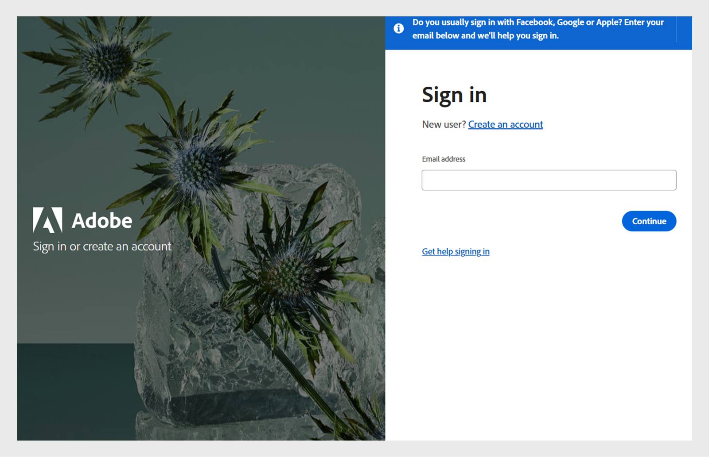
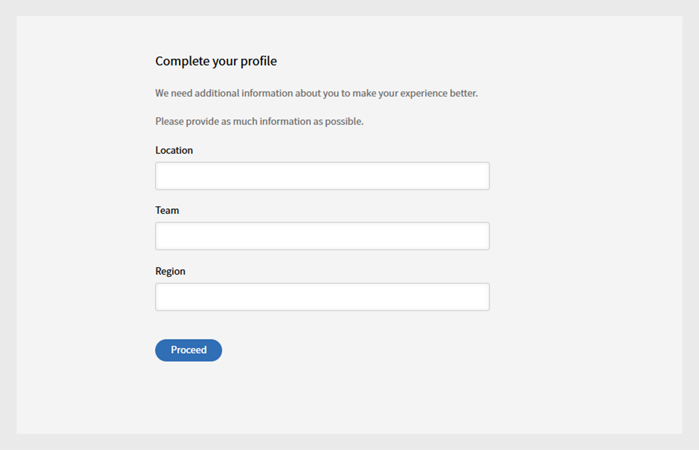

# 登入

以學習者身分登入Learning Manager。

首次使用Adobe Learning Manager時，學習者需要建立帳戶。 您可以透過下列兩種方式之一進行此操作：

* 自助註冊：使用歡迎電子郵件中提供的URL來建立您的帳戶。
* 管理員建立的帳戶：管理員可以代表您建立帳戶。

## 使用歡迎電子郵件URL建立帳戶

請依照下列步驟，使用歡迎電子郵件中的URL建立您的帳戶：

1. 使用您透過歡迎電子郵件從管理員那裡收到的安全連結來啟動Adobe Learning Manager。

   登入畫面隨即顯示。

1. 選取「登入」。

   

   *使用使用者名稱和密碼登入*

1. 輸入Adobe ID和密碼，然後按一下「登入」。

   如果您忘記密碼，請按一下忘記密碼？ 連結，並提供您用於建立Adobe ID的電子郵件ID。

   <!--
   If you do not have an Adobe ID, [click here](../../../manage-account.md) to learn how to create an Adobe ID.
   -->

1. 在作用中欄位中輸入資訊，以完成您的設定檔。

   
   _在[使用中欄位]中輸入您的資訊，以完成設定檔設定_

1. 或者，您也可以按一下「使用Enterprise ID連結登入」 ，以使用Enterprise ID。

>[!NOTE]
>
>第一次登入後，您的Adobe ID就會與公司帳戶建立關聯。 對於任何後續的登入，您可以將您在歡迎郵件中收到的帳戶URL （第二個URL）加入書籤。
