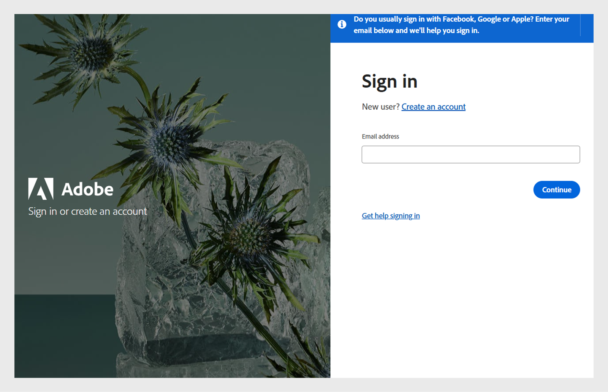

# 登入

在學習管理員中以學習者身份登入。

首次使用 Adobe Learning Manager 時，學習者需要建立一個帳號。 你可以用兩種方式來做：

* 自助註冊：請使用歡迎信箱中提供的網址建立您的帳號。
* 管理員創建的帳號：管理員可以代表你建立帳號。

## 請使用歡迎電子郵件網址建立帳號

請依照以下步驟使用歡迎電子郵件中的網址建立您的帳號：

1. 請使用管理員收到的歡迎電子郵件安全連結啟動 Adobe Learning Manager。

   登入畫面出現。

1. 選擇登入。

   

   *用使用者名稱和密碼登入*

1. 輸入 Adobe ID、密碼，然後點擊登入。

   如果你忘記密碼，請點選忘記密碼？ 連結並提供你用來建立 Adobe ID 的電子郵件 ID。

   <!--
   If you do not have an Adobe ID, [click here](../../../manage-account.md) to learn how to create an Adobe ID.
   
   -->

1. 請在「活躍」欄位輸入您的資訊以完成個人檔案。

   
   _請在「活躍欄位」輸入您的資訊以完成個人檔案設定_

1. 或者，你也可以點擊「以企業識別登入」連結來使用企業識別。

>[!NOTE]
>
>當你第一次登入時，你的 Adobe ID 會與你的公司帳號綁定。 在後續登入時，你可以將你在歡迎信中收到的帳號網址（第二個網址）加入書籤。
