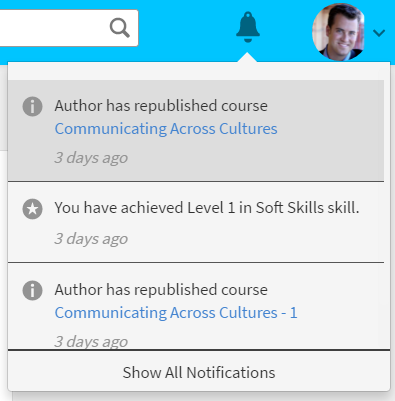
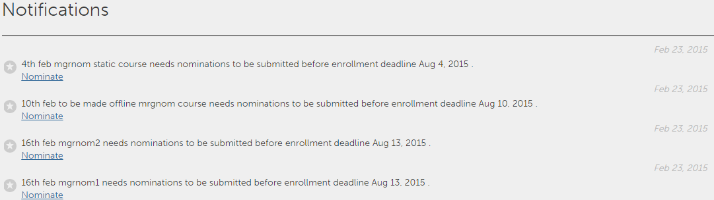
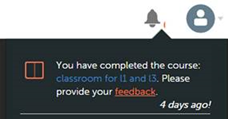

# 使用者通知

<!--User notifications for Learners in Learning Manager.-->

通知功能適用於Adobe Systems學習管理器的所有使用者。 但是，每個用戶根據其角色在各種情況下都會收到不同類型的通知。 給使用者的所有警報和通知都通過通知快顯視窗對話框顯示。

## 存取通知 {#accessnotifications}

用戶可以通過按兩下視窗右上角的通知圖示來查看通知。

以下螢幕擷圖顯示了學習者角色的示例通知窗口：

*檢視所有通知*

此快顯視窗窗口顯示所有通知的突出顯示以及發生次數時間和滾動條。

您可以根據通知圖示頂部突出顯示的數位來瞭解最新通知的數量。 例如，如果在上一個登入之後有五個最新通知，則可以看到通知圖標頂部顯示的數位 5。 閱讀所有最新通知后，這些數位就會消失。

學習者可以通過在通知彈出視窗中按兩下拒絕來拒絕經理分配給他們的課程。

## 排程推送通知

每當學習者錯過課程截止日期時，他們都會收到推送通知。 學習者可以選擇將提醒推遲 24 小時，或者在下周收到每個逾期提醒時收到提醒。 這僅適用於截止日期逾期通知。

## 顯示所有通知 {#showallnotifications}

按下 **[!UICONTROL Show all notifications]** 通知快顯視窗窗口底部的連結，將所有通知視圖到單獨的頁面中。

*將所有通知檢視到不同的頁面*

**面向學習者的通知類型**

每當觸發以下事件時，學習者都會收到通知：

1. 學習者已完成課程
1. 學習者已完成課程，但尚未提供 L1 反饋
1. 學習者已獲得徽章
1. 管理員已為學習者註冊課程或學習方案或認證
1. 經理已為課程指定學習者，學習者必須接受或拒絕
1. 已為學習者分配了新的能力
1. 學習者獲得了能力
1. 學習者完成學習方案
1. 學習者接受提名
1. 學習者拒絕提名
1. 對於經理批准的課程，經理批准/拒絕課程註冊請求
1. 學習者等待清單被清除。
1. 學習者已自動註冊課程或學習方案或認證
1. 學習者完成認證
1. 經理批准/拒絕學習者上傳的認證完成文件證明
1. 當特定課程的截止日期臨近時執行個體。 （管理員可以設置學習者顯示提醒通知的日期）。

## 提供意見 {#providefeedback}

學習者可以在完成具有反饋選項的課程后提供 L1 反饋。 要提供反饋，請在完成課程后按兩下反饋連結如下所示。

*提供課程反饋*

>[!NOTE]
>
>僅當管理員為特定課程啟用課程反饋選項時，學習者才會獲得該選項。
