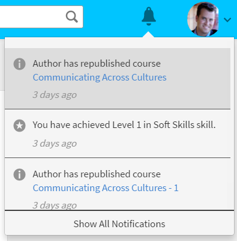
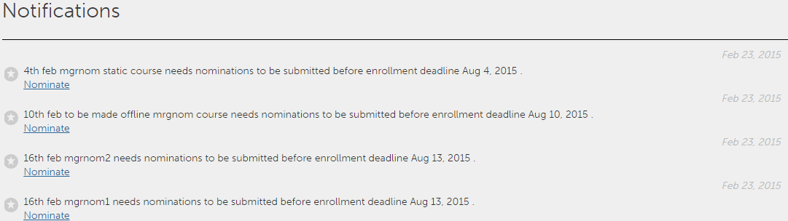
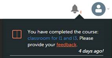

# 使用者通知

<!--User notifications for Learners in Learning Manager.-->

通知功能適用於 Adobe Learning Manager 的所有使用者。 但每個使用者根據其角色在不同情境下會收到不同類型的通知。 所有通知與通知都會透過通知彈出視窗顯示。

## 存取通知 {#accessnotifications}

使用者可點擊視窗右上角的通知圖示查看通知。

以下截圖顯示學習者角色的通知視窗範例：

*查看所有通知*

這個彈出視窗會顯示所有通知的重點、發生時間和滾動列。

你可以根據通知圖示上方高亮的數字來知道最新通知的數量。 例如，如果你上次登入後有五個最新通知，你可以看到通知圖示上方顯示數字 5。 這些數字在你看完所有最新通知後就會消失。

學習者可以透過通知視窗中的「拒絕」來拒絕經理指派給他們的課程。

## 排程推播通知

每當學員錯過課程截止日期時，都會收到推播通知。 學習者可選擇將提醒暫停24小時，或在下週收到每一個逾期提醒時的提醒。 此規定僅適用於逾期通知。

## 顯示所有通知 {#showallnotifications}

點擊 **[!UICONTROL Show all notifications]** 通知彈出視窗底部的連結，可在獨立頁面查看所有通知。

*在另一個頁面查看所有通知*

**學習者通知的類型**

當以下事件觸發時，學習者會收到通知：

1. 學習者已完成課程
1. 學習者已完成課程，卻尚未提供第一語言回饋
1. 學習者已獲得徽章
1. 行政人員已為學習者報名課程、學習計畫或認證
1. 經理已提名學習者參加課程，學習者必須接受或拒絕
1. 學習者被分配了一項新的能力
1. 學習者達成能力
1. 學習者完成學習計畫
1. 學習者接受提名
1. 學習者被拒絕提名
1. 對於經理核准的課程，經理會批准或拒絕課程註冊申請
1. 學員候補名單已清空。
1. 學習者已被自動註冊到課程、學習計畫或認證
1. 學習者完成認證
1. 經理批准或拒絕學員上傳的認證完成證明文件
1. 當某門課程的截止日期即將來臨時。 （管理員可設定提醒通知出現的日期。）

## 提供回饋 {#providefeedback}

學習者完成課程後可以提供第一語言回饋，課程中包含回饋選項。 完成課程後，請點擊下方所示的回饋連結以提供回饋。

*提供課程回饋*

>[!NOTE]
>
>學習者只有在管理員啟用特定課程時，才會獲得課程的回饋選項。
