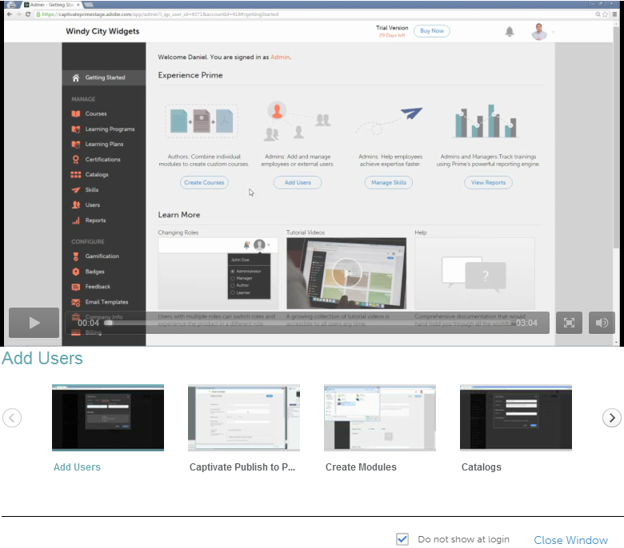
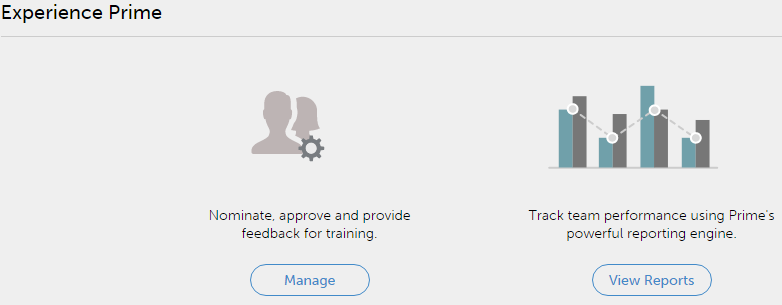

# 經理人入門指南

如何開始擔任學習經理。

開始頁面幫助你瀏覽應用程式的主要功能。

一旦你以管理員身份登入，就能看到彈出視窗，裡面有影片清單。

## 觀看範例影片 {#viewsamplevideos}

瀏覽範例教學影片，了解你作為經理角色的主要特點。 如果你不想讓這個彈出視窗在登入時出現，可以在彈出視窗右下角點擊「登入時不顯示」選項來停用它。

點擊 **[!UICONTROL Close Window]** 關閉彈出視窗。

## 開始頁面 {#gettingstartedpage}

從開始頁面，你可以執行以下操作：

* 查看報告 - 使用報告追蹤團隊表現。
* 管理團隊——提名、核准並提供課程回饋。

你也可以透過觀看教學影片、說明內容及了解不同角色來進一步了解學習經理應用程式。

