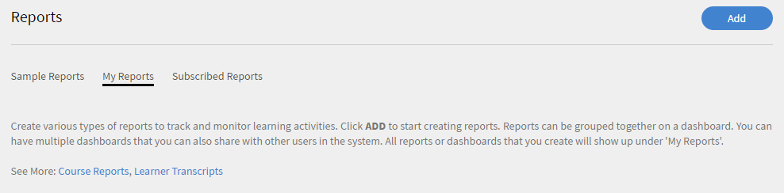
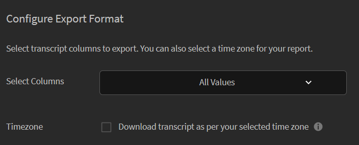

# 學習者成績單

瞭解如何根據使用者、學習物件或Learning Manager中的技能下載學習者成績單。

Adobe Learning Manager可讓組織的經理產生與學習者相關的成績單。

## 產生學習者成績單 {#generatelearnertranscripts}

1. 若要產生學習者成績單，請在[管理員]登入的左窗格上按一下&#x200B;**[!UICONTROL Reports]**。
1. 按一下頁面上的&#x200B;**[!UICONTROL My Reports]**&#x200B;索引標籤。
1. 按一下&#x200B;**[!UICONTROL Learner Transcripts]**&#x200B;連結。

   

   *建立學習者成績單的報告*

1. 學習者成績單對話方塊隨即出現。 選擇您需要產生成績單的日期範圍。

   >[!NOTE]
   >
   >依預設，開始日期是學習者的註冊日期，結束日期永遠是目前的日期。 當您需要資料時，您只能修改開始日期。

1. 從[選取學習者]欄位中選擇學習者名稱，然後按一下&#x200B;**[!UICONTROL Generate]**。

您可以選擇單一學習者或學習者群組。 若要新增多個學習者，請按一下「新增更多學習者」。

成績單會以.xls檔案的形式產生並下載至您的電腦。 每個.xls excel檔案都有七張工作表，其詳細資訊如下：

## 根據時區下載學習者成績單 {#lt-timezone}

管理員也可以像管理員一樣選擇要匯出的欄。 此外，經理可以根據他/她在設定檔設定中選取的時區下載學習者成績單。

如果管理員啟用此選項，則會從設定檔設定頁面中的設定值中挑選時區，如下所示。

>[!NOTE]
>
>對於新的管理員，「時區」核取方塊會停用。

*下載學習者時區成績單*

## 學習者成績單檔案內容 {#learnertranscriptfilecontent}

典型的學習者成績單檔案包含單一檔案中的六張Excel工作表。 學習者成績單可提供資料的整體深入分析，包括每個課程涉及的學習者人數、其技能、根據課程或學習者的競爭百分比，以及合規性儀表板。 學習者成績單中提供的控制面板如下：

**學習者成績單**

在學習者成績單Excel工作表中，連同有關學習者的設定檔詳細資訊一起，提供了學習物件明智的消耗詳細資訊，例如註冊日期、開始日期、已習得等級、已習得測驗分數等。 如果課程屬於任何學習計畫的一部分，則會以個別課程使用情況詳細資訊以外的方式單獨列出。

**1 — 學習活動儀表板**

在此學習對象專屬控制面板中，您可以檢視每個課程、學習計畫或認證的學習者人數。 您可以檢視特定學習物件的學習者進度表。 此工作表會顯示完成課程或學習計畫的學習者數、進行中的學習者以及學習者的到期日等資料。

系統會根據您指定到期日及進度百分比臨界值的輸入欄位，計算特定課程的使用者進度。 例如，如果您在「輸入」欄位中指定7天和70%作為值，則會顯示7天後到期的課程以及進度超過70%的課程的課程進度。 您也可以在此工作表中變更期間，修改過的資料會自動顯示在此儀表板中。

**2 — 學習活動儀表板**

此學習儀表板會顯示特定使用者的資料。 您可以從此儀表板檢視特定使用者已註冊的課程、學習計畫或認證。 此表格也會顯示使用者已完成哪些學習物件、進行中的學習物件，以及使用者即將到期的資料。

每個課程的使用者進度會根據您指定的輸入進行計算。 即到期日與進度百分比值。 例如，如果您在「輸入」欄位中指定7天和70%作為值，則會顯示不同課程（7天後到期）的使用者進度以及進度超過70%的課程。

**技能**

在技能表中提供技能名稱、技能等級、所需學分、已認列學分、完成百分比及其他設定檔明細。 以下提供技能Excel表範例快照以供參考。

**技能儀表板**

在此儀表板中，您可以檢視您的組織是否具備各種技能。 對於特定技能，您可以檢查組織中應該擁有該技能的使用者數量與實際擁有該技能的使用者數量。 此儀表板也會指定可能需要重新整理其技能的使用者。 系統會根據您在「輸入」欄位中輸入的輸入來計算此值。 例如，如果您輸入50天作為輸入，儀表板會提供可能需要在50天後重新整理其技能的使用者資料。

此技能儀表板比較適合使用者。 您可以篩選特定使用者或多個使用者，並將他們的技能層級檢視為控制面板。 這張表可協助經理和管理員追蹤每個學習者的技能，並將其與預期的技能進行比較。 技能儀表板也會顯示需要重新整理技能的學習者。 系統會根據您在「輸入欄位」中輸入的天數，計算學習者重新整理清單。

**法規遵循儀表板**

合規性儀表板分為兩部分 — 每位使用者的合規性報告和每次培訓的合規性報告。 對於以使用者為基礎的報告，您可以使用合規性儀表板來追蹤即將到達重要合規性計畫到期日期的使用者。 對於以培訓為基礎的報告，您可以依學習計畫或認證進行篩選。

對於這兩個相容性報告，請依到期日篩選以檢視適當的資料。
