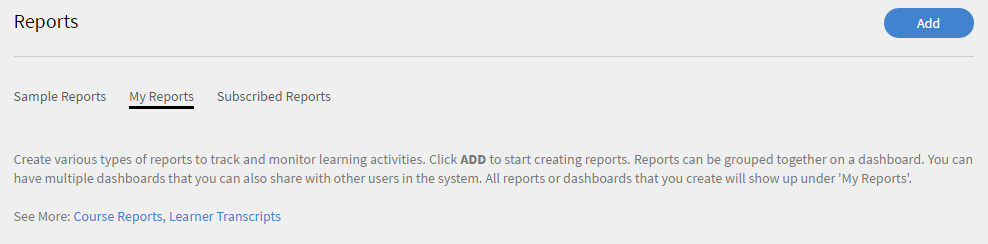
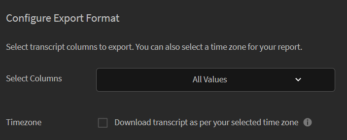

# 學習者成績單

學習如何在學習管理員中根據使用者、學習物件或技能下載學習者成績單。

Adobe Learning Manager 讓組織的經理能夠產生與學習者相關的成績單。

## 產生學習者成績單 {#generatelearnertranscripts}

1. 要產生學習者成績單，請點擊 **[!UICONTROL Reports]** 經理登入中的左側窗格。
1. 點擊 **[!UICONTROL My Reports]** 頁面上的標籤。
1. 點擊 **[!UICONTROL Learner Transcripts]** 連結。

   

   *為學習者成績單建立報告*

1. 會跳出學習者成績單對話框。 請選擇您需要產生成績單的日期範圍。

   >[!NOTE]
   >
   >預設情況下，從開始日期為學員註冊日期，起訖日期永遠為當前日期。 你只能修改從你需要資料開始的日期。

1. 從「選擇學習者」欄位選擇學習者姓名，然後點擊 **[!UICONTROL Generate]**。

你可以選擇單一學習者或多個學習者團體。 若要新增多位學習者，請點擊「新增更多學習者」。

逐字稿會產生並下載到您的電腦，作為.xls檔案。 每個.xls Excel 檔案包含七個工作表，詳細資訊如下：

## 依時區下載學習者成績單 {#lt-timezone}

與管理員類似，管理者也可以選擇要匯出的欄位。 此外，經理可依其在個人資料設定中選擇的時區下載學習者成績單。

若管理員啟用此選項，則會從設定頁面中設定的時區中選擇，如下所示。

>[!NOTE]
>
>對於新管理員，時區勾選框會被關閉。

*下載學習者成績單以供 Zome 使用*

## 學習者成績單檔案內容 {#learnertranscriptfilecontent}

一個典型的學習者成績單檔案由六份Excel表格組成。 學習者成績單表提供整體數據洞察，包括每門課程參與的學習人數、技能、基於課程或學習者的競爭比例，以及合規儀表板。 以下是學習者成績單中可用的儀表板：

**學習者成績單**

在學習者成績單的 Excel 表格中，除了學習者的個人資料外，還會依學習項目提供使用資訊，如報名日期、開始日期、取得成績、測驗成績等。 如果課程是任何學習計畫的一部分，它們會獨立列出，且不列個別課程的使用詳情。

**1 - 學習活動儀表板**

在這個專為 LO 設計的儀表板中，您可以查看每門課程、學習計畫或認證的學習人數。 你可以查看特定學習對象的學習進度表。 此表顯示完成課程或學習計畫的學習人數、正在進行的學習者及學習者的截止日期等資料。

使用者在特定課程的進度是根據輸入欄位計算，該欄位中你指定截止日期和進度百分比門檻。 例如，如果你在輸入欄位中指定 7 天和 70% 的數值，則會顯示 7 天內截止課程的進度，以及超過 70% 進度的課程進度。 你也可以在這個工作表中更改時間範圍，修改後的資料會自動顯示在這個儀表板中。

**2 - 學習活動儀表板**

這個學習儀表板會顯示特定使用者的資料。 從這個儀表板，你可以查看特定使用者所報名的課程、學習計畫或認證。 表格同時顯示使用者已完成的學習物件、進行中的學習物件，以及即將到期的日期。

使用者在每門課程的進度會根據你指定的輸入來計算。 也就是截止日期和進度百分比的數值。 例如，如果你在輸入欄位中指定 7 天和 70% 的數值，使用者會顯示不同課程的進度，針對 7 天內截止的課程，以及超過 70% 進度的課程。

**技巧**

技能表中會提供技能名稱、技能等級、所需學分、已獲得學分、完成率及其他個人資料。 以下附上技能範例 Excel 表格供參考。

**技能儀表板**

在這個儀表板中，您可以查看您的組織是否具備多項技能。 針對特定技能，你可以比較組織中應該擁有該技能的用戶數量與實際擁有該技能的人數。 這個儀表板也會指定可能需要更新技能的使用者。 這個數值是根據你在輸入欄位輸入的輸入來計算的。 例如，如果你輸入 50 天作為輸入，儀表板會提供可能需要更新技能的用戶資料。

這個技能儀表板更符合使用者需求。 你可以篩選特定使用者或多位使用者，並以儀表板方式查看他們的技能等級。 此表能協助管理者與管理者追蹤每位學員的技能與預期技能的差異。 技能儀表板也說明了需要更新技能的學習者。 學習者的刷新清單是根據你在輸入欄位輸入的天數計算出來的。

**合規儀表板**

合規儀表板分為兩部分——每位使用者的合規報告與依培訓提供的合規報告。 針對使用者報告，您可以使用合規儀表板追蹤重要合規計畫即將到期的用戶。 針對訓練型報告，您可以依學習計畫或認證篩選。

對於這份合規報告，請依截止日期篩選以查看相關資料。
