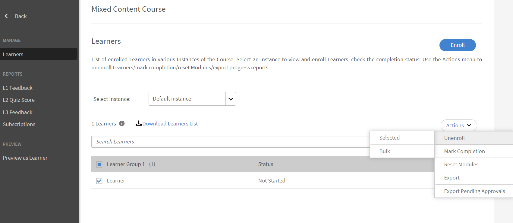
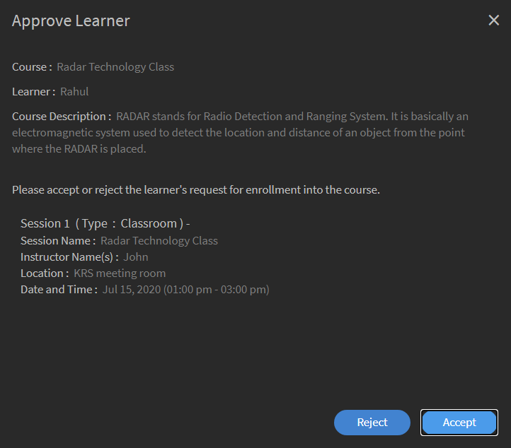
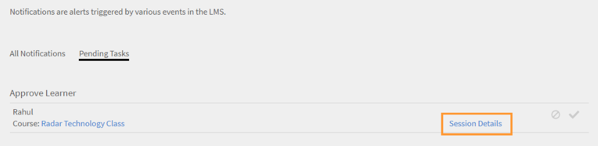
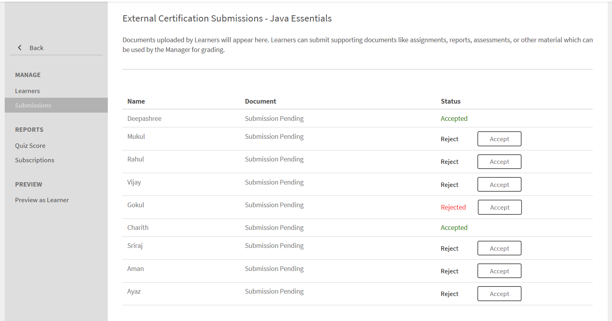

# 學習物件

本檔案包含經理學習物件的相關資訊。

經理可將學習者註冊到其下的課程、學習計畫和認證。 如需註冊所需的詳細資訊和步驟，請參閱 [註冊學習者。](../../administrators/feature-summary/courses.md#main-pars_header_1058138132)

## 課程 {#courses}

## 檢視課程 {#viewingcourses}

身為經理，您可以檢視所有可用課程的清單。 按一下 **[!UICONTROL Courses]** ，以檢視具有搜尋和篩選選項的課程清單。 您也可以在課程縮圖上檢視每個課程的課程效果百分比。 請注意，您只能將團隊成員註冊到學習者應用程式下您可以看到的課程。

>[!NOTE]
>
>按一下「 」以檢視所有已淘汰課程的清單 **已淘汰** 標籤。

## 檢視測驗分數 {#viewquizscores}

1. 按一下課程縮圖上的課程名稱。
1. 按一下左窗格中的「測驗分數」。

您可以根據使用者名稱或每個問題來檢視任何特定課程的測驗分數。 請根據使用者或問題選擇相應的標籤。 您只能看到團隊成員的測驗分數。

從下拉式清單中選擇執行個體型別，以檢視每個課程執行個體的分數。

## 管理課程的學習者清單 {#managelearnerslistforacourse}

身為經理，您可以管理團隊成員的學習者清單。

1. 按一下課程縮圖上的課程名稱。
1. 從左窗格，按一下 **[!UICONTROL Learners]**.

*選取學習者動作*

您可以從學習者頁面執行下列動作：

* 選取您要移除的學習者，然後按一下「動作>移除」。
* 選取您要標示其出勤情況的學習者，然後按一下「動作>標示完成」。

若要允許學習者重設模組並再次使用模組，請按一下「重設」。 在彈出式對話方塊中，按一下「是」以確認「重設」。 無法重設已完成的模組。 只能重設失敗或不完整的模組。

您也可以匯出Excel工作表中的學習者清單。 若要匯出學習者清單，請按一下「動作>匯出」。

>[!NOTE]
>
>如果課程有多個例項，每個標籤會個別提供Excel中的學習者清單。 學習者清單包含學習者名稱、狀態和選取條件。 學習者狀態可以是 **尚未開始**，或 **進行中**，或 **已完成**.

## 檢視L1和L3意見反應 {#viewl1andl3feedback}

您可以檢視課程學習者提供的L1意見以及為團隊成員提供的L3意見。

1. 按一下「課程」清單中的任何課程圖磚。
1. 按一下左窗格中的「L1意見回饋」或「L3意見回饋」 ，以檢視收到的意見回饋。
1. 從下拉式清單中選取執行個體，以檢視該特定執行個體的意見回饋。

## 預覽課程 {#previewcourses}

經理可以按一下 **學習者預覽** 選項。

1. 按一下 **[!UICONTROL Courses]** 左窗格內填入的標籤。
1. 從頁面上的課程清單按一下任何課程圖磚。
1. 從左窗格中按一下學習者身分預覽，然後按一下頁面上的模組名稱，即可在播放器中預覽課程模組。

## 課程效果 {#courseeffectiveness}

課程效果評估旨在瞭解課程對學習者的有用性。 這是學習者對課程內容的意見反應、學習者的課程測驗結果，以及經理根據課程學習情況評估學習者的意見反應所形成的組合。

您可以在課程縮圖上檢視課程成效評等，如下圖快照所示。 您可以看到此課程的評等為100。

<!---->

課程效果評等值是根據L1、L2和L3的意見值得出的。 若要檢視每個意見回饋的分解，請按一下課程效果值。 此時會出現快顯視窗，如下所示。

*檢視課程成效以取得意見*

在此範例快照中，每1位使用者會收到所有這三個回應，因此分數為100/100。 從這個表格中，您可以瞭解如果未針對課程提供這三個意見中的任何一個意見（L1、L2和L3），會對整體效益產生負面影響。 按一下快顯視窗右下角的向下箭頭，檢視課程效果計算的完成方式。

*課程效果計算*

如上圖所示，經理為L3意見反應賦予了更大的權重。

## 搜尋課程、學習計畫及認證 {#searchingcourseslearningprogramsandcertifications}

AdobeLearning Manager讓您更輕鬆地快速找到您選擇的課程/學習計畫。 搜尋課程有兩種方式：

1. 使用搜尋欄位。 按一下右上角顯示的搜尋圖示。 搜尋欄位隨即顯示。 輸入課程名稱或與課程相關聯的任何關鍵字，以找出您的課程/學習計畫。 您也可以使用預先定義的標籤(如Captivate、C、Java和HTML)進行搜尋。 標籤可在「搜尋」欄位內搜尋，這表示當您輸入時，標籤會顯示在搜尋欄位中。 搜尋也可以使用唯一ID來執行。
1. 使用篩選器篩選課程/學習計畫/認證清單。 您可以依狀態篩選課程，例如「全部」、「已發佈」和「已淘汰」。

您可以按一下「能力」並選擇它們，根據能力進行搜尋。 身為經理，您可以用四種方式排序課程，以便更妥善地找出您需要的課程。 按一下「排序依據」，然後選擇按字母遞增順序、按字母遞減順序、課程更新日期或課程的成效：

*根據能力搜尋*

學習計畫可依三種方式排序：字母遞增順序、字母遞減順序以及根據更新日期。

## 將學習者註冊至課程 {#enrollinglearnersintocourses}

經理會根據組織要求，為部分學習者註冊必修課程：

1. 將滑鼠移至任何已發佈的課程圖磚上，然後按一下「註冊學習者」 。

   或者，按一下任何已發佈的課程圖磚，然後按一下左窗格中的學習者。 系統會顯示一個頁面，內含學習者清單。 按一下「註冊」。\
   註冊學習者對話方塊隨即顯示。

1. 輸入學習者名稱或設定檔以選擇學習者，然後按一下「儲存」。

>[!NOTE]
>
>您只能註冊屬於您團隊的學習者。

## 學習計畫 {#learningprograms}

經理可以註冊、檢視測驗分數、L1和L3意見回饋，並且只能取消註冊他的記者。

## 將學習者新增至學習計畫 {#addlearnerstoalearningprogram}

1. 在「管理員」模式中，按一下左窗格中的「學習計畫」 。
1. 從圖磚清單中選取已發佈的學習計畫，您要將學習者新增至該計畫。
1. 按一下左窗格「方案報表」類別底下的「學習者」 。 注意：必須先發佈學習計畫才能新增學習者。
1. 按一下頁面中的「註冊」連結。
1. 開始輸入學習者名稱或設定檔，然後從學習者下拉式清單中選擇學習者。 按一下「儲存」。

## 檢視測驗分數 {#Viewquizscores-1}

1. 按一下任何學習計畫圖磚。
1. 按一下左窗格中的「測驗分數」。

您可以根據使用者名稱或每個問題來檢視任何特定學習計畫的測驗分數。 請根據使用者或問題選擇相應的標籤。 測試分數會一次顯示一個課程。 從下拉式清單變更課程名稱，以檢視其他課程的測驗分數。 您也可以匯出每個課程的測驗分數。 從下拉式清單中選擇執行個體型別，以根據學習計畫的每個執行個體檢視分數。

## 取消學習者註冊 {#unenrollmentforlearners}

如果學習者尚未開始學習計畫，管理員可以取消學習者的註冊。

## 標籤完成 {#markcompletion}

管理員可以為學習者標籤LP完成。 如需詳細資訊，請參閱 [標籤完成](../../administrators/feature-summary/learning-paths.md).

## 認證 {#certifications}

## 將學習者註冊至認證 {#enrolllearnerstothecertification}

有兩種方式可讓學習者註冊參加認證。 請依照下列步驟註冊學習者。

1. 以管理員身分登入後，請按一下左窗格中的「認證」。 從「已發佈」標籤清單中，將滑鼠停留在每個認證上，然後按一下「註冊學習者」。 或者，按一下任何已發佈的認證圖磚，然後從左窗格按一下「學習者」。 按一下學習者頁面右側的「 +註冊」以開始新增學習者。
1. 您可以按一下上述兩個步驟中的註冊學習者選項，然後檢視註冊學習者快顯對話方塊。 開始輸入學習者名稱、設定檔，然後從下拉式清單中選擇學習者名稱，然後按一下「儲存」。

## 取消學習者註冊 {#Unenrollmentforlearners-1}

如果學習者尚未開始認證，經理可以取消學習者的註冊。

## 標籤完成 {#Markcompletion-1}

經理可以標示完成認證。 如需詳細資訊，請參閱 [標籤完成](../../administrators/feature-summary/certifications.md#main-pars_header_303097138).

## 學習者課程核准的經理通知 {#manager-notifications-course-approval}

當嘗試接受或拒絕學習者註冊時，經理現在可以檢視工作階段的詳細資訊(**視訊會議** 或 **教室**)。

*核准或拒絕學習者的註冊請求*

會顯示下列階段作業詳細資訊：

* 工作階段名稱
* 講師姓名
* 位置
* 日期和時間

以下是工作流程：

1. 學習者要求核准課程後，經理會看到通知。

1. 管理員按一下 **工作階段詳細資訊**.

   

   *檢視擱置中的任務*

1. 然後經理核准或拒絕該請求。
1. 如果核准或拒絕未按預期發生，經理會收到確認或錯誤訊息。
1. 學習者取得課程註冊的通知、核准或拒絕。

## 外部認證的選擇性提交 {#optional}

在舊版Learning Manager中，若要完成外部認證，經理需接受學習者提交的檔案。 管理員只有在學習者提交檔案後才會收到通知。

經理現在可以在外部憑證內的提交頁面上檢視已註冊外部憑證的學習者清單，並可以從頁面本身接受或拒絕，而無需等待通知。

當管理員接受而不等待檔案提交時，學習者會看到管理員已接受的新訊息，並且學習者不需要提交檔案。 如果Manager在檔案未提交的情況下拒絕，Manager可以選擇再次接受，而不等待檔案。

如果學習者提交檔案，Manager可以從提交頁面檢視檔案，並可根據提交的檔案接受或拒絕。

*根據檔案提交接受或拒絕*

課程設為強制時：

* 提交頁面只會在學習者完成課程後顯示學習者。
* 學習者僅可在完成課程後上傳檔案。

## 工作輔助 {#jobaids}

經理可以管理其記者的工作輔助指派。 但是，身為管理員，您只能看到已發佈的工作輔助，而管理員也可以看到已撤銷的工作輔助。
