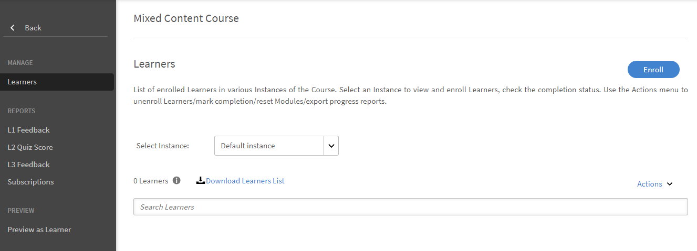
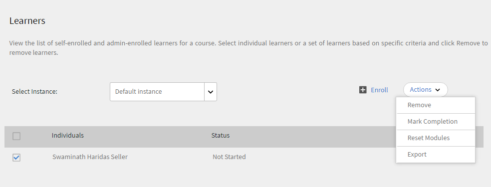
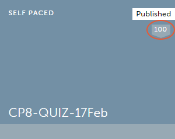
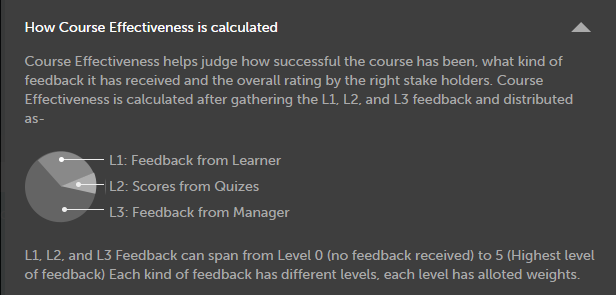
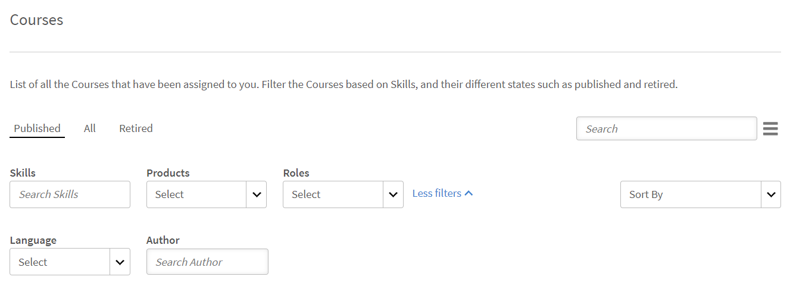
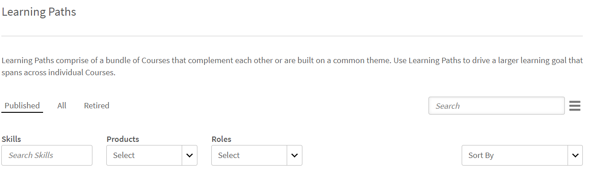
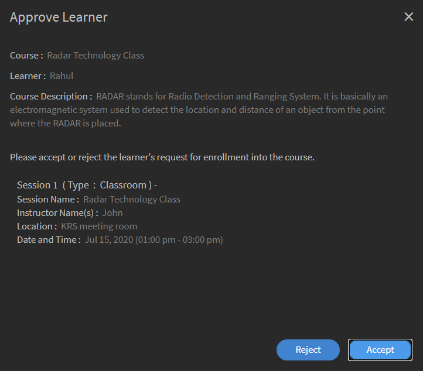
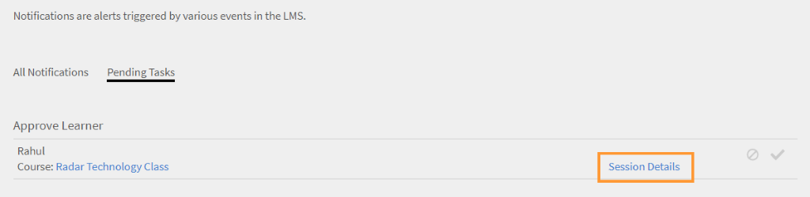
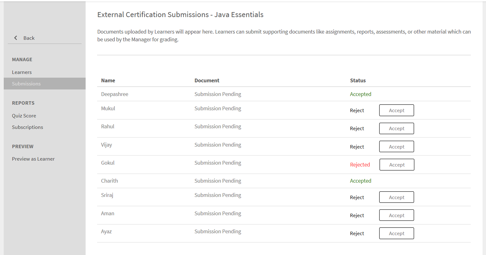

# 學習物件

本文件包含管理人員學習對象的相關資訊。

經理人可以為其下屬的學員報名課程、學習路徑及認證。 欲了解更多資訊及報名步驟，請參閱 [「註冊學習者」。](../../administrators/feature-summary/courses.md#main-pars_header_1058138132)

## 課程 {#courses}

## 觀賞課程 {#viewingcourses}

作為經理，您可以查看所有可用課程的清單。 點擊 **[!UICONTROL Courses]** 左側窗格查看課程清單，並可搜尋與篩選選項。 你也可以在課程縮圖上查看每門課程的效能百分比。 請注意，你只能在學習者申請表下為你可見的課程報名團隊成員。

*查看課程*

>[!NOTE]
>
>所有已退役的球場列表可點擊「 **已退休** 」標籤查看。

## 查看測驗分數 {#viewquizscores}

1. 點擊課程縮圖上的課程名稱。
1. 點擊左側面板的測驗分數。

你可以根據使用者名稱或每個問題查看任何特定課程的小測驗分數。 請依序選擇「依使用者」或「依問題」分頁。 你只能看到隊員的測驗分數。

從下拉選單選擇實例類型，即可查看每個實例的分數。

## 管理課程學習者名單 {#managelearnerslistforacourse}

作為經理，你可以為團隊成員管理學習者名單。

1. 點擊課程縮圖上的課程名稱。
1. 從左側窗格點擊 **[!UICONTROL Learners]**。

*選擇學習者動作*

>[!NOTE]
>
>**可從學習者應用程式執行「匯出待批准」** 選項。

你可以從學習者頁面執行以下操作：

* 選擇你想移除的學習者，然後點選「動作」>「移除」。
* 選擇你想標記的學習者，然後點選「動作」>「標記完成」。

若要讓學習者重置模組並再次使用該模組，請點擊「重置」。 從彈出視窗中，點選「是」以確認重置。 已完成的模組無法重置。 只有失敗或不完整的模組才能被重置。

你也可以把學習者名單匯出成 Excel 表格。 要匯出學習者清單，請點擊「動作」>「匯出」。

>[!NOTE]
>
>若同一課程有多個實例，Excel 中的學習者名單會分別在每個分頁中提供。 學習者名單包含學習者姓名、狀態及選拔標準。 學習者狀態可為 **未開始**、 **進行中**&#x200B;或 **完成**。

## 查看 L1 與 L3 回饋 {#viewl1andl3feedback}

您可以查看學習者為課程提供的 L1 回饋，以及團隊成員所提供的 L3 回饋。

1. 點擊課程列表中的任何課程圖塊。
1. 點擊左側面板的 L1 回饋或 L3 回饋，即可查看收到的回饋。
1. 從下拉選單中選擇該實例，即可查看該實例的回饋。

## 預覽課程 {#previewcourses}

管理員可在瀏覽課程模組時，點擊 **「以學習者** 身份預覽」選項預覽課程。

1. 登入後點擊 **[!UICONTROL Courses]** 左側窗格。
1. 從頁面上的課程列表中點擊任一課程磁貼。
1. 從左側窗格點擊「以學習者身份預覽」，並點擊頁面上的模組名稱，即可在播放器中預覽課程模組。

## 課程效能 {#courseeffectiveness}

課程效能評估用以了解課程對學習者的實用性。 它是結合學習者對課程內容的回饋結果、學習者的課程測驗結果，以及經理根據課程學習對學習者的回饋評估的綜合結果。

您可以在下方截圖中看到課程縮圖上的課程效能評分。 你可以看到這門課的評分是100分。

<!---->

課程效能評分值是根據L1、L2及L3的反饋值得出。 要查看每項回饋的拆分，請點擊課程效能值。 下方會顯示一個彈出視窗。

*查看課程成效以獲得回饋*

在這個範例快照中，每1位用戶就有1位收到了全部三個回饋，因此分數是100/100。 從這張表格你可以理解，如果課程中沒有提供任何三項回饋（L1、L2 和 L3），會對整體效能產生負面影響。 點擊彈出視窗右下角的下箭頭，即可查看球場效能的計算方式。

*計算水道效能*

如上圖所示，管理層的回饋權重較高。

## 搜尋課程、學習路徑與證照 {#searchingcourseslearningprogramsandcertifications}

Adobe Learning Manager 讓你更容易快速找到你想要的課程和學習路徑。 你可以用兩種方式搜尋你的課程：

1. 使用搜尋欄位。 點擊右上角顯示的搜尋圖示。 會出現一個搜尋欄位。 輸入課程名稱或與課程相關的關鍵字，即可找到課程或學習路徑。 你也可以用預設標籤搜尋，如 Captivate、C、Java 和 HTML。 標籤可以在搜尋欄位內搜尋，也就是說，當你輸入時，標籤會顯示在搜尋欄位。 搜尋也可以使用唯一 ID 來執行。
1. 透過篩選課程、學習路徑和證照清單來篩選。 你可以依州別篩選課程，例如全部、已出版和退休。

你可以根據&#x200B;**&#x200B;**&#x200B;能力選擇能力來搜尋。作為經理，你可以將課程分成四種分類方式，以更好地找到你必修的課程。 點擊排序，選擇字母升序、字母升序、課程更新日期、課程創建日期或課程成效：

* 名稱（a-z）
* 名稱（z-a）
* 日期更新
* 創建日期
* 課程效能

*過濾賽道*

你可以用三種方式排序學習路徑：字母由序、字母由序到第，以及依更新日期排序。

*濾波器學習路徑*

## 招收學習者參加課程 {#enrollinglearnersintocourses}

管理者會根據組織要求，為部分學員報名必修課程：

1. 將滑鼠移至任何已公布的課程圖塊，並點擊「註冊學習者」。

   或者，點擊任何已發佈的課程磁貼，然後在左側窗格點選學習者。 會出現一頁學習者名單。 點擊註冊。\
   會跳出「註冊學習者」對話框。

1. 輸入學習者姓名或個人資料以選擇學習者並點擊儲存。

>[!NOTE]
>
>你只能報名屬於你團隊的學習者。

## 學習路徑 {#learningprograms}

經理可以註冊、查看測驗分數、L1 和 L3 回饋，並只取消報名他的記者。

## 將學習者加入學習路徑 {#addlearnerstoalearningprogram}

1. 在管理員模式中，點選左側窗格的學習路徑。
1. 從你想加入學習者的圖塊清單中選擇已發佈的學習路徑。
1. 在「課程報告」類別左側窗格點選「學習者」。 注意：學習計畫必須先發布，才能新增學習者。
1. 點擊頁面中的「註冊連結」。
1. 開始輸入學習者姓名或個人資料，並從學習者下拉選單中選擇學習者。 點擊儲存。

## 查看測驗分數 {#Viewquizscores-1}

1. 點擊任何學習路徑圖塊。
1. 點擊左側面板的測驗分數。

你可以根據使用者名稱或每個問題查看任何特定學習路徑的測驗分數。 請依序選擇「依使用者」或「依問題」分頁。 測驗分數會依一門課逐一顯示。 從下拉選單更改課程名稱，即可查看其他課程的測驗分數。 你也可以匯出每門課程的小測驗分數。 從下拉選單中選擇實例類型，即可查看每個學習路徑實例的分數。

## 學習者退學 {#unenrollmentforlearners}

若學員尚未開始學習路徑，經理可將其退役。

## 標記完成 {#markcompletion}

經理可以為學習者標記完成的LP。 欲了解更多資訊，請參閱 [標記完成](../../administrators/feature-summary/learning-paths.md)。

## 認證 {#certifications}

## 讓學習者報名認證 {#enrolllearnerstothecertification}

你可以有兩種方式讓學習者報名參加此認證。 請依照以下步驟登記學員。

1. 登入為經理後，請在左側窗格點選「認證」。 在已發佈分頁列表中，將滑鼠移至每個認證，點選「註冊學習者」。 或者，點擊任一已發布的認證圖塊，然後從左側窗格點選「學習者」。 點擊學習者頁面右側的 + 註冊，開始新增學習者。
1. 點擊上述兩個步驟的「註冊學習者」選項後，您可以查看「註冊學習者」彈出視窗。 開始輸入學習者姓名、個人資料，並從下拉選單中選擇學習者姓名，然後點擊儲存。

## 學習者退學 {#Unenrollmentforlearners-1}

若學員尚未開始認證，經理可將其退役。

## 標記完成 {#Markcompletion-1}

經理人可以標記認證的完成。 欲了解更多資訊，請參閱 [標記完成](../../administrators/feature-summary/certifications.md#main-pars_header_303097138)。

## 學習者課程核准的經理通知 {#manager-notifications-course-approval}

當嘗試接受或拒絕學習者註冊時，經理現在可以在彈出視窗查看該課程（**視訊會議** 或 **教室**）的詳細資料。

*批准或拒絕學習者的註冊申請*

以下會議詳情顯示：

* 會話名稱
* 教練名稱
* 位置
* 日期與時間

工作流程如下：

1. 經理會在學習者申請課程核准後看到通知。

1. 經理點 **選了會話詳情**。

   

   *查看待處理任務*

1. 經理接著會批准或拒絕這個請求。
1. 如果批准或拒絕沒有如預期發生，經理會收到確認或錯誤訊息。
1. 學習者會收到課程註冊的通知、批准或拒絕通知。

## 外部認證可選擇提交 {#optional}

在早期版本的學習管理者中，若要完成外部認證，管理者必須接受學習者提交的檔案。 經理只有在學習者提交檔案後才會收到通知。

經理現在可以在外部認證內的提交頁面看到已註冊外部認證的學習者名單，並可在該頁面自行接受或拒絕，無需等待通知。

當管理者在未等待檔案提交的情況下接受時，學習者會看到一個新訊息表示管理者已接受，學習者無需提交檔案。 若經理在未提交檔案前拒絕，管理者可選擇再次接受，無需等待檔案。

若學員提交檔案，經理可從提交頁面查看檔案，並可根據提交檔案進行接受或拒絕。

*根據提交的檔案來決定接受或拒絕*

當課程被設定為必修時：

* 提交頁面僅在學習者完成課程後列出。
* 學習者必須在完成課程後才能上傳檔案。

## 工作輔助工具 {#jobaids}

經理可以負責為記者分配工作輔助工具。 但作為經理，你只能看到已發布的工作輔助工具，而管理員則可以看到已撤回的工作輔助工具。
